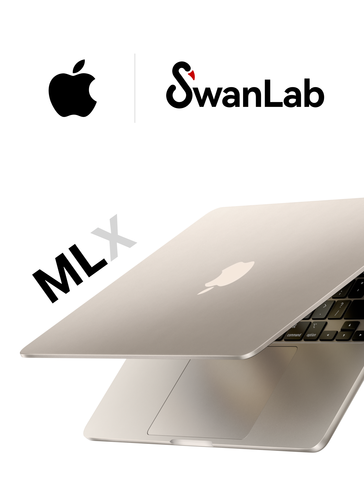
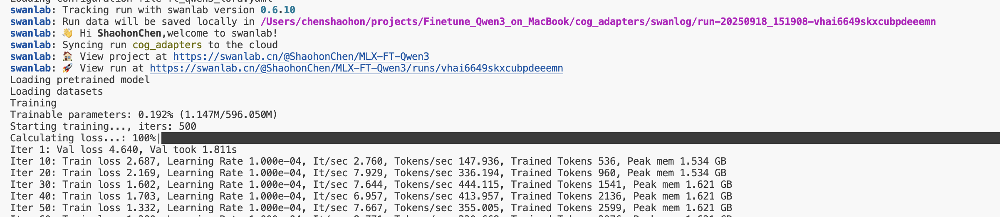
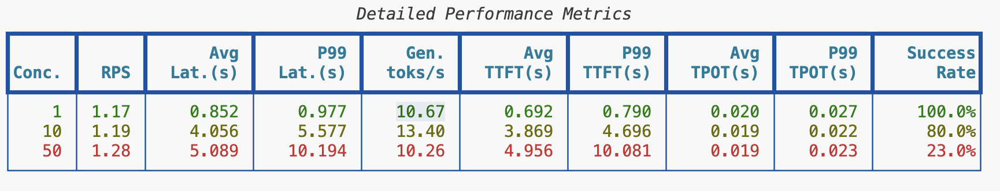
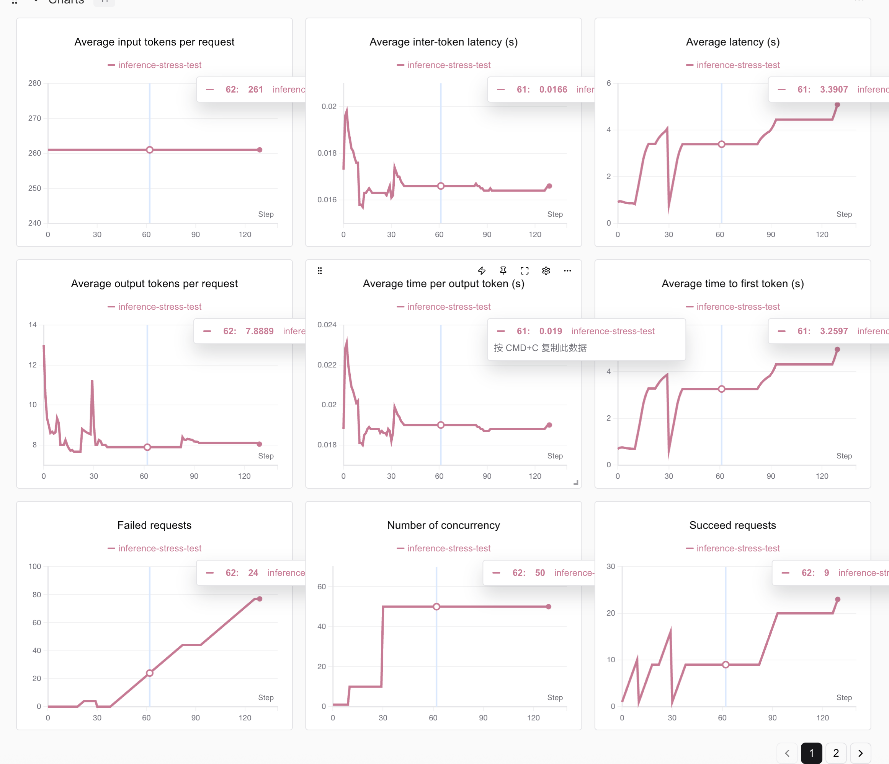
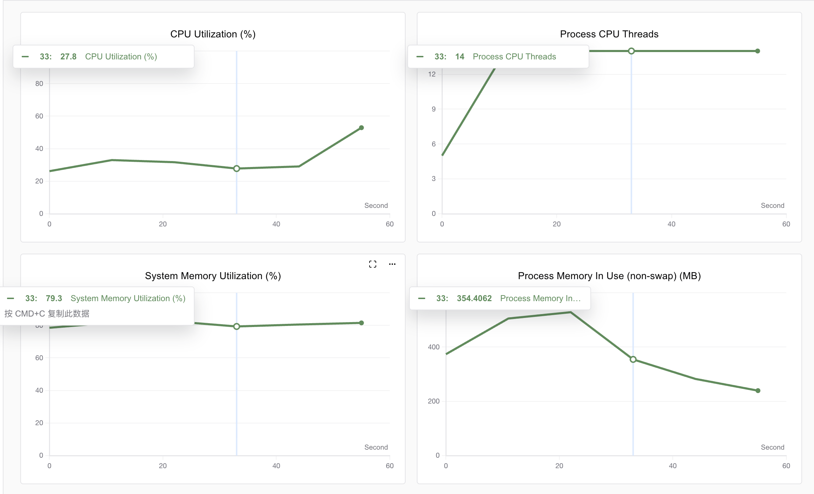

# 使用Macbook和M微调Qwen3——通过微调给Qwen起一个新名字（手把手教学）

* GitHub代码：<https://github.com/ShaohonChen/Finetune_Qwen3_on_MacBook>

* 数据集地址：<https://modelscope.cn/datasets/swift/self-cognition>

* 模型地址：<https://modelscope.cn/models/Qwen/Qwen3-0.6B>

* SwanLab训练日志：<https://swanlab.cn/@ShaohonChen/MLX-FT-Qwen3/charts>

## 写在前面

最近笔者的GPU服务器出了点故障，因此实验只能依靠一台小小的MacBook轻薄本。结果发现意外的能打，跑一些深度学习模型或者大模型居然也能正常运行。看来买Macbook不完全是法器同样也是生产力;-)。


本篇教程将带大家了解下如何Macbook来进行Qwen3微调，并且利用苹果自家发的MLX深度学习框架，让Macbook的性能发挥到极致。

## MLX框架简介


> MLX框架GitHub地址：<https://github.com/ml-explore/mlx>，不过苹果的开源项目首页正如其产品一样，相当的“简介”。文档写的还是不错的。

MLX框架是苹果公司专为机器学习任务设计的一个高效、灵活的深度学习框架，主要面向Apple Silicon进行优化。MLX允许开发者在macOS和iOS设备上构建、训练和部署机器学习模型，充分利用苹果硬件的统一内存架构，实现CPU与GPU之间的零拷贝数据共享，从而提升训练和推理效率。

笔者个人感觉MLX相比于使用torch的MPS后端，更能发挥Apple芯片的性能。上次笔者使用mps后端训练rnn网络时还出现了牙膏倒吸、GPU打不过CPU的情况。不过RNN模型本身比较小，且结构也适合于并行计算，具体效率等未来笔者专门测试下。MLX框架的API整体也非常像numpy和torch，迁移学习起来的门槛不高。

当然，由于现在开源LLM模型一般使用🤗Huggingface Transformers框架开源，基本都是基于pytorch框架，因此想直接体验到MLX带来的性能提升还是很难的。好在苹果同时发布了一个MLX-LM框架，功能定位上类似Transformers + vllm，能训练也能推理。因此本篇教程就基于MLX-LM教程给大家介绍下如何使用Macbook微调Qwen3模型！

> MLX-LM已经支持使用SwanLab进行训练跟踪了！



## 使用MLX-LM训练Qwen3模型

### 环境安装

安装MLX框架非常方便，只需要一行命令即可，由于要用SwanLab做微调跟踪，也额外安装SwanLab包。

```bash
pip install mlx-lm swanlab
```

### 数据集&模型准备

**数据集准备**

本任务通过对Qwen3微调，让Qwen3学习一个新的名字！这里我们使用笔者非常喜欢的一个数据集——MS-Swift团队发布的“self-cognition”数据集。


> 数据集链接：<https://modelscope.cn/datasets/swift/self-cognition>

self-cognition数据集主要用于做模型自我认知微调，数据集由108条身份问答数据组成，包括中文和英文。数据集预留了“模型名称”和“模型作者名称”两个预留字段。我们可以将其替换成希望给模型起的名称和自己的名称。

使用如下命令下载数据集到本地：

```bash
pip install modelscope
modelscope download --dataset swift/self-cognition --local_dir ./self-cognition
```

由于MLX-LM框架的数据格式还有点小区别，再来也要替换数据集中的名称，可以使用笔者实现的数据转换脚本进行格式转换，数据脚本命名为`trans_data.py`：

```bash
import os
import json
import argparse

def main(name="小鹅", author="SwanLab团队"):
    mlx_data = []

    with open("self-cognition/self_cognition.jsonl", "r") as fread:
        data_list = fread.readlines()

        for data in data_list:
            data = json.loads(data)
            user_text = data["query"]
            if data["tag"] == "zh":
                assistant_text = (
                    data["response"]
                    .replace("{{NAME}}", "千仔")
                    .replace("{{AUTHOR}}", "千问粉丝")
                )
            else:
                assistant_text = (
                    data["response"]
                    .replace("{{NAME}}", "Little-Q")
                    .replace("{{AUTHOR}}", "QFans")
                )
            mlx_data.append(
                {
                    "messages": [
                        {"role": "user", "content": user_text},
                        {"role": "assistant", "content": assistant_text},
                    ]
                }
            )

    # splite data
    val_data_num = len(mlx_data) // 5
    mlx_train_data = mlx_data[val_data_num:]
    mlx_val_data = mlx_data[:val_data_num]

    # write data
    os.makedirs("./mlx_data/", exist_ok=True)

    with open("./mlx_data/train.jsonl", "w", encoding="utf-8") as fwrite:
        for data in mlx_train_data:
            fwrite.write(json.dumps(data, ensure_ascii=False) + "\n")

    with open("./mlx_data/val.jsonl", "w", encoding="utf-8") as fwrite:
        for data in mlx_val_data:
            fwrite.write(json.dumps(data, ensure_ascii=False) + "\n")


if __name__ == "__main__":
    parser = argparse.ArgumentParser(
        description="一个简单的脚本，接受 name 和 author 参数。"
    )
    parser.add_argument("--name", type=str, required=True, help="指定数据集中模型名称")
    parser.add_argument(
        "--author", type=str, required=True, help="指定数据集中模型作者名称"
    )
    args = parser.parse_args()

    main(args.name, args.author)
```

使用如下命令进行转换：

```bash
# 可以替换成自己期望的模型名和作者名
python trans_data.py --name 小鹅 --author SwanLab团队 --en_name little-swan --en_author SwanLab-Team    
```

> 也可以使用笔者转换好的数据集：在<https://github.com/ShaohonChen/Finetune_Qwen3_on_MacBook>

转换后会在本地路径生成如下两个文件：

```bash
Finetune_Qwen3_on_MacBook
├── mlx_data
│   ├── train.jsonl
│   └── val.jsonl
...
```

**模型准备**


这里笔者为了计算效率选用Qwen3-0.6B模型，实际测试下来笔者M2 24G的笔记本电脑可以运行Qwen3-4B的模型推理。大家可以根据自己的电脑内存选择合适大小的模型。

> ⚠️注意：要选择Instruct模型而不是Base模型！

下载模型的命令如下：

```bash
pip install modelscope
modelscope download --model Qwen/Qwen3-0.6B --local_dir ./Qwen3-0.6B
```

### 训练模型

参考MLX-LM官方文档：<https://github.com/ml-explore/mlx-lm/blob/main/mlx_lm/LORA.md>

首先要确保MLX-LM已经成功安装！我们使用Lora微调来减少内存消耗，在本地创建`ft_qwen3_lora.yaml`，按照如下设置微调配置参数：

```yaml
model: "Qwen3-0.6B" # 本地模型目录或 Hugging Face 仓库的路径。
train: true # 是否进行训练（布尔值）
fine_tune_type: lora  # 微调方法: "lora", "dora" 或 "full"。
optimizer: adamw # 优化器及其可能的输入
data: "mlx_data" # 包含 {train, valid, test}.jsonl 文件的目录
seed: 0 # PRNG 随机种子
num_layers: 28 # 需要微调的层数
batch_size: 1 # 小批量大小。
iters: 500  # 训练迭代次数。
val_batches: 25 # 验证批次数，-1 表示使用整个验证集。
learning_rate: 1e-4 # Adam 学习率。
report_to: swanlab  # 使用swanlab记录实验
project_name: MLX-FT-Qwen3  # 记录项目名
steps_per_report: 10  # 每隔多少训练步数报告一次损失。
steps_per_eval: 200 # 每隔多少训练步数进行一次验证。
resume_adapter_file: null # 加载路径，用于用给定的 adapter 权重恢复训练。
adapter_path: "cog_adapters"  # 训练后 adapter 权重的保存/加载路径。
save_every: 100 # 每 N 次迭代保存一次模型。
test: true # 训练后是否在测试集上评估
test_batches: 100 # 测试集批次数，-1 表示使用整个测试集。
max_seq_length: 512 # 最大序列长度。
grad_checkpoint: false  # 是否使用梯度检查点以减少内存使用。
lora_parameters:  # LoRA 参数只能在配置文件中指定
  keys: ["self_attn.q_proj", "self_attn.v_proj"]
  rank: 8
  scale: 20.0
  dropout: 0.0
```

接下来在命令行启动MLX-LM微调：

```bash
mlx_lm.lora --config ft_qwen3_lora.yaml
```

启动成功后效果如下



如果开启了SwanLab跟踪，则会自动记录训练损失图像。可以看到大概500步模型训练损失就收敛了


实验记录已公开：<https://swanlab.cn/@ShaohonChen/MLX-FT-Qwen3/charts>

训练速度非常快，在笔者的轻薄本上不到2分钟就完成了训练，使用了不到2G内存，吞吐快400Token/S。


### 评估模型效果

mlx-lm支持直接用chat模式评估模型训练效果，命令如下

```bash
mlx_lm.chat --model Qwen3-0.6B --adapter-path cog_adapters
```

可以直接在命令行里与模型聊天，可以看到模型已经学会了他的新名字“小鹅”。


英文聊天也不在话下！


## 部署Qwen聊天服务

mlx-lm框架也支持一行命令部署成API服务！对于洗数据或者作为自用的AI助手来说非常友好，现在我们使用命令把刚刚微调好的模型部署成API服务：

```bash
mlx_lm.server --model Qwen3-0.6B --adapter-path cog_adapters --chat-template-args '{"enable_thinking":false}'
```

> `--chat-template-args '{"enable_thinking":false}'` 用于关闭Qwen3的推理模式，如果你更喜欢推理也可以删掉这一行来开启深度思考。

运行成功后会显示：

```bash
2025-09-18 15:51:42,639 - INFO - Starting httpd at 127.0.0.1 on port 8080...
```

可以使用如下命令测试是否成功：

```bash
curl localhost:8080/v1/chat/completions \
  -H "Content-Type: application/json" \
  -d '{
     "messages": [{"role": "user", "content": "Say this is a test!"}],
     "temperature": 0.7
   }'
```

看到模型正常返回后，说明API部署成功：

```bash
{"id": "chatcmpl-bdfd6f0c-72db-418e-a35a-ecf13cd98ee0", "system_fingerprint": "0.28.0-0.29.1-macOS-15.6.1-arm64-arm-64bit-applegpu_g14g", "object": "chat.completion", "model": "default_model", "created": 1758181778, "choices": [{"index": 0, "finish_reason": "stop", "logprobs": {"token_logprobs": [-1.125, -0.875, -1.5, 0.0, -0.125, 0.0, -0.375, -2.75, -0.25, -0.375, 0.0, 0.0, -0.125, 0.0, -0.5, 0.0, -0.625, 0.0, 0.0, 0.0, -1.25, 0.0], "top_logprobs": [], "tokens": [9707, 11, 419, 374, 264, 1273, 0, 1416, 498, 614, 894, 4755, 476, 1184, 1492, 11, 2666, 1910, 311, 2548, 0, 151645]}, "message": {"role": "assistant", "content": "Hello, this is a test! If you have any questions or need help, feel free to ask!", "tool_calls": []}}], "usage": {"prompt_tokens": 18, "completion_tokens": 22, "total_tokens": 40}}% 
```

**部署性能测试**

笔者使用evalscope进行速度测试，命令如下：

> ⚠️注意需要开启API服务，否则会运行失败

```bash
evalscope perf \
  --parallel 1 10 50 \
  --number 10 20 100 \
  --model Qwen3-0.6B \
  --url http://127.0.0.1:8080/v1/chat/completions \
  --api openai \
  --dataset random \
  --max-tokens 128 \
  --min-tokens 128 \
  --prefix-length 0 \
  --min-prompt-length 128 \
  --max-prompt-length 128 \
  --tokenizer-path Qwen3-0.6B \
  --extra-args '{"ignore_eos": true}' \
  --swanlab-api-key ttsGKza0SNOiPFCfQWspm \
  --name 'qwen3-inference-stress-test'
```

可以看到单请求能达到平均10toks/s的速度。还是很快的，不过并发速度就下来了。



使用SwanLab进行性能跟踪可以看到，随着并发数从10->20->50，部署性能快速下降。不过这也是由于笔者本身在测试时也在使用这台笔记本电脑，系统内存已经使用到了80%的原因。以自用或者小实验室使用来说这个速度非常可观

> 可以在SwanLab上查看记录：<https://swanlab.cn/@ShaohonChen/MLX-FT-Qwen3/runs/lqitoakl4gnswhk15xmp3/chart>




