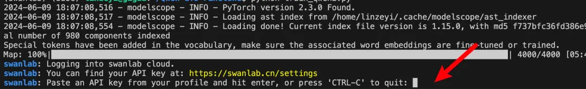

# Qwen2命名实体识别

[](https://swanlab.cn/@ZeyiLin/Qwen2-NER-fintune/runs/9gdyrkna1rxjjmz0nks2c/chart)

[Qwen2](https://modelscope.cn/models/qwen/Qwen2-1.5B-Instruct/summary)是通义千问团队最近开源的大语言模型，由阿里云通义实验室研发。

以Qwen2作为基座大模型，通过**指令微调**的方式做高精度的命名实体识别（NER），是学习入门**LLM微调**、建立大模型认知的非常好的任务。


> 使用LoRA方法训练，1.5B模型对显存要求不高，10GB左右就可以跑。

在本文中，我们会使用 [Qwen2-1.5b-Instruct](https://modelscope.cn/models/qwen/Qwen2-1.5B-Instruct/summary) 模型在 [中文NER](https://huggingface.co/datasets/qgyd2021/chinese_ner_sft) 数据集上做指令微调训练，同时使用[SwanLab](https://swanlab.cn)监控训练过程、评估模型效果。

- 代码：完整代码直接看本文第5节 或 [Github](https://github.com/Zeyi-Lin/LLM-Finetune)
- 实验日志过程：[Qwen2-1.5B-NER-Fintune - SwanLab](https://swanlab.cn/@ZeyiLin/Qwen2-NER-fintune/runs/9gdyrkna1rxjjmz0nks2c/chart)
- 模型：[Modelscope](https://modelscope.cn/models/qwen/Qwen2-1.5B-Instruct/summary)
- 数据集：[chinese_ner_sft](https://huggingface.co/datasets/qgyd2021/chinese_ner_sft)
- SwanLab：[https://swanlab.cn](https://swanlab.cn)


## 知识点1：什么是指令微调？

大模型指令微调（Instruction Tuning）是一种针对大型预训练语言模型的微调技术，**其核心目的是增强模型理解和执行特定指令的能力，使模型能够根据用户提供的自然语言指令准确、恰当地生成相应的输出或执行相关任务。**

指令微调特别关注于提升模型在**遵循指令**方面的一致性和准确性，从而拓宽模型在各种应用场景中的泛化能力和实用性。

在实际应用中，我的理解是，指令微调更多**把LLM看作一个更智能、更强大的传统NLP模型（比如Bert）**，来实现更高精度的NLP任务。所以这类任务的应用场景覆盖了以往NLP模型的场景，甚至很多团队拿它来**标注互联网数据**。


## 知识点2：什么是命名实体识别？

命名实体识别 (NER) 是一种NLP技术，主要用于识别和分类文本中提到的重要信息（关键词）。这些实体可以是人名、地名、机构名、日期、时间、货币值等等。 NER 的目标是将文本中的非结构化信息转换为结构化信息，以便计算机能够更容易地理解和处理。


NER 也是一项非常实用的技术，包括在互联网数据标注、搜索引擎、推荐系统、知识图谱、医疗保健等诸多领域有广泛应用。


## 1.环境安装

本案例基于`Python>=3.8`，请在您的计算机上安装好Python，并且有一张英伟达显卡（显存要求并不高，大概10GB左右就可以跑）。

我们需要安装以下这几个Python库，在这之前，请确保你的环境内已安装好了**pytorch**以及**CUDA**：

```txt
swanlab
modelscope
transformers
datasets
peft
accelerate
pandas
```

一键安装命令：

```bash 
pip install swanlab modelscope transformers datasets peft pandas accelerate
```

> 本案例测试于modelscope==1.14.0、transformers==4.41.2、datasets==2.18.0、peft==0.11.1、accelerate==0.30.1、swanlab==0.3.11

## 2.准备数据集

本案例使用的是HuggingFace上的[chinese_ner_sft](https://huggingface.co/datasets/qgyd2021/chinese_ner_sft)数据集，该数据集主要被用于训练命名实体识别模型。


chinese_ner_sft由不同来源、不同类型的几十万条数据组成，应该是我见过收录最齐全的中文NER数据集。

这次训练我们不需要用到它的全部数据，只取其中的CCFBDCI数据集（中文命名实体识别算法鲁棒性评测数据集）进行训练，该数据集包含LOC（地点）、GPE（地理）、ORG（组织）和PER（人名）四种实体类型标注，每条数据的例子如下：

```json
{
  "text": "今天亚太经合组织第十二届部长级会议在这里开幕，中国外交部部长唐家璇、外经贸部部长石广生出席了会议。",
  "entities": [
    {
        "start_idx": 23,
        "end_idx": 25,
        "entity_text": "中国",
        "entity_label": "GPE",
        "entity_names": ["地缘政治实体", "政治实体", "地理实体", "社会实体"]},
        {
            "start_idx": 25,
            "end_idx": 28,
            "entity_text": "外交部",
            "entity_label": "ORG",
            "entity_names": ["组织", "团体", "机构"]
        },
        {
            "start_idx": 30,
            "end_idx": 33,
            "entity_text": "唐家璇",
            "entity_label": "PER",
            "entity_names": ["人名", "姓名"]
        }, 
        ...
    ],
"data_source": "CCFBDCI"
}
```

其中`text`是输入的文本，`entities`是文本抽取出的实体。我们的目标是希望微调后的大模型能够根据由`text`组成的提示词，预测出一个json格式的实体信息：

```txt
输入：今天亚太经合组织第十二届部长级会议在这里开幕，中国外交部部长唐家璇、外经贸部部长石广生出席了会议。

大模型输出：{"entity_text":"中国", "entity_label":"组织"}{"entity_text":"唐家璇", "entity_label":"人名"}...
```

---

现在我们将数据集下载到本地目录。下载方式是前往[chinese_ner_sft - huggingface](https://huggingface.co/datasets/qgyd2021/chinese_ner_sft/tree/main/data)下载`ccfbdci.jsonl`到项目根目录下即可：


## 3. 加载模型

这里我们使用modelscope下载Qwen2-1.5B-Instruct模型（modelscope在国内，所以直接用下面的代码自动下载即可，不用担心速度和稳定性问题），然后把它加载到Transformers中进行训练：

```python
from modelscope import snapshot_download, AutoTokenizer
from transformers import AutoModelForCausalLM, TrainingArguments, Trainer, DataCollatorForSeq2Seq

model_id = "qwen/Qwen2-1.5B-Instruct"    
model_dir = "./qwen/Qwen2-1___5B-Instruct"

# 在modelscope上下载Qwen模型到本地目录下
model_dir = snapshot_download(model_id, cache_dir="./", revision="master")

# Transformers加载模型权重
tokenizer = AutoTokenizer.from_pretrained(model_dir, use_fast=False, trust_remote_code=True)
model = AutoModelForCausalLM.from_pretrained(model_dir, device_map="auto", torch_dtype=torch.bfloat16)
model.enable_input_require_grads()  # 开启梯度检查点时，要执行该方法
```

## 4. 配置训练可视化工具

我们使用SwanLab来监控整个训练过程，并评估最终的模型效果。

这里直接使用SwanLab和Transformers的集成来实现：

```python
from swanlab.integration.huggingface import SwanLabCallback

swanlab_callback = SwanLabCallback(...)

trainer = Trainer(
    ...
    callbacks=[swanlab_callback],
)

```

如果你是第一次使用SwanLab，那么还需要去[https://swanlab.cn](https://swanlab.cn)上注册一个账号，在**用户设置**页面复制你的API Key，然后在训练开始时粘贴进去即可：




## 5. 完整代码

开始训练时的目录结构：

```txt
|--- train.py
|--- train.jsonl
|--- test.jsonl
```

train.py:

```python
import json
import pandas as pd
import torch
from datasets import Dataset
from modelscope import snapshot_download, AutoTokenizer
from swanlab.integration.huggingface import SwanLabCallback
from peft import LoraConfig, TaskType, get_peft_model
from transformers import AutoModelForCausalLM, TrainingArguments, Trainer, DataCollatorForSeq2Seq
import os
import swanlab


def dataset_jsonl_transfer(origin_path, new_path):
    """
    将原始数据集转换为大模型微调所需数据格式的新数据集
    """
    messages = []

    # 读取旧的JSONL文件
    with open(origin_path, "r") as file:
        for line in file:
            # 解析每一行的json数据
            data = json.loads(line)
            input_text = data["text"]
            entities = data["entities"]
            match_names = ["地点", "人名", "地理实体", "组织"]
            
            entity_sentence = ""
            for entity in entities:
                entity_json = dict(entity)
                entity_text = entity_json["entity_text"]
                entity_names = entity_json["entity_names"]
                for name in entity_names:
                    if name in match_names:
                        entity_label = name
                        break
                
                entity_sentence += f"""{{"entity_text": "{entity_text}", "entity_label": "{entity_label}"}}"""
            
            if entity_sentence == "":
                entity_sentence = "没有找到任何实体"
            
            message = {
                "instruction": """你是一个文本实体识别领域的专家，你需要从给定的句子中提取 地点; 人名; 地理实体; 组织 实体. 以 json 格式输出, 如 {"entity_text": "南京", "entity_label": "地理实体"} 注意: 1. 输出的每一行都必须是正确的 json 字符串. 2. 找不到任何实体时, 输出"没有找到任何实体". """,
                "input": f"文本:{input_text}",
                "output": entity_sentence,
            }
            
            messages.append(message)

    # 保存重构后的JSONL文件
    with open(new_path, "w", encoding="utf-8") as file:
        for message in messages:
            file.write(json.dumps(message, ensure_ascii=False) + "\n")
            
            
def process_func(example):
    """
    将数据集进行预处理
    """

    MAX_LENGTH = 384 
    input_ids, attention_mask, labels = [], [], []
    system_prompt = """你是一个文本实体识别领域的专家，你需要从给定的句子中提取 地点; 人名; 地理实体; 组织 实体. 以 json 格式输出, 如 {"entity_text": "南京", "entity_label": "地理实体"} 注意: 1. 输出的每一行都必须是正确的 json 字符串. 2. 找不到任何实体时, 输出"没有找到任何实体"."""
    
    instruction = tokenizer(
        f"<|im_start|>system\n{system_prompt}<|im_end|>\n<|im_start|>user\n{example['input']}<|im_end|>\n<|im_start|>assistant\n",
        add_special_tokens=False,
    )
    response = tokenizer(f"{example['output']}", add_special_tokens=False)
    input_ids = instruction["input_ids"] + response["input_ids"] + [tokenizer.pad_token_id]
    attention_mask = (
        instruction["attention_mask"] + response["attention_mask"] + [1]
    )
    labels = [-100] * len(instruction["input_ids"]) + response["input_ids"] + [tokenizer.pad_token_id]
    if len(input_ids) > MAX_LENGTH:  # 做一个截断
        input_ids = input_ids[:MAX_LENGTH]
        attention_mask = attention_mask[:MAX_LENGTH]
        labels = labels[:MAX_LENGTH]
    return {"input_ids": input_ids, "attention_mask": attention_mask, "labels": labels}   


def predict(messages, model, tokenizer):
    device = "cuda"
    text = tokenizer.apply_chat_template(
        messages,
        tokenize=False,
        add_generation_prompt=True
    )
    model_inputs = tokenizer([text], return_tensors="pt").to(device)

    generated_ids = model.generate(
        model_inputs.input_ids,
        max_new_tokens=512
    )
    generated_ids = [
        output_ids[len(input_ids):] for input_ids, output_ids in zip(model_inputs.input_ids, generated_ids)
    ]
    
    response = tokenizer.batch_decode(generated_ids, skip_special_tokens=True)[0]
    
    print(response)
     
    return response


model_id = "qwen/Qwen2-1.5B-Instruct"    
model_dir = "./qwen/Qwen2-1___5B-Instruct"

# 在modelscope上下载Qwen模型到本地目录下
model_dir = snapshot_download(model_id, cache_dir="./", revision="master")

# Transformers加载模型权重
tokenizer = AutoTokenizer.from_pretrained(model_dir, use_fast=False, trust_remote_code=True)
model = AutoModelForCausalLM.from_pretrained(model_dir, device_map="auto", torch_dtype=torch.bfloat16)
model.enable_input_require_grads()  # 开启梯度检查点时，要执行该方法

# 加载、处理数据集和测试集
train_dataset_path = "ccfbdci.jsonl"
train_jsonl_new_path = "ccf_train.jsonl"

if not os.path.exists(train_jsonl_new_path):
    dataset_jsonl_transfer(train_dataset_path, train_jsonl_new_path)

# 得到训练集
total_df = pd.read_json(train_jsonl_new_path, lines=True)
train_df = total_df[int(len(total_df) * 0.1):]
train_ds = Dataset.from_pandas(train_df)
train_dataset = train_ds.map(process_func, remove_columns=train_ds.column_names)


config = LoraConfig(
    task_type=TaskType.CAUSAL_LM,
    target_modules=["q_proj", "k_proj", "v_proj", "o_proj", "gate_proj", "up_proj", "down_proj"],
    inference_mode=False,  # 训练模式
    r=8,  # Lora 秩
    lora_alpha=32,  # Lora alaph，具体作用参见 Lora 原理
    lora_dropout=0.1,  # Dropout 比例
)

model = get_peft_model(model, config)

args = TrainingArguments(
    output_dir="./output/Qwen2-NER",
    per_device_train_batch_size=4,
    per_device_eval_batch_size=4,
    gradient_accumulation_steps=4,
    logging_steps=10,
    num_train_epochs=2,
    save_steps=100,
    learning_rate=1e-4,
    save_on_each_node=True,
    gradient_checkpointing=True,
    report_to="none",
)

swanlab_callback = SwanLabCallback(
    project="Qwen2-NER-fintune",
    experiment_name="Qwen2-1.5B-Instruct",
    description="使用通义千问Qwen2-1.5B-Instruct模型在NER数据集上微调，实现关键实体识别任务。",
    config={
        "model": model_id,
        "model_dir": model_dir,
        "dataset": "qgyd2021/chinese_ner_sft",
    },
)

trainer = Trainer(
    model=model,
    args=args,
    train_dataset=train_dataset,
    data_collator=DataCollatorForSeq2Seq(tokenizer=tokenizer, padding=True),
    callbacks=[swanlab_callback],
)

trainer.train()

# 用测试集的随机20条，测试模型
# 得到测试集
test_df = total_df[:int(len(total_df) * 0.1)].sample(n=20)

test_text_list = []
for index, row in test_df.iterrows():
    instruction = row['instruction']
    input_value = row['input']
    
    messages = [
        {"role": "system", "content": f"{instruction}"},
        {"role": "user", "content": f"{input_value}"}
    ]

    response = predict(messages, model, tokenizer)
    messages.append({"role": "assistant", "content": f"{response}"})
    result_text = f"{messages[0]}\n\n{messages[1]}\n\n{messages[2]}"
    test_text_list.append(swanlab.Text(result_text, caption=response))
    
swanlab.log({"Prediction": test_text_list})
swanlab.finish()
```

看到下面的进度条即代表训练开始：


## 5.训练结果演示

在[SwanLab](https://swanlab.cn/@ZeyiLin/Qwen2-NER-fintune/runs/9gdyrkna1rxjjmz0nks2c/chart)上查看最终的训练结果：

可以看到在2个epoch之后，微调后的qwen2的loss降低到了不错的水平——当然对于大模型来说，真正的效果评估还得看主观效果。


可以看到在一些测试样例上，微调后的qwen2能够给出准确的实体抽取结果：


至此，你已经完成了qwen2指令微调的训练！

## 6. 推理训练好的模型

训好的模型默认被保存在`./output/Qwen2-NER`文件夹下。

推理模型的代码如下：

```python
import torch
from transformers import AutoModelForCausalLM, AutoTokenizer
from peft import PeftModel

def predict(messages, model, tokenizer):
    device = "cuda"

    text = tokenizer.apply_chat_template(messages, tokenize=False, add_generation_prompt=True)
    model_inputs = tokenizer([text], return_tensors="pt").to(device)

    generated_ids = model.generate(model_inputs.input_ids, max_new_tokens=512)
    generated_ids = [output_ids[len(input_ids):] for input_ids, output_ids in zip(model_inputs.input_ids, generated_ids)]
    response = tokenizer.batch_decode(generated_ids, skip_special_tokens=True)[0]

    return response


# 加载原下载路径的tokenizer和model
tokenizer = AutoTokenizer.from_pretrained("./qwen/Qwen2-1___5B-Instruct/", use_fast=False, trust_remote_code=True)
model = AutoModelForCausalLM.from_pretrained("./qwen/Qwen2-1___5B-Instruct/", device_map="auto", torch_dtype=torch.bfloat16)

# 加载训练好的Lora模型，将下面的[checkpoint-XXX]替换为实际的checkpoint文件名名称
model = PeftModel.from_pretrained(model, model_id="./output/Qwen2-NER/checkpoint-1700")

input_text = "西安电子科技大学的陈志明爱上了隔壁西北工业大学苏春红，他们约定好毕业后去中国的苏州定居。"
test_texts = {
    "instruction": """你是一个文本实体识别领域的专家，你需要从给定的句子中提取 地点; 人名; 地理实体; 组织 实体. 以 json 格式输出, 如; {"entity_text": "南京", "entity_label": "地理实体"} 注意: 1. 输出的每一行都必须是正确的 json 字符串. 2. 找不到任何实体时, 输出"没有找到任何实体". """,
    "input": f"文本:{input_text}"
}

instruction = test_texts['instruction']
input_value = test_texts['input']

messages = [
    {"role": "system", "content": f"{instruction}"},
    {"role": "user", "content": f"{input_value}"}
]

response = predict(messages, model, tokenizer)
print(response)
```

输出结果为：

```json
{"entity_text": "西安电子科技大学", "entity_label": "组织"}
{"entity_text": "陈志明", "entity_label": "人名"}
{"entity_text": "西北工业大学", "entity_label": "组织"}
{"entity_text": "苏春红", "entity_label": "人名"}
{"entity_text": "中国", "entity_label": "地理实体"}
{"entity_text": "苏州", "entity_label": "地理实体"}
```

## 相关链接

- 代码：完整代码直接看本文第5节 或 [Github](https://github.com/Zeyi-Lin/LLM-Finetune)
- 实验日志过程：[Qwen2-1.5B-NER-Fintune - SwanLab](https://swanlab.cn/@ZeyiLin/Qwen2-NER-fintune/runs/9gdyrkna1rxjjmz0nks2c/chart)
- 模型：[Modelscope](https://modelscope.cn/models/qwen/Qwen2-1.5B-Instruct/summary)
- 数据集：[chinese_ner_sft](https://huggingface.co/datasets/qgyd2021/chinese_ner_sft)
- SwanLab：[https://swanlab.cn](https://swanlab.cn)