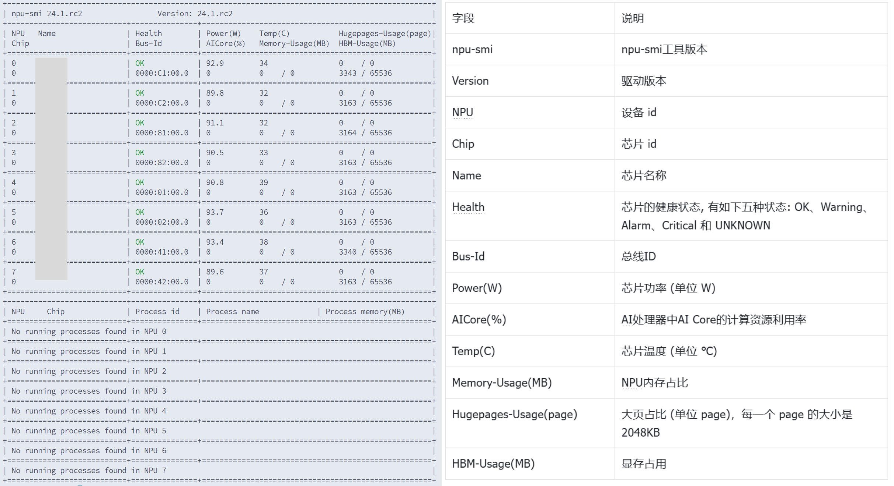
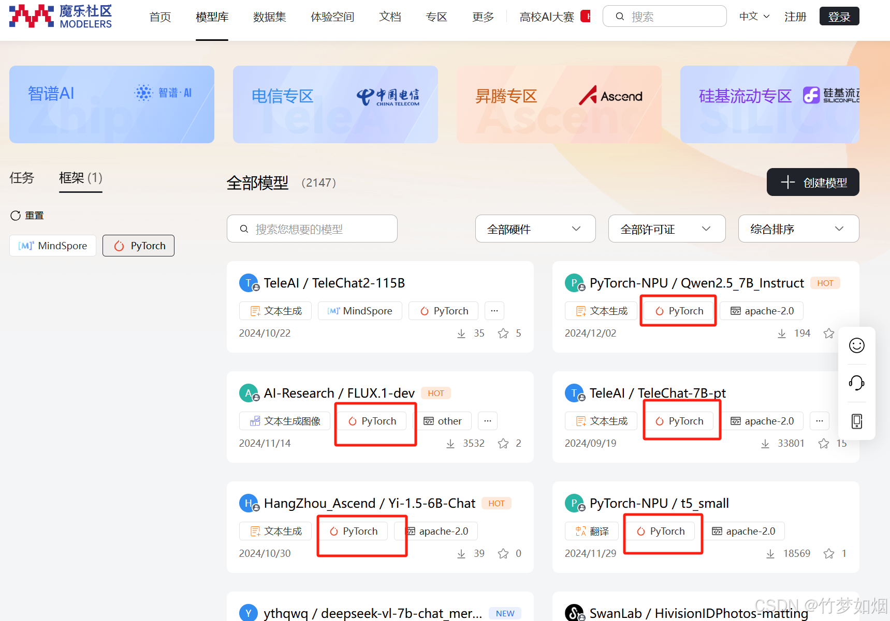
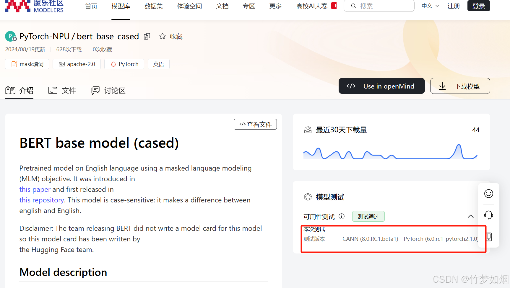
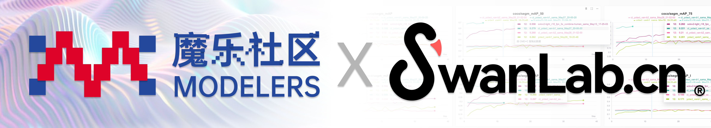
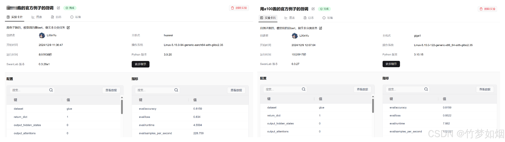
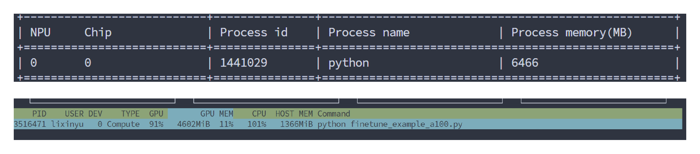
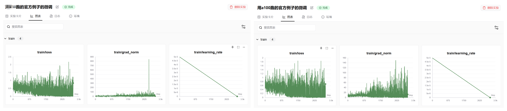

# openMind大模型微调教程

## 简介

魔乐社区（[Modelers.cn](https://modelers.cn)）是一个为人工智能开发者及爱好者打造的社区，提供工具链、数据集、模型和应用等AI领域生产要素的托管及展示服务和支撑系统。目前，魔乐社区已支持openMind Library。该工具通过简单的API接口，帮助开发者完成模型预训练、微调、推理等流程。同时，openMind Library原生兼容PyTorch 和 MindSpore 等主流框架，原生支持昇腾NPU处理器。openMind Library可以和PEFT、DeepSpeed等三方库配合使用，来提升模型微调效率。

友情链接：

* [魔乐社区](https://modelers.cn/docs/zh/openmind-library/0.9.1/overview.html)
* [Huggingface](https://huggingface.co)
* [SwanLab](https://swanlab.cn)

---

## 1、基本概念

1、[openMind Library](https://modelers.cn/docs/zh/openmind-library/0.9.1/overview.html)--->[Huggingface Transformers](https://huggingface.co/docs/transformers/index)

openMind Library类似于transformers的大模型封装工具，其中就有AutoModelForSequenceClassification、AutoModelForCausalLM等等模型加载工具以及像TrainingArguments参数配置工具等等，原理基本一样，不过对NPU适配更友好些。


2、[魔乐社区](https://modelers.cn/)--->[HuggingFace](https://huggingface.co/)

魔乐社区类似于huggingface这种模型托管社区，里面除了torch的模型还有使用MindSpore实现的模型。transformers可以直接从huggingface获取模型或者数据集，openMind也是一样的，可以从魔乐社区获取模型和数据集。


---

## 2、微调代码

如果了解了上述的对应机制，那么就可以跑一个简单的微调代码了，该代码参考了[魔乐社区的教程文档](https://modelers.cn/docs/zh/openmind-library/0.9.1/overview.html)，稍作调整，可以对比NVIDIA显卡的结果。

### 概述

openMind Library是一个深度学习开发套件，通过简单易用的API支持模型预训练、微调、推理等流程。openMind Library通过一套接口兼容PyTorch和MindSpore等主流框架，同时原生支持昇腾NPU处理器，同时openMind Library可以和PEFT、DeepSpeed等三方库配合使用，来加速模型微调效率。

### 环境配置

如果是昇腾AI卡系列的话，配置环境前需要先安装驱动等设备，具体可以参考[软件安装-CANN商用版8.0.RC3开发文档-昇腾社区](https://www.hiascend.com/document/detail/zh/canncommercial/80RC3/softwareinst/instg/instg_0000.html?Mode=PmIns&OS=Ubuntu&Software=cannToolKit)。

**驱动安装&验证**

首先得确定有NPU卡和NPU相关驱动，驱动是8.0.RC3.beta1，如果没安装可以参考上面软件安装的链接查看。

安装好后的验证方法是运行下面的命令，该命令作用与nvidia-smi类似，这里是查看NPU的状态和性能

```
npu-smi info
```

可以看到如下信息的话就表示驱动已经安装完成了，左侧是安装成功后运行代码后的结果，右侧是每一部分的含义



然后安装好驱动了之后就可以配置环境了，本次微调代码使用pytorch框架，openMind中自带了基于pytorch框架的各类函数，因此正常安装openMind就行。

> 注意以下几点：
>
> 1、可以使用镜像源来安装环境，不然会很浪费时间，可以使用清华源：
>
> ```
> pip install -i https://pypi.tuna.tsinghua.edu.cn/simple name
> ```
>
> 2、魔乐社区中有两个框架的分类，如果是pytorch就只能选择pytorch框架，同理如果是mindspore就只能选择mindspore框架
> 
> 3、配置环境的时候，按照openmind官方文档说可以同时存在两个框架，使用的时候分别设置就行，但是实际使用的时候只能存在一个框架，一旦设置了两个框架，使用的时候无论如何设置都会报错说openmind不知道使用哪个框架，所以最好在环境里只安装一个
>
> ```
> >>>import openmind
> Traceback (most recent call last):
>   File "<stdin>", line 1, in <module>
>   File "/home/miniconda3/envs/openmind-pt-cp39/lib/python3.9/site-packages/openmind/__init__.py", line 20, in <module>
>     from .utils import is_ms_available, is_torch_available
>   File "/home/miniconda3/envs/openmind-pt-cp39/lib/python3.9/site-packages/openmind/utils/__init__.py", line 14, in <module>
>     from .import_utils import (
>   File "/home/miniconda3/envs/openmind-pt-cp39/lib/python3.9/site-packages/openmind/utils/import_utils.py", line 69, in <module>
>     CURRENT_FRAMEWORK = get_framework()
>   File "/home/miniconda3/envs/openmind-pt-cp39/lib/python3.9/site-packages/openmind/utils/import_utils.py", line 66, in get_framework
>     raise RuntimeError(replace_invalid_characters(error_msg))
> RuntimeError: Multiple frameworks detected, including: pt, ms.
> ```

然后直接安装环境，下图表示的有些模型测试会直接给出镜像环境，可以直接使用，也可以手动安装环境



### 别忘了安装SwanLab 😃

```
pip install openmind
pip install torch
pip install transformers
pip install swanlab
```


### 数据集处理

OmDataset.load_dataset()方法目前支持下载的数据集格式如下：

* parquet
* json或者jsonl
* tar.gz
* csv
* 下载python脚本加载魔乐社区数据集
* 下载python脚本加载三方站点数据集

```
from openmind import OmDataset
from openmind import AutoTokenizer
 
### 准备数据集
dataset = OmDataset.load_dataset("AI_Connect/glue", "cola")
 
### 结果
"""
DatasetDict({
    train: Dataset({
        features: ['sentence', 'label', 'idx'],
        num_rows: 8551
    })
    validation: Dataset({
        features: ['sentence', 'label', 'idx'],
        num_rows: 1043
    })
    test: Dataset({
        features: ['sentence', 'label', 'idx'],
        num_rows: 1063
    })
})
"""
 
### 加载分词器
tokenizer = AutoTokenizer.from_pretrained("PyTorch-NPU/bert_base_cased")
 
### 处理数据集
def tokenize_function(examples):
    return tokenizer(examples["sentence"],truncation=True,padding="max_length",max_length=512)
 
### 训练数据封装
tokenized_datasets = dataset.map(tokenize_function, batched=True)
 
# 训练数据+验证数据，验证发生在每个epoch之后
small_train_dataset = tokenized_datasets["train"].shuffle(seed=42)
small_eval_dataset = tokenized_datasets["validation"].shuffle(seed=42)
```

### 加载模型

和transformers使用差不多，分别加载模型和分词器

```
from openmind import AutoTokenizer
from openmind import AutoModelForSequenceClassification  ## 做分类任务
 
 
### 加载分词器
tokenizer = AutoTokenizer.from_pretrained("PyTorch-NPU/bert_base_cased")
 
### 加载模型
model = AutoModelForSequenceClassification.from_pretrained("PyTorch-NPU/bert_base_cased", num_labels=2)  # 二分类任务
```

### 训练参数配置

创建一个TrainingArguments类，其中包含可以调整的所有超参数以及不同的训练选项。

```
from openmind import TrainingArguments
 
### 参数初始化
# 指定保存训练检查点的路径
training_args = TrainingArguments(logging_steps=1,
                                  output_dir="test_trainer",
                                  evaluation_strategy="epoch",
                                  half_precision_backend="auto",  # auto:自动选择合适的混合精度训练后端；apex：英伟达的 ；cpu_amp：在CPU上运行
                                  per_device_train_batch_size=4,
                                  optim="adamw_torch",
                                  learning_rate=2e-5)
```

### 评估参数设置

Trainer在训练过程中不会自动评估模型性能，需要向Trainer传递一个函数来计算和展示指标。

```
import numpy as np
from openmind import metrics
 
### 配置评估参数
metric = metrics.Accuracy()
 
 
def compute_metrics(eval_pred):
    logits, labels = eval_pred
    preds = np.argmax(logits, axis=-1)
    return metric.compute(preds=preds, labels=labels)
```

### 可视化工具配置

swanlab支持记录openMind Library。能够在线/离线查看训练日志。SwanLab支持openMind Library通过callback调用，调用代码可参考后文。


关于SwanLab的使用方法可以参考[SwanLab官方文档-快速开始](https://docs.swanlab.cn/guide_cloud/general/quick-start.html)

> 如果提示登录swanlab，可以在[官网完成注册](https://swanlab.cn)后，使用[获取API KEY](https://swanlab.cn/settings)找到对应的登陆密钥并粘贴，这样将能够使用**云上看版**随时查看训练过程与结果。

```
from openmind import Trainer
from swanlab.integration.transformers import SwanLabCallback
 
### 使用swanlab监测
swanlab_config = {
    "dataset": "glue",
    "fp16_backend":"auto",
    "datacollator":"transformer"
}
swanlab_callback = SwanLabCallback(
    project="new_qwen2.5-7B-finetune",
    experiment_name="跑的官方例子的微调",
    description="这个是使用transformers的datacollator封装函数",
    workspace=None,
    config=swanlab_config,
)
 
### 创建训练器并且启动训练
trainer = Trainer(
    model=model,
    args=training_args,
    train_dataset=small_train_dataset,
    eval_dataset=small_eval_dataset,
    compute_metrics=compute_metrics,
    callbacks=[swanlab_callback],
)
 
trainer.train()
 
### 保存模型
output_dir="./output"
final_save_path = join(output_dir)
trainer.save_model(final_save_path)
```

### 全过程代码

```
from openmind import OmDataset
from openmind import AutoTokenizer
from openmind import AutoModelForSequenceClassification
from openmind import TrainingArguments
from openmind import metrics
import numpy as np
from openmind import Trainer
from swanlab.integration.transformers import SwanLabCallback
from os.path import join
 
 
### 准备数据集
dataset = OmDataset.load_dataset("AI_Connect/glue", "cola")
 
### 加载分词器
tokenizer = AutoTokenizer.from_pretrained("PyTorch-NPU/bert_base_cased")
 
 
### 处理数据集
def tokenize_function(examples):
    # 填充
    return tokenizer(examples["sentence"],truncation=True,padding="max_length",max_length=512)
 
 
tokenized_datasets = dataset.map(tokenize_function, batched=True)
 
# 减少数据量
small_train_dataset = tokenized_datasets["train"].shuffle(seed=42)
small_eval_dataset = tokenized_datasets["validation"].shuffle(seed=42)
 
 
### 加载模型
model = AutoModelForSequenceClassification.from_pretrained("PyTorch-NPU/bert_base_cased", num_labels=2)
 
### 参数初始化
# 指定保存训练检查点的路径
training_args = TrainingArguments(logging_steps=1,
                                  output_dir="test_trainer",
                                  evaluation_strategy="epoch",
                                  half_precision_backend="auto",  # auto:自动选择合适的混合精度训练后端；apex：英伟达的 ；cpu_amp：在CPU上运行
                                  per_device_train_batch_size=4,
                                  optim="adamw_torch",
                                  learning_rate=2e-5)
 
### 配置评估参数
metric = metrics.Accuracy()
 
 
def compute_metrics(eval_pred):
    logits, labels = eval_pred
    preds = np.argmax(logits, axis=-1)
    return metric.compute(preds=preds, labels=labels)
 
 
### 使用swanlab监测
swanlab_config = {
    "dataset": "glue",
    "fp16_backend":"auto",
    "datacollator":"transformer"
}
swanlab_callback = SwanLabCallback(
    project="new_qwen2.5-7B-finetune",
    experiment_name="跑的官方例子的微调",
    description="这个是使用transformers的datacollator封装函数",
    workspace=None,
    config=swanlab_config,
)
### 创建训练器并且启动训练
trainer = Trainer(
    model=model,
    args=training_args,
    train_dataset=small_train_dataset,
    eval_dataset=small_eval_dataset,
    compute_metrics=compute_metrics,
    callbacks=[swanlab_callback],
)
 
trainer.train()
 
### 保存模型
output_dir="./output"
final_save_path = join(output_dir)
trainer.save_model(final_save_path)
```

---

## 3、结果展示

这里使用HF Transformers实现同样的训练过程，使用NVIDIA-A100卡来跑了一次做个对比，A100对应的代码如下：

```
from datasets import load_dataset
from transformers import AutoTokenizer
from transformers import AutoModelForSequenceClassification
from transformers import TrainingArguments
import evaluate
import numpy as np
from transformers import Trainer
from swanlab.integration.transformers import SwanLabCallback
from os.path import join
import os
 
# 设置只使用第一个GPU
os.environ["CUDA_VISIBLE_DEVICES"] = "0"  # 使用第一块 GPU
 
### 加载数据集
dataset = load_dataset("nyu-mll/glue","cola")
 
### 加载分词器
tokenizer = AutoTokenizer.from_pretrained("google-bert/bert-base-cased")
 
### 处理数据集
def tokenize_function(examples):
    # 填充
    return tokenizer(examples["sentence"], padding="max_length", truncation=True)
 
tokenized_datasets = dataset.map(tokenize_function, batched=True)
 
# 减少数据量
small_train_dataset = tokenized_datasets["train"].shuffle(seed=42)
small_eval_dataset = tokenized_datasets["validation"].shuffle(seed=42)
 
### 加载模型
model = AutoModelForSequenceClassification.from_pretrained("google-bert/bert-base-cased", num_labels=2)
 
### 参数初始化
# 指定保存训练检查点的路径
training_args = TrainingArguments(logging_steps=1,
                                  output_dir="test_trainer",
                                  evaluation_strategy="epoch",
                                  half_precision_backend="auto",  
                                  per_device_train_batch_size=4,
                                  optim="adamw_torch",
                                  learning_rate=2e-5)
 
### 配置评估参数
metric = evaluate.load("accuracy")
 
def compute_metrics(eval_pred):
    logits, labels = eval_pred
    preds = np.argmax(logits, axis=-1)
    # 添加评估数据
    metric.add_batch(predictions=preds, references=labels)  # 使用add_batch方法添加批次数据
    # 计算准确度
    return metric.compute()
 
### 使用swanlab监测
swanlab_config = {
    "dataset": "glue"
}
swanlab_callback = SwanLabCallback(
    project="new_qwen2.5-7B-finetune",
    experiment_name="跑的官方例子的微调",
    description="用例子跑的，模型用的是bert，做文本分类任务",
    workspace=None,
    config=swanlab_config,
)
### 创建训练器并且启动训练
trainer = Trainer(
    model=model,
    args=training_args,
    train_dataset=small_train_dataset,
    eval_dataset=small_eval_dataset,
    compute_metrics=compute_metrics,
    callbacks=[swanlab_callback],
)
 
trainer.train()
 
### 保存模型
output_dir="./output/A100"
final_save_path = join(output_dir)
trainer.save_model(final_save_path)
```

下面是各项对比，

首先是实验时间，此次实验epoch=3，



看样子昇腾卡比A100稍微快点

然后是显存消耗，其中两个监测NPU/GPU状态的代码如下：

```
NPU：
watch -n 1 npu-smi info
 
GPU：
nvtop
```



显存消耗差不多

最后是loss等参数的变化



感觉A100上运行的结果震荡比较明显，昇腾卡震荡比较少。
