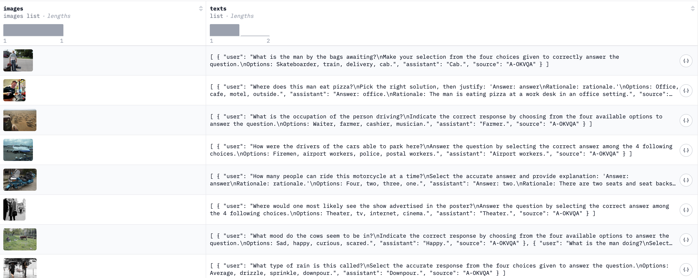
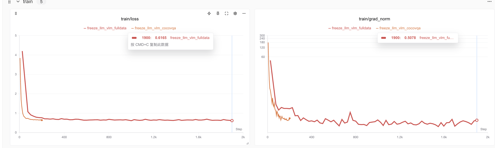
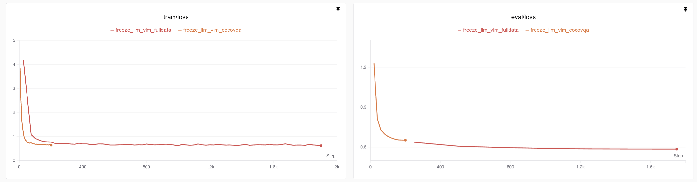
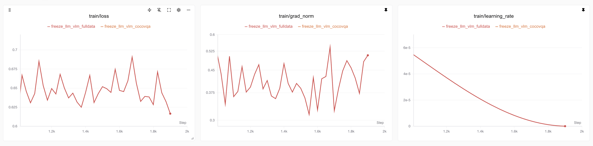

# Qwen3-"VL"——超小中文多模态模型的“拼接微调”之路1（附代码和SwanLab记录）

* 作者：情感机器实验室——陈少宏

* 邮箱：<shaohon_chen@115lab.club>

* GitHub：[https://github.com/ShaohonChen/Qwen3-SmVL](https://github.com/ShaohonChen/Qwen3-SmVL)
* SwanLab：[https://swanlab.cn/@ShaohonChen/Qwen3-SmVL/overview](https://swanlab.cn/@ShaohonChen/Qwen3-SmVL/overview)
* 数据集：[https://huggingface.co/datasets/HuggingFaceM4/the_cauldron](https://huggingface.co/datasets/HuggingFaceM4/the_cauldron)

## 摘要

最近Huggingface团队发布了超小多模态模型SmolVLM2，可以做到端侧1GB显存推理。在怀着惊喜试用后发现，虽然模型有极其强大的视觉文本理解能力，但是模型却无法理解中文。这对一个“四六级压线过”的笔者来说十分不友好。刚好前段时间做SwanLab硬件检测适配时有一台未到期的沐曦C500服务器，因此萌生了使用**沐曦AI芯片微调**，把当前中文小模型扛把子Qwen3与SmolVLM2直接微调拼接的想法。

本教程将介绍一种模型拼接的思路，将SmolVLM2的视觉模块（0.09B）与Qwen3最小的模型（0.6B）进行对齐微调，最终使得Qwen模型具备一定的视觉理解能力。由于笔者时间有限且考虑到文章篇幅的原因，因此该系列预计将以系列的方式放出。篇幅规划如下：

* **第一篇**：如何构建和微调一个拼接模型（**本篇博客**）
* **第二篇**：模型测评、数据集优化、回答人类对齐
* **第三篇**：微调技巧介绍、视觉位置编码改动与模型结构优化

<div align="center">
  <figure>
  
  <figcaption>I have a Qwen, I have a SmolVLM...</figcaption>
  </figure>
</div>

<div style="background-color:#fff3cd; color:black; padding:10px; border-radius:4px; border:1px solid #fbe5b0; width: 90%; max-width: 100%; margin: auto;">
  ⚠️关于算力的注意：本教程涉及VLM微调训练，对算力要求较高，需要40G及以上的GPU显存才能运行本教程的训练代码。
</div>

## 目录

* [SmolVLM2的背景知识](#SmolVLM2的背景知识)
* [模型拼接和微调思路简介](#模型拼接和微调思路简介)
* [模型拼接实现和关键代码讲解](#模型拼接实现和关键代码讲解)
* [微调数据集构建](#微调数据集构建)
* [微调方法与代码实现](#微调方法与代码实现)
* [微调训练&结果展示](#微调训练&结果展示)
* [代码及数据集链接汇总](#代码及数据集链接汇总)

## SmolVLM2的背景知识

首先，我们先回顾一下SmolVLM2模型的构建方案，SmolVLM2模型的整体包括三大块：视觉模型层，特征映射层和大语言模型层，见下图：

<div align="center">
  <figure>
  
  <figcaption>SmolVLM2的架构图</figcaption>
  </figure>
</div>

这个设计是现在比较常见的VLM方案。核心设计思想就是让视觉模型的输出特征与经过embedding的文本特征直接拼接后输入到语言模型（LLM）当中，没有交叉注意力等模块。相比于早期LLaVA等架构，这种最大的优点就是可以最大程度复用已有的语言模型。以Qwen2.5-VL为例，其3B、7B、72B模型大小指的只是LLM部分，并没有包含Vision模块，实际上3B模型的参数量接近4B，视觉模块大概0.4B左右，三个不同大小的VLM使用的是统一的视觉模型。对于一些较大的VLM来说，构建视觉模型时绝大多数的训练都集中在特征映射模块和视觉模块，只在最后阶段为了最终效果进行整体微调时才会调整语言模块。保证了VLM的语言能力。

下面简述一下各个模块的细节：

* 视觉模型层：SmolVLM2-256M版本用的是Google的SigLip模型，一个基于ViT的视觉模型，选用的是最小的SigLip-93M的版本，HF论文里没具体写是直接用的SigLip的参数还是他们从零构建的（有注意到的读者可以评论留言下）。在SmolVLM2代码中对应的是`SmolVLMVisionTransformer`类

* 特征映射层：就是一个简单的MLP，不过SmolVLM2中为了降低图像分辨率还做了一个Pixel shuffle来降低图像分辨率，进一步减少视觉的Token占用，减少了文本长度。HF团队在论文里提到对于参数量较小的VLM来说使用Pixel shuffle还能提升性能。但可训练参数其实就是一个单层的神经网络，这个模块的核心作用就是做特征对齐，将视觉特征从768维（SigLip的维度）映射到576维（SmolLLM2的维度）

* 大语言模型：SmolVLM2-256M模型使用的文本模型是SmolLM-135M版本。可能是由于模型较小，HF团队在论文中说到训练时仅采用两阶段训练：大规模图文训练+针对视频任务的专门微调。为了保障模型的文本能力HF团队在训练数据中参杂了大概14%的纯文本微调数据。不过考虑到视觉模块本身参数量（93M）大小接近于文本模型（135M），因此笔者推测相比于冻结文本模型，数据平衡在这之中会起到更关键的作用。

HF团队在原文中还提到了许多影像小模型VLM性能的trick，感兴趣的读者可以进一步参考SmolVLM2的论文

## 模型拼接和微调思路简介

正所谓顶级食材（模型）只需要最简单的烹饪。模型拼接的思路非常简单直接，基本就三步：

1. 调整SmolVLM2的“上下文控制格式”，使得其与Qwen3兼容。

2. 将模型的文本部分直接从SmolLM2换成Qwen3-0.6B，包括其文本tokenizer和词嵌入、文本模型、以及模型最后输出的语言模型头（LM Head）。

3. 需要重新初始化特征映射层的MLP，从768->576的单层神经网络改成768->1024的单层神经网络即可。

整体架构和对图文对前后处理依旧保持SmolVLM2的流程不变，具体改动见下图：

<div align="center">
  <figure>
  
  <figcaption>将Qwen3-0.6B替换SmolVLM2的语言模型部分</figcaption>
  </figure>
</div>

笔者接下来详细介绍下为了实现“拼接”，具体改动的地方，供之后有类似的任务的读者参考。

## 模型拼接实现和关键代码讲解

### 第一处改动：SmolVLM2的Tokenizers部分

首先需要改动的就是需要改动的是SmolVLM2的Tokenizers部分，这里面主要是涉及两个问题：

* 第一个问题是要将SmolVLM2用于指示图像位置的特殊令牌（Special Token）加入到Qwen3的Tokenizer当中，这么做的目的是防止SmolVLM2的图像Token`<image>`被切分为`<`、`image`、`>`三块。幸运的是，Qwen3本身在Tokenizers中预留了未来用于多模态的特殊特殊令牌`<|image_pad|>`。因此读者直接使用了`<|image_pad|>`代替了`<image>`。用于在文本中预留图像特征的插入点。

* 第二个问题是：SmolVLM2的chat_template和Qwen3的chat_template差别极大。chat_template的作用是通过格式化文本让模型清楚知道不同Token所代表的背景信息。用最近比较流行的话来说就是“上下文工程”（Context Engineering）。

这里我列举了一下Qwen3、SmolVLM2、Qwen2.5-VL在聊天场景下的上下文，供读者参考。

**Qwen3聊天上下文格式**

以给一张图片，问题是“你的名字是什么?”，模型回答是“我的名字是Qwen”为例子。模型的上下文如下：

```txt
<|im_start|>user
你的名字是什么?<|im_end|>
<|im_start|>assistant
<think>

</think>

我的名字是Qwen<|im_end|>

```

注意Qwen3上下文是没有预留图像位置的，但相比于一般的LLM和VLM多了一个用于插入模型思考过程的`<think><\think>`，以及包含额外的函数调用控制文本。为了便于读者理解，读者在在下面举了一个函数调用的例子。这些函数调用上下文用于控制模型调用外部函数、API或者MCP接口和接收其返回的信息。

考虑到篇幅限制，本文就不粘贴带函数调用、推理、思考等一系列上下文的信息了（笔者打印了下发现实在太长了）。感兴趣的读者可以在Qwen3的官方文处了解详细设计

* [Qwen3函数调用案例](https://qwen.readthedocs.io/zh-cn/latest/framework/function_call.html#the-example-case)

可以说正是这些复杂的上下文信息让模型有可能实现推理、调用函数等多样化的能力。包括多模态理解任务也需要先对上下文进行设计。

**SmdwadwdoVLM2聊天上下文格式：**

以给一张图片，问题是“How many dog in there.”，模型回答是“There are Three dogs.”为例子。三种不同模型的上下文如下：

```txt
<|im_start|>User:<fake_token_around_image><row_1_col_1><image>...<image><fake_token_around_image><row_1_col_2><image>...<image><fake_token_around_image><row_1_col_3><image>...<image>...<fake_token_around_image><row_4_col_4><image>...<image>

<fake_token_around_image><global-img><image>...<image><fake_token_around_image>How many dog in there.<end_of_utterance>
Assistant: There are Three dogs.<end_of_utterance>
Assistant:
```

看起来非常乱，是因为有大量的`<image>`占位符。`<image>...<image>`之间是许多的`<image>`，笔者为了文章观感删掉了大量的占位符。注意模型的回车、空格均为上下文的一部分，在进行推理时需要严格遵守缩进关系。

但是我们仍能找到熟悉的内容，如`User:`，`Assistant:`等用于提示模型用户的输入与模型应当输出的位置。这些关键词和Qwen类似。

读者注意到了除了`<fake_token_around_image>`，`<image>`等用于指示图像的词，还出现了<row_1_col_1>这种位置指示符，这是因为SmolVLM2为了防止降采样对图像分辨率影响，专门使用了`image splitting`技术，简单来说就是将全局图和高清的局部图共同输入到模型当中（见下图`image splitting`模块），感兴趣的读者可在文末找到HF的技术报告了解详细技术。

<div align="center">
  <figure>
  
  <figcaption>SmolVLM2的完整推理流程，可以看到在图像输入前使用`image splitting`进行了预切分</figcaption>
  </figure>
</div>

**本博文的拼接模型Qwen3-SmVL模型**

相比于Qwen3，SmolVLM2少了很多上下控制的

为了尽可能保存或者说预留Qwen3的思考、函数调用等能力，笔者最终选择将SmolVLM2对于图像特征的排列插入到Qwen3的上下文格式当中。最终上下文格式如下：

```txt
<|im_start|>user
<vision_start><row_1_col_1><|image_pad|>（图像插入的地方）<|image_pad|><vision_start>
（用户提问的地方）
<|im_end|>
<|im_start|>assistant
<think>

</think>

（模型回答的地方）<|im_end|>
<|endoftext|>
```

可以看到读者尽量保持了与Qwen3的风格和复用特殊令牌。这样能够使得后续拼接的Qwen3-0.6B模型不至于受到上下文差异过大带来的性能损耗。实际上在设计微调上下文时应尽量与模型先前训练的任务接近，以减少微调带来的性能损失。

transformers实现模型上下文格式控制的代码并非python语言，而是一种前端文本格式控制的语言Jinja。这个语言的变量作用域设计简直可以说是有魔法在里面。配合上Qwen3功能丰富且复杂的上下文策略，让笔者花了2个小时用于修改chat_teamplate。这里笔者不赘述如何修改chat_template，感兴趣的读者可以去文末代码链接寻找`chat_template.jinja`文件，笔者专门将chat_template模版拿出来，并且做了格式化方便读者阅读。未来有时间了笔者专门写一篇模型上下文控制与jinja语言的博客。

### 第二处改动：替换SmolVLM2的SmolLM2模型为Qwen3-0.6B

替换模型这块没什么复杂的，主要是需要处理Transformers比较复杂的嵌套逻辑。Tranformers通常建议模型将预训练模型backbone和下游任务分开来。改动逻辑图如下：

<div align="center">
  <figure>
  
  <figcaption>替换smolvlm2的文本模块和语言模型头</figcaption>
  </figure>
</div>

以Qwen3为例，预训练Backbone模型为`Qwen3Model`，仅仅包含embedding层、各个Decoder层，最后输出的是所有输入token的hidden state。负责下游任务的Qwen3提供了包括：用于因果语言序列生成的`Qwen3ForCausalLM`，也就是大家常用的语言生成。负责句子分类`Qwen3ForSequenceClassification`，使用最后一个生成的token输入到一个单层MLP做序列级分类，做句子情绪分类等可以用这个下游模型；`Qwen3ForTokenClassification`用于做Token级分类，比如语言实体抽取任务可以使用这个下游模型。`Qwen3ForQuestionAnswering`则是专门做抽取式问答任务的模型，核心思想是输入（问题，参考文本）让模型从参考文本中找到与问题最相关的一段，这类任务由于RAG系统的出现没那么流行了，未来笔者专门出一个系列的教程阐述除了因果语言序列生成以外的任务则怎么微调。

**关键代码如下**

```python
from transformers import (
    AutoProcessor,
    AutoModelForImageTextToText,
    AutoTokenizer,
    AutoModelForCausalLM
)

# 替换text模型和head
smolvlm2_02B_model = AutoModelForImageTextToText.from_pretrained(
    "model/SmolVLM2-256M-Video-Instruct",
    torch_dtype=torch.bfloat16,
    _attn_implementation="eager",
).to(device)

qwen3_06b_model = AutoModelForCausalLM.from_pretrained(
    "model/Qwen3-0.6B", torch_dtype=torch.bfloat16
).to(device)

smolvlm2_02B_model.model.text_model = qwen3_06b_model.model
smolvlm2_02B_model.lm_head = qwen3_06b_model.lm_head
...
```

接下来比较复杂的是替换所有的关键变量，比如模型内用于在文本序列中为图像特征预留的占位符`image_token_id`，用于指示停止生成的`eos_token_id`，和计算loss值会用到的`vocab_size`，Qwen的词表大小为151936，远远大过SmolVLM2的词表49280。具体代码如下：

```python
...
# 替换词表大小
smolvlm2_02B_model.vocab_size = qwen3_06b_model.vocab_size
smolvlm2_02B_model.model.vocab_size = qwen3_06b_model.vocab_size
smolvlm2_02B_model.config.vocab_size = qwen3_06b_model.vocab_size
smolvlm2_02B_model.config.text_config.vocab_size = qwen3_06b_model.vocab_size
smolvlm2_02B_model.model.config.vocab_siz = qwen3_06b_model.vocab_size
smolvlm2_02B_model.model.config.text_config.vocab_size = qwen3_06b_model.vocab_size
# 替换图像token
smolvlm2_02B_model.image_token_id = 151655
smolvlm2_02B_model.model.image_token_id = 151655
smolvlm2_02B_model.config.image_token_id = 151655
smolvlm2_02B_model.model.config.image_token_id = 151655
# 替换模型生成停止符
smolvlm2_02B_model.generation_config.eos_token_id = 151645
···
```

上面的代码可以看到在替换各个变量时需要将嵌套模型的变量一起替换掉，笔者之前训练时就因为仅仅替换了`SmolVLMForConditionalGeneration`而忘记替换`SmolVLMModel`中的`image_token_id`，导致语言模型接收不到图像特征，最后表现出来就是loss下降的极快且低，grad_norm看起来也学到位了，一推理效果特别差，附上错误训练的损失图：

<div align="center">
  <figure>
  
  <figcaption>SwanLab记录训练结果展示：蓝色为错误训练的完整微调loss图，可以看到损失下降很快，然而实际推理会发现模型并没有图像理解能力。冻结语言模型头（红色）后发现grad_norm为零且loss不收敛，正确的应该是黄色</figcaption>
  </figure>
</div>

笔者最早没发现改动错误，先做完整微调（蓝色曲线）后发现损失下降很快达到了0.1以下，结果实际一推理发现模型完全没有图像理解能力，就补了一个冻结语言模型只微调视觉模型的实验（红色曲线），结果发现损失完全没下降，才定位到了视觉特征传入有问题。后续修复后正确的损失下降过程见黄色图像。

### 第三处改动：构建和替换特征映射层

这个相对较简单，只需要重新构建一个维度对齐的`SmolVLMConnector`即可。Qwen3的hidden_dim是1024，SigLip的hidden_dim是768，因此构建一个768➡️1024映射的`SmolVLMConnector`即可。代码如下：

```python
···
# 构建配置并且创建连接器
@dataclass
class VisionConfig:
    hidden_size: int = 768

@dataclass
class TextConfig:
    hidden_size: int = 1024

@dataclass
class ConnectConfig:
    scale_factor: int = 4
    vision_config: VisionConfig = VisionConfig()
    text_config: TextConfig = TextConfig()

new_connector_config = ConnectConfig()

# 替换 SigLit 到 LLM 的 connector 层
new_connector = SmolVLMConnector(new_connector_config).to(device).to(torch.bfloat16)
smolvlm2_02B_model.model.connector = new_connector
···
```

## 微调数据集构建

笔者最初计划寻找中文多模态数据集，但发现相关的资料比较少。因此决定先用英文的多模态数据集凑合一下。之后再考虑通过数据合成的方式将部分数据翻译为中文。关于数据合成和配比的问题将在之后的博客讨论。

<div align="center">
  <figure>
  
  <figcaption>the_cauldron数据集logo</figcaption>
  </figure>
</div>

这里为了方便本项目直接使用HuggingFace团队整合的多模态数据集the Cauldron数据集，Cauldron翻译成中文类似于煮东西的“釜”，不知道HF团队是不是玩“炼丹”的梗。这个数据集整合了50个视觉微调任务数据集的训练集，用于微调Huggingface发布的多模态模型Idefics2模型。这50多个数据集都被处理成了一致的格式（见下图），共有1,880,992条数据，完整下载约169G，非常方便使用。

<div align="center">
  <figure>
  
  <figcaption>数据集样本展示</figcaption>
  </figure>
</div>

不过可惜数据集的文本都是英文内容，且绝大多数数据集的回复非常短，只有一个词，这也给后面模型训练带来了麻烦。本篇博客暂时不讨论关于数据构建和配比的问题，后续有时间了专门做相关的实验。本博客先以为Qwen3模型带来视觉能力为核心目标。

数据集的下载链接如下，国内推荐用modelscope下载：

* [HuggingFace Hub](https://huggingface.co/datasets/HuggingFaceM4/the_cauldron)
* [ModelScope](https://modelscope.cn/datasets/AI-ModelScope/the_cauldron)

笔者在实际测试时发现"mimic_cgd"，"localized_narratives"，"okvqa"，"ocrvqa"，"clevr_math"这几个子数据集加载有点异常，建议使用此数据集训练的读者手动处理下，社区也有用户反馈这几个数据可以在原始来源处额外下载，未来笔者将会补全这几个数据集重新上传一次完整版的the Cauldron数据集。

## 微调方法与代码实现

### 冻结模型参数微调

整体微调方法采用了CLM模型通常的Teacher Forcing的学习方法，损失就是标准的交叉熵损失。考虑到此次本教程的目标是先确保模型具备中文多模态能力（优化模型性能等之后撰写其他博客），因此为了实验效率，在对齐微调阶段**采用冻结视觉模型与文本模型、语言模型头，仅微调特征映射器**的方法。

冻结模型参数的核心代码如下：

```python
def freeze_model(qwen_smvl):
    for _, param in qwen_smvl.model.text_model.named_parameters():
        param.requires_grad = False
    for _, param in qwen_smvl.model.vision_model.named_parameters():
        param.requires_grad = False
    for _, param in qwen_smvl.lm_head.named_parameters():
        param.requires_grad = False
    return qwen_smvl
```

冻结后训练参数、模型总参数、与占比如下：

```txt
trainable params: 12.00M || all params: 662.87M || trainable%: 1.81
```

### 文本长度，损失掩码和截断策略

**文本长度**

由于视觉特征需要占据大量的文本长度，笔者简单测试了下the_cauldron图像占0.8K到1.3K左右的token。而数据集中大多数文本token数在200-500左右，极少情况会有3-4K的情况。因此笔者统一采用2K的文本长度，超出部分截断处理。

这里有一个不同于文本微调的细节要注意，文本截断长度不能小于图像token，否则会导致模型在进行特征拼接时报错（当然图像特征如果被截断了，这条训练数据也就没意义了）。因此对于显存不足64G的同学如果需要适当缩短文本长度（不建议低于1.5K），最好连同图像分辨率也缩小些。在后面的博客我们会专门增加对减少图片token占用的研究。

同样由于文本长度受限，且图像特征没法截断，我们也没使用“packing dataset”的方法提升模型的训练效率。

考虑到部分数据集存在多张图片的情况，考虑到本次训练仅采用2k的文本长度（与之对比HF在训练SmolVLM-256M版本采用的是8K的文本长度，2.2B版使用了16K的文本长度）。针对单条数据中存在多张图片的情况仅仅选用第一张。

**损失掩码**

在采用Teacher Forcing的学习方法时，文本微调中损失掩码有两种策略：

* 对包含“用户问题”和“模型回复”的完整文本进行微调优化
* 仅对“模型回复”部分进行微调优化

这两种策略的对比如下图：

<div align="center">
  <figure>
  
  <figcaption>两种微调掩码策略的差异，通常建议选择“仅微调模型回答部分”以增强泛化性</figcaption>
  </figure>
</div>

通常来说使用“仅微调模型回复部分”的策略模型更容易泛化（这点与HF在SmolVLM2的论文提到的trick）。然而笔者为了提高训练效率选择了完整文本微调。可以在后续博客中增加消融实验做进一步对比。

值得注意的是，在进行完整文本微调时，需要单独屏蔽Image Token以防止对图像占位token计算损失，影响模型表现。

**关键代码如下：**

```python
def data_collate_fix2k(examples, processor, device, max_length=2048):
    batch_text = []
    batch_image = []
    for example in examples:
        images = example["images"][:1]  # 只允许一张图，不然显存压力太大
        batch_image.append(images)
        image_num = len(images)
        chat_texts = example["texts"][0]
        messages = [
            {
                "role": "user",
                "content": [{"type": "image"}] * image_num
                + [{"type": "text", "text": chat_texts["user"]}],
            },
            {
                "role": "assistant",
                "content": [{"type": "text", "text": chat_texts["assistant"]}],
            },
        ]
        text = processor.apply_chat_template(
            messages, enable_thinking=False, add_generation_prompt=False
        )

        batch_text.append(text)

    batch = processor(
        text=batch_text,
        images=batch_image,
        max_length=max_length,
        return_tensors="pt",
        padding="max_length",
        truncation=True,
    )
    labels = batch["input_ids"].clone()
    labels[labels == processor.tokenizer.pad_token_id] = -100
    labels[labels == processor.image_token_id] = -100
    batch["labels"] = labels
    return batch.to(device, dtype=torch.bfloat16)
```

### 微调超参数设置

**学习率**

由于仅仅针对特征映射层（connector）进行训练，且conntector由于要对齐Qwen3的维度因此参数为随机初始化（理论上可以采用一些独特的初始化策略提升性能，但考虑到模型较小因此笔者没关注初始化策略）。因此学习率设置为lora中较为流行的1e-4学习率策略。

为了保障有效收敛，学习率衰减基本是必备的trick，采用的是社区比较流行的cosine学习率衰减，衰减至0。warm up为整体步长的10%（在超过1000k step的情况下固定为50）。

**batch size**

Batch size通常来说越大越好，然而由于VLM模型的文本长度太大，因此采用每卡1 batch和4梯度累加（grad accelerate），在8卡训练中等效32 Batch size。

**训练参数设置代码**

```python
training_args = TrainingArguments(
    seed=42,
    data_seed=42,
    max_steps=200,
    # num_train_epochs=1,  # 训练1个epoch 约1k steps
    per_device_train_batch_size=1,
    gradient_accumulation_steps=4,
    dataloader_pin_memory=False,
    warmup_ratio=0.1,
    learning_rate=1e-4,
    lr_scheduler_type="cosine",
    weight_decay=0.01,
    logging_steps=5,
    eval_strategy="steps",
    eval_steps=0.125,
    save_strategy="steps",
    save_steps=0.125,
    save_total_limit=8,
    optim="adamw_torch",
    bf16=True,
    output_dir=f"./model/freeze_except_connector_cocovqa",
    overwrite_output_dir=False,
    report_to="swanlab",
    run_name="freeze_except_connector_cocovqa",
    remove_unused_columns=False,
    gradient_checkpointing=False,
)
```

### 训练环境

微调代码基于沐曦的C500国产通用计算GPU实现，显存为64G。沐曦的AI芯片基本完全兼容pytorch和huggingface transformers场景，并且在做多模态训练时相比较其他国产AI芯片罕见的没有兼容性问题。读者在尝试本项目代码时可以采用Nvidia显存40G以上的显卡运行本教程。

<div align="center">
  <figure>
  
  <figcaption>沐曦国产GPU，笔者用的云端服务器没见过真机，因此找了张网图</figcaption>
  </figure>
</div>

训练环境的话除了安装GPU对应的驱动和pytorch外，本教程需要额外安装Huggingface全家桶，如下：

```txt
torch   # 推荐版本>=6.0
torchvision
transformers>=4.53.0
accelerate
datasets
num2words   # SmolVLM2需要
```

额外补充一句，如果采用沐曦GPU训练的话，需要在沐曦官方文档处寻找[沐曦版torch](https://developer.metax-tech.com/softnova/index)的安装方式进行下载。其他HF环境和NV基本一样。附赠一个沐曦查看GPU的命令：

```bash
mx-smi
```

效果如下：

```bash
=================== MetaX System Management Interface Log ===================
Timestamp                                         : Sat Jul 12 14:58:51 2025

Attached GPUs                                     : 8
+---------------------------------------------------------------------------------+
| MX-SMI 2.1.12                       Kernel Mode Driver Version: 2.12.13         |
| MACA Version: 2.29.0.19             BIOS Version: 1.22.3.0                      |
|------------------------------------+---------------------+----------------------+
| GPU         NAME                   | Bus-id              | GPU-Util             |
| Temp        Pwr:Usage/Cap          | Memory-Usage        |                      |
|====================================+=====================+======================|
| 0           MetaX C500             | 0000:0e:00.0        | 0%                   |
| 36C         69W / 350W             | 5680/65536 MiB      |                      |
+------------------------------------+---------------------+----------------------+
| 1           MetaX C500             | 0000:0f:00.0        | 0%                   |
| 38C         70W / 350W             | 4986/65536 MiB      |                      |
+------------------------------------+---------------------+----------------------+
| 2           MetaX C500             | 0000:10:00.0        | 0%                   |
| 37C         69W / 350W             | 4986/65536 MiB      |                      |
+------------------------------------+---------------------+----------------------+
| 3           MetaX C500             | 0000:12:00.0        | 1%                   |
| 37C         71W / 350W             | 4986/65536 MiB      |                      |
+------------------------------------+---------------------+----------------------+
| 4           MetaX C500             | 0000:35:00.0        | 0%                   |
| 37C         70W / 350W             | 4986/65536 MiB      |                      |
+------------------------------------+---------------------+----------------------+
| 5           MetaX C500             | 0000:36:00.0        | 1%                   |
| 36C         68W / 350W             | 4986/65536 MiB      |                      |
+------------------------------------+---------------------+----------------------+
| 6           MetaX C500             | 0000:37:00.0        | 0%                   |
| 39C         73W / 350W             | 4986/65536 MiB      |                      |
+------------------------------------+---------------------+----------------------+
| 7           MetaX C500             | 0000:38:00.0        | 0%                   |
| 38C         71W / 350W             | 4986/65536 MiB      |                      |
+------------------------------------+---------------------+----------------------+

+---------------------------------------------------------------------------------+
| Process:                                                                        |
|  GPU                    PID         Process Name                 GPU Memory     |
|                                                                  Usage(MiB)     |
|=================================================================================|
|  0                  3496691         python3.10                   4066           |
|  0                  3496692         python3.10                   102            |
|  0                  3496693         python3.10                   102            |
|  0                  3496694         python3.10                   102            |
|  0                  3496695         python3.10                   102            |
|  0                  3496696         python3.10                   102            |
|  0                  3496697         python3.10                   102            |
|  0                  3496698         python3.10                   170            |
|  1                  3496692         python3.10                   4154           |
|  2                  3496693         python3.10                   4154           |
|  3                  3496694         python3.10                   4154           |
|  4                  3496695         python3.10                   4154           |
|  5                  3496696         python3.10                   4154           |
|  6                  3496697         python3.10                   4154           |
|  7                  3496698         python3.10                   4154           |
+---------------------------------------------------------------------------------+
```

### 训练代码实现

在构建训练代码时，笔者使用HuggingFace Transfomers框架的Trainer类来完成训练代码。Trainer类实现的训练逻辑基本能完成大部分微调任务。这里唯一需要提到的是笔者使用了Qwen3-0.6B而非通常此类任务该使用的Qwen3-0.6B-Base模型，Qwen3-0.6B相比于Qwen3-0.6B-Base模型经过了指令遵从微调、对齐等，能实现聊天问答功能。

通常来说对经过微调的模型进行持续训练会一定程度带来性能损失，然而此次微调时笔者冻结了LLM参数，因此需要选用经过微调的模型来实现多模态问答能力。

笔者在训练过程中使用的是bfloat16精度，相比于float16来说bfloat16增加了尾数位数，训练过程中精度会更高些。

在前期进行方案验证阶段笔者采用的是cocoqa数据集，并且进行200steps的微调训练。在确定方案可行后笔者使用完整数据集进行2000steps的微调训练。2000steps仅能利用完整数据集的10%，然而考虑到训练数据量仅仅只有整个模型的12M，参数量与Token的比值接近10:1，笔者认为参与训练的数量是足以令模型收敛的，后续实验也证明了模型确实能达到我们所期望的效果。

**训练关键代码实现**

代码比较长是因为增加了断点续训的能力

```python
################
# 开启训练
################
last_checkpoint = None  # load last checkpoint if available
if (
    os.path.isdir(training_args.output_dir)
    and not training_args.overwrite_output_dir
):
    last_checkpoint = get_last_checkpoint(training_args.output_dir)
    if last_checkpoint is None and len(os.listdir(training_args.output_dir)) > 0:
        raise ValueError(
            f"Output directory ({training_args.output_dir}) already exists"
        )
    print(
        f"Checkpoint detected, resuming training at {last_checkpoint}."
    )
# Init Trainer
trainer = Trainer(
    model=qwen_smvl,
    args=training_args,
    train_dataset=raw_data["train"],
    eval_dataset=raw_data["test"],
    data_collator=collate_fn,
)
trainer.train(resume_from_checkpoint=last_checkpoint)
qwen_smvl.save_pretrained(training_args.output_dir)
```

完整代码见[代码及数据集链接汇总](#代码及数据集链接汇总)

或者直接由[完整项目GitHub地址]()

## 微调训练&结果展示

### 环境安装与微调代码执行

**代码准备与环境安装**

可以在[GitHub仓库地址](https://github.com/ShaohonChen/Qwen3-SmVL)处找到实验的完整代码。使用git clone后使用如下命令安装环境

```bash
pip install -r requirements.txt
```

**数据集和模型下载**

笔者附上自动下载脚本，注意该脚本使用[魔塔社区](https://modelscope.cn/)完成模型与数据集的下载

```bash
bash download_resource.sh
```

### 小批量微调训练

为了进行快速验证，笔者首先使用cocoqa数据集并且进行了200steps的训练，所有参数与前文所述一致。通过

运行实验命令如下，推荐使用8卡进行训练，在8片沐曦C500芯片上预计需要使用20min

```bash
# 单GPU训练
CUDA_VISIBLE_DEVICES=0 python train.py ./cocoqa_train.yaml
# 8GPU训练
accelerate --num_process 8 train.py ./cocoqa_train.yaml
```

注意，本项目使用SwanLab进行训练日志记录与分析，如果未登陆SwanLab需要使用`swanlab login`进行登陆。运行后看到如下结果即代表实验成功开启：

<div align="center">
  <figure>
  
  <figcaption>成功训练后可以看到SwanLab链接</figcaption>
  </figure>
</div>

下面是笔者完成小批量微调训练的训练损失、测试损失结果图

<div align="center">
  <figure>
  
  <figcaption>SwanLab训练可视化分析结果，可以看到最后训练损失和测试损失都收敛在0.65左右</figcaption>
  </figure>
</div>

模型在完成训练后会自动使用一张狗狗图片配合问题“图中有什么动物？”让模型根据图片进行推理，推理结果如下：

<div align="center">
  <figure>
  
  <figcaption>SwanLab记录了模型训练好后的推理结果，可以看到模型能正常理解和回复中文</figcaption>
  </figure>
</div>

当时看到模型对着三只狗的图片回答“兔子”时笔者一时认为炼丹失败了，当然如果实际炼丹失败后模型是不会输出动物类型的，而是输出一些乱码或者告诉用户并没有看到图片。识别错误的原因实际上是由于训练步数过少导致的。后续加大训练步数与数据量后模型能正常识别出狗狗并且能准确的说出有三只狗。

<div align="center">
  <figure>
  
  <figcaption>附上三只眼神忧伤的狗子，难道长得很像兔子吗？</figcaption>
  </figure>
</div>

PS: 作者公开了在[SwanLab上的训练结果](https://swanlab.cn/@ShaohonChen/Qwen3-SmVL/overview)，感兴趣的读者可以自己查看，SwanLab也支持Clone作者的训练日志，大家可以在自己训练时clone笔者的项目去做对照。

### 完整微调训练结果展示

运行实验命令如下，推荐使用8卡进行训练，在8片沐曦C500芯片上预计需要使用1.5h

```bash
# 单GPU训练
CUDA_VISIBLE_DEVICES=0 python train.py ./full_train.yaml
# 8GPU训练
accelerate --num_process 8 train.py ./full_train.yaml
```

下图展示了使用完整微调数据对比于小批量训练，可以看到全量数据微调时loss变得更为抖动，这是由于数据类型的丰富给模型的学习带来了一定的挑战。

<div align="center">
  <figure>
  
  <figcaption>红色为完整训练loss，黄色为小批量训练结果</figcaption>
  </figure>
</div>

进一步对比完整训练和小批量训练的训练和测试损失，可以看到完整训练的模型训练损失达到了0.38，远高于仅仅使用cocoqa模型的效果，评估损失也远低于前者，维持在0.58左右。

<div align="center">
  <figure>
  
  <figcaption>红色为完整训练loss，黄色为小批量训练结果</figcaption>
  </figure>
</div>

这里要说明的是，由于我们选用的测试集比较小（仅有64条数据），因此训练损失和测试损失的差距并不能直接理解为过拟合的证据。实际上在大模型训练上，如果数据集足够大的情况下，通常可以认为训练损失等同于评估损失。

此外，模型通过分析1k步之后的训练损失、平均梯度范数（Grad Norm）变化。此时训练任务已过半，且学习率开始快速衰减。如下图，可以看到学习率快速衰减的情况下模型损失并没有明显的进一步下降，这说明模型已经实现了充分训练。

<div align="center">
  <figure>
  
  <figcaption>1k step之后模型的训练损失变化</figcaption>
  </figure>
</div>

在训练效率方面，可以看到我们仍没有充分榨干沐曦GPU的性能，当然这也是由于多模态任务的网络本身架构上比较复杂，其中包含许多对图像、文本的拼接工作，这也导致了GPU性能没法完全利用。

<div align="center">
  <figure>
  
  <figcaption>SwanLab对沐曦C500训效率自动记录</figcaption>
  </figure>
</div>

同样在完成训练后使用狗狗图进行了测试，这次模型能理解图片、中文以及给出正确的回复。更为关键的是模型完全保留了Qwen3-0.6B原有的全部能力，包括函数调用、推理等。在此基础上，仅仅增加了0.09B参数量的情况下为模型带来了图像理解能力！

<div align="center">
  <figure>
  
  <figcaption>同样的图片与问题，更大的数据量和更充足的数据使得模型能够正确给出回复</figcaption>
  </figure>
</div>

### 模型推理与效果分析

等笔者下完数据集后未来补一下测试环节 ; ）

## 代码及数据集链接汇总

微调用The Cauldron数据集下载链接：

* HuggingFace Hub: [https://huggingface.co/datasets/HuggingFaceM4/the_cauldron](https://huggingface.co/datasets/HuggingFaceM4/the_cauldron)
* ModelScope: [https://modelscope.cn/datasets/AI-ModelScope/the_cauldron](https://modelscope.cn/datasets/AI-ModelScope/the_cauldron)

Qwen3-0.6B模型下载：

* HuggingFace Hub: [https://huggingface.co/Qwen/Qwen3-0.6B](https://huggingface.co/Qwen/Qwen3-0.6B)
* ModelScope: [https://modelscope.cn/Qwen/Qwen3-0.6B](https://modelscope.cn/Qwen/Qwen3-0.6B)

本实验完整代码GitHub链接：

* 完整项目GitHub地址：[https://github.com/ShaohonChen/Qwen3-SmVL](https://github.com/ShaohonChen/Qwen3-SmVL)

本实验SwanLab日志：

* SwanLab训练过程查看：[https://swanlab.cn/@ShaohonChen/Qwen3-SmVL/overview](https://swanlab.cn/@ShaohonChen/Qwen3-SmVL/overview)

## 参考资料

* Huggingface SmolVLM2技术报告：[https://arxiv.org/pdf/2504.05299](https://arxiv.org/pdf/2504.05299)
