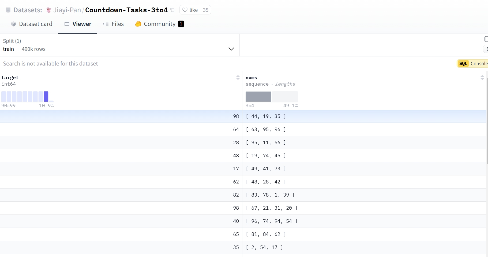

# Qwen2.5复现DeepSeek-R1-ZERO

[](https://swanlab.cn/@LiXinYu/Try_r1/overview)

## 简介
本文旨在对deepseek-r1-zero进行复现实验，简单介绍了从r1原理到代码实现，再到结果观测的整个过程。通过SwanLab监控实验过程，确保实验的每个阶段都能精确跟踪与调试。通过这一系列的实验步骤，能够掌握GRPO的实现方法。


---


## 链接资料

本次实验参考了优秀开源项目[philschmid/deep-learning-pytorch-huggingface](https://github.com/philschmid/deep-learning-pytorch-huggingface/blob/main/training/mini-deepseek-r1-aha-grpo.ipynb)，该项目作者是google-deepmind工程师Philipp Schmid，Countdown用于R1训练的idea就是这个项目发起的。

> 模型地址：Qwen2.5-3B-Instruct:[huggingface社区](https://huggingface.co/Qwen/Qwen2.5-3B-Instruct)|[魔搭社区](https://modelscope.cn/models/Qwen/Qwen2.5-3B-Instruct)
>
> 数据集地址：Countdown-Tasks-3to4:[huggingface地址](https://huggingface.co/datasets/Jiayi-Pan/Countdown-Tasks-3to4)|[魔搭社区地址](https://modelscope.cn/datasets/zouxuhong/Countdown-Tasks-3to4)
>
> 可视化工具SwanLab项目地址：[SwanLab结果可视化](https://swanlab.cn/@LiXinYu/Try_r1/overview)

---


## DeepSeek-R1原理

论文标题：DeepSeek-R1: Incentivizing Reasoning Capability in LLMs via Reinforcement Learning

论文链接：[论文链接](https://arxiv.org/pdf/2501.12948?)

代码地址：[github链接](https://github.com/deepseek-ai/DeepSeek-R1)

**下面是论文里从DeepSeek-V3到DeepSeek-R1的流程图表示**

本次教程仅考虑从DeepSeek-V3--->DeepSeek-R1-Zero的复现过程，基于Qwen2.5-3B-Instruct模型实现。


**GRPO原理：**

`群体相对策略优化 (GRPO，Group Relative Policy Optimization) `是一种强化学习 (RL) 算法，专门用于增强大型语言模型 (LLM) 中的推理能力。与严重依赖外部评估模型（价值函数）指导学习的传统 RL 方法不同，GRPO 通过评估彼此相关的响应组来优化模型。这种方法可以提高训练效率，使 GRPO 成为需要复杂问题解决和长链思维的推理任务的理想选择。

> GRPO 的本质思路：通过在同一个问题上生成多条回答，把它们彼此之间做“相对比较”，来代替传统 PPO 中的“价值模型”

`传统的强化学习算法（如Proximal Policy Optimization，PPO）`在应用于LLMs的推理任务时面临着重大挑战：

1、依赖批评者模型：
PPO需要一个独立的批评者模型来评估每个回答的价值，这使内存和计算需求增加了一倍。
训练批评者模型非常复杂且容易出错，尤其是在需要对主观或细微差别进行评价的任务中。


2、高昂的计算成本：
强化学习流程通常需要大量计算资源来迭代评估和优化回答。
将这些方法扩展到更大的LLMs会进一步加剧成本。

3、可扩展性问题：
绝对奖励评估难以应对多样化任务，使得跨推理领域的泛化变得困难。
---
`GRPO如何应对这些挑战：`

1、无批评者优化： GRPO通过比较组内回答，消除了对批评者模型的需求，显著降低了计算开销。

2、相对评估： GRPO不依赖外部评价者，而是利用组内动态来评估每个回答在同一批次中的相对表现。

3、高效训练： 通过专注于组内优势，GRPO简化了奖励估计流程，使其对大型模型的训练更快且更具可扩展性。

下图是PPO与GRPO的对比，GRPO放弃了价值模型，从分组得分中估计，显著减少了训练资源


> 看到一位作者的看法，把GRPO比作老师给学生上课，老师让一组学生解决一个问题。
> 老师没有单独为每个学生打分，而是让学生在组内比较彼此的答案。表现更好的学生会得到鼓励，而其他人则从错误中学习。随着时间的推移，整个组会逐渐提高，变得更准确和一致。GRPO 将这一原理应用于训练AI模型，使其能够高效地学习。

---

## 实验代码

### 1、环境搭建

> 环境设置如下：
> 
> pip install transformers==4.48.1 
> 
> pip install peft==0.14.0
> 
> conda install pytorch==2.4.0 torchvision==0.19.0 torchaudio==2.4.0 -c pytorch
> 
> pip install datasets
> 
> pip install accelerate
> 
> pip install trl
> 
> pip install -U swanlab
> 
> pip install deepspeed

### 2、数据预处理

本次实验使用一个490k条数据的[Countdown数据集](https://huggingface.co/datasets/Jiayi-Pan/Countdown-Tasks-3to4)来进行实验，内容如下图所示：



该数据集仅有两项，一个是target结果数据，一个是nums组合数据，我们的目的是为了让模型思考如何从nums经过+、-、*、/计算得到target，为了让模型更好的激活思考能力，我们需要对其设置提示词模板，最重要让模型回答成如下模样：

```text
<think>:
让我们来思考下,……
</think>

<answer>
……
</answer>
```
同时，由于每个模型都有对应的训练格式模板，比如Qwen的模板在其权重文件中的tokenizer_config.json文件里，具体[例子](https://modelscope.cn/models/Qwen/Qwen2.5-3B-Instruct/file/view/master?fileName=tokenizer_config.json&status=1)如下：

```json
"chat_template": "\n    {{- '<|im_start|>system\\n' }}\n    \n        {{- messages[0]['content'] }}\n    \n        {{- 'You are Qwen, created by Alibaba Cloud. You are a helpful assistant.' }}\n    \n    {{- \"\\n\\n# Tools\\n\\nYou may call one or more functions to assist with the user query.\\n\\nYou are provided with function signatures within <tools></tools> XML tags:\\n<tools>\" }}\n    \n        {{- \"\\n\" }}\n        {{- tool | tojson }}\n    \n    {{- \"\\n</tools>\\n\\nFor each function call, return a json object with function name and arguments within <tool_call></tool_call> XML tags:\\n<tool_call>\\n{\\\"name\\\": <function-name>, \\\"arguments\\\": <args-json-object>}\\n</tool_call><|im_end|>\\n\" }}\n\n    \n        {{- '<|im_start|>system\\n' + messages[0]['content'] + '<|im_end|>\\n' }}\n    \n        {{- '<|im_start|>system\\nYou are Qwen, created by Alibaba Cloud. You are a helpful assistant.<|im_end|>\\n' }}\n    \n\n\n    \n        {{- '<|im_start|>' + message.role + '\\n' + message.content + '<|im_end|>' + '\\n' }}\n    \n        {{- '<|im_start|>' + message.role }}\n        \n            {{- '\\n' + message.content }}\n        \n        \n            \n                \n            \n            {{- '\\n<tool_call>\\n{\"name\": \"' }}\n            {{- tool_call.name }}\n            {{- '\", \"arguments\": ' }}\n            {{- tool_call.arguments | tojson }}\n            {{- '}\\n</tool_call>' }}\n        \n        {{- '<|im_end|>\\n' }}\n    \n        \n            {{- '<|im_start|>user' }}\n        \n        {{- '\\n<tool_response>\\n' }}\n        {{- message.content }}\n        {{- '\\n</tool_response>' }}\n        \n            {{- '<|im_end|>\\n' }}\n        \n    \n\n\n    {{- '<|im_start|>assistant\\n' }}\n\n",
```

这是一个Jinja2 模板。Jinja2 是一个流行的模板引擎，常用于 Python Web 应用中，但它也可以在其他环境中使用。举一个例子：

```text
<|im_start|>system
You are Qwen, created by Alibaba Cloud. You are a helpful assistant.<|im_end|>
<|im_start|>user
使用给定的数字 [10, 3, 6]，创建一个等于 7 的方程。你可以使用基本算术运算（+、-、*、/）一次或多次，但每个数字只能使用一次。在 <think> </think> 标签中展示你的思考过程，并在 <answer> </answer> 标签中返回最终方程，例如 <answer> (1 + 2) / 3 </answer>。在 <think> 标签中逐步思考。<|im_end|>
<|im_start|>assistant
让我们逐步解决这个问题。
<think>
```

当然也可以利用tokenizer.apply_chat_template自动根据模型的格式模板进行内容整理，具体如下述代码所示，将数据集转换为R1 Countdown提示词格式：


```python
### 模仿R1的prompt格式来处理数据集，使得GRPO的时候的数据集是可以有思考过程
def generate_r1_prompt(question:str,target:str):
    """
    激活qwen模型的思考过程
    :param question:数据集的question，给qwen让他自己思考去
    :param target:数据集的ans
    :return:
    """
    r1_prefix = [
        {
            "role":"user",
            "content":f"现在有一个数学问题，内容是：{question},答案是{target}，你需要根据问题思考其推理过程，使得最终能够得到正确答案，在<think>和</think>标签中展示你的思考过程，并在<answer>和</answer>标签中返回最终答案，比如<answer>19</answer>。在<think>标签后逐步思考。"
        },
        {
            "role":"assistant",
            "content":"让我们逐步解决这个问题。\n<think>"
        }
    ]
    # apply_chat_template是应用qwen模型文件中tokenizer_config.json文件中chat_template提示词模板来生成回答。
    return {"prompt": tokenizer.apply_chat_template(r1_prefix, tokenize=False, continue_final_message=True),
            "question":question,
            "target": target}
            
### 将数据集转换为R1 Countdown提示词格式，在这里我们会把prompt转换为Qwen2的提示词模版，让它以更熟悉的方式来接收提示词，并且我们把让我们逐步解决这个问题。\n<think>作为模型输出的开头，让它接着续写。用 Python字典的方式返回样本，这样trl会在调用奖励函数的时候，帮我们把键名设为为对应的参数；另外，trl会把模型的多个输出设为completions。
def train_dataset_process(train_data_path:str):
    dataset = read_jsonl_to_dataset(train_data_path)
    dataset = dataset.map(lambda x: generate_r1_prompt(x["sni_text"], x["ans"]))

    train_test_split = dataset.train_test_split(test_size=0.1)

    train_dataset = train_test_split["train"]
    test_dataset = train_test_split["test"]

    return {
        "train_dataset":train_dataset,
        "test_dataset":test_dataset
    }
    
```

> **❗注意：** generate_r1_prompt中最终需要return包含数据提问，以及数据集对应的答案answer，map方法会帮我们把实际的question和answer填入到prompt里

### 3、设置奖励函数

在强化学习中，奖励函数是指导智能体（agent）在环境中如何行动的核心信号。奖励提供了对智能体行为的即时反馈，用于评估某个动作在某一状态下的好坏，从而影响其未来的决策。通过不断地试错和调整，智能体学习到在不同状态下选择能获得高奖励的行为策略。奖励的主要功能是引导智能体朝着最大化长期回报的目标去优化策略。正向奖励（正数）鼓励行为，负向奖励（负数）抑制行为。奖励用于更新智能体的策略或值函数，策略的优化通常基于累计奖励（Return），即智能体从当前状态到未来一段时间内获得的总奖励。

本次实验我们仅对输出格式format以及最终答案answer设置奖励函数，训练过程会不断修正格式输出以及答案输出。

**format奖励函数**

```python
### 格式奖励函数
def format_reward_func(completions, **kwargs):
    """
    格式奖励函数，检查模型输出格式是否匹配: <think>...</think><answer>...</answer>

    参数:
        completions (list[str]): 生成的输出
    返回:
        list[float]: 奖励分数
    """
    # 初始化奖励列表
    rewards = []
    # 遍历生成的输出
    for completion in completions:
        try:
            # 在生成的输出前添加<think>标签，便于后续正则表达式匹配
            completion = "<think>" + completion

            if random.random() < 0.1:  # 1% 的概率将生成输出写入文件
                # 创建生成输出目录（如果不存在）
                os.makedirs("completion_samples", exist_ok=True)
                log_file = os.path.join("completion_samples", "completion_samples.txt")
                with open(log_file, "a") as f:
                    f.write(f"\n\n==============\n")
                    f.write(completion)  # 写入生成的输出

            # 定义正则表达式模式，用于匹配 <think> 和 <answer> 标签
            regex = r"^<think>([^<]*(?:<(?!/?think>)[^<]*)*)<\/think>\n<answer>([\s\S]*?)<\/answer>$"
            match = re.search(regex, completion, re.DOTALL)  # 使用正则表达式进行匹配

            if match is None or len(match.groups()) != 2:
                rewards.append(0.0)  # 如果格式不正确，奖励为 0
            else:
                rewards.append(1.0)  # 如果格式正确，奖励为 1
        except Exception:
            rewards.append(0.0)  # 如果发生异常，奖励为 0

    return rewards
```

**answer奖励函数**

```python
### 答案奖励函数
def equation_reward_func(completions, target, nums, **kwargs):
    """
    方程奖励函数，检查计算结果是否正确，数字是否符合使用要求（每个数字只用一次，只使用所提供的数字）

    参数:
        completions (list[str]): 生成的输出
        target (list[str]): 预期的答案
        nums (list[str]): 可用的数字

    返回:
        list[float]: 奖励分数
    """
    # 初始化奖励列表
    rewards = []
    # 遍历生成的输出、预期的答案和可用的数字
    for completion, gt, numbers in zip(completions, target, nums):
        try:
            # 在生成的输出前添加 <think> 标签，便于后续正则表达式匹配
            completion = "<think>" + completion
            # 定义正则表达式模式，用于匹配 <answer> 标签
            match = re.search(r"<answer>(.*?)<\/answer>", completion)
            if match is None:
                rewards.append(0.0)  # 如果没有匹配到 <answer> 标签，奖励为 0
                continue
            equation = match.group(1).strip()  # 提取 <answer> 标签中的内容
            # 提取方程中的所有数字
            used_numbers = [int(n) for n in re.findall(r"\d+", equation)]

            # 检查所有数字是否被使用且只使用一次
            if sorted(used_numbers) != sorted(numbers):
                rewards.append(0.0)
                continue

            # 定义允许的字符模式，只允许数字、运算符、括号和空白字符
            allowed_pattern = r"^[\d+\-*/().\s]+$"
            if not re.match(allowed_pattern, equation):
                rewards.append(0.0)  # 如果方程包含不允许的字符，奖励为 0
                continue

            # 计算方程的结果
            result = eval(equation, {"__builtins__": None}, {})
            # 检查方程是否正确且与预期答案匹配（误差小于 1e-5）
            if abs(float(result) - float(gt)) < 1e-5:
                rewards.append(1.0)  # 如果正确，奖励为 1

                # 10% 的概率将成功的样本写入文件
                if random.random() < 0.10:
                    # 创建生成输出目录（如果不存在）
                    os.makedirs("completion_samples", exist_ok=True)
                    log_file = os.path.join(
                        "completion_samples", "success_completion_samples.txt"
                    )
                    with open(log_file, "a") as f:
                        f.write(f"\n\n==============\n")
                        f.write(completion)  # 写入生成的输出
            else:
                rewards.append(0.0)  # 如果不正确，奖励为 0
        except Exception:
            rewards.append(0.0)  # 如果评估失败，奖励为 0

    return rewards
```

> **补充：** 也可以设置思考长度以及语言一致性奖励函数来提高模型性能

### 4、设置模型参数

```python
# 模型参数设置
model_config = ModelConfig(
    model_name_or_path=model_path,
    torch_dtype="bfloat16",
    # attn_implementation="flash_attention_2",
    use_peft=True,
    load_in_4bit=True
)
```

 `attn_implementation`:使用 flash_attention_2 可以优化显存使用和加速计算，尤其是在处理大规模模型时。若启用，它会减少内存占用并加速训练过程，尤其在使用多GPU时效果显著。未启用时，可能会牺牲性能和显存效率，影响训练速度。

### 5、设置训练参数

```python
# 训练参数
training_args = GRPOConfig(
    output_dir="/root/test/outputs",
    learning_rate=5e-7,
    lr_scheduler_type="cosine",
    logging_steps=2,
    max_steps=200,
    per_device_train_batch_size=1,
    gradient_checkpointing=False,
    gradient_accumulation_steps=8,
    gradient_checkpointing_kwargs={"use_reentrant": False},
    bf16=True,
    save_steps=50,
    # GRPO参数设置
    max_prompt_length=256,
    max_completion_length=1024,
    num_generations=2,
    beta=0.001,
    # vllm加速
    use_vllm=False
    # vllm_device="npu:7"
    vllm_device="cuda:1"
    vllm_gpu_memory_utilization=0.8
)
```

其中vLLM 是一个用于加速推理的库，能在 GPU 上优化内存使用和计算性能。启用 use_vllm=True 后，它可以在推理阶段通过高效的内存管理和多设备并行来加速计算，特别是在处理大型语言模型时。它还能通过 vllm_device 参数指定加速设备，例如 cuda:1，提升训练和推理速度，减少显存占用。
这里之所以是false是因为我申请的服务器只有两块卡，使用vllm的时候一块卡训练，一块卡用来推理，而vllm一般在多块卡的时候，比如5、6块卡以上的时候才能体现出加速效果，而本次实验使用的是4090，只有242GB显存，很容易炸显存，如果卡比较多的话推荐vllm。


⚠️**注意：**
> 我们使用的是trl的库来使用GRPO，目前有个小bug，就是gradient_checkpointing和vllm要同时true或者同时false，否则就会报错，而这两个参数都有降低显存占用，提高训练推理速度的功能，因此如何设置可以交给各位炼丹师自行选择。

### 6、可视化训练工具参数

```python
## swanlab参数配置
swanlab_callback = SwanLabCallback(
    workspace=None, # 项目不公开
    project="DeepSeek-R1-zero",  # 项目名称
    experiment_name="4090-grpo",  # 实验名称
)
```

### 7、训练并保存模型

```python
# 训练器配置
trainer = GRPOTrainer(
    model=model_config.model_name_or_path,
    reward_funcs=[format_reward_func,answer_reward_func],
    args=training_args,
    train_dataset=train_dataset,
    eval_dataset=test_dataset,
    peft_config=get_peft_config(model_config),
    callbacks=[swanlab_callback]
)

trainer.train()
trainer.save_model(training_args.output_dir)
```


### 全过程代码

为了便于管理和配置分布式训练环境、强化学习（RL）训练的超参数，以及定义主训练函数 main，我们建议采用 YAML 格式的脚本文件来系统化地记录和维护这些关键参数，同时使用 Python 文件来实现 main 函数。

```
root/project/
├── data/
│   └── zouxuhong___countdown-tasks-3to4/
├── models/
│   └── Qwen/
│       └── Qwen2___5-3B-Instruct/
├── config/
│   ├── 2rtx4090.yaml
│   └── grpo-qwen-2.5-3b-deepseek-r1-zero-countdown.yaml
├── train_r1_grpo.py
└── train_r1_grpo.sh
```


**1、Accelerate 配置文件，用于分布式训练（两张卡）。新建deepspeed_zero3.yaml，填入以下内容并保存**

一般来说，这个文件内容不需要修改，如果有定制需求，请不要使用这个文件，运行`accelerate config`自行设定。　

```yaml
compute_environment: LOCAL_MACHINE
debug: false
deepspeed_config:
  gradient_accumulation_steps: 8
  gradient_clipping: 1.0
  offload_optimizer_device: cpu
  offload_param_device: cpu
  zero3_init_flag: false
  zero3_save_16bit_model: true
  zero_stage: 3
distributed_type: DEEPSPEED
downcast_bf16: 'no'
enable_cpu_affinity: false
machine_rank: 0
main_training_function: main
mixed_precision: bf16
num_machines: 1
num_processes: 2
rdzv_backend: static
same_network: true
tpu_env: []
tpu_use_cluster: false
tpu_use_sudo: false
use_cpu: false
```

⚠️**注意：**

由于本次实验资源有限，因此训练优化器还有模型参数部分会转移到CPU上进行计算，以减少显存压力，修改的参数是offload_optimizer_device和offload_param_device

1. offload_optimizer_device: cpu

    作用：将优化器状态（如动量、梯度等）卸载到 CPU 上。

    具体内容：

        优化器状态通常占用大量显存，尤其是在使用 Adam 优化器时。

        将这些状态卸载到 CPU 上可以显著减少 GPU 显存占用，从而支持更大的模型或更大的批量大小。

2. offload_param_device: cpu

    作用：将模型参数卸载到 CPU 上。

    具体内容：

       模型参数是训练过程中占用显存的主要部分。

       将这些参数卸载到 CPU 上可以进一步减少 GPU 显存占用，但会增加 CPU 和 GPU 之间的数据传输开销。

**2、设定训练的超参数。新建grpo-qwen-2.5-3b-deepseek-r1-zero-countdown.yaml填入以下内容，并根据实际情况修改**

```yaml
# Model arguments
model_name_or_path: /root/epfs/ascend_r1_turtorial/models/Qwen/Qwen2___5-3B-Instruct
model_revision: main
torch_dtype: bfloat16
# attn_implementation: flash_attention_2
bf16: true
tf32: false
output_dir: /root/epfs/ascend_r1_turtorial/output

# Dataset arguments
dataset_id_or_path: /root/epfs/zouxuhong___countdown-tasks-3to4

# Lora Arguments
# No LoRA is used here

# Training arguments
max_steps: 450
per_device_train_batch_size: 1
gradient_accumulation_steps: 8
gradient_checkpointing: false
gradient_checkpointing_kwargs:
  use_reentrant: false
learning_rate: 5.0e-7 # 1.0e-6 as in the deepseek math paper 5-e7 from https://hijkzzz.notion.site/unraveling-rlhf-and-its-variants-engineering-insights#147d9a33ecc9806090f3d5c749d31f05
lr_scheduler_type: cosine
warmup_ratio: 0.03
# GRPO specific parameters
beta: 0.001 # 0.04 as in the deepseek math paper 0.001 from https://hijkzzz.notion.site/unraveling-rlhf-and-its-variants-engineering-insights#147d9a33ecc9806090f3d5c749d31f05
max_prompt_length: 256
max_completion_length: 1024
num_generations: 2
use_vllm: false
# vllm_device: "npu:7"
vllm_device: "cuda:1"
vllm_gpu_memory_utilization: 0.8

# Logging arguments
logging_strategy: steps
logging_steps: 1
save_strategy: "steps"
save_steps: 100
save_total_limit: 1
seed: 2025

# Swanlab 训练流程记录参数
swanlab: true # 是否开启 Swanlab 
workspace: none
project: Try_r1
experiment_name: qingyun-4090-jupyter
```


**3、设置训练函数**

```python
import logging
import os
import random
import re
from dataclasses import dataclass
from datetime import datetime
from typing import List

from datasets import load_dataset
from swanlab.integration.transformers import SwanLabCallback
import torch
from transformers import AutoTokenizer
from transformers.trainer_utils import get_last_checkpoint
from trl import GRPOConfig, GRPOTrainer, ModelConfig, TrlParser


################################################
# 自定义参数类
################################################

@dataclass
class DatasetArguments:
    """数据集参数的数据类"""

    # 数据集 ID 或路径
    dataset_id_or_path: str = "Jiayi-Pan/Countdown-Tasks-3to4"
    # 数据集拆分
    dataset_splits: str = "train"
    # 分词器名称或路径
    tokenizer_name_or_path: str = None

@dataclass
class SwanlabArguments:
    """SwanLab参数的数据类"""

    # 是否使用 SwanLab
    swanlab: bool
    # SwanLab 用户名
    workspace: str
    # SwanLab 的项目名
    project: str
    # SwanLab 的实验名
    experiment_name: str

################################################
# 设置日志记录
################################################

# 配置日志记录器
logging.basicConfig(level=logging.INFO)
logger = logging.getLogger(__name__)
logger.setLevel(logging.INFO)
handler = logging.StreamHandler()
handler.setFormatter(
    logging.Formatter("%(asctime)s - %(name)s - %(levelname)s - %(message)s")
)  # 设置日志格式

logger.addHandler(handler)

################################################
# 定义奖励函数
################################################

def format_reward_func(completions, **kwargs):
    """
    格式奖励函数，检查模型输出格式是否匹配: <think>...</think><answer>...</answer>

    参数:
        completions (list[str]): 生成的输出
    返回:
        list[float]: 奖励分数
    """
    # 初始化奖励列表
    rewards = []
    # 遍历生成的输出
    for completion in completions:
        try:
            # 在生成的输出前添加<think>标签，便于后续正则表达式匹配
            completion = "<think>" + completion

            if random.random() < 0.1:  # 1% 的概率将生成输出写入文件
                # 创建生成输出目录（如果不存在）
                os.makedirs("completion_samples", exist_ok=True)
                log_file = os.path.join("completion_samples", "completion_samples.txt")
                with open(log_file, "a") as f:
                    f.write(f"\n\n==============\n")
                    f.write(completion)  # 写入生成的输出

            # 定义正则表达式模式，用于匹配 <think> 和 <answer> 标签
            regex = r"^<think>([^<]*(?:<(?!/?think>)[^<]*)*)<\/think>\n<answer>([\s\S]*?)<\/answer>$"
            match = re.search(regex, completion, re.DOTALL)  # 使用正则表达式进行匹配

            if match is None or len(match.groups()) != 2:
                rewards.append(0.0)  # 如果格式不正确，奖励为 0
            else:
                rewards.append(1.0)  # 如果格式正确，奖励为 1
        except Exception:
            rewards.append(0.0)  # 如果发生异常，奖励为 0

    return rewards

def equation_reward_func(completions, target, nums, **kwargs):
    """
    方程奖励函数，检查计算结果是否正确，数字是否符合使用要求（每个数字只用一次，只使用所提供的数字）

    参数:
        completions (list[str]): 生成的输出
        target (list[str]): 预期的答案
        nums (list[str]): 可用的数字

    返回:
        list[float]: 奖励分数
    """
    # 初始化奖励列表
    rewards = []
    # 遍历生成的输出、预期的答案和可用的数字
    for completion, gt, numbers in zip(completions, target, nums):
        try:
            # 在生成的输出前添加 <think> 标签，便于后续正则表达式匹配
            completion = "<think>" + completion
            # 定义正则表达式模式，用于匹配 <answer> 标签
            match = re.search(r"<answer>(.*?)<\/answer>", completion)
            if match is None:
                rewards.append(0.0)  # 如果没有匹配到 <answer> 标签，奖励为 0
                continue
            equation = match.group(1).strip()  # 提取 <answer> 标签中的内容
            # 提取方程中的所有数字
            used_numbers = [int(n) for n in re.findall(r"\d+", equation)]

            # 检查所有数字是否被使用且只使用一次
            if sorted(used_numbers) != sorted(numbers):
                rewards.append(0.0)
                continue

            # 定义允许的字符模式，只允许数字、运算符、括号和空白字符
            allowed_pattern = r"^[\d+\-*/().\s]+$"
            if not re.match(allowed_pattern, equation):
                rewards.append(0.0)  # 如果方程包含不允许的字符，奖励为 0
                continue

            # 计算方程的结果
            result = eval(equation, {"__builtins__": None}, {})
            # 检查方程是否正确且与预期答案匹配（误差小于 1e-5）
            if abs(float(result) - float(gt)) < 1e-5:
                rewards.append(1.0)  # 如果正确，奖励为 1

                # 10% 的概率将成功的样本写入文件
                if random.random() < 0.10:
                    # 创建生成输出目录（如果不存在）
                    os.makedirs("completion_samples", exist_ok=True)
                    log_file = os.path.join(
                        "completion_samples", "success_completion_samples.txt"
                    )
                    with open(log_file, "a") as f:
                        f.write(f"\n\n==============\n")
                        f.write(completion)  # 写入生成的输出
            else:
                rewards.append(0.0)  # 如果不正确，奖励为 0
        except Exception:
            rewards.append(0.0)  # 如果评估失败，奖励为 0

    return rewards

################################################
# 断点续训处理
################################################

def get_checkpoint(training_args: GRPOConfig):
    """
    获取最后一个检查点

    参数:
        training_args (GRPOConfig): 训练参数
    返回:
        str: 最后一个检查点的路径，如果没有检查点，则返回 None
    """
    last_checkpoint = None
    if os.path.isdir(training_args.output_dir):  # 如果输出目录存在
        # 获取最后一个检查点
        last_checkpoint = get_last_checkpoint(training_args.output_dir)
    return last_checkpoint

################################################
# 基于trl实现GRPO训练过程
################################################
def grpo_function(
    model_args: ModelConfig,
    dataset_args: DatasetArguments,
    training_args: GRPOConfig,
    callbacks: List,
):
    # 记录模型参数
    logger.info(f"Model parameters {model_args}")
    # 记录训练/评估参数
    logger.info(f"Training/evaluation parameters {training_args}")

    ################################################
    # 处理数据
    ################################################

    # 加载分词器
    tokenizer = AutoTokenizer.from_pretrained(
        (
            # 如果有指定分词器，则使用指定的分词器，否则使用模型名称
            dataset_args.tokenizer_name_or_path
            if dataset_args.tokenizer_name_or_path
            else model_args.model_name_or_path
        ),
        revision=model_args.model_revision,  # 使用指定的模型版本
        trust_remote_code=model_args.trust_remote_code,  # 允许使用远程代码
    )
    # 如果分词器没有填充标记，则使用结束标记作为填充标记
    if tokenizer.pad_token is None:
        tokenizer.pad_token = tokenizer.eos_token

    # 加载数据集
    dataset = load_dataset(
        dataset_args.dataset_id_or_path, split=dataset_args.dataset_splits
    )
    # 随机选择 50K 个样本，看你喜好定数字，但是数据集有 409K 个样本
    dataset = dataset.shuffle(seed=training_args.seed).select(range(50000))

    def generate_r1_prompt(numbers, target):
        """
        生成 R1 Countdown 游戏提示词

        参数:
            numbers (list[int]): 数字列表
            target (int): 目标值
        返回:
            dict: 生成的一个数据样本
        """
        # 定义提示词前缀
        r1_prefix = [
            {
                "role": "user",
                "content": f"使用给定的数字 {numbers}，创建一个等于 {target} 的方程。你可以使用基本算术运算（+、-、*、/）一次或多次，但每个数字只能使用一次。在 <think> </think> 标签中展示你的思考过程，并在 <answer> </answer> 标签中返回最终方程，例如 <answer> (1 + 2) / 3 </answer>。在 <think> 标签中逐步思考。",
            },
            {
                "role": "assistant",
                "content": "让我们逐步解决这个问题。\n<think>",  # 结尾使用 `<think>` 促使模型开始思考
            },
        ]

        return {
            "prompt": tokenizer.apply_chat_template(
                r1_prefix, tokenize=False, continue_final_message=True
            ),  # 提示词，continue_final_message=True 表示将提示词中的最后一个消息继续到最终的输出中
            "target": target,
            "nums": numbers,
        }

    # 将数据集转换为 R1 Countdown 游戏提示词
    dataset = dataset.map(lambda x: generate_r1_prompt(x["nums"], x["target"]))
    # 将数据集拆分为训练集和测试集，拆分比例为 9:1
    train_test_split = dataset.train_test_split(test_size=0.1)
    train_dataset = train_test_split["train"]  # 获取训练集
    test_dataset = train_test_split["test"]  # 获取测试集

    # 参考自 huggingface/open-r1, 把attn_implementation（是否使用flash_attention）等参数传入模型初始化参数
    logger.info("*** Initializing model kwargs ***")
    torch_dtype = (
        model_args.torch_dtype if model_args.torch_dtype in ["auto", None] else getattr(torch, model_args.torch_dtype)
    )
    model_kwargs = dict(
        revision=model_args.model_revision,
        trust_remote_code=model_args.trust_remote_code,
        attn_implementation=model_args.attn_implementation,
        torch_dtype=torch_dtype,
        use_cache=False if training_args.gradient_checkpointing else True,
    )
    training_args.model_init_kwargs = model_kwargs


    ################################################
    # 设置 GRPOTrainer
    ################################################
    trainer = GRPOTrainer(
        model=model_args.model_name_or_path,  # 模型名称或路径
        # 奖励函数列表，用于计算奖励分数
        reward_funcs=[
            format_reward_func,  # 格式奖励函数
            equation_reward_func,  # 方程奖励函数
        ],
        args=training_args,
        train_dataset=train_dataset,
        eval_dataset=test_dataset,
        callbacks=callbacks,
    )

    last_checkpoint = get_checkpoint(training_args)  # 检查最后一个检查点
    # 如果检测到检查点且指定从检查点恢复训练，则记录信息
    if last_checkpoint is not None and training_args.resume_from_checkpoint is None:
        logger.info(f"Checkpoint detected, resuming training at {last_checkpoint}.")

    logger.info(
        f'*** Starting training {datetime.now().strftime("%Y-%m-%d %H:%M:%S")} for {training_args.num_train_epochs} epochs***'
    )

    ################################################
    # 训练模型
    ################################################
    train_result = trainer.train(resume_from_checkpoint=last_checkpoint)

    ################################################
    # 保存训练结果
    ################################################

    # 记录和保存指标
    metrics = train_result.metrics
    metrics["train_samples"] = len(train_dataset)
    trainer.log_metrics("train", metrics)
    trainer.save_metrics("train", metrics)
    trainer.save_state()

    logger.info("*** Training complete ***")

    # 保存模型和分词器
    logger.info("*** Save model ***")
    trainer.model.config.use_cache = True
    trainer.save_model(training_args.output_dir)
    logger.info(f"Model saved to {training_args.output_dir}")
    training_args.distributed_state.wait_for_everyone()  # 等待所有进程加载
    tokenizer.save_pretrained(training_args.output_dir)
    logger.info(f"Tokenizer saved to {training_args.output_dir}")

    logger.info("*** Training complete! ***")

def main():
    """主函数，用于执行主训练循环"""
    # 解析命令行参数和配置文件
    parser = TrlParser((ModelConfig, DatasetArguments, GRPOConfig, SwanlabArguments))
    model_args, dataset_args, training_args, swanlab_args = (
        parser.parse_args_and_config()
    )

    # 如果使用 SwanLab，则创建 SwanLab 回调对象，用于训练信息记录
    if swanlab_args.swanlab:
        swanlab_callback = SwanLabCallback(
            project=swanlab_args.project,
            experiment_name=swanlab_args.experiment_name,
        )
        callbacks = [swanlab_callback]
    else:
        callbacks = None

    # 运行主训练循环
    grpo_function(model_args, dataset_args, training_args, callbacks=callbacks)

if __name__ == "__main__":
    main()
```

**4、设置分布式训练脚本**

```python
accelerate launch \
    --num_processes 2 \
    --config_file config/2rtx4090.yaml \
    train_r1_grpo.py \
    --config config/grpo-qwen-2.5-3b-deepseek-r1-zero-countdown.yaml
```

**5、启动训练**

在命令行输入下面的内容：

```bash
bash train_r1_grpo.sh
```

## 训练后模型部署和推理

保存下来的仅仅是模型的权重信息以及配置文件等，是不能直接使用的，需要与原模型进行合并操作，代码如下：

```python
from peft import PeftModel
from transformers import AutoModelForCausalLM, AutoTokenizer
import torch
import os
import shutil

# 保证原始模型的各个文件不遗漏保存到merge_path中
def copy_files_not_in_B(A_path, B_path):
    if not os.path.exists(A_path):
        raise FileNotFoundError(f"The directory {A_path} does not exist.")
    if not os.path.exists(B_path):
        os.makedirs(B_path)

    # 获取路径A中所有非权重文件
    files_in_A = os.listdir(A_path)
    files_in_A = set([file for file in files_in_A if not (".bin" in file or "safetensors" in file)])

    files_in_B = set(os.listdir(B_path))

    # 找到所有A中存在但B中不存在的文件
    files_to_copy = files_in_A - files_in_B

    # 将文件或文件夹复制到B路径下
    for file in files_to_copy:
        src_path = os.path.join(A_path, file)
        dst_path = os.path.join(B_path, file)

        if os.path.isdir(src_path):
            # 复制目录及其内容
            shutil.copytree(src_path, dst_path)
        else:
            # 复制文件
            shutil.copy2(src_path, dst_path)

def merge_lora_to_base_model(adapter_name_or_path,save_path,model_name_or_path="Qwen/Qwen2-0.5B"):
    # 如果文件夹不存在，就创建
    if not os.path.exists(save_path):
        os.makedirs(save_path)
    tokenizer = AutoTokenizer.from_pretrained(model_name_or_path,trust_remote_code=True,)

    model = AutoModelForCausalLM.from_pretrained(
        model_name_or_path,
        trust_remote_code=True,
        low_cpu_mem_usage=True,
        torch_dtype=torch.float16,
        device_map="auto"
    )
    # 加载保存的 Adapter
    model = PeftModel.from_pretrained(model, adapter_name_or_path, device_map="auto",trust_remote_code=True)
    # 将 Adapter 合并到基础模型中
    merged_model = model.merge_and_unload()  # PEFT 的方法将 Adapter 权重合并到基础模型
    # 保存合并后的模型
    tokenizer.save_pretrained(save_path)
    merged_model.save_pretrained(save_path, safe_serialization=False)
    copy_files_not_in_B(model_name_or_path, save_path)
    print(f"合并后的模型已保存至: {save_path}")


if __name__ == '__main__':
    adapter_name_or_path="你的生成的模型的文件夹"
    save_path = "保存模型的地址"
    merge_lora_to_base_model(adapter_name_or_path=adapter_name_or_path,save_path=save_path)
```

运行上述代码后，会得到最终合并后的模型，我们用该模型进行推理测试，测试代码如下：

```python
from transformers import AutoModelForCausalLM,AutoTokenizer
import torch

MODEL_NAME_OR_PATH = "output/qwen-grpo"
PROMPT="""使用给定的数字 [80, 9, 18]，创建一个等于 53 的方程。你可以使用基本算术运算（+、-、*、/）一次或多次，
          但每个数字只能使用一次。在 <think> </think> 标签中展示你的思考过程，并在 <answer> </answer> 标签中返回最终方程，
          例如 <answer> (1 + 2) / 3 </answer>。在 <think> 标签中逐步思考。让我们逐步解决这个问题。\n<think>"""


model = AutoModelForCausalLM.from_pretrained(
    MODEL_NAME_OR_PATH,
    torch_dtype="auto",
    device_map="auto"
)
tokenizer = AutoTokenizer.from_pretrained(MODEL_NAME_OR_PATH)

messages = [
    {"role": "system", "content": "You are a helpful assistant."},
    {"role": "user", "content": PROMPT}
]
text = tokenizer.apply_chat_template(
    messages,
    tokenize=False,
    add_generation_prompt=True
)
model_inputs = tokenizer([text], return_tensors="pt").to(model.device)

generated_ids = model.generate(
    model_inputs.input_ids,
    max_new_tokens=512,
    top_p=0.95,
    temperature=0.7,
)
generated_ids = [
    output_ids[len(input_ids):] for input_ids, output_ids in zip(model_inputs.input_ids, generated_ids)
]

response = tokenizer.batch_decode(generated_ids, skip_special_tokens=True)[0]
print(response)
```

---

## 实验结果演示

由于训练时间较长，推荐使用tmux将训练任务hold住。可以在[SwanLab](https://swanlab.cn/@LiXinYu/Try_r1/runs/iunfsosyp8ryfanbjcv7g/chart)中查看。


---

## 参考链接：

* https://github.com/philschmid/deep-learning-pytorch-huggingface
* https://github.com/Jiayi-Pan/TinyZero
* https://github.com/datawhalechina/unlock-deepseek
* https://arxiv.org/pdf/2501.12948?
* https://github.com/deepseek-ai/DeepSeek-R1
* https://arxiv.org/pdf/2402.03300
* https://zhuanlan.zhihu.com/p/21952581194
* https://github.com/huggingface/open-r1?tab=readme-ov-file#grpo
* https://zhuanlan.zhihu.com/p/21062322587
* https://cloud.tencent.com/developer/article/2495699