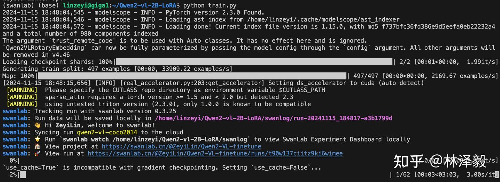
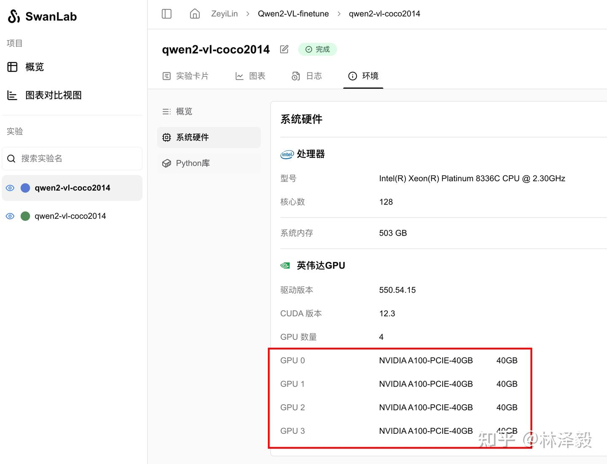

# Qwen2-VL多模态大模型微调实战

:::info
多模态，大语言模型，大模型微调
:::


[](https://swanlab.cn/@ZeyiLin/Qwen2-VL-finetune/runs/pkgest5xhdn3ukpdy6kv5/chart)

[训练过程](https://swanlab.cn/@ZeyiLin/Qwen2-VL-finetune/runs/pkgest5xhdn3ukpdy6kv5/chart) | [知乎教程](https://zhuanlan.zhihu.com/p/7144893529)

Qwen2-VL是阿里通义实验室推出的多模态大模型。本文我们将简要介绍基于 transformers、peft 等框架，使用 Qwen2-VL-2B-Instruct 模型在COCO2014图像描述 上进行Lora微调训练，同时使用 SwanLab 监控训练过程与评估模型效果。


Lora 是一种高效微调方法，深入了解其原理可参见博客：[知乎|深入浅出 Lora](https://zhuanlan.zhihu.com/p/650197598)。

- 训练过程：[Qwen2-VL-finetune](https://swanlab.cn/@ZeyiLin/Qwen2-VL-finetune/runs/pkgest5xhdn3ukpdy6kv5/chart)
- Github：[代码仓库](https://github.com/Zeyi-Lin/LLM-Finetune/tree/main/qwen2_vl)、[self-llm](https://github.com/datawhalechina/self-llm)
- 数据集：[coco_2014_caption](https://modelscope.cn/datasets/modelscope/coco_2014_caption/summary)
- 模型：[Qwen2-VL-2B-Instruct](https://modelscope.cn/models/Qwen/Qwen2-VL-2B-Instruct)

OCR微调版：[Qwen2-VL-Latex-OCR](https://zhuanlan.zhihu.com/p/10705293665)


---

## 1. 环境配置

环境配置分为三步：

1. 确保你的电脑上至少有一张英伟达显卡，并已安装好了CUDA环境。
2. 安装Python（版本>=3.8）以及能够调用CUDA加速的PyTorch。
3. 安装Qwen2-VL微调相关的第三方库，可以使用以下命令：

```bash
python -m pip install --upgrade pip
# 更换 pypi 源加速库的安装
pip config set global.index-url https://pypi.tuna.tsinghua.edu.cn/simple

pip install modelscope==1.18.0
pip install transformers==4.46.2
pip install sentencepiece==0.2.0
pip install accelerate==1.1.1
pip install datasets==2.18.0
pip install peft==0.13.2
pip install swanlab==0.3.25
pip install qwen-vl-utils==0.0.8
```

## 2. 准备数据集

本节使用的是 [coco_2014_caption](https://modelscope.cn/datasets/modelscope/coco_2014_caption/summary) 数据集（中的500张图），该数据集主要用于多模态（Image-to-Text）任务。

> 数据集介绍：COCO 2014 Caption数据集是Microsoft Common Objects in Context (COCO)数据集的一部分，主要用于图像描述任务。该数据集包含了大约40万张图像，每张图像都有至少1个人工生成的英文描述语句。这些描述语句旨在帮助计算机理解图像内容，并为图像自动生成描述提供训练数据。


在本节的任务中，我们主要使用其中的前500张图像，并对它进行处理和格式调整，目标是组合成如下格式的json文件：

```json
[
{
    "id": "identity_1",
    "conversations": [
      {
        "from": "user",
        "value": "COCO Yes: <|vision_start|>图像文件路径<|vision_end|>"
      },
      {
        "from": "assistant",
        "value": "A snow skier assessing the mountain before starting to sky"
      }
    ]
},
...
]
```

其中，"from"是角色（user代表人类，assistant代表模型），"value"是聊天的内容，其中`<|vision_start|>`和`<|vision_end|>`是Qwen2-VL模型识别图像的标记，中间可以放图像的文件路径，也可以是URL。

**数据集下载与处理方式**

1. **我们需要做四件事情：**
    - 通过Modelscope下载coco_2014_caption数据集
    - 加载数据集，将图像保存到本地
    - 将图像路径和描述文本转换为一个csv文件
    - 将csv文件转换为json文件

2. **使用下面的代码完成从数据下载到生成csv的过程：**

data2csv.py：

```python
# 导入所需的库
from modelscope.msdatasets import MsDataset
import os
import pandas as pd

MAX_DATA_NUMBER = 500

# 检查目录是否已存在
if not os.path.exists('coco_2014_caption'):
    # 从modelscope下载COCO 2014图像描述数据集
    ds =  MsDataset.load('modelscope/coco_2014_caption', subset_name='coco_2014_caption', split='train')
    print(len(ds))
    # 设置处理的图片数量上限
    total = min(MAX_DATA_NUMBER, len(ds))

    # 创建保存图片的目录
    os.makedirs('coco_2014_caption', exist_ok=True)

    # 初始化存储图片路径和描述的列表
    image_paths = []
    captions = []

    for i in range(total):
        # 获取每个样本的信息
        item = ds[i]
        image_id = item['image_id']
        caption = item['caption']
        image = item['image']
        
        # 保存图片并记录路径
        image_path = os.path.abspath(f'coco_2014_caption/{image_id}.jpg')
        image.save(image_path)
        
        # 将路径和描述添加到列表中
        image_paths.append(image_path)
        captions.append(caption)
        
        # 每处理50张图片打印一次进度
        if (i + 1) % 50 == 0:
            print(f'Processing {i+1}/{total} images ({(i+1)/total*100:.1f}%)')

    # 将图片路径和描述保存为CSV文件
    df = pd.DataFrame({
        'image_path': image_paths,
        'caption': captions
    })
    
    # 将数据保存为CSV文件
    df.to_csv('./coco-2024-dataset.csv', index=False)
    
    print(f'数据处理完成，共处理了{total}张图片')

else:
    print('coco_2014_caption目录已存在,跳过数据处理步骤')
```


**3. 在同一目录下，用以下代码，将csv文件转换为json文件：**

csv2json.py：

```python
import pandas as pd
import json

# 载入CSV文件
df = pd.read_csv('./coco-2024-dataset.csv')
conversations = []

# 添加对话数据
for i in range(len(df)):
    conversations.append({
        "id": f"identity_{i+1}",
        "conversations": [
            {
                "from": "user",
                "value": f"COCO Yes: <|vision_start|>{df.iloc[i]['image_path']}<|vision_end|>"
            },
            {
                "from": "assistant", 
                "value": df.iloc[i]['caption']
            }
        ]
    })

# 保存为Json
with open('data_vl.json', 'w', encoding='utf-8') as f:
    json.dump(conversations, f, ensure_ascii=False, indent=2)
```

此时目录下会多出两个文件：
- coco-2024-dataset.csv
- data_vl.json

至此，我们完成了数据集的准备。


## 3. 模型下载与加载

这里我们使用modelscope下载Qwen2-VL-2B-Instruct模型，然后把它加载到Transformers中进行训练：

```python
from modelscope import snapshot_download, AutoTokenizer
from transformers import TrainingArguments, Trainer, DataCollatorForSeq2Seq, Qwen2VLForConditionalGeneration, AutoProcessor
import torch

# 在modelscope上下载Qwen2-VL模型到本地目录下
model_dir = snapshot_download("Qwen/Qwen2-VL-2B-Instruct", cache_dir="./", revision="master")

# 使用Transformers加载模型权重
tokenizer = AutoTokenizer.from_pretrained("./Qwen/Qwen2-VL-2B-Instruct/", use_fast=False, trust_remote_code=True)
# 特别的，Qwen2-VL-2B-Instruct模型需要使用Qwen2VLForConditionalGeneration来加载
model = Qwen2VLForConditionalGeneration.from_pretrained("./Qwen/Qwen2-VL-2B-Instruct/", device_map="auto", torch_dtype=torch.bfloat16, trust_remote_code=True,)
model.enable_input_require_grads()  # 开启梯度检查点时，要执行该方法
```

模型大小为 4.5GB，下载模型大概需要 5 分钟。

## 4. 集成SwanLab

[SwanLab](https://github.com/swanhubx/swanlab) 是一个开源的模型训练记录工具。SwanLab面向AI研究者，提供了训练可视化、自动日志记录、超参数记录、实验对比、多人协同等功能。在SwanLab上，研究者能基于直观的可视化图表发现训练问题，对比多个实验找到研究灵感，并通过在线链接的分享与基于组织的多人协同训练，打破团队沟通的壁垒。

SwanLab与Transformers已经做好了集成，用法是在Trainer的`callbacks`参数中添加`SwanLabCallback`实例，就可以自动记录超参数和训练指标，简化代码如下：

```python
from swanlab.integration.transformers import SwanLabCallback
from transformers import Trainer

swanlab_callback = SwanLabCallback()

trainer = Trainer(
    ...
    callbacks=[swanlab_callback],
)
```

首次使用SwanLab，需要先在[官网](https://swanlab.cn)注册一个账号，然后在用户设置页面复制你的API Key，然后在训练开始提示登录时粘贴即可，后续无需再次登录：


更多用法可参考[快速开始](https://docs.swanlab.cn/zh/guide_cloud/general/quick-start.html)、[Transformers集成](https://docs.swanlab.cn/zh/guide_cloud/integration/integration-huggingface-transformers.html)。


## 5. 开始微调

查看可视化训练过程：<a href="https://swanlab.cn/@ZeyiLin/Qwen2-VL-finetune/runs/53vm3y7sp5h5fzlmlc5up/chart" target="_blank">Qwen2-VL-finetune</a>


**本节代码做了以下几件事：**
1. 下载并加载Qwen2-VL-2B-Instruct模型
2. 加载数据集，取前496条数据参与训练，4条数据进行主观评测
3. 配置Lora，参数为r=64, lora_alpha=16, lora_dropout=0.05
4. 使用SwanLab记录训练过程，包括超参数、指标和最终的模型输出结果
5. 训练2个epoch

开始执行代码时的目录结构应该是：
```
|———— train.py
|———— coco_2014_caption
|———— coco-2024-dataset.csv
|———— data_vl.json
|———— data2csv.py
|———— csv2json.py
```


**完整代码如下**

train.py：

```python
import torch
from datasets import Dataset
from modelscope import snapshot_download, AutoTokenizer
from swanlab.integration.transformers import SwanLabCallback
from qwen_vl_utils import process_vision_info
from peft import LoraConfig, TaskType, get_peft_model, PeftModel
from transformers import (
    TrainingArguments,
    Trainer,
    DataCollatorForSeq2Seq,
    Qwen2VLForConditionalGeneration,
    AutoProcessor,
)
import swanlab
import json


def process_func(example):
    """
    将数据集进行预处理
    """
    MAX_LENGTH = 8192
    input_ids, attention_mask, labels = [], [], []
    conversation = example["conversations"]
    input_content = conversation[0]["value"]
    output_content = conversation[1]["value"]
    file_path = input_content.split("<|vision_start|>")[1].split("<|vision_end|>")[0]  # 获取图像路径
    messages = [
        {
            "role": "user",
            "content": [
                {
                    "type": "image",
                    "image": f"{file_path}",
                    "resized_height": 280,
                    "resized_width": 280,
                },
                {"type": "text", "text": "COCO Yes:"},
            ],
        }
    ]
    text = processor.apply_chat_template(
        messages, tokenize=False, add_generation_prompt=True
    )  # 获取文本
    image_inputs, video_inputs = process_vision_info(messages)  # 获取数据数据（预处理过）
    inputs = processor(
        text=[text],
        images=image_inputs,
        videos=video_inputs,
        padding=True,
        return_tensors="pt",
    )
    inputs = {key: value.tolist() for key, value in inputs.items()} #tensor -> list,为了方便拼接
    instruction = inputs

    response = tokenizer(f"{output_content}", add_special_tokens=False)


    input_ids = (
            instruction["input_ids"][0] + response["input_ids"] + [tokenizer.pad_token_id]
    )

    attention_mask = instruction["attention_mask"][0] + response["attention_mask"] + [1]
    labels = (
            [-100] * len(instruction["input_ids"][0])
            + response["input_ids"]
            + [tokenizer.pad_token_id]
    )
    if len(input_ids) > MAX_LENGTH:  # 做一个截断
        input_ids = input_ids[:MAX_LENGTH]
        attention_mask = attention_mask[:MAX_LENGTH]
        labels = labels[:MAX_LENGTH]

    input_ids = torch.tensor(input_ids)
    attention_mask = torch.tensor(attention_mask)
    labels = torch.tensor(labels)
    inputs['pixel_values'] = torch.tensor(inputs['pixel_values'])
    inputs['image_grid_thw'] = torch.tensor(inputs['image_grid_thw']).squeeze(0)  #由（1,h,w)变换为（h,w）
    return {"input_ids": input_ids, "attention_mask": attention_mask, "labels": labels,
            "pixel_values": inputs['pixel_values'], "image_grid_thw": inputs['image_grid_thw']}


def predict(messages, model):
    # 准备推理
    text = processor.apply_chat_template(
        messages, tokenize=False, add_generation_prompt=True
    )
    image_inputs, video_inputs = process_vision_info(messages)
    inputs = processor(
        text=[text],
        images=image_inputs,
        videos=video_inputs,
        padding=True,
        return_tensors="pt",
    )
    inputs = inputs.to("cuda")

    # 生成输出
    generated_ids = model.generate(**inputs, max_new_tokens=128)
    generated_ids_trimmed = [
        out_ids[len(in_ids) :] for in_ids, out_ids in zip(inputs.input_ids, generated_ids)
    ]
    output_text = processor.batch_decode(
        generated_ids_trimmed, skip_special_tokens=True, clean_up_tokenization_spaces=False
    )
    
    return output_text[0]


# 在modelscope上下载Qwen2-VL模型到本地目录下
model_dir = snapshot_download("Qwen/Qwen2-VL-2B-Instruct", cache_dir="./", revision="master")

# 使用Transformers加载模型权重
tokenizer = AutoTokenizer.from_pretrained("./Qwen/Qwen2-VL-2B-Instruct/", use_fast=False, trust_remote_code=True)
processor = AutoProcessor.from_pretrained("./Qwen/Qwen2-VL-2B-Instruct")

model = Qwen2VLForConditionalGeneration.from_pretrained("./Qwen/Qwen2-VL-2B-Instruct/", device_map="auto", torch_dtype=torch.bfloat16, trust_remote_code=True,)
model.enable_input_require_grads()  # 开启梯度检查点时，要执行该方法

# 处理数据集：读取json文件
# 拆分成训练集和测试集，保存为data_vl_train.json和data_vl_test.json
train_json_path = "data_vl.json"
with open(train_json_path, 'r') as f:
    data = json.load(f)
    train_data = data[:-4]
    test_data = data[-4:]

with open("data_vl_train.json", "w") as f:
    json.dump(train_data, f)

with open("data_vl_test.json", "w") as f:
    json.dump(test_data, f)

train_ds = Dataset.from_json("data_vl_train.json")
train_dataset = train_ds.map(process_func)

# 配置LoRA
config = LoraConfig(
    task_type=TaskType.CAUSAL_LM,
    target_modules=["q_proj", "k_proj", "v_proj", "o_proj", "gate_proj", "up_proj", "down_proj"],
    inference_mode=False,  # 训练模式
    r=64,  # Lora 秩
    lora_alpha=16,  # Lora alaph，具体作用参见 Lora 原理
    lora_dropout=0.05,  # Dropout 比例
    bias="none",
)

# 获取LoRA模型
peft_model = get_peft_model(model, config)

# 配置训练参数
args = TrainingArguments(
    output_dir="./output/Qwen2-VL-2B",
    per_device_train_batch_size=4,
    gradient_accumulation_steps=4,
    logging_steps=10,
    logging_first_step=5,
    num_train_epochs=2,
    save_steps=100,
    learning_rate=1e-4,
    save_on_each_node=True,
    gradient_checkpointing=True,
    report_to="none",
)
        
# 设置SwanLab回调
swanlab_callback = SwanLabCallback(
    project="Qwen2-VL-finetune",
    experiment_name="qwen2-vl-coco2014",
    config={
        "model": "https://modelscope.cn/models/Qwen/Qwen2-VL-2B-Instruct",
        "dataset": "https://modelscope.cn/datasets/modelscope/coco_2014_caption/quickstart",
        "github": "https://github.com/datawhalechina/self-llm",
        "prompt": "COCO Yes: ",
        "train_data_number": len(train_data),
        "lora_rank": 64,
        "lora_alpha": 16,
        "lora_dropout": 0.1,
    },
)

# 配置Trainer
trainer = Trainer(
    model=peft_model,
    args=args,
    train_dataset=train_dataset,
    data_collator=DataCollatorForSeq2Seq(tokenizer=tokenizer, padding=True),
    callbacks=[swanlab_callback],
)

# 开启模型训练
trainer.train()

# ====================测试模式===================
# 配置测试参数
val_config = LoraConfig(
    task_type=TaskType.CAUSAL_LM,
    target_modules=["q_proj", "k_proj", "v_proj", "o_proj", "gate_proj", "up_proj", "down_proj"],
    inference_mode=True,  # 训练模式
    r=64,  # Lora 秩
    lora_alpha=16,  # Lora alaph，具体作用参见 Lora 原理
    lora_dropout=0.05,  # Dropout 比例
    bias="none",
)

# 获取测试模型
val_peft_model = PeftModel.from_pretrained(model, model_id="./output/Qwen2-VL-2B/checkpoint-62", config=val_config)

# 读取测试数据
with open("data_vl_test.json", "r") as f:
    test_dataset = json.load(f)

test_image_list = []
for item in test_dataset:
    input_image_prompt = item["conversations"][0]["value"]
    # 去掉前后的<|vision_start|>和<|vision_end|>
    origin_image_path = input_image_prompt.split("<|vision_start|>")[1].split("<|vision_end|>")[0]
    
    messages = [{
        "role": "user", 
        "content": [
            {
            "type": "image", 
            "image": origin_image_path
            },
            {
            "type": "text",
            "text": "COCO Yes:"
            }
        ]}]
    
    response = predict(messages, val_peft_model)
    messages.append({"role": "assistant", "content": f"{response}"})
    print(messages[-1])

    test_image_list.append(swanlab.Image(origin_image_path, caption=response))

swanlab.log({"Prediction": test_image_list})

# 在Jupyter Notebook中运行时要停止SwanLab记录，需要调用swanlab.finish()
swanlab.finish()
```

看到下面的进度条即代表训练开始：




## 6. 训练结果演示

详细训练过程请看这里：[qwen2-vl-coco2014](https://swanlab.cn/@ZeyiLin/Qwen2-VL-finetune/runs/pkgest5xhdn3ukpdy6kv5/chart)


从SwanLab图表中我们可以看到，lr的下降策略是线性下降，loss随epoch呈现下降趋势，而grad_norm则在上升。这种形态往往反映了模型有过拟合的风险，训练不要超过2个epoch。

在`Prediction`图表中记录着模型最终的输出结果，可以看到模型在回答的风格上是用的COCO数据集的简短英文风格进行的描述：


而同样的图像，没有被微调的模型输出结果如下：

```
1-没有微调：The image depicts a cozy living room with a rocking chair in the center, a bookshelf filled with books, and a table with a vase and a few other items. The walls are decorated with wallpaper, and there are curtains on the windows. The room appears to be well-lit, with sunlight streaming in from the windows.
1-微调后：A living room with a rocking chair, a bookshelf, and a table with a vase and a bowl.

2-没有微调：It looks like a family gathering or a party in a living room. There are several people sitting around a dining table, eating pizza. The room has a cozy and warm atmosphere.
2-微调后：A group of people sitting around a dining table eating pizza.
```

可以明显看到微调后风格的变化。


## 7. 推理LoRA微调后的模型

加载lora微调后的模型，并进行推理：

```python
from transformers import Qwen2VLForConditionalGeneration, AutoProcessor
from qwen_vl_utils import process_vision_info
from peft import PeftModel, LoraConfig, TaskType

config = LoraConfig(
    task_type=TaskType.CAUSAL_LM,
    target_modules=["q_proj", "k_proj", "v_proj", "o_proj", "gate_proj", "up_proj", "down_proj"],
    inference_mode=True,
    r=64,  # Lora 秩
    lora_alpha=16,  # Lora alaph，具体作用参见 Lora 原理
    lora_dropout=0.05,  # Dropout 比例
    bias="none",
)

# default: Load the model on the available device(s)
model = Qwen2VLForConditionalGeneration.from_pretrained(
    "./Qwen/Qwen2-VL-2B-Instruct", torch_dtype="auto", device_map="auto"
)
model = PeftModel.from_pretrained(model, model_id="./output/Qwen2-VL-2B/checkpoint-62", config=config)
processor = AutoProcessor.from_pretrained("./Qwen/Qwen2-VL-2B-Instruct")

messages = [
    {
        "role": "user",
        "content": [
            {
                "type": "image",
                "image": "测试图像路径",
            },
            {"type": "text", "text": "COCO Yes:"},
        ],
    }
]

# Preparation for inference
text = processor.apply_chat_template(
    messages, tokenize=False, add_generation_prompt=True
)
image_inputs, video_inputs = process_vision_info(messages)
inputs = processor(
    text=[text],
    images=image_inputs,
    videos=video_inputs,
    padding=True,
    return_tensors="pt",
)
inputs = inputs.to("cuda")

# Inference: Generation of the output
generated_ids = model.generate(**inputs, max_new_tokens=128)
generated_ids_trimmed = [
    out_ids[len(in_ids) :] for in_ids, out_ids in zip(inputs.input_ids, generated_ids)
]
output_text = processor.batch_decode(
    generated_ids_trimmed, skip_special_tokens=True, clean_up_tokenization_spaces=False
)
print(output_text)
```


## 补充

### 详细硬件配置和参数说明

使用4张A100 40GB显卡，batch size为4，gradient accumulation steps为4，训练2个epoch的用时为1分钟57秒。





### 注意

- 在微调脚本中，`val_peft_model`加载的是一共固定的checkpoint文件，如果你添加了数据或超参数，请根据实际情况修改checkpoint文件路径。


