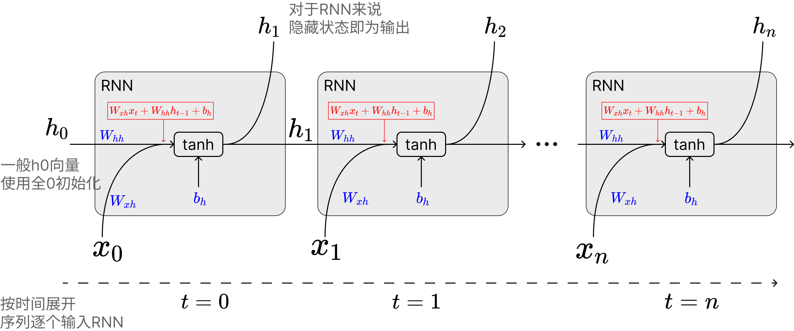

# 考古RNN篇（上）：一文搞懂pytorch RNN如何处理可变长批次训练

## 写在前面

笔者最近研究线性注意力时，突然发现此前了解过RNN网络，但是没有细究RNN具体如何堆叠，训练时如何并行等细节。因此本博客将讲解pytorch下`torch.nn.RNN`的使用方法，重点关注如下两块：

* RNN如何堆叠，`num_layers`参数背后是什么结构，`bidirectional`参数的作用
* 对于可变序列输入来说，RNN如何进行batch训练

## 系列目录

* [考古RNN篇（上）：一文搞懂pytorch RNN如何处理可变长批次训练](https://github.com/ShaohonChen/tutorial_with_rnn/blob/main/README.md)———介绍RNN原理与处理可变长批次序列方法
* [考古RNN篇（下）：如何用RNN网络进行序列预测](https://github.com/ShaohonChen/tutorial_with_rnn/blob/main/README_next.md)———训练一个求序列和余数的RNN分类网络，以及一些调参小技巧

## 介绍RNN原理

先简单介绍下RNN的公式：

$$
h_t = \tanh(W_{xh} x_t + W_{hh} h_{t-1} + b_h)
$$

公式里面的关键变量：

* $ x_t $ ：时间步 $ t $ 的输入向量
* $ h_t $ ：时间步 $ t $ 的隐藏状态（hidden state）
* $ W_{xh} $ ， $ W_{hh} $ ， $ b_h $ ：就是模型的参数矩阵

笔者刚学RNN时一直弄不懂隐藏状态 $ h_t $ 和网络输出的关系（网上的图也比较乱，一会儿 $ h $ 一会儿 $ y $ 的），实际上对于RNN来说隐藏状态就是输出。隐藏状态和输出的更新关系可以用下图解释：

<div align="center">
  <figure>
  
  <figcaption>将RNN的输入过程沿时间展开</figcaption>
  </figure>
</div>

这里面重要的是对于RNN来说，隐变量直接输出作为RNN网络的输出，同时该输出与下一个序列token的输入相加，隐状态 $ h_t $ 与 $ x_t $ 的结合方式即为 $ \tanh $ 的输入：

$$
W_{xh} x_t + W_{hh} h_{t-1} + b_h
$$

pytorch官方实现的`torch.nn.RNN`模块支持输入如下参数

* input_size: 输入维度
* hidden_size: 隐藏层维度，历史无论输入多长序列，模型都会将其压缩到这个小的向量来表示
* num_layers: 多层RNN的层数，**后面讲解**
* nonlinearity: 非线性函数的选择，只支持输入`"tanh"`和`"relu"`两种，想用sigmoid得自己想办法实现
* bias: 是否开启偏置，也就是上面公式中的 $ b_h $
* batch_first: 是否为batchu输入，跟input_size的形状有关
* dropout: 是否给输出增加dropout
* bidirectional: 是否为双向RNN，**后面讲解**

一个典型的使用案例是这样：

```python
rnn = torch.nn.RNN(10, 20, 1) # 输入向量序列的维度为10维，隐藏层大小（也就是输出大小）为20维，RNN堆叠层数是1
input = torch.randn(5, 3, 10)   # 序列长度为5，batch大小为3的一个向量序列，每个向量维度为5
h0 = None  # 默认不需要输入第一个隐藏状态，不输入的话模型会自动初始化一个全0的隐藏向量
output, hn = rnn(input, h0) # 输出
print(output.shape) # torch.Size([5, 3, 20])    output中包含所有的隐藏状态：h_1,h_2,...,h_n
print(hn.shape) # torch.Size([1, 3, 20])    hn中仅包含最后一层的隐藏状态：h_n
```

这里也推荐读者看一下pytorch官方对于RNN的模块的介绍文档：

* 链接：<https://docs.pytorch.org/docs/stable/generated/torch.nn.RNN.html>

那接下来我们就介绍下`num_layers`参数的作用和`bidirectional`参数的作用。

### 多层RNN的堆叠

pytorch官方文档中对于`num_layers`参数的介绍如下：

>num_layers – Number of recurrent layers. E.g., setting num_layers=2 would mean stacking two RNNs together to form a stacked RNN, with the second RNN taking in outputs of the first RNN and computing the final results. Default: 1

用Qwen3翻译过来就是：

>num_layers —— 循环层的数量。例如，设置 num_layers=2 表示将两个 RNN 堆叠在一起形成一个堆叠 RNN，其中第二个 RNN 接收第一个 RNN 的输出并计算最终结果。默认值：1

实际上讲解的也非常不清楚，笔者查阅了不少博客，以及看官方的案例代码，最终理解了所谓的Stacked RNN就是如下这么一个结构：

<div align="center">
  <figure>
  
  <figcaption>将RNN的输入过程沿时间展开，图来自[1]</figcaption>
  </figure>
</div>

笔者也贴出对于多层堆叠RNN（Stacked RNN）的计算代码供读者参考（代码来自pytorch官方文档）：

```python
# Efficient implementation equivalent to the following with bidirectional=False
rnn = nn.RNN(input_size, hidden_size, num_layers)
params = dict(rnn.named_parameters())
def forward(x, hx=None, batch_first=False):
    if batch_first:
        x = x.transpose(0, 1)
    seq_len, batch_size, _ = x.size()
    if hx is None:
        hx = torch.zeros(rnn.num_layers, batch_size, rnn.hidden_size)
    h_t_minus_1 = hx.clone()
    h_t = hx.clone()
    output = []
    for t in range(seq_len):
        for layer in range(rnn.num_layers):
            input_t = x[t] if layer == 0 else h_t[layer - 1]
            h_t[layer] = torch.tanh(
                input_t @ params[f"weight_ih_l{layer}"].T
                + h_t_minus_1[layer] @ params[f"weight_hh_l{layer}"].T
                + params[f"bias_hh_l{layer}"]
                + params[f"bias_ih_l{layer}"]
            )
        output.append(h_t[-1].clone())
        h_t_minus_1 = h_t.clone()
    output = torch.stack(output)
    if batch_first:
        output = output.transpose(0, 1)
    return output, h_t
```

通过上面的代码，可以理解，output和h_t的关系：

* output表示，随着向量序列中各个向量的输入，每个向量对应的最后一层隐藏状态的变化，所以形状是`(序列长度, batch数, 隐藏状态维度)`
* h_t表示的是整个序列输入完，所有层的最后一个隐藏状态，所以形状是`(层数, batch数, 隐藏状态维度)`

### 双向RNN

双向RNN比较好理解，用直白的话说，就是为了让模型即能够从前往后理解序列，又能从后往前理解序列（有点像Bert和GPT的差异）。因此我弄两个相同的RNN，把序列正着输入到第一个RNN获得隐藏状态，再倒着输入第二个RNN获得隐藏状态。开启的方式是另`bidirectional`变量为True。

示意图如下：

<div align="center">
  <figure>
  
  <figcaption>有两个RNN分别处理正向和反向序列，图来自[1]</figcaption>
  </figure>
</div>

当然这里注意两个细节：

1. 开启`bidirectional`后模型会直接生成两份RNN参数，所以RNN模型参数会大一倍
2. `output`和`h_n`都会给两份（两个RNN各一份），上面参考图画的有点问题在于最后 $ y_0 $ 看起来好像是正向和反向RNN的隐藏状态向加，**实际上torch实现的RNN是直接把正向反向RNN的隐藏状态都返回出来的**。

## 基于RNN网络的序列处理模型设计

由于RNN模型结构自身的梯度爆炸问题等问题，基于RNN的网络显著少于LSTM。当然，无论是LSTM还是RNN、乃至transformers，对于序列处理的模型可以简单分为下图这几个类：

<div align="center">
  <figure>
  
  <figcaption>不同结构的RNN网络，红色是输入，蓝色是输出（也是隐藏状态），绿色是RNN网络[2]</figcaption>
  </figure>
</div>

上图绿色部分其实替换成LSTM、RNN、Transformers逻辑都是一样的。下面列举一个各个网络的作用：

* **one to one:** 一般没这个结构😂，跟全连接没区别了
* **one to many:** 早期的图像-文本模型会是这个结构，或者老一点的文本生成模型
* **many to many(encode-decode):** 早期非常流行的NLP网络架构，一般用于文本生成、翻译、序列预测等任务，很多LSTM都是这个架构（Bert可以勉强归入到这个架构，虽然不完全正确，但是设计思想比较近）
* **many to many:** 这个架构笔者见的少，但是一些翻译任务，序列特征提取（比如实时语音转文本）会使用类似的架构。包括近年流行的线性注意力模型可以不严谨的归类到这个

当然RNN本身的建模能力并不是特别强，所以流行的还是**encode-decode**架构，或者做一些简单的预测、分类任务使用**many to one**架构，本文后面的教程就是基于**many to one**架构。

> 梯度消失和爆炸问题：<https://en.wikipedia.org/wiki/Vanishing_gradient_problem>  
> 当然RNN结构本身还有并行效率低，长程理解能力差等问题，关于并行效率将在后面分析

## RNN对于可变长序列的处理问题

为了提升显卡的计算效率，以及梯度方向的准确性，训练一般是将一批序列打包成一个batch进行的，但是这会有一个问题。就是对于文本分类等任务，序列一般是长度不一的。

对于多个不同长度的序列x，我们通常使用padding的办法来将其填充到特定长度，再输入到网络中。

<div align="center">
  <figure>
  
  <figcaption>填充方法，一般训练时是从右边填充（左边对齐）</figcaption>
  </figure>
</div>

对于Transformers来说这个问题比较好解决，我们可以通过增加attention mask实现并行。但是对于LSTM、RNN这种网络。由隐藏状态 $ h_n $ 是随着每个序列逐步更新的。所以我们直接padding+batch输入就会出现隐藏状态 $ h_n $ 计算时包含了pad token的问题。

<div align="center">
  <figure>
  
  <figcaption>使用常规的batch处理方法在RNN上对于pad token没法很好的处理</figcaption>
  </figure>
</div>

好在pytorch工程师也考虑了这一点，弄了两个工具函数专门来帮助处理

* **pack_padded_sequence** 把填充后的batch和序列长度合成一个长序列：(seq,batch, dim) -> (seq*batch, dim)
* **pad_packed_sequence** 和上面的函数反过来，通常用于处理RNN的output结果：(seq*batch, dim) -> (seq,batch, dim)

这样一定程度上能实现并行计算，不过并行计算的效率自然还是很低（这也是RNN没法做大的原因之一）。不过终归是可以利用向量计算+流水线处理一定程度上加速了。

下面是`pack_padded_sequence`函数知乎大神画的示意图，我直接拿来用了：

<div align="center">
  <figure>
  
  <figcaption>`pack_padded_sequence`函数处理方法[3]</figcaption>
  </figure>
</div>

这里要说明下，pack_padded_sequence有一个参数`enforce_sorted`是默认开启的，这个意思是要求batch里的序列必须是从长到短排列的（为了在GPU上可以减少中断的计算）。然而实际上我们并不会在训练代码时每次对一个batch的数据排序，这里给指定为false就行，开不开启只影响模型导出onnx的行为。一般来说我们指定为false让pytorch自己处理即可。

有关pack_padded_sequence和pad_packed_sequence的使用案例代码如下（网上好多都是错的T_T，包括外网stack over flow上一些，大家可以参考这个笔者校对过的代码）

```python
import torch
import torch.nn as nn
from torch.autograd import Variable


input_dim=2
batch_size = 3
max_length = 4
hidden_size = 2
n_layers =1

# container
batch_in = torch.zeros(
    (
        batch_size,
        max_length,input_dim
    )
)

# data
vec_1 = torch.FloatTensor([[1, 1.1], [2, 2.2], [0, 0], [0, 0]])
vec_2 = torch.FloatTensor([[[1, 1.1], [2, 2.2], [3, 3.3], [4, 4.4]]])
vec_3 = torch.FloatTensor([[[1, 1.1], [0, 0], [0, 0], [0, 0]]])


# print(batch_in[0].shape)
batch_in[0] = vec_1
batch_in[1] = vec_2
batch_in[2] = vec_3

batch_in = Variable(batch_in)

seq_lengths = [4,2,1,] # list of integers holding information about the batch size at each sequence step

# pack it
pack = torch.nn.utils.rnn.pack_padded_sequence(batch_in, seq_lengths, batch_first=True,enforce_sorted=False)

print(pack)
# PackedSequence(data=tensor([[1.0000, 1.1000],
#         [1.0000, 1.1000],
#         [1.0000, 1.1000],
#         [2.0000, 2.2000],
#         [2.0000, 2.2000],
#         [0.0000, 0.0000],
#         [0.0000, 0.0000]]), batch_sizes=tensor([3, 2, 1, 1]), sorted_indices=tensor([0, 1, 2]), unsorted_indices=tensor([0, 1, 2]))
```

`pack`中会包含构建好的序列、batch大小信息（用于未来恢复）、以及排序信息。

那么对RNN进行批次前向传递和对ouput进行batch恢复的代码如下：

```python
# initialize
rnn = nn.RNN(input_dim, hidden_size, n_layers, batch_first=True)
h0 = Variable(torch.zeros(n_layers, batch_size, hidden_size))

# forward
out, h_n = rnn(pack, h0)

# unpack
unpacked, unpacked_len = torch.nn.utils.rnn.pad_packed_sequence(out ,batch_first=True)


print(unpacked)
# tensor([[[ 0.6948, -0.4382],
#          [ 0.5995,  0.0263],
#          [ 0.7160,  0.0732],
#          [ 0.7253,  0.1289]],

#         [[ 0.6948, -0.4382],
#          [ 0.5995,  0.0263],
#          [ 0.0000,  0.0000],
#          [ 0.0000,  0.0000]],

#         [[ 0.6948, -0.4382],
#          [ 0.0000,  0.0000],
#          [ 0.0000,  0.0000],
#          [ 0.0000,  0.0000]]], grad_fn=<IndexSelectBackward0>)
```

这里还是放一下两个函数的官方文档链接，推荐大家读一下：

* pack_padded_sequence文档：<https://docs.pytorch.org/docs/stable/generated/torch.nn.utils.rnn.pack_padded_sequence.html>
* pad_packed_sequence文档：<https://docs.pytorch.org/docs/stable/generated/torch.nn.utils.rnn.pad_packed_sequence.html>

除了这两个函数外，还有一个经常会用到的函数`pad_sequence`，将数据由不同长度的tensor list自动填充成一个batch。这个函数通常用于数据预处理

* pad_sequence文档：<https://docs.pytorch.org/docs/stable/generated/torch.nn.utils.rnn.pad_sequence.html>

<div align="center">
  <figure>
  
  <figcaption>`pad_sequence`函数处理方法[3]</figcaption>
  </figure>
</div>

下一篇会介绍下如何构建一个做序列分类的训练脚本。（可以在GitHub上找到`README_next.md`）

## 参考

* [1] <https://www.researchgate.net/figure/Stacked-RNN-Generalized-structure-and-temporal-unrolled-variant_fig4_376204636>

* [2] <https://medium.com/data-science/pytorch-basics-how-to-train-your-neural-net-intro-to-rnn-cb6ebc594677>

* [3] <https://zhuanlan.zhihu.com/p/601705984>
