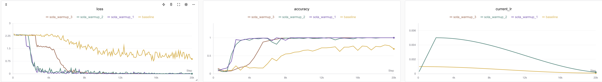

# 考古RNN篇（下）：如何用RNN网络进行序列预测

## 写在前面

上一个章节讲解了RNN的基本结构、原理、还有如何使用torch的`pack_padded_sequence`和`pad_packed_sequence`两个函数来对可变长批次数据进行处理。

本章节主要是介绍一下如何利用这几个函数，构建一个能够进行训练分类的RNN模型，以及批量训练脚本怎么写。

最后还附上了序列网络的调参数小技巧😊

## 系列目录

* [考古RNN篇（上）：一文搞懂pytorch RNN如何处理可变长批次训练](https://zhuanlan.zhihu.com/p/1951795080848475475)———介绍RNN原理与处理可变长批次序列方法
* [考古RNN篇（下）：如何用RNN网络进行序列预测](https://zhuanlan.zhihu.com/p/1951799150158026738)———训练一个求序列和余数的RNN分类网络，以及一些调参小技巧

## 训练任务简介

我们使用**序列和计算余数**的任务来验证RNN模型的性能表现。

**序列和计算余数**：数据集由输入-输出对 `(X, Y)` 构成，形式化定义如下：

* **模型输入 X**：  
  为一个任意长度$n \in \mathbb{N}^+$的随机整数序列$X = (x_1, x_2, \dots, x_n)$，其中每个元素$x_i$独立同分布地从集合$\{0, 1, 2, \dots, 9\}$中均匀采样，即：

 $$
  x_i \overset{\text{i.i.d.}}{\sim} \text{Uniform}\{0, 1, \dots, 9\}, \quad \forall i = 1, \dots, n
 $$

* **目标输出 Y**：  
  为序列中所有元素之和对 10 取模的结果：

 $$
  Y = \left( \sum_{i=1}^{n} x_i \right) \bmod 10
 $$

下面是一些数据集案例：

| 模型输入 X                     | 计算过程                     | 目标输出 Y |
|-----------------------------|------------------------------|----------|
| `[3, 7, 1, 9]`              | (3+7+1+9) = 20 → 20 mod 10   | `0`      |
| `[5]`                       | 5 mod 10                     | `5`      |
| `[1,2,3,4,5,6,7,8,9,0]`     | 45 mod 10                    | `5`      |
| `[8, 8, 8]`                 | 24 mod 10                    | `4`      |

该任务可视为一个序列到标量的映射问题，目标是学习从任意长度数字序列到其各位数字和模 10 的映射函数。由于输入长度可变且元素随机，该数据集可用于测试RNN模型对变长序列的建模能力、模运算推理能力及泛化性能。

合成该数据集的pytorch代码如下：

```python
# 可变长数据集，X为一个0-N的序列，Y为该序列的求和除N+1的余数，范围也是0-N
class SeqSumModDataset(IterableDataset):
    def __init__(self, total_samples=None, min_seq_len=2, max_seq_len=5, max_number=4):
        """
        :param total_samples: 总样本数（None = 无限生成）
        :param min_len: 最短字母序列长度
        :param max_len: 最长字母序列长度
        :param max_number: 序列会出现的最大数字
        """
        self.total_samples = total_samples
        self.min_len = min_seq_len
        self.max_len = max_seq_len
        self.max_number = max_number
        self.count = 0  # 用于限制样本总数

    def __iter__(self):
        self.count = 0  # 每次重新迭代时重置计数器
        return self

    def __next__(self):
        # 用于控制epoch
        if self.total_samples is not None and self.count >= self.total_samples:
            raise StopIteration

        # 动态生成一个样本
        seq_length = random.randint(self.min_len, self.max_len)
        input_seq = [random.randint(0, self.max_number) for _ in range(seq_length)]
        target_num = sum(input_seq) % (self.max_number + 1)
        self.count += 1
        return input_seq, seq_length, target_num
```

## 构建预测模型

由于是一个“离散序列➡️离散数字”预测任务。因此可以看作一个序列分类任务。输入一个不定长离散序列，输出0-9这10个数字的类别。我们可以构建一个“many to one”的模型。笔者设计的模型架构如下：

<div align="center">
  <figure>
  
  <figcaption>网络架构图，使用embedding将序列数字转换为向量，后跟多层RNN网络以及FFN分类头</figcaption>
  </figure>
</div>

由上图可以看到，序列由embedding网络转换成向量，再输入多层堆叠的RNN网络，使用最后一层RNN的最后一个隐藏状态$h_n$来预测最后一个输入序列的求和。

当然可能读者会说为什么要弄一个embedding模型那么麻烦，直接把输入序列$x_i$处理成one-hot编码或者直接映射成浮点数不是更好吗？

实际上这两个做法都是对的hhh，不过笔者使用embedding模型配合是为了读者更好的理解自然语言中对于各个文本token序列是如何处理的。至于为什么没转换成标量，实际上标亮确实能让模型更快的收敛，毕竟数值不像字符，本身具备大小关系。考虑到RNN在自然语言上的表现相当优秀，因此笔者这么实现是方便未来这个网络能够更容易迁移到NLP任务当中。

网络代码实现如下：

```python
import torch.nn as nn
from torch.nn.utils.rnn import pack_padded_sequence

class RnnClsNet(nn.Module):
    """
    基于RNN的序列分类网络，适用于变长输入序列（如句子、数字序列等）。
    使用 Embedding + 多层RNN + 全连接层结构，最终输出分类概率。
    支持处理填充（padding）序列，通过 pack_padded_sequence 提高计算效率。
    """
    def __init__(self, vocab_size=5, embed_dim=5, hidden_dim=16, num_layers=2, cls_num=5):
        super().__init__()
        # Embedding层，注意指定最后一个序列为padding序列，因此词表大小要加1
        self.embedding = nn.Embedding(vocab_size + 1, embed_dim, padding_idx=-1)
        # RNN 层：处理变长序列，batch_first=True 表示输入形状为 (batch, seq_len, embed_dim)
        self.rnn = nn.RNN(
            embed_dim,           # 输入特征维度
            hidden_dim,          # 隐藏状态维度
            num_layers=num_layers,  # RNN 层数
            batch_first=True     # 输入/输出的第一个维度是 batch_size
        )
        self.rnn = nn.RNN(embed_dim, hidden_dim, num_layers=num_layers, batch_first=True)
        self.fc = nn.Linear(hidden_dim, cls_num)

    def forward(self, x, seq_lengths):
        # 词嵌入：将索引转换为向量
        embedded = self.embedding(x)  # 形状: (batch, seq_len, embed_dim)
        # 打包变长序列：提升 RNN 对 padding 部分的计算效率，避免无效计算
        pack = pack_padded_sequence(embedded, seq_lengths, enforce_sorted=False, batch_first=True)
        # RNN 前向计算
        out, h_n = self.rnn(pack)   # h_n 形状 (num_layers, batch, hidden_dim)
        # 取最后一层的最终隐藏状态作为序列表示
        out = self.fc(h_n[-1])  # 映射到分类空间，形状: (batch, cls_num)
        return out
```

笔者做了完整的注释方便读者理解模型具体怎么实现。

这里重点关注`forward`函数中使用`pack_padded_sequence`对输入序列进行打包，打包后padding token将被删除。

## 完整训练代码获取与运行

完整训练代码可以通过Github查看（后文也附了训练代码，防止有读者无法访问github，见[#附录：训练代码](#附录：训练代码)

* GitHub链接：<https://github.com/ShaohonChen/tutorial_with_rnn>

下载代码&环境安装命令：

```bash
git clone https://github.com/ShaohonChen/tutorial_with_rnn.git
cd tutorial_with_rnn
pip install torch swanlab
```

运行训练代码的命令如下：

```bash
python train_cls_rnn.py
```

由于模型比较小，一共也就不到1k的参数量，因此使用笔者自己的Mac笔记本电脑CPU运行两分钟即可完成训练。

运行效果如下：

<div align="center">
  <figure>
  
  <figcaption>网络架构图，使用embedding将序列数字转换为向量，后跟多层RNN网络以及FFN分类头</figcaption>
  </figure>
</div>

> 实验记录见：<https://swanlab.cn/@ShaohonChen/tutorial_with_rnn/charts>

可见模型基本在4k左右的训练步长时会突然出现“啊哈时刻🤪”，突然顿悟了怎么计算求余数，此后准确率飞速增长，到75%的准确率。

P.S. 笔者一开始设置只运行1k-2k steps。结果发现老收敛不了。后来拉大训练步骤后出现奇迹了。

> 如果提示输入swanlab api key可参考[swanlab登陆指南](https://docs.swanlab.cn/guide_cloud/general/quick-start.html)来使用SwanLab监控训练指标～ SwanLab是一个非常好用且免费的在线训练监控工具，希望大家能够多多支持。

<div align="center">
  <figure>
  
  <figcaption>SwanLab工具，后面教程关于调参部分的实验结果可以在SwanLab上查看</figcaption>
  </figure>
</div>

## 评估推理代码

上次笔者在写构建多模态模型的教程[Qwen-SmlVL](https://github.com/ShaohonChen/Qwen3-SmVL)时忘了传评估脚本，结果被issue疯狂diss。这次笔者乖乖提交了推理脚本。运行命令如下：

```bash
python predict_cls_rnn.py
```

运行效果如下：

<div align="center">
  <figure>
  
  <figcaption>这次笔者认真附上了推理标准，再也不担心issue被抓🐦了</figcaption>
  </figure>
</div>

> 感谢Qwen老师帮我写了推理脚本，并增加了详细的注释。

## 如何提升性能

不过目前准确率只到75%，也就是平均问4条错1条🤔。笔者想让模型准确率更高些，想到了如下两个策略：

### 策略一：增大batch

<div align="center">
  <figure>
  
  <figcaption>baseline后半段损失震荡比较大</figcaption>
  </figure>
</div>

笔者观察到在4k步以后的训练损失有点震荡。一个直观的思想是增加batch大小减少抖动。笔者将batch大小从16➡️64（当然这也引入了更多的数据集）。实验结果如下：

<div align="center">
  <figure>
  
  <figcaption>黄色是baseline，蓝色是batch增大了4倍的训练效果，结果准确率更低了</figcaption>
  </figure>
</div>

可见确实损失抖动较之前小了点，但是精度反而下来了。笔者怀疑这是因为陷入了局部最优解。那么既然batch增大了，理论上也可以通过增大lr来让模型跳出局部最优。

### 策略二：增大batch和学习率Lr

接着把LR从1e-3提升到5e-3

```bash
python train_cls_rnn.py --batch_size 64 --lr 0.005 --run_name large_batch_lr5e-3
```

> * 💡 按照scaling law法则，batch增大四倍学习率也该增加近似4倍，但是笔者觉得4e-3不吉利哈哈哈哈🤣，其实差不多只要数量级别差太远就行，超参数没那么敏感。关于batch和lr的关系并不是严格的线性，但是一般小模型可以近似理解为线性。  
> * 关于学习率和batch size的关联，建议大家阅读OpenAI的经典之作《An Empirical Model of Large-Batch Training》[4]，其证明了SGD优化器下batch size和学习率的关系是单调有界，在两者都比较小时学习率和batch size基本为**线性关系**。

效果如下⬇️

<div align="center">
  <figure>
  
  <figcaption>黄色是baseline，品红色是增大学习率的曲线</figcaption>
  </figure>
</div>

> 实验记录见：<https://swanlab.cn/@ShaohonChen/tutorial_with_rnn/charts>

一条漂亮的损失曲线！不仅提前收敛了，并且准确率来到了91%！😄

不过仍然不够，这个任务理论上有更优的解。

### 策略二：Scaling Law（直接加大模型）

这个原理很好理解，实际上对于任意长度的序列求和去余，RNN并不需要记住蓄力的所有数字，也不需要学会求余数的数学公式。

一个比较讨巧的策略是：由余数倒退所有和不超过10的整数加法组合也是一个有限集，模型只需要把这个有限集的范围背下来即可。笔者粗估了一下这个组合关系小于10的平方除2，也就50多个组合。

那么简单好懂的思维是，增加模型的大小，让他的记忆变大。

增大模型规模的训练脚本：

```bash
python train_cls_rnn.py --hidden_dim 32 --num_layers 3  --run_name deeper_rnn
```

结果可谓立竿见影，准确率直接冲到了99%🎉（99%-97波动）

<div align="center">
  <figure>
  
  <figcaption>黄色是baseline，绿色是更深更大的RNN网络，可见加深网络后准确率峰值达到了99%</figcaption>
  </figure>
</div>

> 实验记录见：<https://swanlab.cn/@ShaohonChen/tutorial_with_rnn/charts>

当然可以看到虽然模型训练的更为滞后，但是这仍带来了明显的收益。

### SOTA模型的诞生：组合策略带来的性能提升

那么直观的思考就是我把所有trick加起来，效果一定更好

```bash
python train_cls_rnn.py --hidden_dim 32 --num_layers 3  --batch_size 64 --lr 0.005  --run_name sota
```

结果发现模型并不如人意，更为痛苦的是，笔者连跑了三个模型，发现有一个居然收敛了？？？（笔者意思到自己忘固定随机种子了😭）

> ⚠️大家以后自己训练务必记得记录随机种子，笔者也给SwanLab提PR希望增加自动随机种子记录，防止未来实验复线不了

<div align="center">
  <figure>
  
  <figcaption>黄色是baseline，三个组合别的sota策略发现有一个是收敛的</figcaption>
  </figure>
</div>

> 实验记录见：<https://swanlab.cn/@ShaohonChen/tutorial_with_rnn/charts>

笔者进一步分析实验结果，发现相比于收敛的实验，不收敛的模型在loss初期存在一个明显的震荡。这里还是带货一下SwanLab，如果不做数值分析真的找不出这些问题;-)

<div align="center">
  <figure>
  
  <figcaption>相比于收敛的实验，另两个不收敛实验损失在初期震荡严重</figcaption>
  </figure>
</div>

考虑到RNN结构本身对梯度传递不太友好，那么只需要消除掉训练前期的损失震荡问题即可（后面没震荡不代表收敛了，单纯使用了余弦学习率衰减学习率下来了）

> 💡关于RNN为什么震荡比较推荐苏神（Su Jianlin）的手推教程：<https://spaces.ac.cn/archives/7888>

包括梯度截断、换优化器、网络增加跨层链接或者门控都是选项。以及在LLM比较流行的策略，**前期增加学习率warm up**。

<div align="center">
  <figure>
  
  <figcaption>学习率warm up + 余弦衰减</figcaption>
  </figure>
</div>

这里介绍一下warm up这个技巧，学习率 Warmup 是一种在训练初期逐步增加学习率的优化策略。其核心思想是：在模型训练刚开始时，参数尚未稳定，若直接使用较大的学习率，容易导致梯度震荡、训练不稳定甚至发散。Warmup 通过在前若干个训练步（或 epoch）中，从一个极小的学习率线性（或指数）增长到目标学习率，使模型参数“温和启动”，从而提升训练稳定性与最终收敛性能。

那么增加了warmup后，训练命令如下：

```bash
python train_cls_rnn.py --hidden_dim 32 --num_layers 3  --batch_size 64 --lr 0.005 --warmup_step 2000  --run_name sota_warmup
```

Bingo！这次模型非常稳定的实现了收敛，笔者重复了三次实验也没发现无法收敛的情况！

并且准确率也来到了惊人的100%，因为测试集每次是随机生成100%，理论上不存在过拟合的问题。

> 实验记录见：<https://swanlab.cn/@ShaohonChen/tutorial_with_rnn/charts>

<div align="center">
  <figure>
  
  <figcaption>增加warm up策略后的实验，可以看到三次实验模型都稳定收敛</figcaption>
  </figure>
</div>

<div align="center">
  <figure>
  
  <figcaption>warm up后训练前期的稳定性提升了不少</figcaption>
  </figure>
</div>

### 评估效果

对模型进行推理，发现整体表现还是相当喜人的，而且有一定的外推能力，模型训练时序列长度为2-5，但是推理时超过10个数字模型依然能准确计算hhh。

<div align="center">
  <figure>
  
  <figcaption>效果图</figcaption>
  </figure>
</div>
、
<div align="center">
  <figure>
  
  <figcaption>超文本长度外推表现也不错</figcaption>
  </figure>
</div>

## 附录：完整代码（包含了评估部分🍎）

### 附录：训练代码

完整训练代码`train_cls_rnn.py`如下：

```python
import os
import argparse
import random
from functools import partial

import torch
import torch.nn as nn
import torch.optim as optim
from torch.utils.data import DataLoader, IterableDataset
from torch.nn.utils.rnn import pad_sequence, pack_padded_sequence
import swanlab


# ========== 1. 数据部分 ==========


# 可变长数据集，X为一个0-N的序列，Y为该序列的求和除N+1的余数，范围也是0-N
class SeqSumModDataset(IterableDataset):
    def __init__(self, total_samples=None, min_seq_len=2, max_seq_len=5, max_number=4):
        """
        :param total_samples: 总样本数（None = 无限生成）
        :param min_len: 最短字母序列长度
        :param max_len: 最长字母序列长度
        :param max_number: 序列会出现的最大数字
        """
        self.total_samples = total_samples
        self.min_len = min_seq_len
        self.max_len = max_seq_len
        self.max_number = max_number
        self.count = 0  # 用于限制样本总数

    def __iter__(self):
        self.count = 0  # 每次重新迭代时重置计数器
        return self

    def __next__(self):
        # 用于控制epoch
        if self.total_samples is not None and self.count >= self.total_samples:
            raise StopIteration

        # 动态生成一个样本
        seq_length = random.randint(self.min_len, self.max_len)
        input_seq = [random.randint(0, self.max_number) for _ in range(seq_length)]
        target_num = sum(input_seq) % (self.max_number + 1)
        self.count += 1
        return input_seq, seq_length, target_num


# ========== 2. 模型部分（示例：字符级 简单的RNN模型） ==========


class RnnClsNet(nn.Module):
    def __init__(
        self, vocab_size=5, embed_dim=5, hidden_dim=16, num_layers=2, cls_num=5
    ):
        super().__init__()
        self.embedding = nn.Embedding(
            vocab_size + 1, embed_dim, padding_idx=-1
        )  # 多一个填充位
        self.rnn = nn.RNN(
            embed_dim, hidden_dim, num_layers=num_layers, batch_first=True
        )
        self.fc = nn.Linear(hidden_dim, cls_num)

    def forward(self, x, seq_lengths):
        # x: [batch_size, seq_len] （字符索引）
        embedded = self.embedding(x)
        pack = pack_padded_sequence(
            embedded, seq_lengths, enforce_sorted=False, batch_first=True
        )
        out, h_n = self.rnn(pack)
        out = self.fc(h_n[-1])
        return out


# ========== 3. 训练脚本 ==========


def train(args, device):
    # 初始化SwanLab记录日志
    swanlab.init(experiment_name=args.run_name, config=args)

    # 创建数据集
    dataset = SeqSumModDataset(  # 训练集，无限个
        total_samples=None,
        min_seq_len=args.min_seq_len,
        max_seq_len=args.max_seq_len,
        max_number=args.max_number,
    )

    def pad_and_tensor(data, padding_value=5):
        """填充函数"""
        input_seqs, seq_lengths, target_nums = zip(*data)
        input_seqs = [torch.LongTensor(input_seq) for input_seq in input_seqs]
        seq_lengths = torch.LongTensor(seq_lengths)
        target_nums = torch.LongTensor(target_nums)
        input_seqs = pad_sequence(
            input_seqs, batch_first=True, padding_value=padding_value
        )
        return input_seqs, seq_lengths, target_nums

    pad_and_tensor = partial(pad_and_tensor, padding_value=args.max_number + 1)
    train_dataloader = DataLoader(
        dataset, batch_size=args.batch_size, collate_fn=pad_and_tensor
    )
    eval_dataset = SeqSumModDataset(  # 测试集，一共100个（注意测试集样本并非固定）
        total_samples=100,
        min_seq_len=args.min_seq_len,
        max_seq_len=args.max_seq_len,
        max_number=args.max_number,
    )
    eval_dataloader = DataLoader(
        eval_dataset, batch_size=args.batch_size, collate_fn=pad_and_tensor
    )

    # 创建模型
    model = RnnClsNet(
        vocab_size=args.max_number
        + 1,  # 输出和数字对齐，注意数组包含0，有max_number+1个输入token，下同
        embed_dim=args.embed_dim,
        hidden_dim=args.hidden_dim,
        num_layers=args.num_layers,
        cls_num=args.max_number + 1,
    ).to(device)
    total_params = sum(p.numel() for p in model.parameters())
    swanlab.log({"Model Params": total_params})
    model.train()

    # 准备优化器和损失函数
    criterion = nn.CrossEntropyLoss().to(device)  # 示例用回归损失
    optimizer = optim.Adam(model.parameters(), lr=args.lr)

    # 余弦学习率衰减
    scheduler = optim.lr_scheduler.CosineAnnealingLR(
        optimizer, T_max=args.total_steps, eta_min=args.min_lr
    )

    if args.warmup_step > 0:
        # 组合调度器：先 warmup，再 cosine
        warmup_scheduler = optim.lr_scheduler.LinearLR(
            optimizer,
            start_factor=0.01,  # 起始缩放比例
            end_factor=1.0,  # 结束时为 100%
            total_iters=args.warmup_step,
        )
        scheduler = optim.lr_scheduler.SequentialLR(
            optimizer,
            schedulers=[warmup_scheduler, scheduler],
            milestones=[args.warmup_step],  # 在第 warmup_epochs 个 epoch 后切换调度器
        )

    # 开始训练
    os.makedirs(args.save_dir, exist_ok=True)
    torch.save(args, os.path.join(args.save_dir, "args.pt"))  # 保存模型参数
    step = 0
    data_iter = iter(train_dataloader)
    while step < args.total_steps:
        try:
            batch = next(data_iter)
        except StopIteration:
            # 如果是有限数据集，重新创建迭代器
            data_iter = iter(train_dataloader)
            batch = next(data_iter)

        input_seqs, seq_lengths, target_nums = batch
        input_seqs = input_seqs.to(device)
        target_nums = target_nums.to(device)
        # ========== 前向 + 损失 + 反向 ==========
        optimizer.zero_grad()
        outputs = model(input_seqs, seq_lengths)
        print
        loss = criterion(outputs, target_nums)
        loss.backward()
        optimizer.step()
        scheduler.step()
        step += 1

        # ========== 评估 ==========
        if step % args.eval_every == 0:
            accuracy = eval_loop(model, eval_dataloader, device)
            print(f"##### Eval [{step}/{args.total_steps}], Acc: {accuracy:.4f}")
            swanlab.log({"accuracy": accuracy}, step=step)

        # ========== 日志 ==========
        if step % args.log_every == 0:
            print(f"Step [{step}/{args.total_steps}], Loss: {loss.item():.4f}")
            current_lr = scheduler.get_last_lr()[0]
            swanlab.log({"loss": loss.item(), "current_lr": current_lr}, step=step)
        # ========== 保存模型 ==========
        if args.save_every and step % args.save_every == 0:
            torch.save(
                model.state_dict(), os.path.join(args.save_dir, f"model_step_{step}.pt")
            )
            path = os.path.join(args.save_dir, f"model_step_{step}.pt")
            print(f"模型已保存: {path}")

    torch.save(model.state_dict(), os.path.join(args.save_dir, f"model_step_{step}.pt"))
    path = os.path.join(args.save_dir, f"model_step_{step}.pt")
    print(f"模型已保存: {path}")
    print("训练完成！")


# ========== 4. 评估程序 ==========


def eval_loop(model, dataloader, device):
    model.eval()  # 切换到评估模式（关闭 dropout、BN 等）
    total_correct = 0
    total_samples = 0

    with torch.no_grad():  # 整个循环放在 no_grad 里更高效
        for batch in dataloader:
            input_seqs, seq_lengths, target_nums = batch

            input_seqs = input_seqs.to(device)
            target_nums = target_nums.to(device)

            # 模型推理
            outputs = model(input_seqs, seq_lengths)
            # 获取预测类别
            pred = torch.argmax(outputs, dim=1)  # shape: (batch_size,)
            # 累计正确预测数和样本总数
            total_correct += (pred == target_nums).sum().item()
            total_samples += target_nums.size(0)

    model.train()  # 切换回训练模式
    # 计算整体准确率
    accuracy = total_correct / total_samples if total_samples > 0 else 0.0
    return accuracy


# ========== 5. 启动程序 ==========

if __name__ == "__main__":
    # 使用设备
    device = "cpu"  # for debug
    # device = "mps"  # for mac（我的M2电脑发现，用这个比cpu模式还慢😭）
    # device = "npu"  # for ascend

    # 超参数
    parser = argparse.ArgumentParser(description="Training Configuration")
    # 数据集参数
    parser.add_argument("--min_seq_len", type=int, default=2)
    parser.add_argument("--max_seq_len", type=int, default=5)
    parser.add_argument("--max_number", type=int, default=9)
    # 模型参数
    parser.add_argument("--embed_dim", type=int, default=10)
    parser.add_argument("--hidden_dim", type=int, default=16)
    parser.add_argument("--num_layers", type=int, default=1)
    # 训练参数
    parser.add_argument("--total_steps", type=int, default=20000)
    parser.add_argument("--batch_size", type=int, default=16)
    parser.add_argument("--lr", type=float, default=0.001)
    parser.add_argument("--min_lr", type=float, default=0.0001)
    parser.add_argument("--warmup_step", type=float, default=100)
    parser.add_argument("--log_every", type=int, default=100)
    parser.add_argument("--eval_every", type=int, default=500)
    parser.add_argument("--save_every", type=int, default=1000)
    parser.add_argument("--save_dir", type=str, default="./output/")
    parser.add_argument("--run_name", type=str, default="baseline-lr1e2")
    args = parser.parse_args()
    # 开始训练
    train(args, device)

```

### 附录：评估代码

评估代码`predict_cls_rnn.py`如下：

```python
import os
import glob

import torch
import torch.nn as nn
from torch.nn.utils.rnn import pack_padded_sequence


# ========== 模型定义（比训练代码多了一个predict） ==========
class RnnClsNet(nn.Module):
    def __init__(
        self, vocab_size=5, embed_dim=5, hidden_dim=16, num_layers=2, cls_num=5
    ):
        super().__init__()
        self.embedding = nn.Embedding(vocab_size + 1, embed_dim, padding_idx=-1)
        self.rnn = nn.RNN(
            embed_dim, hidden_dim, num_layers=num_layers, batch_first=True
        )
        self.fc = nn.Linear(hidden_dim, cls_num)

    def forward(self, x, seq_lengths):
        embedded = self.embedding(x)
        pack = pack_padded_sequence(
            embedded, seq_lengths, enforce_sorted=False, batch_first=True
        )
        out, h_n = self.rnn(pack)
        out = self.fc(h_n[-1])
        return out

    def predict(self, x):
        """
        输入一个List序列或者torch.Tensor序列，返回类别号
        x: List或者torch.Tensor
        返回: cls_num
        """
        if isinstance(x, list):
            x = torch.tensor(x, dtype=torch.long).unsqueeze(0)  # 添加 batch 维度
        elif isinstance(x, torch.Tensor):
            if x.dim() == 1:
                x = x.unsqueeze(0)  # 添加 batch 维度
        else:
            raise TypeError("Input x must be a list or torch.Tensor")

        seq_lengths = torch.tensor([x.size(1)] * x.size(0), dtype=torch.long)

        with torch.no_grad():
            output = self.forward(x, seq_lengths)
            output = nn.functional.softmax(output, dim=1)
            pred = torch.argmax(output, dim=1)

        return pred.item() if pred.size(0) == 1 else pred


# ========== 主程序：加载模型 + 终端交互预测 ==========
if __name__ == "__main__":
    # ===== 配置超参数 =====
    save_dir = "./output"

    # ===== 模型初始化 =====
    args = torch.load(os.path.join(save_dir, "args.pt"), weights_only=False)
    model = RnnClsNet(
        vocab_size=args.max_number
        + 1,  # 输出和数字对齐，注意数组包含0，有max_number+1个输入token，下同
        embed_dim=args.embed_dim,
        hidden_dim=args.hidden_dim,
        num_layers=args.num_layers,
        cls_num=args.max_number + 1,
    )
    model.eval()  # 设置为评估模式

    # 读取最新的chckpoints
    lastest_checkpoints = max(
        glob.glob(os.path.join(save_dir, "model_step_*.pt")),
        key=lambda x: int(x.split("_")[-1].split(".")[0]),
    )
    print(f"使用模型权重：{lastest_checkpoints}")
    model.load_state_dict(
        torch.load(lastest_checkpoints, map_location=torch.device("cpu"))
    )  # 加载权重

    # ===== 交互式预测 =====
    print(
        f"\n请输入数字序列（空格分隔，如：1 2 3），注意输入数字要在0-{args.max_number}之间，输入 'quit' 退出："
    )
    while True:
        user_input = input(">>> ").strip()
        if user_input.lower() == "quit":
            print("👋 退出程序。")
            break

        try:
            # 解析输入为整数列表
            seq = list(map(int, user_input.split()))
            if len(seq) == 0:
                print("⚠️  输入为空，请重新输入。")
                continue
            # 预测
            pred_class = model.predict(seq)
            print(f"⌨️ 输入序列: {seq}")
            print(f"🎯 模型预测结果: {pred_class}")
            print(
                f"✅ 输入序列的求和除{args.max_number+1}余数为: {sum(seq)%(args.max_number+1)}"
            )

        except ValueError:
            print("⚠️  输入格式错误，请输入空格分隔的整数，如：1 2 3")
        except Exception as e:
            print(f"❌ 预测出错: {e}")

```

## 参考

* [4] <https://papers.cool/arxiv/1812.06162>
