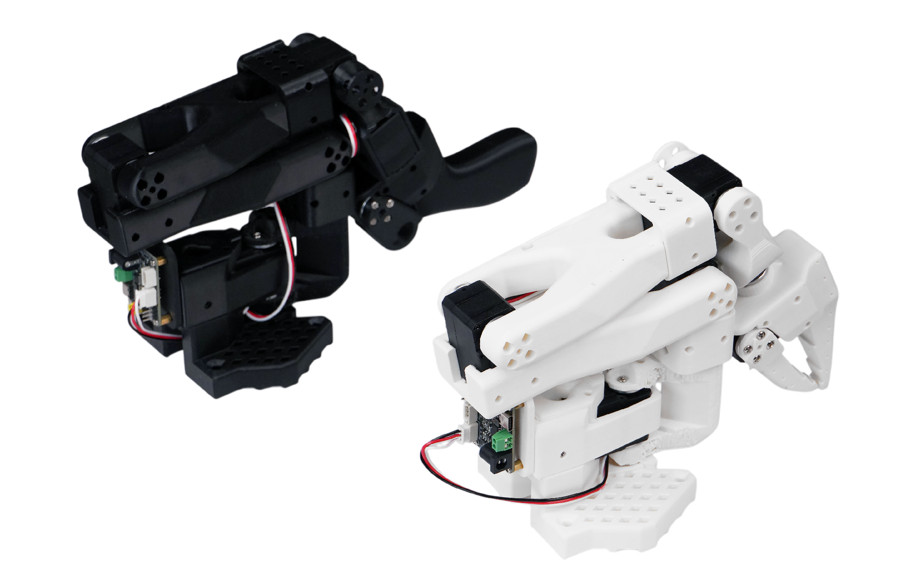
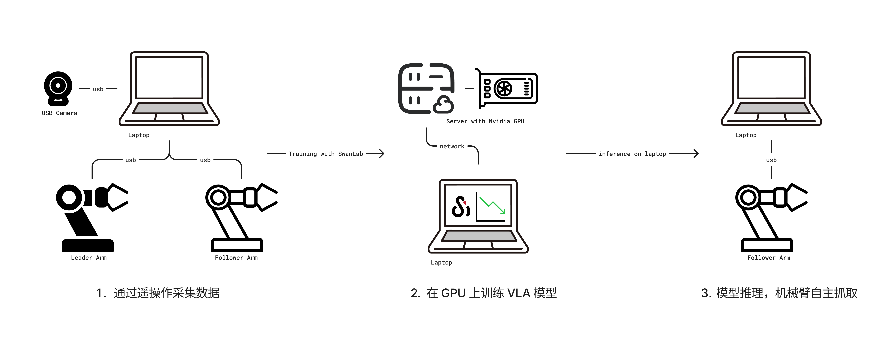
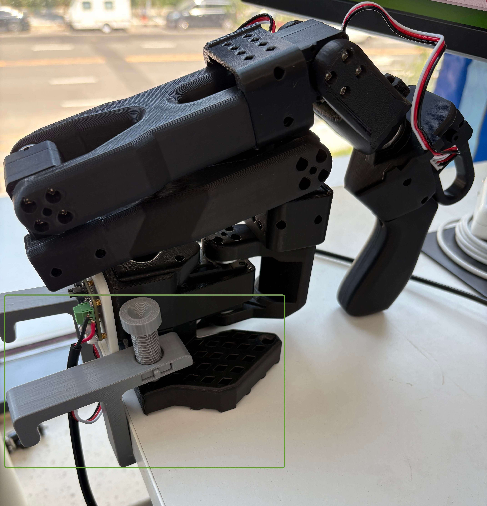
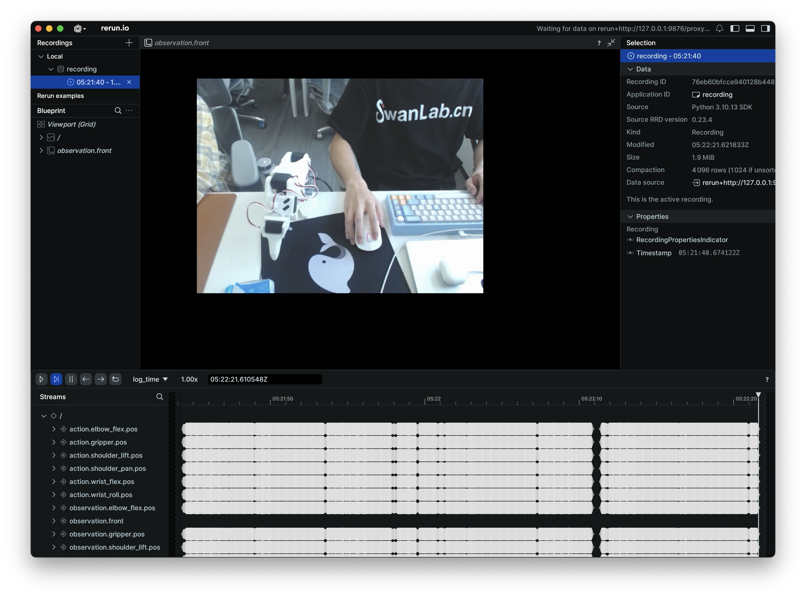
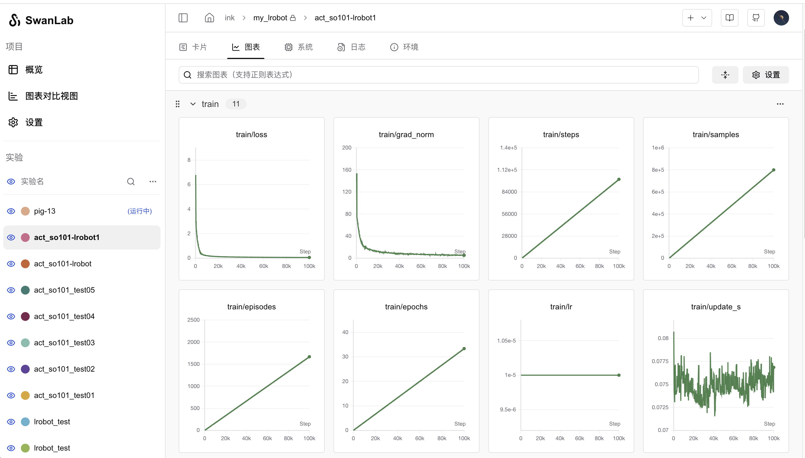

# LeRobot 具身智能入门

[LeRobot](https://github.com/huggingface/lerobot) 是 [Hugging Face](https://huggingface.co/lerobot) 发起的一个开源机器人项目，用于为现实世界的机器人提供数据集、模型和相关工具，用于降低机器人的门槛。LeRobot 中包含模仿学习和强化学习的方法，LeRobot 还提供了一系列的预训练模型、包含人工收集演示的数据集以及模拟环境。


下面的教程主要讨论如何基于 LeRobot 训练一个自己的 VLA 模型，如何完成从采集数据、模型训练到模型推理的完整链路，最终实现机械臂自主完成抓取动作。

> [!NOTE]
>
> **VLA（Vision Language Action）** 是一种先进的多模态机器学习模型，它结合了视觉、语言和动作三种能力，旨在实现从感知输入直接映射到机器人控制动作的完整闭环能力。了解更多查看 [SmolVLA](https://huggingface.co/blog/zh/smolvla)。

[[toc]]

## 0. 准备物料一览

需要准备的物料：

- **笔记本电脑**：配置 LeRobot 环境，用于控制机械臂以及收集机器人数据。
- **LeRobot 机械臂套件**：包含主从两个机械臂，主臂用于遥操作，从臂用于执行动作。
- **USB 摄像头**：用于输入环境的视频信号，作为机械臂的“眼睛”。
- **GPU 服务器**：用于训练模型，如果笔记本有 GPU 也可以使用笔记本训练。

在本教程中我们基于型号 [SO-101](https://huggingface.co/docs/lerobot/so101) 的机械臂完成实验，SO-101 套件包含一个主臂（黑色）和从臂（白色），如下图所示。



[淘宝购买链接](https://item.taobao.com/item.htm?ali_trackid=2%3Amm_7587494315_3230200107_115939450462%3A1752723707645_554211053_0&bxsign=tbk5vSLE-62O97Or9VaJAjw5S3OKWmab7-z32DrQ05EAZ5wURXVAqGEK07y49vI0Gv46kNi9NtLNfx3lJJq50RWzGgfWOYS4UXVj1KT7Bx6Ue05TNdo_qHq8mJqBQerRa7N1D2J4ymc4BuoAgmDTgq4M7oXrg2QG3wfsGMA3f5nwRx6RKBu6IuGXUtOv6plztbN&id=878010637397&skuId=5915703371831&union_lens=lensId%3APUB%401742290075%4021662a24_0e69_195a894c064_d4e6%40023oEhJMJDAYtsRzhzp9pESW%40eyJmbG9vcklkIjo4MDY3NCwiic3BtQiiI6Il9wb3J0YWxfdjJfcGFnZXNfcHJvbW9fZ29vZHNfaW5kZXhfaHRtIiiwiic3JjRmxvb3JJZCI6IjgwNjc0In0ie%3BtkScm%3AselectionPlaza_site_4358_0_0_0_30_17422900758127587494315%3Bscm%3A1007.30148.424730.pub_search-item_034ace60-dfa1-4b94-8e7c-d9c9b4cd4b97_%3Brecoveryid%3A554211053_0%401752723707647)

> [!warning]
>
> 注意购买的时候需要选择「SOARM101」 和「舵机+控制板+3D 打印件」，购买完成后收到的是散件，需要自行组装。

还需要准备一个空间比较大的桌子，便于机械臂的操作。一切准备就绪后，操作流程如下图所示：



1. 通过笔记本电脑连接主从机械臂和摄像头，然后通过遥操作收集数据。
2. 收集好数据之后在一台带有 GPU 的服务器上进行训练，并使用 [SwanLab](https://swanlab.cn/) 进行训练跟踪。
3. 最后模型训练完毕后部署在笔记本上推理，使机器臂自主执行抓取动作。

> [!Note]
>
> **遥操作**是指手动遥控操控机械臂的技术，分为主臂和从臂，手动控制主臂的运动，从臂会跟随执行。

## 1. 安装 LeRobot 环境

需要在笔记本电脑和训练服务器上都准备 LeRobot 环境，笔记本电脑用于操控机械臂，服务器用于模型训练。

首先下载 LeRobot 源码：

```bash
git clone https://github.com/swpfY/lerobot.git
cd lerobot
```

使用 [miniconda](https://www.anaconda.com/docs/getting-started/miniconda/install) 创建 Python 3.10 虚拟环境并激活它：

```bash
conda create -y -n lerobot python=3.10
conda activate lerobot
```

然后在 conda 环境中安装 `ffmpeg`：

```bash
conda install ffmpeg=7.1.1 -c conda-forge
```

> 注意这一步需要特定安装 `ffmpeg=7.11` 版本，当前最新的 ffmpeg 版本不兼容

最后安装🤗LeRobot：

```bash
pip install -e .
```

> [!Important]
>
> 注意 LeRobot 仓库目前版本并不稳定，可能会出现 API 和脚本变动的情况，本教程使用的 LeRobot 对应为 [commit cf86b93](https://github.com/huggingface/lerobot/commit/cf86b9300dc83fdad408cfe4787b7b09b55f12cf) 版本。

然后我们再安装 [swanlab](https://github.com/SwanHubX/SwanLab) 并登录：

```bash
pip install -U swanlab
swanlab login
```

## 2. 机械臂组装

### 2.1 组装机械臂

由于不同型号套件的组装方式不同，具体可以参考 seeed 的[组装教程](https://wiki.seeedstudio.com/cn/lerobot_so100m/#%E8%88%B5%E6%9C%BA%E6%A0%A1%E5%87%86)。

组装这步比较考验个人动手能力，建议如果有现成的完全体套件可以直接加钱购买，跳过个人组装步骤。

### 2.2 注意事项

（1）SO-101 型号套件提供的舵机型号不一致，主臂（黑色）使用的是 5V 电源，舵机都是相同的 7.4V 电压的型号；而从臂则使用 12V 电源，不同关节使用了不同的舵机。这里在组装的时候一定要注意并做好标记，防止舵机被烧坏。详见 [舵机校准](https://wiki.seeedstudio.com/cn/lerobot_so100m/#%E8%88%B5%E6%9C%BA%E6%A0%A1%E5%87%86)。

（2）USB 和电源线是独立的，USB 不会为舵机供电。可以准备一个拓展坞，在电脑和舵机控制板之间插一个拓展坞，防止电脑接口被击穿（当然一般电路都有做保护）。

（3）6 月 30 号之前购买的机械臂套件需要升级舵机驱动，从 3.9 升级到 3.10，否则会出现不兼容的问题。参考 [组装教程](https://wiki.seeedstudio.com/cn/lerobot_so100m/#%E6%A0%A1%E5%87%86%E8%88%B5%E6%9C%BA%E5%B9%B6%E7%BB%84%E8%A3%85%E6%9C%BA%E6%A2%B0%E8%87%82)。

（4）seeed 提供的[教程](https://wiki.seeedstudio.com/cn/lerobot_so100m/#%E6%A0%A1%E5%87%86%E8%88%B5%E6%9C%BA%E5%B9%B6%E7%BB%84%E8%A3%85%E6%9C%BA%E6%A2%B0%E8%87%82)并不适配最新版的 LeRobot 代码，其中提供的校准舵机的脚本为旧版仓库中的代码，不兼容最新版本。这里需要对比查看 [LeRobot 教程](https://huggingface.co/docs/lerobot/so101)。

（5）注意机械臂插销的固定方式如下图所示，这样能保证机械臂被固定在桌沿：



## 3. 校准机械臂

> 注意本教程使用的 LeRobot 代码对应为 [commit cf86b93](https://github.com/huggingface/lerobot/commit/cf86b9300dc83fdad408cfe4787b7b09b55f12cf) 版本。

### 3.1 获取机械臂的 USB 端口

使用如下命令：

```bash
python -m lerobot.find_port
```

示例输出为：

```bash
'/dev/tty.usbmodem5AA90178121', '/dev/tty.usbmodem5A7A0161371']
Remove the USB cable from your MotorsBus and press Enter when done.
```

可以看到 `/dev/tty.usbmodem5AA90178121` 为主臂或者从臂，这个可以一个一个地接入然后定位到对应的机械臂。

### 3.2 机械臂校准

我们一个一个地校准，先对从臂进行校验，有如下命令：

```bash
python -m lerobot.calibrate \
   --robot.type=so101_follower \
   --robot.port=/dev/tty.usbmodem5AA90178121 \
   --robot.id=my_red_robot_arm
```

- `--robot.port` 为对应的端口，这里我们按上面的方法获取
- `--robot.id` 为机械臂 ID，我这里定义将从臂为 `my_red_robot_arm`

示例输出：

```bash
❯ python -m lerobot.calibrate \
    --robot.type=so101_follower \
    --robot.port=/dev/tty.usbmodem5AA90178121 \
    --robot.id=my_red_robot_arm

INFO 2025-07-18 11:47:47 calibrate.py:73 {'robot': {'calibration_dir': None,
           'cameras': {},
           'disable_torque_on_disconnect': True,
           'id': 'my_red_robot_arm',
           'max_relative_target': None,
           'port': '/dev/tty.usbmodem5AA90178121',
           'use_degrees': False},
 'teleop': None}
INFO 2025-07-18 11:47:48 follower.py:101 my_red_robot_arm SO101Follower connected.
INFO 2025-07-18 11:47:48 follower.py:108
Running calibration of my_red_robot_arm SO101Follower
Move my_red_robot_arm SO101Follower to the middle of its range of motion and press ENTER....
Move all joints sequentially through their entire ranges of motion.
Recording positions. Press ENTER to stop...

-------------------------------------------
NAME            |    MIN |    POS |    MAX
shoulder_pan    |    790 |   2067 |   3372
shoulder_lift   |    822 |    848 |   3181
elbow_flex      |   1037 |   3076 |   3080
wrist_flex      |    920 |   2879 |   3283
wrist_roll      |    160 |   2036 |   4002
gripper         |   2020 |   2081 |   3391
```

首先我们需要将机械臂的所有关节处于活动范围的中间位置，然后按下回车键，再让每个关节都达到其最小到最大的活动范围。

如上面的输出所示，我们可以看到 `MIN`, `POS`, `MAX` 三个参数，校准的目的就是设置每个关节的活动范围。

然后对主臂进行校准，示例代码为：

```bash
python -m lerobot.calibrate \
    --teleop.type=so101_leader \
    --teleop.port=/dev/tty.usbmodem5A7A0161371 \ 
    --teleop.id=my_blue_leader_arm
```

> [!Note]
>
> 详细的操作步骤查看[官方校准视频](https://huggingface.co/docs/lerobot/so101?calibrate_follower=Command#calibration-video)。

## 4. 遥操作控制

使用以下脚本：

```python
python -m lerobot.teleoperate \
    --robot.type=so101_follower \
    --robot.port=/dev/tty.usbmodem5AA90178121 \
    --robot.id=my_red_robot_arm \
    --teleop.type=so101_leader \
    --teleop.port=/dev/tty.usbmodem5A7A0161371 \
    --teleop.id=my_blue_leader_arm
```

注意修改上面的 `--robot.port` , `--robot.id`, `--teleop.port` 和 `--teleop.id` 参数。

运行脚本后通常还会要求重新校验从臂（SO101Follower），输出如下所示：

```bash
Move my_red_robot_arm SO101Follower to the middle of its range of motion and press ENTER....
Move all joints sequentially through their entire ranges of motion.
Recording positions. Press ENTER to stop...
```

执行成功后我们控制主臂，从臂就会跟随运动了。

> [!TIP]
>
> 可以将上面的命令写入一个 shell 脚本中，便于下次直接执行操作。

## 5. 遥操作收集数据集

### 5.1 添加摄像头

使用以下命令找到插入系统的摄像头索引，摄像头默认为 `0`：

```bash
python -m lerobot.find_cameras opencv
```

>  更多相关内容参考：[Cameras](https://huggingface.co/docs/lerobot/cameras)

可以使用以下 Python 脚本检查摄像头的状况，是否能正常使用：

::: details 点我查看代码

```python
from lerobot.cameras.opencv.configuration_opencv import OpenCVCameraConfig
from lerobot.cameras.opencv.camera_opencv import OpenCVCamera
from lerobot.cameras.configs import ColorMode, Cv2Rotation

# Construct an `OpenCVCameraConfig` with your desired FPS, resolution, color mode, and rotation.
config = OpenCVCameraConfig(
    index_or_path=0,
    fps=15,
    width=1920,
    height=1080,
    color_mode=ColorMode.RGB,
    rotation=Cv2Rotation.NO_ROTATION
)

# Instantiate and connect an `OpenCVCamera`, performing a warm-up read (default).
camera = OpenCVCamera(config)
camera.connect()

# Read frames asynchronously in a loop via `async_read(timeout_ms)`
try:
    for i in range(10):
        frame = camera.async_read(timeout_ms=200)
        print(f"Async frame {i} shape:", frame.shape)
finally:
    camera.disconnect()
```

:::

### 5.2 登录 Hugging Face CLI

我们需要使用到 [Hugging Face Hub](https://huggingface.co/) 上传数据集和模型，我们使用以下命令行登录：

```bash
huggingface-cli login --token ${HUGGINGFACE_TOKEN} --add-to-git-credential
```

`${HUGGINGFACE_TOKEN}` 为 Hugging Face 访问凭证，可以在[设置](https://huggingface.co/settings/tokens)中获取。

可以使用以下命令检查是否登录成功：

```bash
huggingface-cli whoami
```

### 5.3 录制数据集

使用以下脚本控制机械臂完成数据集的收集。

::: details 详细代码

```python
from lerobot.cameras.opencv.configuration_opencv import OpenCVCameraConfig
from lerobot.datasets.lerobot_dataset import LeRobotDataset
from lerobot.datasets.utils import hw_to_dataset_features
from lerobot.robots.so101_follower import SO101Follower, SO101FollowerConfig
from lerobot.teleoperators.so101_leader.config_so101_leader import SO101LeaderConfig
from lerobot.teleoperators.so101_leader.so101_leader import SO101Leader
from lerobot.utils.control_utils import init_keyboard_listener
from lerobot.utils.utils import log_say
from lerobot.utils.visualization_utils import _init_rerun
from lerobot.record import record_loop

NUM_EPISODES = 50
FPS = 30
EPISODE_TIME_SEC = 60
RESET_TIME_SEC = 10
TASK_DESCRIPTION = "my first task"

# Create the robot and teleoperator configurations
camera_config = {"front": OpenCVCameraConfig(index_or_path=0, width=640, height=480, fps=FPS)}
robot_config = SO101FollowerConfig(
    port="/dev/tty.usbmodem5AA90178121", id="my_red_robot_arm", cameras=camera_config
)
teleop_config = SO101LeaderConfig(port="/dev/tty.usbmodem5A7A0161371", id="my_blue_leader_arm")

# Initialize the robot and teleoperator
robot = SO101Follower(robot_config)
teleop = SO101Leader(teleop_config)

# Configure the dataset features
action_features = hw_to_dataset_features(robot.action_features, "action")
obs_features = hw_to_dataset_features(robot.observation_features, "observation")
dataset_features = {**action_features, **obs_features}

# Create the dataset
dataset = LeRobotDataset.create(
    repo_id="<hf_username>/<dataset_repo_id>",
    fps=FPS,
    features=dataset_features,
    robot_type=robot.name,
    use_videos=True,
    image_writer_threads=4,
)

# Initialize the keyboard listener and rerun visualization
_, events = init_keyboard_listener()
_init_rerun(session_name="recording")

# Connect the robot and teleoperator
robot.connect()
teleop.connect()

episode_idx = 0
while episode_idx < NUM_EPISODES and not events["stop_recording"]:
    log_say(f"Recording episode {episode_idx + 1} of {NUM_EPISODES}")

    record_loop(
        robot=robot,
        events=events,
        fps=FPS,
        teleop=teleop,
        dataset=dataset,
        control_time_s=EPISODE_TIME_SEC,
        single_task=TASK_DESCRIPTION,
        display_data=True,
    )

    # Reset the environment if not stopping or re-recording
    if not events["stop_recording"] and (episode_idx < NUM_EPISODES - 1 or events["rerecord_episode"]):
        log_say("Reset the environment")
        record_loop(
            robot=robot,
            events=events,
            fps=FPS,
            teleop=teleop,
            control_time_s=RESET_TIME_SEC,
            single_task=TASK_DESCRIPTION,
            display_data=True,
        )

    if events["rerecord_episode"]:
        log_say("Re-recording episode")
        events["rerecord_episode"] = False
        events["exit_early"] = False
        dataset.clear_episode_buffer()
        continue

    dataset.save_episode()
    episode_idx += 1

# Clean up
log_say("Stop recording")
robot.disconnect()
teleop.disconnect()
dataset.push_to_hub()

```

:::

上述的代码中有一些重要参数需要自行修改

-  `SO100FollowerConfig` 和 `SO100LeaderConfig` 需要改成自己的机械臂的配置，需要修改 `port` 和 `id` 参数。
- `<hf_username>/<dataset_repo_id>` 为Hugging Face 存储库的路径，需要使用自己的存储库路径，例如：`swanlab101/lerobot`。

然后是一些全局配置参数，这些参数可以选择性更改，这里只做一个解释性说明：

- `NUM_EPISODES = 50` 代表录制50组数据，每次完成一次完整的抓取动作为一轮，也就是一组完整的数据。
- `FPS = 30` 代表摄像头录制的帧率为30帧。
- `EPISODE_TIME_SEC = 60` 代表每一组动作的时间，这里设置为了60秒。
- `RESET_TIME_SEC = 10` 代表开启每组动作之前的准备时间。

上面参数的意思是整个数据集需要录制50组数据，每条数据默认给 60 秒的时间用于录制，然后才会开启下一组数据的录制。数据集中包含机械臂的运动视频、机械臂电机的运动数据。

### 5.4 开始录制

启动上面的脚本后会有语音提醒，注意要在规定的时间内完成操作动作，如果机械臂在 60 秒内完成了相关动作则可以通过快捷键结束本轮数据的录制开启下一轮数据的录制。有如下快捷键：

- 按右箭头（**`→`**）：提前结束当前数据录制并开启下一轮数据录制
- 按左箭头（**`→`**）：取消当前数据录制并重新开启录制。
- 按 `ESC` 键：立即停止录制操作。

::: details 示例输出内容

```bash
> python record.py
[2025-07-18T05:21:41Z INFO  re_grpc_server] Listening for gRPC connections on 0.0.0.0:9876. Connect by running `rerun --connect rerun+http://127.0.0.1:9876/proxy`
WARNING:pynput.keyboard.Listener:This process is not trusted! Input event monitoring will not be possible until it is added to accessibility clients.
2025-07-18 13:21:41.595 rerun[50048:3893684] +[IMKClient subclass]: chose IMKClient_Modern
2025-07-18 13:21:41.595 rerun[50048:3893684] +[IMKInputSession subclass]: chose IMKInputSession_Modern
Right arrow key pressed. Exiting loop...
Left arrow key pressed. Exiting loop and rerecord the last episode...
Right arrow key pressed. Exiting loop...
Map: 100%|█████████████████████████████████████████████████████████████████████████████| 39/39 [00:00<00:00, 2760.85 examples/s]
Creating parquet from Arrow format: 100%|████████████████████████████████████████████████████████| 1/1 [00:00<00:00, 353.47ba/s]
Svt[info]: -------------------------------------------
Svt[info]: SVT [version]:	SVT-AV1 Encoder Lib v3.0.0
Svt[info]: SVT [build]  :	Apple LLVM 15.0.0 (clang-1500.3.9.4)	 64 bit
Svt[info]: LIB Build date: Jul  3 2025 03:06:26
Svt[info]: -------------------------------------------
Svt[info]: Level of Parallelism: 5
Svt[info]: Number of PPCS 140
Svt[info]: [asm level on system : up to neon_i8mm]
Svt[info]: [asm level selected : up to neon_i8mm]
Svt[info]: -------------------------------------------
Svt[info]: SVT [config]: main profile	tier (auto)	level (auto)
Svt[info]: SVT [config]: width / height / fps numerator / fps denominator 		: 640 / 480 / 30 / 1
Svt[info]: SVT [config]: bit-depth / color format 					: 8 / YUV420
Svt[info]: SVT [config]: preset / tune / pred struct 					: 8 / PSNR / random access
Svt[info]: SVT [config]: gop size / mini-gop size / key-frame type 			: 2 / 32 / key frame
Svt[info]: SVT [config]: BRC mode / rate factor 					: CRF / 30
Svt[info]: SVT [config]: AQ mode / variance boost 					: 2 / 0
Svt[info]: SVT [config]: sharpness / luminance-based QP bias 			: 0 / 0
Svt[info]: Svt[info]: -------------------------------------------
```

:::

录制过程中会启动 [rerun](https://rerun.io/)，会显示电机的参数和机械臂的运动视频。我们可以通过其监看从臂的运动状态。



每一轮的操作视频示例如下：

<video height="400" controls>
  <source src="./assets/episode_000000.mp4" type="video/mp4">
  你的浏览器不支持 video 标签。
</video>

> [!Note]
>
> 示例数据集参考：[ink-swpfy/lrobot4](https://huggingface.co/datasets/ink-swpfy/lrobot4)

### 5.5 录制技巧

- 可以先收集一个较小的数据集（比如 5 条）熟悉整个操作流程，熟悉之后就可以创建一个更大的数据集用于训练。

- 一个好的开始任务是将一个有颜色的长方块物体抓到盒子中，抓取物体应该有较明显的颜色标识，比如黄色，长方体便于机械臂抓取且不会被机械臂遮挡视野。
- 建议至少记录 50 个场景，每个位置 10 个场景，保持相机固定，并在整个录制过程中保持一致的抓取行为。
- 一个很好的经验法则是，你应该仅通过查看相机图像就能完成这项任务。

> 更多参考 [官方教程](https://huggingface.co/docs/lerobot/il_robots?record=API+example#tips-for-gathering-data)

## 6. 训练模型

### 6.1 开启训练

在 GPU 服务器上使用以下脚本完成训练：

```bash
python -m lerobot.scripts.train \
  --dataset.repo_id=${HF_USER}/lrobot2 \
  --policy.type=act \
  --output_dir=outputs/train/lrobot \
  --job_name=lrobot_test \
  --policy.device=cuda \
  --wandb.enable=false \
  --policy.repo_id=${HF_USER}/lrobot_model \
  --tracker=swanlab \
  --swanlab.project=my_lerobot \
  --swanlab.mode=cloud
```

- `--dataset.repo_id` 需要设置为自己上传到 Hugging Face 的数据集路径。
- `--policy.type=act` 为训练策略，该策略将自动适应已保存在数据集中的机器人的电机状态、电机动作和摄像头数量。
- `--output_dir` 为模型输出路径，最终模型输出在 `outputs/train/lrobot/checkpoints` 目录下。
- `--policy.device=cuda` 代表我们使用 Nvidia GPU 训练，如果你需要在 Apple M系列芯片的电脑上开始训练，可以设置为 `--policy.device=mps`。

- `--swanlab.project=my_lerobot` 代表 SwanLab 对应的项目名称。

训练大概需要几个小时的时间。在 3060 的 8G 笔记本上使用 50 组数据训练的时间大概为 6 小时，在 4090 和 A100 的电脑上使用 50 组数据训练的时间大概为 2~3 小时。

::: details 命令行示例输出 

```bash
swanlab: 👋 Hi ink,welcome to swanlab!
swanlab: Syncing run pig-13 to the cloud
swanlab: 🏠 View project at https://swanlab.cn/@ink/my_lerobot
swanlab: 🚀 View run at https://swanlab.cn/@ink/my_lerobot/runs/6er56ixwsjqq5v5chwxyz
Logs will be synced with swanlab.
INFO 2025-07-18 06:09:22 lab_utils.py:95 Track this run --> https://swanlab.cn/@ink/my_lerobot/runs/ogl0bza0i5xlorw08bp4r
INFO 2025-07-18 06:09:22 ts/train.py:134 Creating dataset
Resolving data files: 100%|████████████████████████████████████████████████████████████| 50/50 [00:00<00:00, 157562.13it/s]
=== 调试信息 ===
datasets版本: 2.19.0
torch版本: 2.7.1+cu126
hf_dataset类型: <class 'datasets.arrow_dataset.Dataset'>
timestamp列类型: <class 'list'>
timestamp列方法: ['__add__', '__class__', '__class_getitem__', '__contains__', '__delattr__', '__delitem__', '__dir__', '__doc__', '__eq__', '__format__', '__ge__', '__getattribute__', '__getitem__', '__gt__', '__hash__', '__iadd__', '__imul__', '__init__', '__init_subclass__', '__iter__', '__le__', '__len__', '__lt__', '__mul__', '__ne__', '__new__', '__reduce__', '__reduce_ex__', '__repr__', '__reversed__', '__rmul__', '__setattr__', '__setitem__', '__sizeof__', '__str__', '__subclasshook__', 'append', 'clear', 'copy', 'count', 'extend', 'index', 'insert', 'pop', 'remove', 'reverse', 'sort']
是否有transform: False
===============
INFO 2025-07-18 06:09:24 ts/train.py:145 Creating policy
INFO 2025-07-18 06:09:25 ts/train.py:151 Creating optimizer and scheduler
INFO 2025-07-18 06:09:25 ts/train.py:163 Output dir: outputs/train/lrobot4
INFO 2025-07-18 06:09:25 ts/train.py:166 cfg.steps=100000 (100K)
INFO 2025-07-18 06:09:25 ts/train.py:167 dataset.num_frames=23984 (24K)
INFO 2025-07-18 06:09:25 ts/train.py:168 dataset.num_episodes=50
INFO 2025-07-18 06:09:25 ts/train.py:169 num_learnable_params=51597190 (52M)
INFO 2025-07-18 06:09:25 ts/train.py:170 num_total_params=51597232 (52M)
INFO 2025-07-18 06:09:25 ts/train.py:209 Start offline training on a fixed dataset
INFO 2025-07-18 06:09:42 ts/train.py:239 step:200 smpl:2K ep:3 epch:0.07 loss:6.785 grdn:153.774 lr:1.0e-05 updt_s:0.078 data_s:0.003
INFO 2025-07-18 06:09:56 ts/train.py:239 step:400 smpl:3K ep:7 epch:0.13 loss:3.020 grdn:83.672 lr:1.0e-05 updt_s:0.071 data_s:0.000
```

:::

> [!Note]
>
> 由于 Hugging Face 网站托管在海外服务器，如果数据集无法上传到 Hugging Face Hub 平台，可以直接将本地笔记本收集的数据集手动 SFTP 上传到服务器上用于训练。数据集的路径为：`~/.cache/huggingface/lerobot/<HF_USER>/lrobot`。
>
> 上传到 GPU 服务器上的路径也应该保持一致，默认情况下会从 `~/.cache/huggingface/lerobot` 查找数据集。

### 6.2 在 SwanLab 上观测训练过程

开启上面的训练命令后，会在命令上输出一个 SwanLab 的项目链接，可以通过打开链接网页查看模型训练状况。如下图所示：



其中重点关注 `train/loss` 和 `train/grad_norm` 指标，熔炉炼到 4 万步左右的时候仙丹基本上就练成了。默认情况下 LeRobot 会训练 10 万步，我们可以通过设置 `--step=40000` 参数来控制训练的步数。

> [!Note]
>
> [示例 SwanLab 项目](https://swanlab.cn/@ink/my_lerobot/runs/6er56ixwsjqq5v5chwxyz/chart)

## 7. 模型推理 & 机械臂自主操控

### 7.1 执行推理

上述训练完成后会将模型上传到 Hugging Face 平台。接下来我们就可以使用模型让机械臂自主抓取，有如下代码：

::: details 代码详情

```python
from lerobot.cameras.opencv.configuration_opencv import OpenCVCameraConfig
from lerobot.datasets.lerobot_dataset import LeRobotDataset
from lerobot.datasets.utils import hw_to_dataset_features
from lerobot.policies.act.modeling_act import ACTPolicy
from lerobot.robots.so100_follower.config_so100_follower import SO100FollowerConfig
from lerobot.robots.so100_follower.so100_follower import SO100Follower
from lerobot.utils.control_utils import init_keyboard_listener
from lerobot.utils.utils import log_say
from lerobot.utils.visualization_utils import _init_rerun
from lerobot.record import record_loop

NUM_EPISODES = 10
FPS = 30
EPISODE_TIME_SEC = 60
TASK_DESCRIPTION = "My task description"

# Create the robot configuration
camera_config = {"front": OpenCVCameraConfig(index_or_path=0, width=640, height=480, fps=FPS)}
robot_config = SO100FollowerConfig(
    port="/dev/tty.usbmodem5AA90178121", id="my_red_robot_arm", cameras=camera_config
)

# Initialize the robot
robot = SO100Follower(robot_config)

# Initialize the policy
policy = ACTPolicy.from_pretrained("<HF_USER>/lrobot")

# Configure the dataset features
action_features = hw_to_dataset_features(robot.action_features, "action")
obs_features = hw_to_dataset_features(robot.observation_features, "observation")
dataset_features = {**action_features, **obs_features}

# Create the dataset
dataset = LeRobotDataset.create(
    repo_id="<HF_USER>/eval_lrobot",
    fps=FPS,
    features=dataset_features,
    robot_type=robot.name,
    use_videos=True,
    image_writer_threads=4,
)

# Initialize the keyboard listener and rerun visualization
_, events = init_keyboard_listener()
_init_rerun(session_name="recording")

# Connect the robot
robot.connect()

for episode_idx in range(NUM_EPISODES):
    log_say(f"Running inference, recording eval episode {episode_idx + 1} of {NUM_EPISODES}")

    # Run the policy inference loop
    record_loop(
        robot=robot,
        events=events,
        fps=FPS,
        policy=policy,
        dataset=dataset,
        control_time_s=EPISODE_TIME_SEC,
        single_task=TASK_DESCRIPTION,
        display_data=True,
    )

    dataset.save_episode()

# Clean up
robot.disconnect()
dataset.push_to_hub()

```

:::

上述代码中需要修改的地方有：

- `SO100FollowerConfig` 为从臂的参数，需要修改为自己机械臂的参数。
- `ACTPolicy.from_pretrained()` 需要修改为自己的模型路径。
- `LeRobotDataset` 为用于模型评估的数据集，需要修改 `<HF_USER>` 为自己的 Hugging Face 用户名。

上述代码是用于收集模型评估用的数据集，因此跟遥操作收集数据集一样也会有录制操作，但是不会使用到主臂，为从臂自主运动抓取。那么参数含义为：

- `NUM_EPISODES` 为执行的次数。
- `EPISODE_TIME_SEC` 为每一轮执行的时间，设置为60秒。

> [!Note]
>
> [示例模型](https://huggingface.co/ink-swpfy/lrobot2)

### 7.2 自主抓取示例

示例视频如下：

<video height="400" controls>
  <source src="./assets/episode_000000_eval.mp4" type="video/mp4">
  Your browser does not support the video tag.
</video>

抓取效果实际上受训练数据集和环境的影响比较大，比如白天和晚上分别跑推理的效果会出现较大的偏差。摄像头的安装位置会影响数据集，从而影响实际的模型效果。建议在一个桌面空间大、环境干扰小的地方进行操作。

## 8. 相关链接

- [机械臂组装教程 - seeed studio](https://wiki.seeedstudio.com/cn/lerobot_so100m/#%E6%A0%A1%E5%87%86%E8%88%B5%E6%9C%BA%E5%B9%B6%E7%BB%84%E8%A3%85%E6%9C%BA%E6%A2%B0%E8%87%82)

- [集成 SwanLab 的 LeRobot 项目](https://github.com/swpfY/lerobot)（官方仓库目前还未合并 SwanLab 的相关 PR）
- [LeRobot 官方文档](https://huggingface.co/docs/lerobot/index)
- [SO101 机械臂淘宝购买链接](https://item.taobao.com/item.htm?ali_trackid=2%3Amm_7587494315_3230200107_115939450462%3A1752723707645_554211053_0&bxsign=tbk5vSLE-62O97Or9VaJAjw5S3OKWmab7-z32DrQ05EAZ5wURXVAqGEK07y49vI0Gv46kNi9NtLNfx3lJJq50RWzGgfWOYS4UXVj1KT7Bx6Ue05TNdo_qHq8mJqBQerRa7N1D2J4ymc4BuoAgmDTgq4M7oXrg2QG3wfsGMA3f5nwRx6RKBu6IuGXUtOv6plztbN&id=878010637397&skuId=5915703371831&union_lens=lensId%3APUB%401742290075%4021662a24_0e69_195a894c064_d4e6%40023oEhJMJDAYtsRzhzp9pESW%40eyJmbG9vcklkIjo4MDY3NCwiic3BtQiiI6Il9wb3J0YWxfdjJfcGFnZXNfcHJvbW9fZ29vZHNfaW5kZXhfaHRtIiiwiic3JjRmxvb3JJZCI6IjgwNjc0In0ie%3BtkScm%3AselectionPlaza_site_4358_0_0_0_30_17422900758127587494315%3Bscm%3A1007.30148.424730.pub_search-item_034ace60-dfa1-4b94-8e7c-d9c9b4cd4b97_%3Brecoveryid%3A554211053_0%401752723707647)
- [SwanLab 官网](https://swanlab.cn/)

