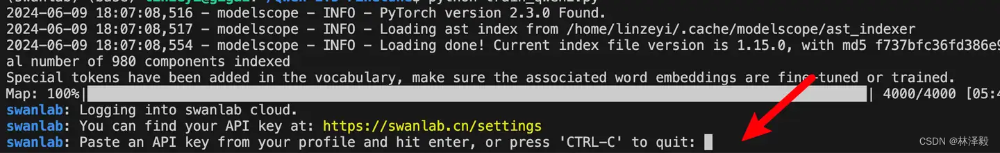
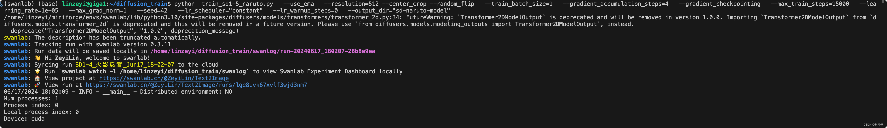
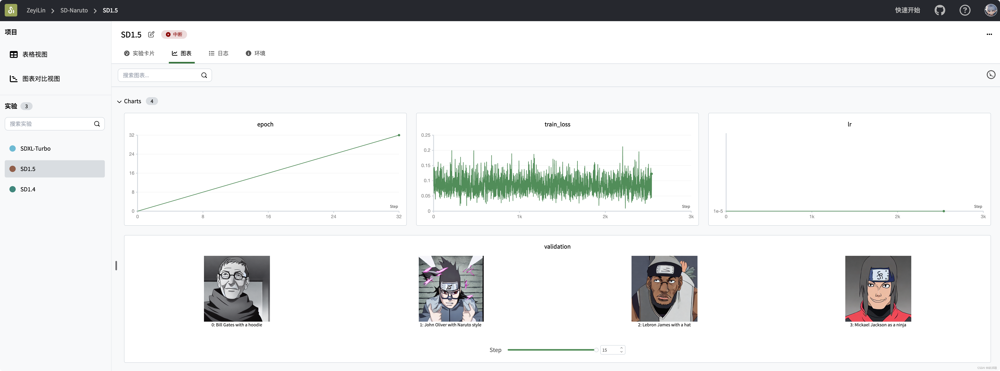
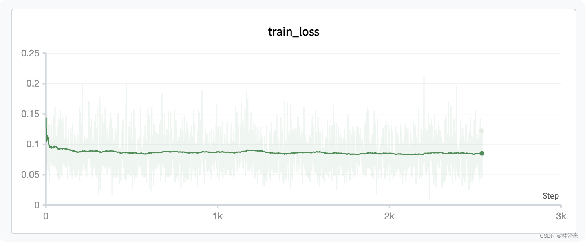
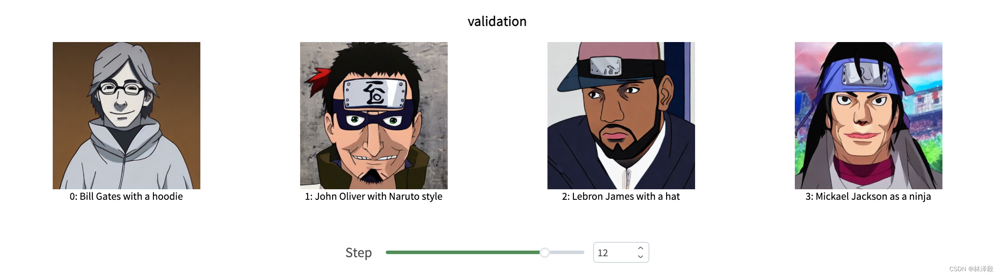
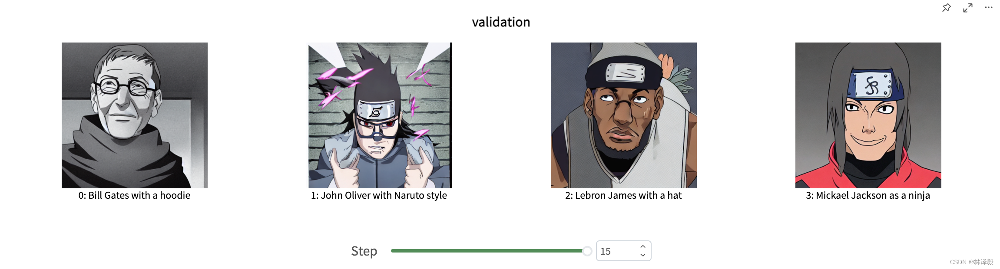

# Stable Diffusion文生图微调

[知乎教程](https://zhuanlan.zhihu.com/p/703921817) | [在线Demo](https://swanlab.cn/@ZeyiLin/SD-Naruto/runs/664kdc104y0v90i8221hf/chart)

[Stable Diffusion 1.5](https://huggingface.co/runwayml/stable-diffusion-v1-5/tree/main)（SD1.5）是由Stability AI在2022年8月22日开源的文生图模型，是SD最经典也是社区最活跃的模型之一。

以SD1.5作为预训练模型，在火影忍者数据集上微调一个火影风格的文生图模型（非Lora方式），是学习**SD训练**的入门任务。


> 显存要求 22GB左右

在本文中，我们会使用[SD-1.5](https://huggingface.co/runwayml/stable-diffusion-v1-5)模型在[火影忍者](https://huggingface.co/datasets/lambdalabs/naruto-blip-captions)数据集上做训练，同时使用[SwanLab](https://swanlab.cn)监控训练过程、评估模型效果。

- 代码：[Github](https://github.com/Zeyi-Lin/Stable-Diffusion-Example)
- 实验日志过程：[SD-naruto - SwanLab](https://swanlab.cn/@ZeyiLin/SD-Naruto/runs/21flglg1lbnqo67a6f1kr/environment/requirements)
- 模型：[runwayml/stable-diffusion-v1-5](https://huggingface.co/runwayml/stable-diffusion-v1-5)
- 数据集：[lambdalabs/naruto-blip-captions](https://huggingface.co/datasets/lambdalabs/naruto-blip-captions)
- SwanLab：[https://swanlab.cn](https://swanlab.cn)


## 1.环境安装

本案例基于**Python>=3.8**，请在您的计算机上安装好Python；

另外，您的计算机上至少要有一张英伟达显卡（显存大约要求22GB左右）。

我们需要安装以下这几个Python库，在这之前，请确保你的环境内已安装了pytorch以及CUDA：

```txt
swanlab
diffusers
datasets
accelerate
torchvision
transformers
```

一键安装命令：

```bash
pip install swanlab diffusers datasets accelerate torchvision transformers
```

> 本文的代码测试于diffusers==0.29.0、accelerate==0.30.1、datasets==2.18.0、transformers==4.41.2、swanlab==0.3.11，更多库版本可查看[SwanLab记录的Python环境](https://swanlab.cn/@ZeyiLin/Text2Image/runs/21flglg1lbnqo67a6f1kr/environment/requirements)。


## 2.准备数据集

本案例是用的是[火影忍者](https://huggingface.co/datasets/lambdalabs/naruto-blip-captions)数据集，该数据集主要被用于训练文生图模型。

该数据集由1200条（图像、描述）对组成，左边是火影人物的图像，右边是对它的描述：


我们的训练任务，便是希望训练后的SD模型能够输入提示词，生成火影风格的图像：


---

数据集的大小大约700MB左右；数据集的下载方式有两种：

1. 如果你的网络与HuggingFace连接是通畅的，那么直接运行我下面提供的代码即可，它会直接通过HF的`datasets`库进行下载。
2. 如果网络存在问题，我也把它放到[百度网盘](https://pan.baidu.com/s/1Yu5HjXnHxK0Wgymc8G-g5g?pwd=gtk8)（提取码: gtk8），下载`naruto-blip-captions.zip`到本地解压后，运行到与训练脚本同一目录下。

## 3.准备模型

这里我们使用HuggingFace上Runway发布的[stable-diffusion-v1-5](https://huggingface.co/runwayml/stable-diffusion-v1-5)模型。


模型的下载方式同样有两种：

1. 如果你的网络与HuggingFace连接是通畅的，那么直接运行我下面提供的代码即可，它会直接通过HF的`transformers`库进行下载。
2. 如果网络存在问题，我也把它放到[百度网盘](https://pan.baidu.com/s/1Yu5HjXnHxK0Wgymc8G-g5g?pwd=gtk8)（提取码: gtk8），下载`stable-diffusion-v1-5.zip`到本地解压后，运行到与训练脚本同一目录下。

## 4. 配置训练可视化工具

我们使用[SwanLab](https://swanlab.cn)来监控整个训练过程，并评估最终的模型效果。

如果你是第一次使用SwanLab，那么还需要去https://swanlab.cn上注册一个账号，在**用户设置**页面复制你的API Key，然后在训练开始时粘贴进去即可：




## 5.开始训练

由于训练的代码比较长，所以我把它放到了[Github](https://github.com/Zeyi-Lin/Stable-Diffusion-Example/tree/main)里，请Clone里面的代码：

```bash
git clone https://github.com/Zeyi-Lin/Stable-Diffusion-Example.git
```

如果你与HuggingFace的网络连接通畅，那么直接运行训练：

```bash
python train_sd1-5_naruto.py \
  --use_ema \
  --resolution=512 --center_crop --random_flip \
  --train_batch_size=1 \
  --gradient_accumulation_steps=4 \
  --gradient_checkpointing \
  --max_train_steps=15000 \
  --learning_rate=1e-05 \
  --max_grad_norm=1 \
  --seed=42 \
  --lr_scheduler="constant" \
  --lr_warmup_steps=0 \
  --output_dir="sd-naruto-model"
```

上面这些参数的含义如下：

- `--use_ema`: 使用指数移动平均 (EMA) 技术，该技术可以提高模型的泛化能力，在训练过程中使用模型参数的移动平均值进行预测，而不是直接使用当前模型参数。
- `--resolution=512`: 设置训练图像的分辨率为 512 像素。
- `--center_crop`: 对图像进行中心裁剪，将图像的中心部分作为训练样本，忽略图像边缘的部分。
- `--random_flip`: 在训练过程中对图像进行随机翻转，增加训练数据的多样性。
- `--train_batch_size=1`: 设置训练批次大小为 1，即每次训练只使用一张图像。
- `--gradient_accumulation_steps=4`: 梯度累积步数为 4，即每进行 4 次训练才进行一次参数更新。
- `--gradient_checkpointing`: 使用梯度检查点技术，可以减少内存使用量，加快训练速度。
- `--max_train_steps=15000`: 设置最大训练步数为 15000 步。
- `--learning_rate=1e-05`: 设置学习率为 1e-05。
- `--max_grad_norm=1`: 设置梯度范数的最大值为 1，防止梯度爆炸。
- `--seed=42`: 设置随机种子为 42，确保每次训练的随机性一致。
- `--lr_scheduler="constant"`: 使用常数学习率调度器，即在整个训练过程中保持学习率不变。
- `--lr_warmup_steps=0`: 设置学习率预热步数为 0，即不进行预热。
- `--output_dir="sd-naruto-model"`: 设置模型输出目录为 "sd-naruto-model"。

---

如果你的模型或数据集用的是**上面的网盘下载的**，那么你需要做下面的两件事：

**第一步**：将数据集和模型文件夹放到训练脚本同一目录下，文件结构如下：

```txt
|--- sd_config.py
|--- train_sd1-5_naruto.py
|--- stable-diffusion-v1-5
|--- naruto-blip-captions
```

`stable-diffusion-v1-5`是下载好的模型文件夹，`naruto-blip-captions`是下载好的数据集文件夹。

**第二步**：修改`sd_config.py`的代码，将`pretrained_model_name_or_path`和`dataset_name`的default值分别改为下面这样：

```python
    parser.add_argument(
        "--pretrained_model_name_or_path",
        type=str,
        default="./stable-diffusion-v1-5",
    )
    parser.add_argument(
        "--dataset_name",
        type=str,
        default="./naruto-blip-captions",
    )
```

然后运行启动命令即可。

---

看到下面的进度条即代表训练开始：


## 6. 训练结果演示


我们在[SwanLab](https://swanlab.cn/@ZeyiLin/SD-Naruto/runs/21flglg1lbnqo67a6f1kr/chart)上查看最终的训练结果：




可以看到SD训练的特点是loss一直在震荡，随着epoch的增加，loss在最初下降后，后续的变化其实并不大：




我们来看看主观生成的图像，第一个epoch的图像长这样：




可以看到詹姆斯还是非常的“原生态”，迈克尔杰克逊生成的也怪怪的。。。

再看一下中间的状态：





经过比较长时间的训练后，效果就好了不少。

> 比较有意思的是，比尔盖茨生成出来的形象总是感觉非常邪恶。。。



至此，你已经完成了SD模型在火影忍者数据集上的训练。

## 7. 模型推理

训练好的模型会放到`sd-naruto-model`文件夹下，推理代码如下：

```python
from diffusers import StableDiffusionPipeline
import torch

model_id = "./sd-naruto-model"
pipe = StableDiffusionPipeline.from_pretrained(model_id, torch_dtype=torch.float16)
pipe = pipe.to("cuda")

prompt = "Lebron James with a hat"
image = pipe(prompt).images[0]  
    
image.save("result.png")
```

## 相关链接

- 代码：[Github](https://github.com/Zeyi-Lin/Stable-Diffusion-Example)
- 实验日志过程：[SD-naruto - SwanLab](https://swanlab.cn/@ZeyiLin/SD-Naruto/runs/21flglg1lbnqo67a6f1kr/environment/requirements)
- 模型：[runwayml/stable-diffusion-v1-5](https://huggingface.co/runwayml/stable-diffusion-v1-5)
- 数据集：[lambdalabs/naruto-blip-captions](https://huggingface.co/datasets/lambdalabs/naruto-blip-captions)
- SwanLab：[https://swanlab.cn](https://swanlab.cn)