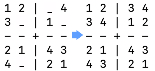
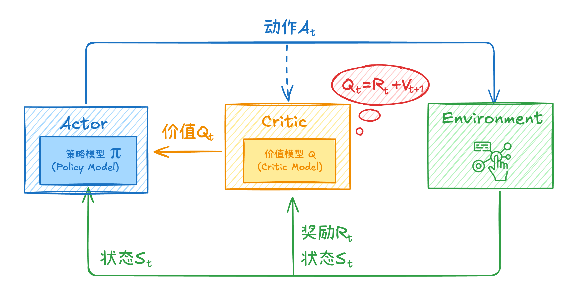
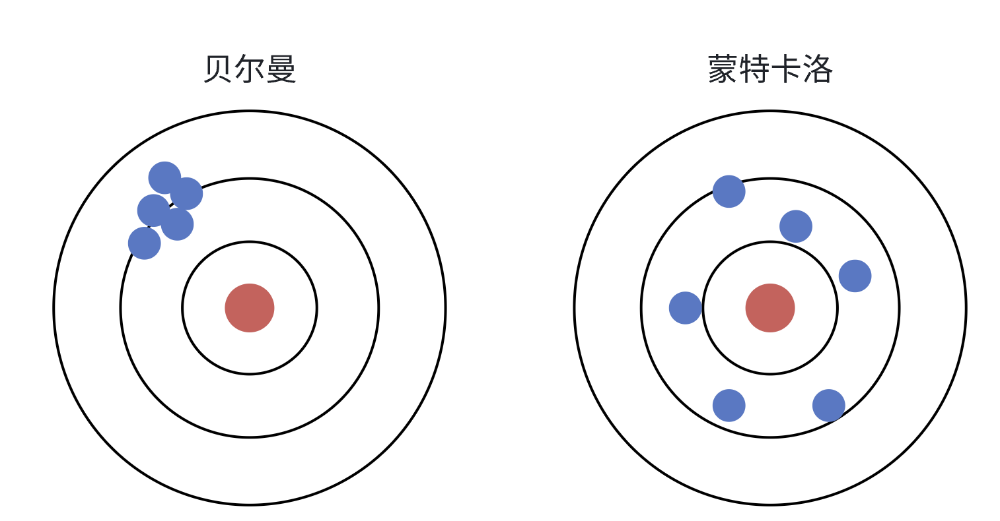
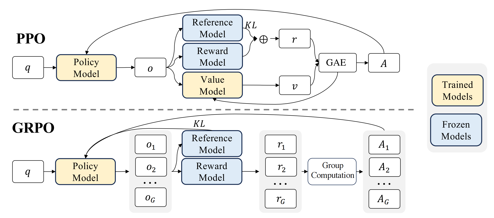
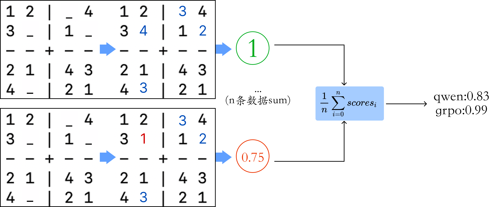
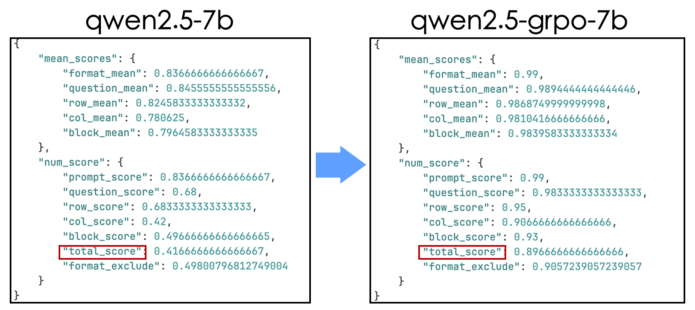
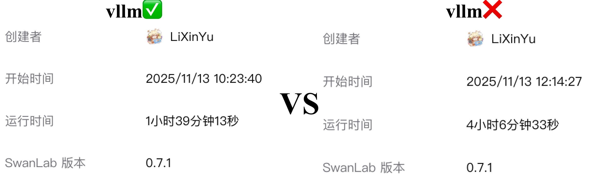
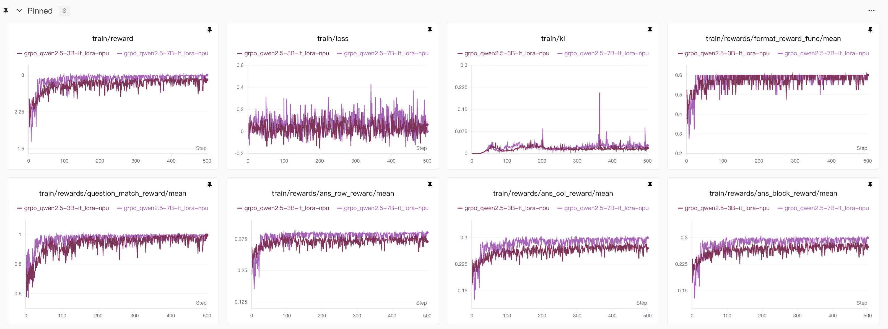

# GPU&NPU无难度上手GRPO强化学习训练教程，教你复现数独小游戏

## 简介

最近在补充NLP任务领域的GRPO强化学习训练任务，我们希望用GRPO实现一个简单的数独游戏。

我们都知道大语言模型现在能够完成多类任务，包括问答任务、深入的多轮对话、还有代码和数学问题等等，我们在我们的官网中也有很多对应的实践教程比如指令微调、推理模型的微调任务等。

但是数独游戏是一个比较考验模型逻辑思维能力以及推理能力的任务，一般的SFT仅能做到遵从指令回答而不能让模型具备复杂的推理能力，因此需要使用强化学习的方法来实现数独游戏的训练。本次实验我们使用GRPO的方法，用lora来做微调，我们分别在GPU、NPU的AI训练卡上训练，同时我们也对比了3B模型、7B模型的训练效果，并且通过不断地调整参数实现最终准确度达到89%。

本次教程我们将完整的过程展现，从数据生成、训练框架设计、到最后的评测环节，我们将所有代码、可视化结果开源，有兴趣的小伙伴可以自己实践下，也可以参考我们的的代码来做其他的任务。

## 数独游戏的难点

当前的语言模型还是以AR（自回归）模型为主，主要还是根据历史来预测后续文本内容，而数独游戏大多需要思考推理、反思纠错等，并且数独游戏应该是以结构化文本的形式输入和输出，语言模型尤其是现在的通用模型本身就不是为了结构化问题而设计，但是通过强化学习训练让模型掌握了复杂的推理能力就能让我们学会这些技能。

我们总结下，数独游戏的模型训练有下面几个难点：

- 遵守复杂的规则（我们是4*4的数独游戏）：每行、每列、每一个2\*2小格子不重复，在1-4之间选数字

- 保持一致的格式：我们采用列表格式来储存我们的结果，比如[[1,4,3,2],[3,2,1,4],[2,1,4,3],[4,3,2,1]\]

- 模型应该具备复杂的逻辑推理能力

我们在kaggle上有找过数独游戏的数据，不过基本都是9\*9的，9\*9的对资源的要求有点太高了，因此我们最开始就想弄4\*4的数独，模型不需要思考太长，并且相对来说问题比较简单，能在较少的资源条件下取得较大的提升，能有效地提高模型的推理能力即可。

同时，4\*4数独的数据，完整符合规则的就只有288条数据，我们可以在设置问题的时候随机挖空，扩大这个数据集，但是本身比起9\*9的数据少了很多，我们生成数据的时候也能方便些。

下面是4\*4数独的一个例子：

<div style="display:flex;justify-content:center;">
  <figure style="text-align:center;margin:0;">
    
  </figure>
</div>

我们会随机在其中挖几个空做为问题，通过GRPO的训练让模型学会自主思考，并且填写其中被挖去的部分。（实际训练的时候我们不是用的网格格式，而是上面提到的列表格式，这个用网格只是为了形象的展示）

<div style="display:flex;justify-content:center;">
  <figure style="text-align:center;margin:0;">
    
  </figure>
</div>

## 奖励函数设计的难点

对于一般的数学问题，奖励函数基本就是格式、回答准确度相关，但是对于数独，我们要考虑下面几点：

1. 同一个问题可能回答的结果不一样，但可能符合数独游戏规则，因此我们不能以单纯的对错来设计解答的准确度奖励，而应该以规则的遵守程度来设计奖励函数，比如每行、每列、每个小格子是否都遵守了规则，如果没有遵守，错了多少个就扣多少分。

2. 对于格式，除了单纯的\<think>\</think>、\<answer>\</answer>，我们更应该关注最终回答的结果是否是结构化格式，也就是是否是List格式，里面的数字是否是16个这样的情况

3. **我们在实际实验的时候发现，因为模型是预测后面的文本内容，并不是我们习惯的填写数独同时保留问题，模型是全部输出，因此会遇到模型改题的情况，对于问题的保持也要设置为奖励函数。**

# 链接资料

本次教程，我们使用trl框架做GRPO训练，我们的所有代码已经开源到github中，同时训练过程的观测结果我们放在了swanlab中，具体的链接如下：

- 代码链接：[github](https://github.com/828Tina/sudoku_trl_grpo?tab=readme-ov-file)
- 模型链接：[modelscope/qwen2.5-3b-instruct](https://www.modelscope.cn/models/Qwen/Qwen2.5-3B-Instruct)、[modelscope/qwen2.5-7b-instruct](https://www.modelscope.cn/models/Qwen/Qwen2.5-7B-Instruct)
- swanlab结果：[SwanLab](https://swanlab.cn/@LiXinYu/sudoku-grpo-qwen2.5/overview)

友情链接：

- trl代码：[huggingface/trl](https://github.com/huggingface/trl)

- GRPOTrainer：[huggingface/TRL/GRPOTrainer](https://huggingface.co/docs/trl/grpo_trainer)

- SwanLab官方文档，助你轻松开启深度学习之旅：
  
  > [框架集成文档](https://docs.swanlab.cn/guide_cloud/integration/)：SwanLab已经集成Transformers、LLaMA Factory、Pytorch等主流框架，并持续更新
  > [实战案例](https://docs.swanlab.cn/examples/hello_world.html)：SwanLab提供了丰富的模型训练实战教程，助力用户快速掌握深度学习模型训练的要点

作者：情感机器实验室研究员-李馨雨 邮箱：wind.340171@gmail.com

# GRPO原理

关于GRPO的原理，由于本教程更多是实践如何实现GRPO的训练，这里我就简单讲述下GRPO做了什么，如果对GRPO原理感兴趣的小伙伴可以参考一些资料。

- [图解大模型RLHF系列之：人人都能看懂的PPO原理与源码解读](https://zhuanlan.zhihu.com/p/677607581)
- [DeepSeekMath: Pushing the Limits of Mathematical Reasoning in Open Language Models](https://arxiv.org/abs/2402.03300)
- [LLM-RL-Visualized](https://github.com/changyeyu/LLM-RL-Visualized)

GRPO（Group Relative Policy Optimization，群体相对策略优化）本质是对PPO（Proximal Policy Optimization，近端策略优化）的优化，所以如果GRPO没看懂，那大概率是PPO没有搞懂，如果PPO没搞懂，那大概率是actor-critic框架没搞懂，下面我们简单地从头到尾梳理下。

我希望这部分更多是让读者明白GRPO相比于前人做了什么优化，如果是更详细的原理，可以参考下[这篇文章](https://github.com/changyeyu/LLM-RL-Visualized)，我就是根据这个来学的。

**LLM强化学习基础架构**

<div style="display:flex;justify-content:center;">
  <figure style="text-align:center;margin:0;">
    
  </figure>
</div>

`智能体Agent`通常来说也就是大模型，是负责决策`动作`的实体，根据当前所处`状态`和环境给予的`奖励`来决策下一步行动。

`环境`是`智能体Agent`决策好`动作`后，与`环境`交互完成状态转移并生成对应`奖励`，为下一步`智能体Agent`决策提供信息。

因此`智能体Agent`和`环境`分别包含以下信息：

- `智能体Agent`：策略模型
- `环境`：状态空间、动作空间、奖励函数（&模型）、状态转移概率

强化学习其实就是解决这两部分内容。

其中策略模型是做决策、生成动作用的，在NLP领域通常是大模型，那么这个决策其实具体就是生成下一个token。

然后对于环境来说，状态空间就是无数的历史对话，动作空间就是大模型对应的字典规模，每一个状态可能有一个转移概率，每一个动作可能有一个对应的奖励。

> 在实际训练的时候，哪一部分更难呢？
> 显然是奖励函数的设计，策略模型只要根据奖励和状态来更新参数就行了，而奖励函数需要考虑的就很多了。当前LLM的动作空间也就是字典规模都是10w+的，更别说状态空间了，因此如何设计奖励函数使得模型训练过程中的复杂度、方差等指标更小就是后面的各种训练方法需要思考的。

那下面我们看看actor-critic框架做了什么。

**actor-critic框架原理**

<div style="display:flex;justify-content:center;">
  <figure style="text-align:center;margin:0;">
    
  </figure>
</div>

- `Actor Model`:策略模型$\pi$，负责选择动作，直接输出策略$\pi(a|s)$，也就是在给定状态s下执行动作a的概率分布。

- `Critic Model`:价值模型Q，来评估`Actor Model`执行的动作的好坏，协助`Actor Model`选择动作，逐步优化参数$\theta$。

在理解这张图前，我们需要明确，对于一个动作的好坏，我们不仅要考虑这个动作执行后能获得的即时奖励，也需要考虑这个动作未来能够给予我的回报，也就是“眼光放长远”。

某个动作对应的那个奖励我们可以轻松得出，但是未来的回报我们很难直接获得。这很好理解，对于大模型来说，预测下一个token是简单的，但是在预测下一个token的同时一次性预测后面所有的tokens并将后面的概率全部返回，这并不可行，因为大模型大多是AR模型。

那么我们就需要一个模型来训练这个未来回报所代表的价值函数，这就是`Critic Model`做的事。

早期的`actor-critic模型`价值模型训练的是动作价值函数，动作价值函数与之相对的还有一个状态价值函数，简单说下概念：

- `动作价值函数Q(a,s)`:在策略$\pi$下，智能体在状态$s$时采取动作$a$之后能获得的回报的期望值。
- `状态价值函数V(s)`:在策略$\pi$下，智能体在当前状态下所能获得的期望值。

两个价值函数之间可以相互转换，近似公式为：

$$Q(a_t,s_t)\approx r+ \gamma V(s_{t+1})$$

- $\gamma$：折扣因子，取值范围为$[0,1]$，用于衡量即时奖励和未来奖励之间的关联度

早期的`actor-critic模型`优化目标函数使用的是早期的策略梯度的计算，公式如下：

$$\nabla_{ \theta} \mathbb{J}(\theta)=\mathbb{E}_{\tau \sim p(\tau; \theta)}[\sum_{t=0}^{T-1}\nabla_{\theta}log\pi_{\theta}(a_t|s_t)Q(s_t,a_t)]$$

<div style="background:#fff0dc;color:#000;padding:12px 16px;border-left:4px solid #ffb754;">
但是上面的做法有个问题，那就是由动作价值函数作为奖励函数，计算loss的时候方差会很大，因为模型的参数更新永远都是朝着有利于提高奖励的方向，从而陷入局部最优，并且也会导致很多样本利用率不高。</br>
而且策略模型的参数不好更新，因为在原始分布中采样得到的结果方差会比较大，因此想要得到稳定的参数更新采样会很困难。</br>
👆PPO就负责解决上述问题，那么下面我们看看PPO是怎么解决的。
</div>

**PPO原理**

> 其实准确来说，解决上面问题的是TRPO做的，不过PPO更有名并且应用广泛，而且PPO只是在TRPO的基础上做了点优化让方差更小、训练更稳定，所以我们从PPO角度讲起，反正都是openai团队的。

$$
J(\theta) = \mathbb{E}_{t} \left[ \min\left( \frac{\pi_\theta(a_t|s_t)}{\pi_{\theta_{\text{old}}}(a_t|s_t)} A^{\pi_{\theta_{\text{old}}}}(a_t|s_t), \text{clip}\left( \frac{\pi_\theta(a_t|s_t)}{\pi_{\theta_{\text{old}}}(a_t|s_t)}, 1-\epsilon, 1+\epsilon \right) A^{\pi_{\theta_{\text{old}}}}(a_t|s_t) \right) \right]
$$

上面是PPO（准确来说是PPO-Clip）的优化目标函数，简单来说，有下面两个重要的点：

1. 优势函数：$A^{\pi_{\theta_{\text{old}}}}(a_t|s_t)$
2. 重要性采样：$\frac{\pi_\theta(a_t|s_t)}{\pi_{\theta_{\text{old}}}(a_t|s_t)}$

首先对于优势函数：

$$A(s_t,a_t)=Q(s_t,a_t)-V(s_t)$$

我们将$V(s_t)$当作该状态的基线函数，将该状态下选择某一个动作$a_t$对应的价值函数减去这个基线函数，可以有效地减少策略梯度更新时的方差，并且可以使各个动作的相对优势更加明显，从而让梯度更新可以针对性的调整执行动作的概率。

<div style="display:flex;justify-content:center;">
  <figure style="text-align:center;margin:0;">
    
  </figure>
</div>

其次对于重要性采样，主要功能是修正新旧策略之间的分布差异，以便利用旧策略采样的数据来优化新策略，其中$\frac{\pi_\theta(a_t|s_t)}{\pi_{\theta_{\text{old}}}(a_t|s_t)}$与重要性采样有关，衡量了新旧策略在同一动作$A^{\pi_{\theta_{\text{old}}}}(a_t|s_t)$上的概率比值：

- $\frac{\pi_\theta(a_t|s_t)}{\pi_{\theta_{\text{old}}}(a_t|s_t)}>1$：新策略更倾向于选择$A^{\pi_{\theta_{\text{old}}}}(a_t|s_t)$
- $\frac{\pi_\theta(a_t|s_t)}{\pi_{\theta_{\text{old}}}(a_t|s_t)}<1$：新策略对$A^{\pi_{\theta_{\text{old}}}}(a_t|s_t)$倾向减弱

> 关于更详细的重要性采样原理，可以参考[这篇](https://zhuanlan.zhihu.com/p/371156865)。

最后为了防止“训飞”，加了一个裁剪，就是我们常用的PPO-Clip，另外一个是PPO-Penalty是加KL散度的，原理一样，但是因为算法表现不如PPO-Clip，所以使用较为有限。

下面我们再看看PPO的原理图，就很好理解每一个模块是为了做什么了：

<div style="display:flex;justify-content:center;">
  <figure style="text-align:center;margin:0;">
    
  </figure>
</div>

奖励模型(Reward Model)用于计算每个动作对应的奖励，训练时参数固定。价值模型(Value Model)用于计算某个状态选择某个动作后的回报期望，需要跟着策略模型一起训练，因为需要根据策略模型生成的回答去估计未来回报。

然后将动作奖励和回报期望做GAE，得到最终的优势估计。

那么GAE是做什么的？为什么能估计优势？

可以参考[这篇文章](https://zhuanlan.zhihu.com/p/549145459)，这里简单描述下：

价值函数的估计分为两种方法：

1. `蒙特卡洛`：也就是遵循策略$\pi$，从状态$s_t$出发，一直到最终的状态，将所有的奖励加起来，你多实验几次，然后将实验后的结果去平均值，就能逼近真实的期望。
2. `贝尔曼(时序差分)`：不需要等待回合结束就可以估计价值函数，中心思想是将完整的对未来价值的预估转换成多个子任务的和，在计算价值函数的过程中，就是将完整的价值函数->当前奖励+未来奖励的期望。$V(s_t)\gets V(s_t)+\alpha(r_{t+1}+\gamma V(s_{t+1})-V(s_t))$更新价值函数。

其中`蒙特卡洛`方法动作随机，最后每次实验后的价值估计偏差大，方差比较小；而`时序差分`的方法会朝着价值高的方向选择动作，每次实验后价值估计偏差会比较小，但是方差比较大。

<div style="display:flex;justify-content:center;">
  <figure style="text-align:center;margin:0;">
    
  </figure>
</div>

极端的偏差和方差都不是我们想要的，想要稳定的训练就要在两者之间取得平衡，GAE（Generalized Advantage Estimation，广义优势估计）就是这么做的。

GAE引入衰减系数 $\lambda$，权衡偏差和方差（$\lambda$ 越小，方差越小但偏差越大）：
$$
\hat{A}_t^{(\lambda)} = \delta_t + \gamma \lambda \delta_{t+1} + \gamma^2 \lambda^2 \delta_{t+2} + \dots + \gamma^{T-t-1} \lambda^{T-t-1} \delta_{T-1}
$$

因此我们就能在估计出优势函数的同时，又能利用优势函数来优化更新策略函数的参数。

**GRPO原理**

上面我们对PPO的原理有了比较清晰的认知，那么GRPO具体做了什么呢，我们直接上[论文](https://arxiv.org/abs/2402.03300)里的图：

<div style="display:flex;justify-content:center;">
  <figure style="text-align:center;margin:0;">
    
  </figure>
</div>

我们再看下公式对比：

$J _{PPO}(\theta) = \mathbb{E}_{t} \left[ \min\left( \frac{\pi_\theta(a_t|s_t)}{\pi_{\theta_{\text{old}}}(a_t|s_t)} A^{\pi_{\theta_{\text{old}}}}(a_t|s_t), \text{clip}\left( \frac{\pi_\theta(a_t|s_t)}{\pi_{\theta_{\text{old}}}(a_t|s_t)}, 1-\epsilon, 1+\epsilon \right) A^{\pi_{\theta_{\text{old}}}}(a_t|s_t) \right) \right]$

$J _{GRPO}(\theta)=\mathbb{E} _t \left [\frac{1}{G}\sum_{i=1}^G\frac{1}{|o_i|}\sum_{t=1}^{|o_i|}\left( min\left [\frac{\pi _{\theta}(o_{i,t}|q,o_{i,<t})}{\pi_{\theta_{old}}(o_{i,t}|q,o_{i,<t})} \cdot \hat{A}_{i.t},clip(\frac{\pi_{\theta}(o_{i,t}|q,o_{i,<t})}{\pi_{\theta_{old}}(o_{i,t}|q,o_{i,<t})},1-\varepsilon,1+\varepsilon)\hat{A}_{i.t}]-\beta\mathbb{D}_{KL}[\pi_{\theta}||\pi_{ref}\right]\right)\right ]$

简单来说修改了两处地方：

1. 优势函数
2. 增加了KL散度

首先是优势函数，是最大的改动。PPO的优势函数我们看到，又是价值模型，又是GAE估计，不仅计算量大，而且由于多了一个模型，显存占用也高，同时clip也会导致有些样本利用率不高，容易陷入局部最优，并且如果GAE平衡不好方差还是会很大，训练不稳定。

GRPO（Group Relative Policy Optimization，群体相对策略优化）优化了这些问题，GRPO在训练过程中，对于每一个问题q，旧的策略会生成G个输出$\{o_1,o_2,...,o_G\}$，随后，通过给予规则的奖励机制或者奖励函数对这些输出进行打分，得到对应的多个奖励值$\{r_1,r_2,...,r_G\}$，然后经过Group Computation计算出每一个奖励对应的优势值$\{A_1,A_2,...,A_G\}$。

$\{A_1,A_2,...,A_G\}$这一批优势值我们不再像PPO一样做的是有偏估计，而是根据下面的计算得到无偏估计值：

$$A_i=\frac{r_i-mean(\{r_1,r_2,...,r_G\})}{std(\{r_1,r_2,...r_G\})}$$

也就是说优势函数不再是通过模型估计出来的，而是直接根据结果奖励计算得到优势值，自然GRPO就不用价值模型了。

然后增加的KL散度是防止模型“训飞”的手段，KL散度主要通过奖励值进行惩罚来来影响优势的计算。

<div style="background:#e7f8ff;color:#000;padding:12px 16px;border-left:4px solid #20c0ff;">
我们总结下，GRPO的核心思想在于利用群体相对优势估计来取代传统的价值模型，具体来说，GRPO通过采样一组候选输出，并将这些输出的平均奖励作为基线，来计算每个输出的优势值。</br>
这样做不仅避免了对额外的价值模型的依赖，也充分发挥了奖励模型的比较特性，从而提高了训练的效率和稳定性。
</div>


# GPU训练代码

## 1、环境配置

基础环境使用2.8版本的pytorch，因为vllm我们安装了最新的0.11.0版本的，和2.8版本的pytorch配套，当然如果低版本的也没有问题，就是可能还需要卸载安装比较麻烦，所以干脆一次性安装好。

安装命令：

```bash
pip install torch==2.8.0 torchvision==0.23.0 torchaudio==2.8.0
pip install -r requirements.txt
```

对硬件条件的要求：

3B模型：普通训练2块5090，vllm的话3块（per_device_train_batch_size<=2）
7B模型：普通训练4块5090，vllm的话5块（per_device_train_batch_size<=2）

> 如果per_device_train_batch_size超过2，上面的资源撑不住，需要再多几块5090。
> 其他GPU具体没试过，因为本次教程我使用AutoDL上的算力实现的，用的更多还是5090。
> 除了GPU，昇腾的910B2我们也进行了实验，下面我们补充了下NPU的环境配置👇：

**NPU环境安装**

参考文献：[官方文档](https://www.hiascend.com/document/detail/zh/Pytorch/600/configandinstg/instg/insg_0002.html)

建议前置安装包
```bash
apt update  -y
apt install -y gcc g++ libnuma-dev
```

建议前置安装如下包

```bash
pip install attrs cython numpy==1.24.0 decorator sympy cffi pyyaml pathlib2 psutil protobuf==3.20 scipy requests absl-py ml-dtypes tornado cloudpickle jinja2
```

可能出现如下错误，暂时忽略

```bash
ERROR: pip's dependency resolver does not currently take into account all the packages that are installed. This behaviour is the source of the following dependency conflicts.
te 0.4.0 requires cloudpickle, which is not installed.
op-compile-tool 0.1.0 requires getopt, which is not installed.
op-compile-tool 0.1.0 requires inspect, which is not installed.
op-compile-tool 0.1.0 requires multiprocessing, which is not installed.
dataflow 0.0.1 requires jinja2, which is not installed.
```

安装pytorch 2.4.0和torch_npu 6.0.0

```bash
# 下载PyTorch安装包
wget https://download.pytorch.org/whl/cpu/torch-2.4.0-cp311-cp311-manylinux_2_17_aarch64.manylinux2014_aarch64.whl
# 下载torch_npu插件包
wget https://gitee.com/ascend/pytorch/releases/download/v6.0.0-pytorch2.4.0/torch_npu-2.4.0.post2-cp311-cp311-manylinux_2_17_aarch64.manylinux2014_aarch64.whl
# 安装命令
pip install torch-2.4.0-cp311-cp311-manylinux_2_17_aarch64.manylinux2014_aarch64.whl
pip install torch_npu-2.4.0.post2-cp311-cp311-manylinux_2_17_aarch64.manylinux2014_aarch64.whl
```

## 2、数据集处理

**数据生成**

因为4\*4的数独要是完全符合规则，最终也就只有288种情况，这样的规模我们不需要爬取数据集，直接自己生成一批数据，代码表示分为两步：

1. 生成288条符合规则的4\*4数独游戏结果数据
2. 随机挖空设置question

数据生成的代码可以参考👉[这里](https://github.com/828Tina/sudoku_trl_grpo/blob/main/datacreate.py)，下面我们补充些细节。

1. 首先采用递归填充数独网络的方式生成10万条数据，确保随机生成的结果能覆盖所有的情况，并且最终删除掉重复数据，就能得到288条数独答案的数据。

2. 然后我们需要对数独设置问题，我们希望对答案进行随机挖空作为问题，并将挖空的地方用“_”替代。下面是我们要生成的数据样例，虽然`question`部分可能不是标准化格式，但是我们在实际训练的时候会对其进行处理，最终训练的时候会以list格式作为prompt的一部分。

```json
{"question": "_24___1234212134", "answer": "1243431234212134", "label": "simple"}
```

模型需要最终将“_”替换成符合数独游戏规则的数字，同时其他没有被挖空的地方不要变动，这是我们的最终目标。

运行下面的命令，可以直接本地生成数据集，具体可以生成下面的文件👇：

```bash
python datacreate.py
```

```python
# 生成的数据
├──data
│   ├── sudoku_4x4_answer.jsonl  # 288条4*4只有答案的数据集
│   └── sudoku_4x4_qa.jsonl      # 随机挖空后的包含问题和答案的数据集（训练用）  
```

**数据预处理**

该过程包含在训练代码中，主要用于添加前缀prompt。在前文我们提到过，实际训练的时候我们需要将数独游戏的问题以结构化数据形式作为问题的输入和输出，经过我们实验发现以List形式交给模型效果比较好，具体我们还是分成两步实现：

1. 将`question`每个数字分隔开保存到List中
2. 设计训练用的前缀提示词，确保模型能够遵循指令完成数独游戏的推理任务

```python
## 将`question`每个数字分隔开保存到List中
SUDOKU_FORMAT = "[[{},{},{},{}],\n[{},{},{},{}],\n[{},{},{},{}],\n[{},{},{},{}]]"
sudo_str = SUDOKU_FORMAT.format(*[c for c in example["question"]])
# '[[_,2,4,_],\n[_,_,1,2],\n[3,4,2,1],\n[2,1,3,4]]'

## 设计训练用的前缀提示词，确保模型能够遵循指令完成数独游戏的推理任务
PROMPT_TEMPLATE = """请作为数独专家完成4x4数独题目。数独题目中已给出数字为限定条件，“_”表示待填入1-4的空白位置。
## 数独规则
- 根据数独矩阵中已给出的数字推测“_”处的数字
- 每行：数字1-4各出现一次
- 每列：数字1-4各出现一次  
- 每个2×2宫格：数字1-4各出现一次
## 解题流程
1. 选择一处空白位置“_”，按行、列、宫格分析应该填入的数字
2. 打印填补一处空白的矩阵，判断该次填充是否正确
3. 重复流程1，直至所有空白位置“_”被填完。
## 输出格式
输出格式为<think>...</think>\n<answer>...</answer>
在<think>...</think>中填入思考过程
在<answer>...</answer>中填写python List格式的最终矩阵
输出格式案例：
<think>
详细推理过程，包括：
- 一步步的思考过程
- 对题目的复述，以及要分析的空白位置
- 填入空白位置的数字以及理由，按行、列、宫格规则分析
- 检查填入后的数独矩阵，确保符合数独规则，确保没有修改题目限定条件
</think>
<answer>[[1,2,3,4],[4,3,...],...]</answer>
## 数独题目：
{}"""
user_prompt = PROMPT_TEMPLATE.format(sudo_str)
messages = {
            "prompt": [
                {"role": "user", "content": user_prompt},
            ],
            "answer": [int(c) for c in example["answer"]],
          }
```

<div style="background:#fff0dc;color:#000;padding:12px 16px;border-left:4px solid #ffb754;">
这套提示词我们设计了很多版，因为这个提示词是作为GRPO训练时让模型生成回答的，<strong>因此需要提供准确的规则描述和足够的约束条件</strong>。</br><strong>同时也需要注意，提示词不能过长。</strong>因为我们使用的是Qwen2.5的instruct模型，该模型在使用的时候，如果提示词内容过长，也就是给的条件过于复杂，会大大削减其GRPO训练的效果。</br>
💡我们总结下：</br>
1. 提示词模板需要提供准确的规则描述和足够的约束条件</br>
2. 提示词模板不能过于复杂，尽量精简
</div>

## 3、训练代码

我们使用trl框架来做GRPO的强化学习训练任务，我们的代码链接👉[在这](https://github.com/828Tina/sudoku_trl_grpo)。

TRL (Transformers Reinforcement Learning，用强化学习训练Transformers模型) 是一个领先的Python库，旨在通过监督微调（SFT）、近端策略优化（PPO）和直接偏好优化（DPO）等先进技术，对基础模型进行训练后优化。TRL建立在🤗Huggingface Transformers生态系统之上，支持多种模型架构和模态，并且能够在各种硬件配置上进行扩展。

<div style="display:flex;justify-content:center;">
  <figure style="text-align:center;margin:0;">
    
  </figure>
</div>

trl提供了方便的GRPO训练器框架`GRPOTrainer`，我们只需要围绕`GRPOTrainer`注意输入的参数的格式即可。**其中最难的地方在于奖励函数的设计而不是代码本身，合理的奖励函数有助于提升训练的准确度。** 下面我们针对不同的部分详细讲述代码原理，帮助读者更轻松的熟悉trl框架并轻松训练GRPO。

```python
# 我们的GRPOTrainer设置
trainer = GRPOTrainer(
        model=model_args.model_name_or_path,  # 模型名称或路径
        # 奖励函数列表，用于计算奖励分数
        reward_funcs=[
            # 1. 格式奖励函数
            format_reward_func,
            # 2. 长度奖励函数
            len_reward_func,
            # 3. 问题保持奖励函数
            question_match_reward,
            # 4. 规则遵守奖励函数
            ans_row_reward,
            ans_col_reward,
            ans_block_reward,
        ],
        args=training_args,
        train_dataset=train_dataset,
        eval_dataset=eval_dataset,
        peft_config=get_peft_config(model_args),
    )
```

**奖励函数设计**

我们设计了很多的奖励函数，但是整体上我们分成下面四个模块：

1. 格式奖励函数
2. 长度奖励函数
3. 问题保持奖励函数
4. 规则遵守奖励函数

<div style="background:#e7f8ff;color:#000;padding:12px 16px;border-left:4px solid #20c0ff;">
我们并没有设置解答奖励函数，原因我们在前文介绍奖励函数设计的难点处提到过，对于数独游戏来说，即便题目一致，有可能回答有多种可能（我们在实际训练的时候挖的空比较少，所以出现多种答案的可能性不大，但是仍然使用规则奖励函数，因为这个奖励函数可以通用同时原理一致）
</div>

我们依次详细解释其原理：

**1. 格式奖励函数**

由于数独游戏的特殊性，除了基础的special token：\<think>\</think>、\<answer>\</answer>需要遵守外，还需要根据下面的要求设计奖励函数：

- 4\*4的每个空只能填写[1,2,3,4]中的数，一旦有其他的数字比如5，6等就算错误
- 4\*4的数独游戏总共也只有16个位置，模型在生成的时候除了会自己改题，还可能擅自修改题目设定，我们在实验的时候发现本来4\*4的矩阵，能生成5\*4，也就是多一行或者多行的情况，因此如果模型生成的结果超过16个，也按照格式错误来算

> 满分我们按照0.6分来算，这只是为了和长度奖励函数凑够和为1

```python
## 格式准确奖励
def format_reward_func(completions, prompts, **kwargs):
    """Reward function that checks if the completion has a specific format."""
    pattern = r"^<think>[\s\S]*?</think>\s*<answer>([\s\S]*?)</answer>$"
    completion_contents = [completion[0]["content"] for completion in completions]
    matches = [re.match(pattern, content, re.DOTALL) for content in completion_contents]
    rewards = []
    for match in matches:
        if match:
            try:
                numberstr = re.findall(r"\d+", match.group(1))
                number = list(map(int, numberstr))
                # 判断数字是16个，且都在1-4
                if len(number) == 16 and all(0 < x < 5 for x in number):
                    rewards.append(1.0)
                else:
                    rewards.append(0.0)
            except:
                rewards.append(0.0)
        else:
            rewards.append(0.0)
    rewards = [r * 0.6 for r in rewards]
    return rewards
```

**2. 长度奖励函数**

因为我们的资源有限，对于生成的长度我们需要加以限制，我们预计`prompt+completions=2048`的长度，因为prompt我们设计的提示词很短，所以`max_prompt_length=400`，最大的生成长度`max_completion_length=1648`，越接近最大生成长度扣分越多，确保思考长度不会太长。

总分设置为0.4，和前面的格式奖励按照权重比例综合为1

```python
## 长度奖励
def len_reward_func(completions, **kwargs):
    """Reward function for response len."""
    content_len = [len(completion[0]["content"]) for completion in completions]
    rewards = []
    for clen in content_len:
        if clen < 1648 - 64:  # 2048-400=1648
            rewards.append(1.0)
        else:
            rw = (1648 - clen) / 64
            rewards.append(rw if rw >= 0 else 0.0)
    rewards = [r * 0.4 for r in rewards]
    return rewards
```

**3. 问题保持奖励函数**

自回归模型是根据前文预测后文，我们在prompt中虽然要求模型填充空白位置“_”，但是最终输出完整的数独结果，自然包括没被挖去的部分。因为我们对于解答的准确度奖励函数是根据规则看是否符合规则，并没有明确的对答案，因此模型可能会“耍小聪明”，只要符合行、列、宫格的规则就能得到reward，那么改题也可以实现这一要求，如果不对输入的问题设计奖励函数，那么模型可能会变成只会遵守规则而不在乎输入问题。

对于问题保持的奖励函数，我们按照问题保持的数字的个数来计算，和原`question`对应，错一个扣一点分，满分为1分。

```python
## 问题描述准确奖励
def question_match_reward(completions, question, **kwargs):
    pattern = r"^<think>[\s\S]*?</think>\s*<answer>([\s\S]*?)</answer>$"
    completion_contents = [completion[0]["content"] for completion in completions]
    matches = [re.match(pattern, content, re.DOTALL) for content in completion_contents]
    rewards = []
    for match, qs_str in zip(matches, question):
        if match:
            try:
                numberstr = re.findall(r"\d+", match.group(1))
                question_match_num = sum(
                    1 for a, b in zip(numberstr, qs_str) if b != "_" and a == b
                )
                question_match_rate = question_match_num / (16 - qs_str.count("_"))
                rewards.append(question_match_rate)
            except:
                rewards.append(0.0)
        else:
            rewards.append(0.0)
    rewards = [r * 1.0 for r in rewards]
    return rewards
```

**4. 规则遵守奖励函数**

对于数独游戏，如果挖的空过多，可能答案不止一种，因此按照答案来设计答案奖励函数并不合理，虽然我们的实验只挖4个空，但是我们仍然按照是否遵守规则来设计奖励函数，即每行、每列、每一个2\*2的小宫格是否是1-4中的数字，并且每个数字出现都不重复，每错误一个扣一些分数，行奖励函数满分为0.4，列和宫奖励函数满分都为0.3。

<div style="background:#e7f8ff;color:#000;padding:12px 16px;border-left:4px solid #20c0ff;">
需要注意的是，尽量避免“牵一发而动全身”的想法设计奖励函数，即但凡有一个数字不对，直接reward=0，本身数独游戏和普通的数学问题不同，整体的答案都不一定只有一种，更何况需要填写的数字数量不为1，需要填充多个数字，如果仅一处错误就将奖励设置为0，那么训练的“顿悟”时刻很难来临，因为这跟模型自身的能力有关。7B的模型还好，3B的模型在训练前做简单的推理，结果正确的情况极少，如果对于reward设置的过于严苛，对于3B这种规模的模型很难学到正确的解答方式。
</div>

```python
## 数独行准确评估
def ans_row_reward(completions, answer, **kwargs):
    pattern = r"^<think>[\s\S]*?</think>\s*<answer>([\s\S]*?)</answer>$"
    completion_contents = [completion[0]["content"] for completion in completions]
    matches = [re.match(pattern, content, re.DOTALL) for content in completion_contents]
    rewards = []
    for match in matches:
        if match:
            try:
                numberstr = re.findall(r"\d+", match.group(1))
                number = list(map(int, numberstr))
                if len(number) != 16:
                    rewards.append(0.0)
                else:
                    matrix_4x4 = np.array(number).reshape(4, 4)
                    reward = [len(np.unique(row)) / 4 for row in matrix_4x4]
                    rewards.append(sum(reward) / 4)
            except:
                rewards.append(0.0)
        else:
            rewards.append(0.0)
    rewards = [r * 0.4 for r in rewards]
    return rewards

## 数独列准确评估
def ans_col_reward(completions, answer, **kwargs):
    pattern = r"^<think>[\s\S]*?</think>\s*<answer>([\s\S]*?)</answer>$"
    completion_contents = [completion[0]["content"] for completion in completions]
    matches = [re.match(pattern, content, re.DOTALL) for content in completion_contents]
    rewards = []
    for match in matches:
        if match:
            try:
                numberstr = re.findall(r"\d+", match.group(1))
                number = list(map(int, numberstr))
                if len(number) != 16:
                    rewards.append(0.0)
                else:
                    matrix_4x4 = np.array(number).reshape(4, 4)
                    matrix_4x4 = matrix_4x4.T
                    reward = [len(np.unique(row)) / 4 for row in matrix_4x4]
                    rewards.append(sum(reward) / 4)
            except:
                rewards.append(0.0)
        else:
            rewards.append(0.0)
    rewards = [r * 0.3 for r in rewards]
    return rewards

## 数独块准确评估
def ans_block_reward(completions, answer, **kwargs):
    pattern = r"^<think>[\s\S]*?</think>\s*<answer>([\s\S]*?)</answer>$"
    completion_contents = [completion[0]["content"] for completion in completions]
    matches = [re.match(pattern, content, re.DOTALL) for content in completion_contents]
    rewards = []
    for match in matches:
        if match:
            try:
                numberstr = re.findall(r"\d+", match.group(1))
                number = list(map(int, numberstr))
                if len(number) != 16:
                    rewards.append(0.0)
                else:
                    matrix_4x4 = np.array(number).reshape(4, 4)
                    reward = 0
                    reward += len(np.unique(matrix_4x4[0:2, 0:2])) / 4
                    reward += len(np.unique(matrix_4x4[0:2, 2:4])) / 4
                    reward += len(np.unique(matrix_4x4[2:4, 0:2])) / 4
                    reward += len(np.unique(matrix_4x4[2:4, 2:4])) / 4
                    rewards.append(reward / 4)
            except:
                rewards.append(0.0)
        else:
            rewards.append(0.0)
    rewards = [r * 0.3 for r in rewards]
    return rewards

```

**LoRA参数设置**

因为对于强化学习任务，哪怕GRPO优化了PPO少了Critic模型参与训练，但是我们仍然需要模型前向传播生成多个回答进行采样，同时还包含正常训练任务比如反向传播等对于显存的占用，如果我们使用全参量微调的方式，对于资源要求很高，我们并没有那么多的资源，况且因为我们完成的是简单的数独游戏任务，4\*4的大小最多就16个数字，对于3B模型来说还有点吃力，但是对于7B模型任务就比较简单了，用LoRA和全参的差别不大，我们使用LoRA微调的方式来进行GRPO的训练。

不过在实际编写代码的时候，我发现trl对于输入的`model`并不是我以为的`model_name_or_path`，可以用`AutoModelForCausalLM`来加载好模型后，结合`loraconfig`使用`peft`库的`get_peft_model`作为`GRPOtrainer`的输入来实现lora训练，也就是**下面表示的伪代码是❌的：**

```python
from transformers import AutoModelForCausalLM, AutoTokenizer
from peft import get_peft_model,LoraConfig

lora_config=LoraConfig(
    ...
)
model=AutoModelForCausalLM.from_pretrained(
    ...
)
model=get_peft_model(model, lora_config)
trainer = GRPOTrainer(
        model=model
        ...
)
```

事实上，trl在GRPOTrainer里已经加入了lora参数的配置，我们在官方代码里找到[对应位置](https://github.com/huggingface/trl/blob/main/trl/trainer/grpo_trainer.py#L218)，如果需要LoRA或者其他部分参数训练的方法，可以将模型参数和lora参数导入到`peft_config`中，下面表示的伪代码才是可以用的✅

```python
trainer = GRPOTrainer(
        model=model_args.model_name_or_path,
        ...
        peft_config=get_peft_model(model_args)
)
```

**完整训练代码**

官方其实给了相应的训练脚本，GRPO训练的代码可以参考官方的[代码](https://github.com/huggingface/trl/blob/main/trl/scripts/grpo.py)。

针对我们的任务，我们也给出了我们的训练代码，我们已将代码开源，地址在👉[这里](https://github.com/828Tina/sudoku_trl_grpo)。只要在代码中包含下面的内容就行：

1. 奖励函数
2. 数据预处理
3. 参数配置

```python
import os
import re
from dataclasses import dataclass

import datasets
from trl import ModelConfig, GRPOConfig, GRPOTrainer, TrlParser, get_peft_config

import swanlab
import numpy as np

################################################
# 自定义参数类
################################################
rl_setting = swanlab.Settings(max_log_length=4096)
swanlab.merge_settings(rl_setting)


################################################
# 自定义参数类
################################################
@dataclass
class DatasetArguments:
    """数据集参数的数据类"""

    dataset_id_or_path: str = "json"
    data_files: str = "./data/sudoku_4x4_qa_nostar.jsonl"


################################################
# 提示词格式
################################################
PROMPT_TEMPLATE = """请作为数独专家完成4x4数独题目。数独题目中已给出数字为限定条件，“_”表示待填入1-4的空白位置。
## 数独规则
- 根据数独矩阵中已给出的数字推测“_”处的数字
- 每行：数字1-4各出现一次
- 每列：数字1-4各出现一次  
- 每个2×2宫格：数字1-4各出现一次
## 解题流程
1. 选择一处空白位置“_”，按行、列、宫格分析应该填入的数字
2. 打印填补一处空白的矩阵，判断该次填充是否正确
3. 重复流程1，直至所有空白位置“_”被填完。
## 输出格式
输出格式为<think>...</think>\n<answer>...</answer>
在<think>...</think>中填入思考过程
在<answer>...</answer>中填写python List格式的最终矩阵
输出格式案例：
<think>
详细推理过程，包括：
- 一步步的思考过程
- 对题目的复述，以及要分析的空白位置
- 填入空白位置的数字以及理由，按行、列、宫格规则分析
- 检查填入后的数独矩阵，确保符合数独规则，确保没有修改题目限定条件
</think>
<answer>[[1,2,3,4],[4,3,...],...]</answer>
## 数独题目：
{}"""

SUDOKU_FORMAT = "[[{},{},{},{}],\n[{},{},{},{}],\n[{},{},{},{}],\n[{},{},{},{}]]"
# SUDOKU_FORMAT = r"""
# \[ \begin{{bmatrix}}
# {} & {} & {} & {} \\
# {} & {} & {} & {} \\
# {} & {} & {} & {} \\
# {} & {} & {} & {} \\
# \end{{bmatrix}}
# \]
# """

################################################
# 奖励函数
################################################

## 格式准确奖励
def format_reward_func(completions, prompts, **kwargs):

    """Reward function that checks if the completion has a specific format."""
    pattern = r"^<think>[\s\S]*?</think>\s*<answer>([\s\S]*?)</answer>$"
    completion_contents = [completion[0]["content"] for completion in completions]
    matches = [re.match(pattern, content, re.DOTALL) for content in completion_contents]
    rewards = []
    for match in matches:
        if match:
            try:
                numberstr = re.findall(r"\d+", match.group(1))
                number = list(map(int, numberstr))
                # 判断数字是16个，且都在1-4
                if len(number) == 16 and all(0 < x < 5 for x in number):
                    rewards.append(1.0)
                else:
                    rewards.append(0.0)
            except:
                rewards.append(0.0)
        else:
            rewards.append(0.0)
    rewards = [r * 0.6 for r in rewards]

    # 打印第一组
    prompt_content = prompts[0][0]["content"]
    print("#" * 20, " 打印推理案例 ", "#" * 20)
    print(prompt_content[-111:], "\n模型回复：\n", completions[0][0]["content"])
    print("格式准确奖励：", rewards[0])

    return rewards


## 长度奖励
def len_reward_func(completions, **kwargs):
    """Reward function for response len."""
    content_len = [len(completion[0]["content"]) for completion in completions]
    rewards = []
    for clen in content_len:
        if clen < 1648 - 64:  # 2048-400=1648
            rewards.append(1.0)
        else:
            rw = (1648 - clen) / 64
            rewards.append(rw if rw >= 0 else 0.0)
    rewards = [r * 0.4 for r in rewards]

    # 打印第一组
    print("长度奖励：", rewards[0])

    return rewards

## 问题描述准确奖励
def question_match_reward(completions, question, **kwargs):
    pattern = r"^<think>[\s\S]*?</think>\s*<answer>([\s\S]*?)</answer>$"
    completion_contents = [completion[0]["content"] for completion in completions]
    matches = [re.match(pattern, content, re.DOTALL) for content in completion_contents]
    rewards = []
    for match, qs_str in zip(matches, question):
        if match:
            try:
                numberstr = re.findall(r"\d+", match.group(1))
                question_match_num = sum(
                    1 for a, b in zip(numberstr, qs_str) if b != "_" and a == b
                )
                question_match_rate = question_match_num / (16 - qs_str.count("_"))
                rewards.append(question_match_rate)
            except:
                rewards.append(0.0)
        else:
            rewards.append(0.0)
    rewards = [r * 1.0 for r in rewards]

    # 打印第一组
    print("问题描述准确奖励：", rewards[0])

    return rewards

## 数独行准确评估
def ans_row_reward(completions, answer, **kwargs):
    pattern = r"^<think>[\s\S]*?</think>\s*<answer>([\s\S]*?)</answer>$"
    completion_contents = [completion[0]["content"] for completion in completions]
    matches = [re.match(pattern, content, re.DOTALL) for content in completion_contents]
    rewards = []
    for match in matches:
        if match:
            try:
                numberstr = re.findall(r"\d+", match.group(1))
                number = list(map(int, numberstr))
                if len(number) != 16:
                    rewards.append(0.0)
                else:
                    matrix_4x4 = np.array(number).reshape(4, 4)
                    reward = [len(np.unique(row)) / 4 for row in matrix_4x4]
                    rewards.append(sum(reward) / 4)
            except:
                rewards.append(0.0)
        else:
            rewards.append(0.0)
    rewards = [r * 0.4 for r in rewards]

    # 打印第一组
    print("数独行准确评估：", rewards[0])

    return rewards

## 数独列准确评估
def ans_col_reward(completions, answer, **kwargs):
    pattern = r"^<think>[\s\S]*?</think>\s*<answer>([\s\S]*?)</answer>$"
    completion_contents = [completion[0]["content"] for completion in completions]
    matches = [re.match(pattern, content, re.DOTALL) for content in completion_contents]
    rewards = []
    for match in matches:
        if match:
            try:
                numberstr = re.findall(r"\d+", match.group(1))
                number = list(map(int, numberstr))
                if len(number) != 16:
                    rewards.append(0.0)
                else:
                    matrix_4x4 = np.array(number).reshape(4, 4)
                    matrix_4x4 = matrix_4x4.T
                    reward = [len(np.unique(row)) / 4 for row in matrix_4x4]
                    rewards.append(sum(reward) / 4)
            except:
                rewards.append(0.0)
        else:
            rewards.append(0.0)
    rewards = [r * 0.3 for r in rewards]

    # 打印第一组
    print("数独列准确评估：", rewards[0])

    return rewards

## 数独块准确评估
def ans_block_reward(completions, answer, **kwargs):
    pattern = r"^<think>[\s\S]*?</think>\s*<answer>([\s\S]*?)</answer>$"
    completion_contents = [completion[0]["content"] for completion in completions]
    matches = [re.match(pattern, content, re.DOTALL) for content in completion_contents]
    rewards = []
    for match in matches:
        if match:
            try:
                numberstr = re.findall(r"\d+", match.group(1))
                number = list(map(int, numberstr))
                if len(number) != 16:
                    rewards.append(0.0)
                else:
                    matrix_4x4 = np.array(number).reshape(4, 4)
                    reward = 0
                    reward += len(np.unique(matrix_4x4[0:2, 0:2])) / 4
                    reward += len(np.unique(matrix_4x4[0:2, 2:4])) / 4
                    reward += len(np.unique(matrix_4x4[2:4, 0:2])) / 4
                    reward += len(np.unique(matrix_4x4[2:4, 2:4])) / 4
                    rewards.append(reward / 4)
            except:
                rewards.append(0.0)
        else:
            rewards.append(0.0)
    rewards = [r * 0.3 for r in rewards]

    # 打印第一组
    print("数独块准确评估：", rewards[0])

    return rewards


################################################
# 基于trl实现GRPO训练过程
################################################
def grpo_function(
    model_args: ModelConfig, dataset_args: DatasetArguments, training_args: GRPOConfig
):
    ################################################
    # 读取数据 & 加载数据
    ################################################
    sudoku_dataset = datasets.load_dataset(
        dataset_args.dataset_id_or_path, data_files=dataset_args.data_files
    )
    sudoku_dataset = sudoku_dataset.filter(lambda x: x["label"] == "simple")
    sudoku_dataset = sudoku_dataset.shuffle(seed=42)  # 固定seed打乱
    train_dataset,eval_dataset = sudoku_dataset["train"].train_test_split(test_size=0.1, seed=42)

    def make_conversation(example):
        sudo_str = SUDOKU_FORMAT.format(*[c for c in example["question"]])
        user_prompt = PROMPT_TEMPLATE.format(sudo_str)
        return {
            "prompt": [
                {"role": "user", "content": user_prompt},
            ],
            "answer": [int(c) for c in example["answer"]],
        }

    train_dataset = train_dataset.map(make_conversation)
    eval_dataset = eval_dataset.map(make_conversation)

    ################################################
    # 设置 GRPOTrainer & 开启训练
    ################################################
    trainer = GRPOTrainer(
        model=model_args.model_name_or_path,  # 模型名称或路径
        # 奖励函数列表，用于计算奖励分数
        reward_funcs=[
            format_reward_func,
            len_reward_func,
            question_match_reward,
            ans_row_reward,
            ans_col_reward,
            ans_block_reward,
        ],
        args=training_args,
        train_dataset=train_dataset,
        eval_dataset=eval_dataset,
        peft_config=get_peft_config(model_args),
    )
    trainer.train()

    ################################################
    # 保存训练结果
    ################################################
    trainer.save_model(training_args.output_dir)
    print(f"Model and Tokenizer saved to {training_args.output_dir}")
    print("*** Training complete! ***")


if __name__ == "__main__":
    """主函数，用于执行主训练循环"""
    # 解析命令行参数和配置文件
    parser = TrlParser((ModelConfig, DatasetArguments, GRPOConfig))
    args = parser.parse_args_and_config()
    # 运行主训练循环
    grpo_function(*args)
```

> 我们的实验对于数据部分只使用了`label=simple`的部分数据，也就是只让模型填空4个地方的数字，如果挖空比较多，同时由于我们设置的挖空数量并不随机，模型可能会思考很长时间，如果有兴趣的小伙伴可以尝试下用挖空更多的数据做训练查看效果。

**训练启动命令**

由于我们在训练代码中未添加各种参数config设置，因此我们需要另外的文件去配置这些超参数，然后我们的实验都使用`accelerate`分布式训练来实现训练的加速。

```python
# 训练文件
├──configs/   # 参数配置文件
│   ├── deepspeed_zero3.yaml  # deepspeed参数配置
│   ├── grpo_qwen2.5-7b-it_lora.yaml  # 7B模型的参数配置
│   └── grpo_qwen2.5-3b-it_lora.yaml  # 3B模型的参数配置
├──scripts/   # 训练启动脚本
│   └── train_grpo.sh
└── train_grpo.py
```

如果不用`vllm`做推理加速，那么直接运行下面的代码就可以训练：

```bash
CUDA_VISIBLE_DEVICES=0,1,2,3 bash ./scripts/train_grpo.sh
```

**使用vllm做推理加速**

如果需要`vllm`做推理加速（因为需要模型生成答案采样，因此vllm可以加速这部分推理过程，通常我们的采样数比较多，我们的实验设置为`num_generations=6`，这部分会导致整体时间延长，但是本身并不能用于加速训练，仅加速推理），那么我们需要设置一块卡作为推理卡使用vllm服务，剩下的卡用于模型训练。

需要注意的是，trl和vllm适配不能直接用`vllm serve --model /your/model/path`命令，而是参考[官方代码](https://huggingface.co/docs/trl/main/en/vllm_integration#-what-exactly-happens-when-you-run-trl-vllm-serve---model-ltmodelnamegt-)后，使用`trl vllm-serve /your/model/path`开启vllm服务做推理任务。也可以直接运行下面的代码看看实际应该怎么使用，不过在运行代码前，需要将`config`文件中`use_vllm`改成`True`，详细可以看官方文档👉[地址](https://huggingface.co/docs/trl/main/en/speeding_up_training?vllm+examples=GRPO#vllm-for-fast-generation-in-online-methods)。

```bash
trl -h
```

首先我们选择一个块作为推理使用，要注意单卡确保能跑模型，不然显存不够。假如我们是3卡，我们令第三块卡为推理卡：

```bash
CUDA_VISIBLE_DEVICES=2 trl vllm-serve /your/path/of/model
```

然后在剩下两块卡上跑训练任务

```bash
CUDA_VISIBLE_DEVICES=0,1 bash ./scripts/train_grpo.sh
```

**合并模型**

别忘了最后模型参数合并，我们使用LoRA的方式进行训练，参数需要和原模型进行合并，运行下面的代码：

```bash
python ./merge/merge-lora.py \
        --lora_path /root/autodl-tmp/models/outputs/grpo_qwen2.5-3b-it_lora \
        --base_model_path /root/autodl-tmp/models/qwen/qwen2.5-3b-it \
        --merge_path /root/autodl-tmp/models/outputs/merged-model-gpu
```

- `lora_path`:训练完成后保存的lora参数地址
- `base_model_path`:原模型保存地址
- `merge_path`:合并后模型保存地址

## 4、结果评测

对于训练好的模型，我们需要对其效果进行评测，我们想测试下数独游戏任务的完成效果，因此测试代码仍然需要我们来设计，原理和训练时设计奖励模型一样，也是格式、规则符合就行。

不过有所不同的是，训练的时候错一个数字才扣一些分数，但是测试的时候只要有一个数字错误，就按照0分来算，只有全部正确，才算1分，这是因为我们在测试阶段需要更关注于模型的推理能力。

然后我们生成300个数据，统计完全正确的个数/300来计算准确率。

<div style="display:flex;justify-content:center;">
  <figure style="text-align:center;margin:0;">
    
  </figure>
</div>

我们按照下面的步骤来依次实现：

1. 开启vllm服务：

因为待评测数据集的生成其实就是推理过程，因此需要先开启一个vllm服务，然后通过openai接口实现远程vllm服务推理，有效加速数据的生成。

```bash
vllm serve /your/path/of/model
```

2. 生成待评测数据集

我们需要生成一批结果数据，用于后面打分，并且原模型也生成一批，可以对比效果，看GRPO是否提升了做数独游戏的准确度。

```bash
bash ./eval/generate.sh
```

该函数有下面几个参数，这里简单解释下：

- `input_file`:在数据生成阶段生成的数据集，我们需要用到`question`部分作为问题让模型生成回答数据集进行测试，默认为`sudoku_4x4_qa.jsonl`

- `output_file`:用于后续测试用，利用训练好的模型和原模型生成的数据集保存地址

- `num_completions_to_generate`:总共生成n条数据用于测试

- `model_name`:用于测试的本地模型地址，测试需要分别用训练好的模型和训练前的原模型

- `temperature`:调节输出文本随机性与确定性的参数，数值越高随机性越强、确定性越弱，反之相反，这里默认为0，用于模型确定性输出解答测试效果

- `top_p`:按概率从高到低筛选候选词、直至累积概率达到p值再从中采样的参数，由于默认`temperature=0`，`top_p`其实失效，不过如果要测试在`temperature>0`的情况下模型的效果，也就是确保模型丰富度的情况下是否还能回答正确，`top_p`可以调整，这里默认为1。
3. 评估结果

运行下面的代码可以直接将生成的结果数据进行评估，得到最终的准确度：

```python
python ./eval/eval.py
```

最终我们得到了结果数据：

<div style="display:flex;justify-content:center;">
  <figure style="text-align:center;margin:0;">
    
  </figure>
</div>

其中各个参数表达如下：

- `mean_scores`:使用原始奖励函数统计的分数，比如某个数独游戏问题，回答的答案中如果只有一个数字不符合条件，则按照错误的个数扣分，但是不直接设置为0，然后统计完所有的数据求平均得到的结果。**(这个分数是我最开始测试时使用，要用后面的`num_score`，这个分数才更偏重于准确度的测试，因此`mean_scores`不参考也可以)**
  
  - `format_mean`:格式正确分数，统计是否遵守\<think>\</think>\<answer>\</answer>并且结果中包含的数字为16个
  
  - `question_mean`:问题保持分数，统计是否生成的回答没有被模型改题
  
  - `row_mean`:行规则遵守分数，统计是否保证每行是1-4，并且没有重复
  
  - `col_mean`:列规则遵守分数，统计是否保证每列是1-4，并且没有重复
  
  - `block_mean`:宫格规则遵守分数，统计是否保证每个2\*2小宫格是1-4，并且没有重复
    
    下面是`format_mean`分数统计的原理图，其他分数原理相同：
    
    <div style="display:flex;justify-content:center;">
    <figure style="text-align:center;margin:0;">
      
    </figure>
    </div>

- `num_score`:还是使用原始奖励函数，但是需要对于分数要求更加严格。格式、问题保持以及数独规则的分数只要不是满分，就按照0分来算，除非满分才算1分，然后对所有的数据求平均。红框中是我们应该关注的参数。
  
  <div style="display:flex;justify-content:center;">
    <figure style="text-align:center;margin:0;">
        
    </figure>
    </div>
  
    **其中`total_score`的计算方法如下：**
  
  <div style="display:flex;justify-content:center;">
    <figure style="text-align:center;margin:0;">
        
    </figure>
    </div>
  
  - `format_score`:格式正确分数，统计是否*完美*遵守\<think>\</think>\<answer>\</answer>并且结果中包含的数字为16个
  - `question_score`:问题保持分数，统计是否生成的回答*完全*没有被模型改题
  - `row_score`:行规则遵守分数，统计是否保证每行是1-4，并且没有重复
  - `col_score`:列规则遵守分数，统计是否保证每列是1-4，并且没有重复
  - `block_score`:宫格规则遵守分数，统计是否保证每个2\*2小宫格是1-4，并且没有重复
  - **`total_score`:统计同时符合行、列、宫格规则，也就是三个都是满分的情况的数据的个数**
  - `format_exclude`:上面的`total_score/format_score`，尽量排除格式带来的可能答案准确的影响，就是可能答案是对的，但是格式不是按照标准格式输出的，但是该参数其实意义不大，因为在每个奖励函数中我添加了正则化`pattern = r"^<think>[\s\S]*?</think>\s*<answer>([\s\S]*?)</answer>$"`代码，如果不遵守规则，那么根本连分数都记录不了。

<div style="background:#e7f8ff;color:#000;padding:12px 16px;border-left:4px solid #20c0ff;">
经过GRPO训练的模型可以达到很高的准确度，针对规则遵守的测试结果total_score相比于原模型qwen2.5-7b-instruct，训练后的模型提高了0.48的准确度，这证明了我们实验的可行性。
</div>

# NPU训练代码

该部分训练代码和上述代码是同一个，但是启动命令不太一样，NPU我们并没有使用`vllm`来加速推理，并且由于没办法安装`tmux`，离线训练的话得用另外的命令：

训练启动命令：

```bash
ASCEND_RT_VISIBLE_DEVICES=0,1,2,3 bash ./scripts/train_grpo_nohup_npu.sh
```

合并模型：

```bash
python ./merge/merge-lora.py
```

结果评测：

1. 生成数据

```bash
bash ./eval/generate.sh
```

2. 评估分数

```bash
python ./eval/eval.py
```

# SwanLab结果观测

我们主要需要观察每个`reward`的平均值`mean`，这个代表着GRPO中每个输出经过奖励函数得到的优势$A_i$值，求出`num_generations`个输出的平均值作为实际的奖励值。

`reward`很多，每个满分可能都不一样，因为博客过长，估计大家都快忘了奖励分数多少了，这里再重复一遍：

- `format_reward`:0.6，格式遵从奖励
- `len_reward`:0.4，长度限制奖励
- `question_match_reward`:1.0，问题保持奖励
- `ans_row_reward`:0.4，行规则奖励
- `ans_col_reward`:0.3，列规则奖励
- `ans_block_reward`:0.3，宫格规则奖励

***我们所有的结果在这个项目中👉[SwanLab](https://swanlab.cn/@LiXinYu/sudoku-grpo-qwen2.5/overview)，可以查看每个实验的训练过程以及参数设置***

下面展示下所有实验的结果👇：

| 模型实验名称                          | 模型参数量 | vllm | GPU | NPU |
|:------------------------------- |:-----:|:----:|:---:|:---:|
| grpo_qwen2.5-3B-it-lora-gpuvllm | 3B    | ✅    | ✅   | ❌   |
| grpo_qwen2.5-3B-it-lora-gpu     | 3B    | ❌    | ✅   | ❌   |
| grpo_qwen2.5-7B-it-lora-gpu     | 7B    | ❌    | ✅   | ❌   |
| grpo_qwen2.5-3B-it_lora-npu     | 3B    | ❌    | ❌   | ✅   |
| grpo_qwen2.5-7B-it_lora-npu     | 7B    | ❌    | ❌   | ✅   |


**1. 3B模型lora强化学习grpo训练（vllm✅ GPU✅）**

<div style="display:flex;justify-content:center;">
<figure style="text-align:center;margin:0;">
    
</figure>
</div>

**2. 3B模型lora强化学习grpo训练（vllm❌ GPU✅）**

<div style="display:flex;justify-content:center;">
<figure style="text-align:center;margin:0;">
    
</figure>
</div>

**3B模型有无vllm对比观察**

<div style="display:flex;justify-content:center;">
<figure style="text-align:center;margin:0;">
    
</figure>
</div>

> 从图表中可以看到使用`vllm`后效果下降，由于其他参数全都不变，那么唯一的变量还是从`vllm`增加推理吞吐量的原理入手，大概总结为下面几点：
> 
> 1. vLLM为了实现极高的吞吐量，使用了如PagedAttention在内的核心优化。这些优化可能会改变采样时随机数生成的方式或顺序。在不使用vLLM时（例如使用标准的Hugging Face transformers），随机数生成器（RNG）的状态是相对简单和确定的。而在vLLM中，为了并行处理多个请求，RNG的管理变得更加复杂。即使你设置了相同的随机种子，vLLM和原生PyTorch的采样结果也可能因为并行调度、内存分页等因素而产生微小差异。
> 2. vLLM为了追求速度，可能会在某些计算中使用混合精度（如FP16、BF16）或特定的内核优化，这可能会引入微小的数值误差。
> - Logits和概率的差异：模型输出的logits在经过softmax变成概率分布时，微小的数值差异（尤其是在使用FP16时）可能会被放大，导致采样时选中不同的token。
> - 梯度计算的累积误差：在反向传播过程中，这些数值精度的差异可能会累积，导致最终的权重更新与原生PyTorch环境下的结果不同。

不过`vllm`确实能极大地提高训练的效率，下面是有无`vllm`的实验时间的对比图：

<div style="display:flex;justify-content:center;">
<figure style="text-align:center;margin:0;">
    
</figure>
</div>

**3. 7B模型lora强化学习grpo训练（vllm❌ GPU✅）**

<div style="display:flex;justify-content:center;">
<figure style="text-align:center;margin:0;">
    
</figure>
</div>

**7B模型和3B模型的对比（vllm❌ GPU✅）**

<div style="display:flex;justify-content:center;">
<figure style="text-align:center;margin:0;">
    
</figure>
</div>

> 由于7B模型本身能力比3B模型要好上不少，因此训练的时候不仅比3B模型更快的到达性能最高点，而且整体的准确度也比较高。

<div style="display:flex;justify-content:center;">
<figure style="text-align:center;margin:0;">
    
</figure>
</div>

> 另外，7B模型普遍比3B模型用更少的思考长度得到正确答案

<div style="display:flex;justify-content:center;">
<figure style="text-align:center;margin:0;">
    
</figure>
</div>

> `entropy`表示的是训练过程中的熵（train/entropy），是衡量模型输出多样性的核心指标。熵（Entropy）在这里指的是模型预测 token 的概率分布的不确定性，因此值越高，答案的不确定性也就越高，由于我们的答案是结构化输出，而且由于数独挖空较少所以很难有多个解的情况，因此答案越确定越好。

**4. 3B模型lora强化学习GRPO的训练（vllm❌ NPU✅）**

<div style="display:flex;justify-content:center;">
<figure style="text-align:center;margin:0;">
    
</figure>
</div>

**3B模型和7B模型的对比（vllm❌ NPU✅）**

<div style="display:flex;justify-content:center;">
<figure style="text-align:center;margin:0;">
    
</figure>
</div>

# 调参技巧

我们在实验的时候其实遇到了许多问题，最开始的时候我们的曲线震荡特别剧烈，并且`reward`通常没有提升，我们尝试了很多参数还有提示词的调整，才得到我们最终的实验效果，下面我们会总结出遇到的参数调整技巧，以方便大家实际训练的时候迅速找到问题：

**1、显存不够**

这个其实是比较基础的问题，不过对于参数的调整还是需要注意的，基本要调整的有以下这些参数：

- `per_device_train_batch_size`
- `gradient_accumulation_steps`

其中`per_device_train_batch_size`对显存占用的影响最大，在精度都为混合精度`bfloat16`条件下，`per_device_train_batch_size>2`的话3B模型4卡5090训练，1卡跑vllm推理跑不了，不用vllm的话5卡也同样跑不了，即使设置梯度累计量比较高也不行。

况且整体的batch也要控制，
`generation_batch_size=num_devices x per_device_train_batch_size x gradient_accumulation_steps`，在SwanLab的卡片中也可以直接看到整体的batch，我们的实验统一是24。

<div style="display:flex;justify-content:center;">
<figure style="text-align:center;margin:0;">
    
</figure>
</div>

我们的数据具体如下，如果有需要可以对其进行调整：

- `per_device_train_batch_size=2`
- `gradient_accumulation_steps=3`
- `num_devices=4`

对于NPU（910B2）的实验，我们设为：

- `per_device_train_batch_size=3`   # 因为910B2的显存为64GB
- `gradient_accumulation_steps=2`
- `num_devices=4`

**2、lora参数**

前期，我设置训练的模型层仅为`q_proj`, `k_proj`, `v_proj`，不仅很难达到性能最高点，并且`reward`的震荡非常剧烈，也就是说生成的所有的回答之间差别很大，这并不是我们想看到的，因此后续直接改成`target_modules=all_linear`，将所有的模型层都加入训练，其中主要是`attention`计算部分和`mlp`层参与训练，虽然**显存占用提高，但是效果提高了很多。**

**3、‼️reward函数优化**

奖励函数是GRPO训练的核心导向，可以直接告诉模型它回答的效果如何，直接决定模型优化方向与训练效果。合理设计的奖励函数能精准引导策略学习目标（如提升生成质量、逻辑性），通过平衡拟合度与多样性，避免模型熵坍缩或模式崩溃，同时稳定重要性采样比值，减少训练震荡。

若奖励函数设计不当，会导致策略更新混乱，要么新旧策略差异过大引发梯度异常，要么模型过度迎合单一奖励维度，最终降低训练稳定性与收敛效率，甚至让GRPO的策略优化机制失效，无法达成预期训练目标。

**不过奖励函数设计总归是任务导向的，奖励函数无非就是对结果答案的计算，因此归根结底是任务目标设计的问题，** 事实上我们最开始考虑了两种方案，

- 一种是现在最终的实验效果也就是直接输出完整的数独答案;
- 另外一种是填充数独问题的空位，然后按照顺序输出空的地方对应的答案。

第二种方案对于大模型来说比较难，我们看下下面的提示词（已经优化了很多遍的）：

```python
PROMPT_TEMPLATE = """
## 任务
填充4x4数独中的空白位置“_”，按从左到右、从上到下的顺序输出所有“_”对应的数字列表，数字的数量要和“_”的数量一致。

## 规则
- 每行：数字1-4各出现一次
- 每列：数字1-4各出现一次  
- 每个2x2宫格：数字1-4各出现一次

## 输出格式
在<think></think>中填入思考过程
在<answer></answer>标签中，仅输出“_”位置对应的数字列表List[int]。

输出格式举例（仅做参考）：
<think>
详细推理过程，请你一步一步思考，包括：
  - 初始题目分析（已知数字和空白位置分布）。
  - 每个空白位置的候选数字分析及排除理由。
  - 填充顺序和逻辑（例如，如何通过行、列、宫格规则确定数字）。
  - 最终验证步骤，确保无规则冲突。
</think>
<answer>[1,2,3,4]</answer>

## 题目
{}
"""
```

然后看下输出的结果，大家可以感受下😂，这是7B的模型都不行，3B就更不行了：

<div style="display:flex;justify-content:center;">
<figure style="text-align:center;margin:0;">
    
</figure>
</div>

后来我自己总结认为是任务太难了，本身数独这种任务对大模型来说就是比较难的，然后这个任务有分了好多步，但是让大模型一次性解决，`len_completions`又这么短，所以效果很不理想。

所以最终还是使用第一种方案。

对于第一种方案，`reward`我们最开始也是按照和答案的对应程度来计算准确度，但是后来我们认为利用准确的答案来计算准确度只能让模型学会背答案而忽视思考的能力，毕竟4\*4的数独符合规则的也就那么多种，因此我们最终去掉了答案的`reward`，**让模型更关注是否遵守规则的`reward`。**

<div style="background:#e7f8ff;color:#000;padding:12px 16px;border-left:4px solid #20c0ff;">
我们总结下：

1. 最开始的任务目标要设计好
2. 任务不能设计的过于复杂
3. reward的设计要更关注于让模型学会思考
4. <strong>在设计任务的时候可以先让模型推理下，看是否能够做到基本回答的能力</strong>

</div>

**4、分布式训练参数**

trl的代码中给了相关的参数脚本，文件在👉[这里](https://github.com/huggingface/trl/tree/main/trl/accelerate_configs)，经过我们实验，`deepspeed_zero2`可能还是显存占用比较多，所以我们最终使用的是`deepspeed_zero3`的脚本，虽然速度可能比`zero2`慢一点，但是效果其实差不了太多，而且显存占用不会太多。

如果多机或者其他需要单独设置的话，可以用下面的命令输出：

```bash
accelerate config
```

```yaml
compute_environment: LOCAL_MACHINE
debug: false
deepspeed_config:
  offload_optimizer_device: none
  offload_param_device: none
  zero3_init_flag: false
  zero3_save_16bit_model: true
  zero_stage: 3
distributed_type: DEEPSPEED
downcast_bf16: 'no'
enable_cpu_affinity: false
fsdp_config: {}
machine_rank: 0
main_training_function: main
mixed_precision: bf16
num_machines: 1
rdzv_backend: static
same_network: true
use_cpu: false
```

# 参考资料

[1].[Teaching Language Models to Solve Sudoku Through Reinforcement Learning](https://hrishbh.com/teaching-language-models-to-solve-sudoku-through-reinforcement-learning/)

[2].[https://huggingface.co/docs/trl/grpo_trainer](https://huggingface.co/docs/trl/grpo_trainer)

[3].[图解大模型RLHF系列之：人人都能看懂的PPO原理与源码解读](https://zhuanlan.zhihu.com/p/677607581)

[4].[DeepSeekMath: Pushing the Limits of Mathematical Reasoning in Open Language Models](https://arxiv.org/abs/2402.03300)

[5].[LLM-RL-Visualized](https://github.com/changyeyu/LLM-RL-Visualized)

[6].[Trust Region Policy Optimization](https://arxiv.org/abs/1502.05477)