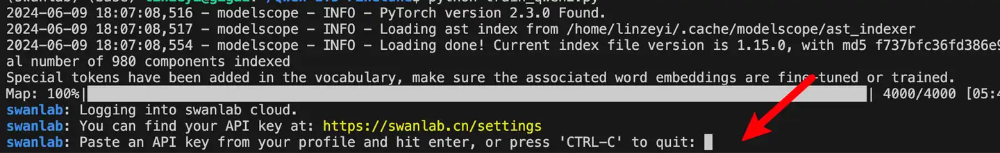

# UNet 医学影像分割

:::info
计算机视觉，医学影像，图像分割
:::


[](https://swanlab.cn/@ZeyiLin/Unet-Medical-Segmentation/runs/67konj7kdqhnfdmusy2u6/chart)

[训练过程](https://swanlab.cn/@ZeyiLin/Unet-Medical-Segmentation/runs/67konj7kdqhnfdmusy2u6/chart)

UNet是一种基于卷积神经网络（CNN）的医学影像分割模型，由Ronneberger等人于2015年提出。本文我们将简要介绍基于PyTorch框架，使用UNet模型在脑瘤医学影像分割数据集上进行训练，同时通过SwanLab监控训练过程，实现对病灶区域或器官结构的智能定位。


- 代码：完整代码直接看本文第5节 或 [Github](https://github.com/Zeyi-Lin/UNet-Medical)
- 实验日志过程：[Unet-Medical-Segmentation - SwanLab](https://swanlab.cn/@ZeyiLin/Unet-Medical-Segmentation/runs/67konj7kdqhnfdmusy2u6/chart)
- 模型：UNet（Pytorch代码直接写）
- 数据集：[brain-tumor-image-dataset-semantic-segmentation - Kagggle](https://www.kaggle.com/datasets/pkdarabi/brain-tumor-image-dataset-semantic-segmentation)
- SwanLab：[https://swanlab.cn](https://swanlab.cn)


---

## 1. 环境配置

环境配置分为三步：

1. 确保你的电脑上至少有一张英伟达显卡，并已安装好了CUDA环境。
2. 安装Python（版本>=3.8）以及能够调用CUDA加速的PyTorch。
3. 安装UNet微调相关的第三方库，可以使用以下命令：

```bash
git clone https://github.com/Zeyi-Lin/UNet-Medical.git
cd UNet-Medical
pip install -r requirements.txt
```

## 2. 准备数据集

本节使用的是 [脑瘤图像分割](https://www.kaggle.com/datasets/pkdarabi/brain-tumor-image-dataset-semantic-segmentation) 数据集，该数据集主要用于医学影像分割任务。

> ​​数据集介绍​​：Brain Tumor Segmentation Dataset 是专用于医学图像语义分割的数据集，旨在精准识别脑肿瘤区域。该数据集包含两类标注（肿瘤/非肿瘤），通过像素级分类实现肿瘤区域的细粒度分割，适用于训练和评估医学影像分割模型，为脑肿瘤诊断提供自动化分析支持。


在本节的任务中，我们主要是将数据集下载下来并解压，以供后续的训练。

**下载数据集并解压：**

```bash
python download.py
unzip dataset/Brain_Tumor_Image_DataSet.zip -d dataset/
```

完成上述步骤后，你应该可以根目录下看到这样的文件夹：


文件夹中包含训练集、验证集和测试集，里面有图像文件（`jpg`格式）和标注文件（`json`格式）。至此，我们完成了数据集的准备。

下面是一些细节的代码展示，然后你想马上训练起来，可以直接跳到第五节。


## 3. 模型代码

这里我们使用PyTorch来写UNet模型（在`net.py`中）。代码展示如下：

```python
import torch
import torch.nn as nn

# 定义U-Net模型的下采样块
class DownBlock(nn.Module):
    def __init__(self, in_channels, out_channels, dropout_prob=0, max_pooling=True):
        super(DownBlock, self).__init__()
        self.conv1 = nn.Conv2d(in_channels, out_channels, 3, padding=1)
        self.conv2 = nn.Conv2d(out_channels, out_channels, 3, padding=1)
        self.relu = nn.ReLU(inplace=True)
        self.maxpool = nn.MaxPool2d(2) if max_pooling else None
        self.dropout = nn.Dropout(dropout_prob) if dropout_prob > 0 else None

    def forward(self, x):
        x = self.relu(self.conv1(x))
        x = self.relu(self.conv2(x))
        if self.dropout:
            x = self.dropout(x)
        skip = x
        if self.maxpool:
            x = self.maxpool(x)
        return x, skip

# 定义U-Net模型的上采样块
class UpBlock(nn.Module):
    def __init__(self, in_channels, out_channels):
        super(UpBlock, self).__init__()
        self.up = nn.ConvTranspose2d(in_channels, out_channels, kernel_size=2, stride=2)
        self.conv1 = nn.Conv2d(out_channels * 2, out_channels, 3, padding=1)
        self.conv2 = nn.Conv2d(out_channels, out_channels, 3, padding=1)
        self.relu = nn.ReLU(inplace=True)

    def forward(self, x, skip):
        x = self.up(x)
        x = torch.cat([x, skip], dim=1)
        x = self.relu(self.conv1(x))
        x = self.relu(self.conv2(x))
        return x

# 定义完整的U-Net模型
class UNet(nn.Module):
    def __init__(self, n_channels=3, n_classes=1, n_filters=32):
        super(UNet, self).__init__()
        
        # 编码器路径
        self.down1 = DownBlock(n_channels, n_filters)
        self.down2 = DownBlock(n_filters, n_filters * 2)
        self.down3 = DownBlock(n_filters * 2, n_filters * 4)
        self.down4 = DownBlock(n_filters * 4, n_filters * 8)
        self.down5 = DownBlock(n_filters * 8, n_filters * 16)
        
        # 瓶颈层 - 移除最后的maxpooling
        self.bottleneck = DownBlock(n_filters * 16, n_filters * 32, dropout_prob=0.4, max_pooling=False)
        
        # 解码器路径
        self.up1 = UpBlock(n_filters * 32, n_filters * 16)
        self.up2 = UpBlock(n_filters * 16, n_filters * 8)
        self.up3 = UpBlock(n_filters * 8, n_filters * 4)
        self.up4 = UpBlock(n_filters * 4, n_filters * 2)
        self.up5 = UpBlock(n_filters * 2, n_filters)
        
        # 输出层
        self.outc = nn.Conv2d(n_filters, n_classes, 1)
        self.sigmoid = nn.Sigmoid()

    def forward(self, x):
        # 编码器路径
        x1, skip1 = self.down1(x)      # 128
        x2, skip2 = self.down2(x1)     # 64
        x3, skip3 = self.down3(x2)     # 32
        x4, skip4 = self.down4(x3)     # 16
        x5, skip5 = self.down5(x4)     # 8
        
        # 瓶颈层
        x6, skip6 = self.bottleneck(x5)  # 8 (无下采样)
        
        # 解码器路径
        x = self.up1(x6, skip5)    # 16
        x = self.up2(x, skip4)     # 32
        x = self.up3(x, skip3)     # 64
        x = self.up4(x, skip2)     # 128
        x = self.up5(x, skip1)     # 256
        
        x = self.outc(x)
        x = self.sigmoid(x)
        return x
```

该模型保存为`pth`文件，大约需要124MB。

## 4. 使用SwanLab跟踪实验

[SwanLab](https://github.com/swanhubx/swanlab) 是一个开源的模型训练记录工具。SwanLab面向AI研究者，提供了训练可视化、自动日志记录、超参数记录、实验对比、多人协同等功能。在SwanLab上，研究者能基于直观的可视化图表发现训练问题，对比多个实验找到研究灵感，并通过在线链接的分享与基于组织的多人协同训练，打破团队沟通的壁垒。

<video controls src="../guide_cloud/general/what_is_swanlab/demo.mp4"></video>

在本次训练中，我们设置swanlab的项目为`Unet-Medical-Segmentation`，实验名称为`bs32-epoch40`，并设置超参数如下：

```python
swanlab.init(
    project="Unet-Medical-Segmentation",
    experiment_name="bs32-epoch40",
    config={
        "batch_size": 32,
        "learning_rate": 1e-4,
        "num_epochs": 40,
        "device": "cuda" if torch.cuda.is_available() else "cpu",
    },
)
```

可以看到，这次训练的batch_size为32，学习率为1e-4，训练40个epoch。

首次使用SwanLab，需要先在[官网](https://swanlab.cn)注册一个账号，然后在用户设置页面复制你的API Key，然后在训练开始提示登录时粘贴即可，后续无需再次登录：




## 5. 开始训练

查看可视化训练过程：<a href="https://swanlab.cn/@ZeyiLin/Unet-Medical-Segmentation/runs/67konj7kdqhnfdmusy2u6/chart" target="_blank">Unet-Medical-Segmentation</a>

**本节代码做了以下几件事：**
1. 加载UNet模型
2. 加载数据集，分为训练集、验证集和测试集，数据处理为Resize为 (256, 256)和 Normalization 
3. 使用SwanLab记录训练过程，包括超参数、指标和最终的模型输出结果
4. 训练40个epoch
5. 生成最后的预测图像

开始执行代码时的目录结构应该是：

```
|———— dataset/
|———————— train/
|———————— val/
|———————— test/
|———— readme_files/
|———— train.py
|———— data.py
|———— net.py
|———— download.py
|———— requirements.txt
```

**完整代码如下**

train.py：

```python
import torch
import torch.nn as nn
import torch.optim as optim
import matplotlib.pyplot as plt
from pycocotools.coco import COCO
from torch.utils.data import DataLoader
import torchvision.transforms as transforms
import random
import swanlab
from net import UNet
from data import COCOSegmentationDataset


# 数据路径设置
train_dir = './dataset/train'
val_dir = './dataset/valid'
test_dir = './dataset/test'

train_annotation_file = './dataset/train/_annotations.coco.json'
test_annotation_file = './dataset/test/_annotations.coco.json'
val_annotation_file = './dataset/valid/_annotations.coco.json'

# 加载COCO数据集
train_coco = COCO(train_annotation_file)
val_coco = COCO(val_annotation_file)
test_coco = COCO(test_annotation_file)

# 定义损失函数
def dice_loss(pred, target, smooth=1e-6):
    pred_flat = pred.view(-1)
    target_flat = target.view(-1)
    intersection = (pred_flat * target_flat).sum()
    return 1 - ((2. * intersection + smooth) / (pred_flat.sum() + target_flat.sum() + smooth))

def combined_loss(pred, target):
    dice = dice_loss(pred, target)
    bce = nn.BCELoss()(pred, target)
    return 0.6 * dice + 0.4 * bce

# 训练函数
def train_model(model, train_loader, val_loader, criterion, optimizer, num_epochs, device):
    best_val_loss = float('inf')
    patience = 8
    patience_counter = 0

    for epoch in range(num_epochs):
        model.train()
        train_loss = 0
        train_acc = 0
        
        for images, masks in train_loader:
            images, masks = images.to(device), masks.to(device)
            
            optimizer.zero_grad()
            outputs = model(images)
            loss = criterion(outputs, masks)
            
            loss.backward()
            optimizer.step()
            
            train_loss += loss.item()
            train_acc += (outputs.round() == masks).float().mean().item()

        train_loss /= len(train_loader)
        train_acc /= len(train_loader)
        
        # 验证
        model.eval()
        val_loss = 0
        val_acc = 0
        
        with torch.no_grad():
            for images, masks in val_loader:
                images, masks = images.to(device), masks.to(device)
                outputs = model(images)
                loss = criterion(outputs, masks)
                
                val_loss += loss.item()
                val_acc += (outputs.round() == masks).float().mean().item()
        
        val_loss /= len(val_loader)
        val_acc /= len(val_loader)
        
        swanlab.log(
            {
                "train/loss": train_loss,
                "train/acc": train_acc,
                "train/epoch": epoch+1,
                "val/loss": val_loss,
                "val/acc": val_acc,
            },
            step=epoch+1)
        
        print(f'Epoch {epoch+1}/{num_epochs}:')
        print(f'Train Loss: {train_loss:.4f}, Train Acc: {train_acc:.4f}')
        print(f'Val Loss: {val_loss:.4f}, Val Acc: {val_acc:.4f}')
        
        # 早停
        if val_loss < best_val_loss:
            best_val_loss = val_loss
            patience_counter = 0
            torch.save(model.state_dict(), 'best_model.pth')
        else:
            patience_counter += 1
            if patience_counter >= patience:
                print("Early stopping triggered")
                break

def main():
    swanlab.init(
        project="Unet-Medical-Segmentation",
        experiment_name="bs32-epoch40",
        config={
            "batch_size": 32,
            "learning_rate": 1e-4,
            "num_epochs": 40,
            "device": "cuda" if torch.cuda.is_available() else "cpu",
        },
    )
    
    # 设置设备
    device = torch.device(swanlab.config["device"])
    
    # 数据预处理
    transform = transforms.Compose([
        transforms.ToTensor(),
        transforms.Resize((256, 256)),
        transforms.Normalize(mean=[0.485, 0.456, 0.406], std=[0.229, 0.224, 0.225])
    ])
    
    # 创建数据集
    train_dataset = COCOSegmentationDataset(train_coco, train_dir, transform=transform)
    val_dataset = COCOSegmentationDataset(val_coco, val_dir, transform=transform)
    test_dataset = COCOSegmentationDataset(test_coco, test_dir, transform=transform)
    
    # 创建数据加载器
    BATCH_SIZE = swanlab.config["batch_size"]
    train_loader = DataLoader(train_dataset, batch_size=BATCH_SIZE, shuffle=True)
    val_loader = DataLoader(val_dataset, batch_size=BATCH_SIZE)
    test_loader = DataLoader(test_dataset, batch_size=BATCH_SIZE)
    
    # 初始化模型
    model = UNet(n_filters=32).to(device)
    
    # 设置优化器和学习率
    optimizer = optim.Adam(model.parameters(), lr=swanlab.config["learning_rate"])
    
    # 训练模型
    train_model(
        model=model,
        train_loader=train_loader,
        val_loader=val_loader,
        criterion=combined_loss,
        optimizer=optimizer,
        num_epochs=swanlab.config["num_epochs"],
        device=device,
    )
    
    # 在测试集上评估
    model.eval()
    test_loss = 0
    test_acc = 0
    
    with torch.no_grad():
        for images, masks in test_loader:
            images, masks = images.to(device), masks.to(device)
            outputs = model(images)
            loss = combined_loss(outputs, masks)
            test_loss += loss.item()
            test_acc += (outputs.round() == masks).float().mean().item()
    
    test_loss /= len(test_loader)
    test_acc /= len(test_loader)
    print(f"Test Loss: {test_loss:.4f}, Test Accuracy: {test_acc:.4f}")
    swanlab.log({"test/loss": test_loss, "test/acc": test_acc})
    
    # 可视化预测结果
    visualize_predictions(model, test_loader, device, num_samples=10)
    

def visualize_predictions(model, test_loader, device, num_samples=5, threshold=0.5):
    model.eval()
    with torch.no_grad():
        # 获取一个批次的数据
        images, masks = next(iter(test_loader))
        images, masks = images.to(device), masks.to(device)
        predictions = model(images)
        
        # 将预测结果转换为二值掩码
        binary_predictions = (predictions > threshold).float()
        
        # 选择前3个样本
        indices = random.sample(range(len(images)), min(num_samples, len(images)))
        indices = indices[:8]
        
        # 创建一个大图
        plt.figure(figsize=(15, 8))  # 调整图像大小以适应新增的行
        plt.suptitle(f'Epoch {swanlab.config["num_epochs"]} Predictions (Random 6 samples)')
        
        for i, idx in enumerate(indices):
            # 原始图像
            plt.subplot(4, 8, i*4 + 1)  # 4行而不是3行
            img = images[idx].cpu().numpy().transpose(1, 2, 0)
            img = (img * [0.229, 0.224, 0.225] + [0.485, 0.456, 0.406]).clip(0, 1)
            plt.imshow(img)
            plt.title('Original Image')
            plt.axis('off')
            
            # 真实掩码
            plt.subplot(4, 8, i*4 + 2)
            plt.imshow(masks[idx].cpu().squeeze(), cmap='gray')
            plt.title('True Mask')
            plt.axis('off')
            
            # 预测掩码
            plt.subplot(4, 8, i*4 + 3)
            plt.imshow(binary_predictions[idx].cpu().squeeze(), cmap='gray')
            plt.title('Predicted Mask')
            plt.axis('off')

            # 新增：预测掩码叠加在原图上
            plt.subplot(4, 8, i*4 + 4)
            plt.imshow(img)  # 先显示原图
            # 添加红色半透明掩码
            plt.imshow(binary_predictions[idx].cpu().squeeze(), 
                      cmap='Reds', alpha=0.3)  # alpha控制透明度
            plt.title('Overlay')
            plt.axis('off')
        
        # 记录图像到SwanLab
        swanlab.log({"predictions": swanlab.Image(plt)})

if __name__ == '__main__':
    main()
```


**运行训练**

```bash
python train.py
```

看到下面的输出即代表训练开始：


## 6. 训练结果演示

详细训练过程请看这里：<a href="https://swanlab.cn/@ZeyiLin/Unet-Medical-Segmentation/runs/67konj7kdqhnfdmusy2u6/chart" target="_blank">Unet-Medical-Segmentation</a>


从SwanLab图表中我们可以看到，train loss和val loss随epoch呈现下降趋势，而train acc和val acc随epoch呈现上升趋势。最终的test acc可以达到 97.93%。

在`prediction`图表中记录着模型最终的测试集图像预测结果，可以看到模型分割的结果还是相对不错的：


当然，这教程主要的目标是帮助大家入门医学影像分割训练，所以没有使用更加复杂的模型结构和数据增强策略，感兴趣的同学可以基于本文的代码进行改变和实验，欢迎在[SwanLab基线社区](https://swanlab.cn/benchmarks)上展示你的结果和过程！


## 7. 模型推理

加载训练好的模型`best_model.pth`，并进行推理：

```bash
python predict.py
```

predict.py代码：

```python
import torch
import torchvision.transforms as transforms
from PIL import Image
import matplotlib.pyplot as plt
from net import UNet
import numpy as np
import os

def load_model(model_path='best_model.pth', device='cuda'):
    """加载训练好的模型"""
    try:
        # 检查文件是否存在
        if not os.path.exists(model_path):
            raise FileNotFoundError(f"Model file not found at {model_path}")
            
        model = UNet(n_filters=32).to(device)
        # 添加weights_only=True来避免警告
        state_dict = torch.load(model_path, map_location=device, weights_only=True)
        model.load_state_dict(state_dict)
        model.eval()
        print(f"Model loaded successfully from {model_path}")
        return model
    except Exception as e:
        print(f"Error loading model: {str(e)}")
        raise

def preprocess_image(image_path):
    """预处理输入图像"""
    # 读取原始图像
    image = Image.open(image_path).convert('RGB')
    
    # 保存调整大小后的原始图像用于显示
    display_image = image.resize((256, 256), Image.Resampling.BILINEAR)
    
    # 模型输入的预处理
    transform = transforms.Compose([
        transforms.ToTensor(),
        transforms.Resize((256, 256)),
        transforms.Normalize(mean=[0.485, 0.456, 0.406], std=[0.229, 0.224, 0.225])
    ])
    
    image_tensor = transform(image)
    return image_tensor.unsqueeze(0), display_image

def predict_mask(model, image_tensor, device='cuda', threshold=0.5):
    """预测分割掩码"""
    with torch.no_grad():
        image_tensor = image_tensor.to(device)
        prediction = model(image_tensor)
        prediction = (prediction > threshold).float()
    return prediction

def visualize_result(original_image, predicted_mask):
    """可视化预测结果"""
    plt.figure(figsize=(12, 6))
    plt.suptitle('Predictions')
    
    # 显示原始图像
    plt.subplot(131)
    plt.imshow(original_image)
    plt.title('Original Image')
    plt.axis('off')
    
    # 显示预测掩码
    plt.subplot(132)
    plt.imshow(predicted_mask.squeeze(), cmap='gray')
    plt.title('Predicted Mask')
    plt.axis('off')
    
    # 显示叠加结果
    plt.subplot(133)
    plt.imshow(np.array(original_image))  # 转换为numpy数组
    plt.imshow(predicted_mask.squeeze(), cmap='Reds', alpha=0.3)
    plt.title('Overlay')
    plt.axis('off')
        
    plt.tight_layout()
    plt.savefig('./predictions.png')
    print("Visualization saved as predictions.png")

def main():
    # 设置设备
    device = torch.device("cuda" if torch.cuda.is_available() else "cpu")
    print(f"Using device: {device}")
    
    try:
        # 加载模型
        model_path = "/Users/zeyilin/Desktop/Coding/UNet-Medical/best_model.pth"  # 确保这个路径是正确的
        print(f"Attempting to load model from: {model_path}")
        model = load_model(model_path, device)
        
        # 处理单张图像
        image_path = "dataset/test/27_jpg.rf.b2a2b9811786cc32a23c46c560f04d07.jpg"
        if not os.path.exists(image_path):
            raise FileNotFoundError(f"Image file not found at {image_path}")
            
        print(f"Processing image: {image_path}")
        image_tensor, original_image = preprocess_image(image_path)
        
        # 预测
        predicted_mask = predict_mask(model, image_tensor, device)
        
        # 将预测结果转回CPU并转换为numpy数组
        predicted_mask = predicted_mask.cpu().numpy()
        
        # 可视化结果
        print("Generating visualization...")
        visualize_result(original_image, predicted_mask)
        print("Results saved to predictions.png")
        
    except Exception as e:
        print(f"Error during prediction: {str(e)}")
        raise

if __name__ == '__main__':
    main()
```


## 补充

### 详细硬件配置和参数说明

我使用了1张英伟达 vGPU-32GB 显卡，训练40个epoch，用时13分钟22秒。


显存占用情况为`6.124GB`，即只要你的显卡显存大于6GB，就可以跑这个任务。如果想要进一步降低显存要求，可以调低batch size。


---

## 参考

- 代码：完整代码直接看本文第5节 或 [Github](https://github.com/Zeyi-Lin/UNet-Medical)
- 实验日志过程：[Unet-Medical-Segmentation - SwanLab](https://swanlab.cn/@ZeyiLin/Unet-Medical-Segmentation/runs/67konj7kdqhnfdmusy2u6/chart)
- 模型：UNet（Pytorch代码直接写）
- 数据集：[brain-tumor-image-dataset-semantic-segmentation - Kagggle](https://www.kaggle.com/datasets/pkdarabi/brain-tumor-image-dataset-semantic-segmentation)
- SwanLab：[https://swanlab.cn](https://swanlab.cn)
