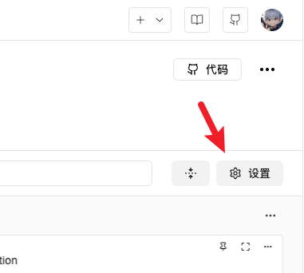
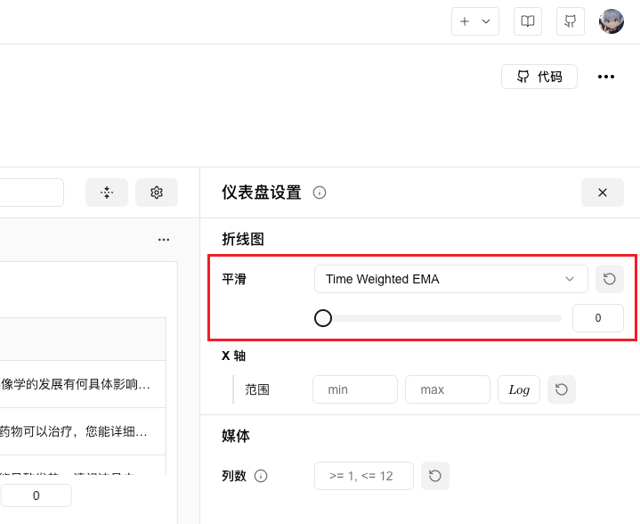

# FAQ

## 登录时，API Key为什么输入不进去？

见此回答：[链接](https://www.zhihu.com/question/720308649/answer/25076837539)


## 如何从一个脚本启动多个实验？

在多次创建实验之间增加`swanlab.finish()`即可。

执行了`swanlab.finish()`之后，再次执行`swanlab.init()`就会创建新的实验；  
如果不执行`swanlab.finish()`的情况下，再次执行`swanlab.init()`，将无视此次执行。

## 如何将数据上传到私有化部署的SwanLab?

有两种方法可以做到这一点：

::: code-group

```python [方法一]
swanlab.login(api_key='你的API Key', host='你的私有化部署IP地址')
```

```bash [方法二]
swanlab login --host 你的私有化部署IP地址 --api-key 你的API Key
```

完成登录后，就可以将数据指定上传到私有化部署的SwanLab了。

:::


## 如何在训练时关闭swanlab记录（Debug调试）？

将`swanlab.init`的`mode`参数设置为disabled，就可以不创建实验以及不写入数据。

```python
swanlab.init(mode='disabled')
```

## 在同一台机器上，有多个人都在使用SwanLab，应该如何配置？

`swanlab.login`登录完成之后，会在该机器上生成一个配置文件记录登录信息，以便下次不用重复登录。但如果有多人使用这一台机器的话，则需要小心日志传递到对方账号上。

**推荐的配置方式有两种：**

**方式一(推荐)**：在代码开头加上`swanlab.login(api_key='你的API Key')`，这样不会将登录配置文件写入到本地，[文档](/api/py-login)

**方式二**：在运行代码前，设置环境变量`SWANLAB_API_KEY="你的API Key"`


## 本地的训练已经结束，但SwanLab UI上仍然在运行中，要怎么改变状态？

点击实验名旁边的终止按钮，会将实验状态从“进行中”转为“中断”，并停止接收数据的上传。


## 如何查看折线图的局部细节？

放大折线图，长按鼠标划过目标的区域，即可放大查看该区域。


## 内部指标名

指标名称是指`swanlab.log()`传入字典的key部分。有一部分key在内部被SwanLab用于传递系统硬件指标，所以不太建议使用。

内部指标包括：

- `__swanlab__.xxx`

## 实验状态规则

实验一共分为三种状态：完成、运行中与中断。

- **完成**：训练进程自然结束，或手动执行了`swanlab.finish()`。
- **运行中**：训练进程正在运行，且没有执行`swanlab.finish()`。
- **中断**：训练进程因为Bug、机器关闭、`Ctrl+C`等异常中断。

有些用户会遇到这样的情况：为什么我的训练进程好像还在进行中，但是SwanLab图表上显示中断？

这是因为SwanLab判定中断有一条隐藏规则，如果训练进程在15分钟以内没有任何日志上传（包含自动收集的系统指标），则判定为中断，这是为了避免训练进程被意外Kill后，无法触达SwanLab SDK中的状态上传逻辑，导致实验永远处于“运行中”状态。

所以如果你的机器出现了网络问题，且时间大于15分钟，就会导致实验状态显示为“中断”。

## 命令行记录与截断

SwanLab会记录`swanlab.init()`之后进程中的标准输出流，可以在实验的「日志」选项卡查看。如果一行的命令行输出过长，会被截断，目前的默认限制是`1024`个字符，最大限制是`4096`个字符。

如果你想修改限制，可以使用下面的代码进行修改：

```python
import swanlab

# 创建新的设置对象，修改max_log_length参数
new_settings = swanlab.Settings(
    max_log_length=4096,
)

# 更新全局设置
swanlab.merge_settings(new_settings)

swanlab.init()
...
```

## 如何开启实验平滑

找到实验页面的右上角，点击「设置」按钮：



在右侧拉出的菜单中，找到「平滑」选项，拉动滑动条即可开启平滑：

