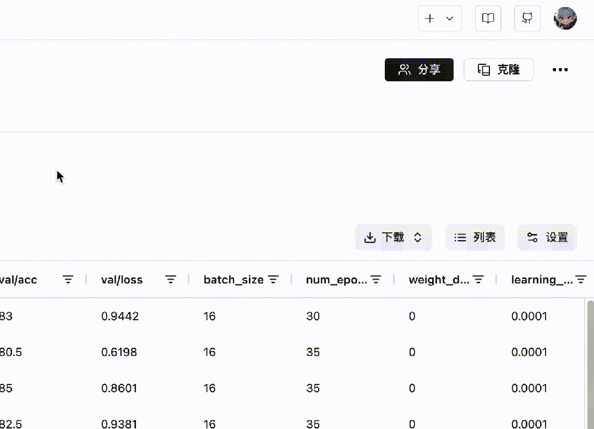
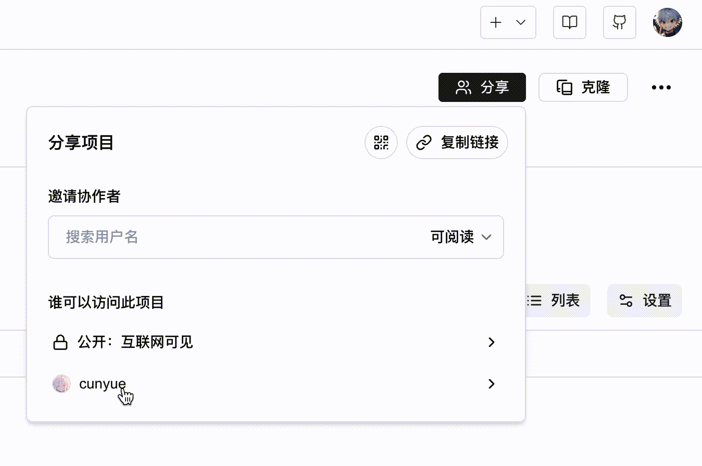

# 添加项目协作者

SwanLab支持添加项目协作者，方便团队成员之间协作。

> 每个项目可添加最多10名协作者

## 添加协作者

**添加流程如下：**

1. 在项目的「概览」页，右上角有一个「分享」按钮
2. 点击按钮后，可以通过用户名搜索你的团队成员
3. 选择成员，设置权限后点击黑色的「+」按钮，即可完成协作者的添加



## 协作者权限

| 权限 | 可阅读 | 可开发 | 可管理 |
| --- | --- | --- | --- |
| 查看实验 | ✅ | ✅ | ✅ |
| 查看概览 | ✅ | ✅ | ✅ |
| 查看图表对比视图 | ✅ | ✅ | ✅ |
| 创建新实验 | ❌ | ✅ | ✅ |
| 编辑实验信息 | ❌ | ✅ | ✅ |
| 删除实验 | ❌ | ✅ | ✅ |
| 修改项目信息 | ❌ | ❌ | ✅ |
| 删除项目 | ❌ | ❌ | ✅ |
| 设置协作者 | ❌ | ❌ | ✅ |

## 协作者在他人项目创建实验

假如你是项目`OpenVLA`的协作者（有可开发或可管理权限），该项目归属于用户`A`（username为`A`），你希望将实验创建到`OpenVLA`项目中，那么可以：

```python
swanlab.init(
    project="OpenVLA",
    workspace="A", 
)
```


## 移除协作者

在「分享」面板中，点击最下方的协作者设置，在里面点击「移除」按钮，在权限选择菜单中选择「移除」，即可移除该协作者。

