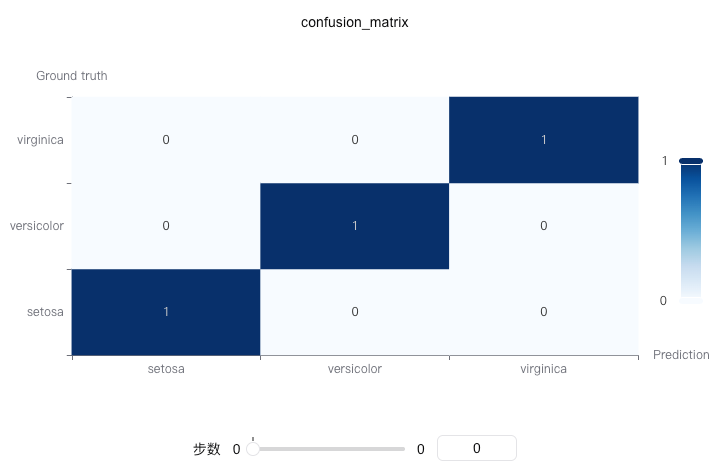

# 记录混淆矩阵

绘制混淆矩阵（Confusion Matrix），用于评估分类模型的性能。混淆矩阵展示了模型预测结果与真实标签之间的对应关系，能够直观地显示各类别的预测准确性和错误类型。

混淆矩阵是评估分类模型性能的基础工具，特别适用于多分类问题。

你可以使用`swanlab.confusion_matrix`来记录混淆矩阵。

[](https://swanlab.cn/@ZeyiLin/ComputeMetrics/runs/gvivixdwka8lyutdxt865/chart#NHFwdTEx-Uzk3bUJKMVY=)



### 基本用法

```python
from sklearn.datasets import load_iris
from sklearn.model_selection import train_test_split
import xgboost as xgb
import swanlab

# 加载鸢尾花数据集
iris_data = load_iris()
X = iris_data.data
y = iris_data.target
class_names = iris_data.target_names.tolist()

# 划分训练集和测试集
X_train, X_test, y_train, y_test = train_test_split(X, y, test_size=0.2, random_state=42)

# 训练模型
model = xgb.XGBClassifier(objective='multi:softmax', num_class=len(class_names))
model.fit(X_train, y_train)

# 获取预测结果
y_pred = model.predict(X_test)

# 初始化SwanLab
swanlab.init(project="Confusion-Matrix-Demo", experiment_name="Confusion-Matrix-Example")

# 记录混淆矩阵
swanlab.log({
    "confusion_matrix": swanlab.confusion_matrix(y_test, y_pred, class_names)
})

swanlab.finish()
```

### 使用自定义类别名称

```python
# 定义自定义类别名称
custom_class_names = ["类别A", "类别B", "类别C"]

# 记录混淆矩阵
confusion_matrix = swanlab.confusion_matrix(y_test, y_pred, custom_class_names)
swanlab.log({"confusion_matrix_custom": confusion_matrix})
```

### 不使用类别名称

```python
# 不指定类别名称，将使用数字索引
confusion_matrix = swanlab.confusion_matrix(y_test, y_pred)
swanlab.log({"confusion_matrix_default": confusion_matrix})
```


### 二分类示例

```python
import numpy as np
from sklearn.datasets import make_classification
from sklearn.model_selection import train_test_split
import xgboost as xgb
import swanlab

# 生成二分类数据
X, y = make_classification(n_samples=1000, n_features=20, n_informative=2, n_redundant=10, random_state=42)
X_train, X_test, y_train, y_test = train_test_split(X, y, test_size=0.3, random_state=42)

# 训练模型
model = xgb.XGBClassifier(use_label_encoder=False, eval_metric='logloss')
model.fit(X_train, y_train)

# 获取预测结果
y_pred = model.predict(X_test)

# 记录混淆矩阵
swanlab.log({
    "confusion_matrix": swanlab.confusion_matrix(y_test, y_pred, ["负类", "正类"])
})
```

### 注意事项

1. **数据格式**: `y_true`和`y_pred`可以是列表或numpy数组
2. **多分类支持**: 此函数支持二分类和多分类问题
3. **类别名称**: `class_names`的长度应该与类别数量一致
4. **依赖包**: 需要安装`scikit-learn`和`pyecharts`包
5. **坐标轴**: sklearn的confusion_matrix左上角为(0,0)，在pyecharts的heatmap中是左下角，函数会自动处理坐标转换
6. **矩阵解读**: 混淆矩阵中，行表示真实标签，列表示预测标签
