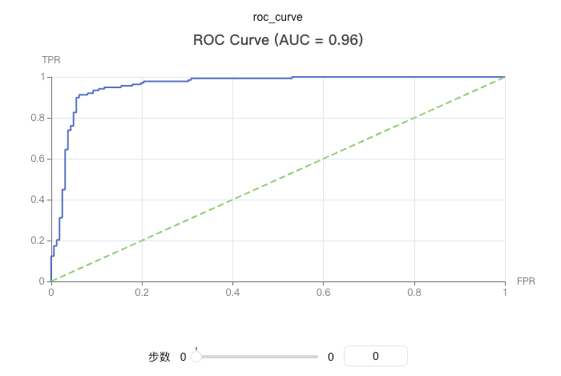

# 记录ROC曲线

绘制ROC（Receiver Operating Characteristic）曲线，用于评估二分类模型的性能。ROC曲线展示了在不同阈值下真正率（True Positive Rate）和假正率（False Positive Rate）的关系。

ROC曲线是评估分类模型性能的重要工具，能够直观地展示模型在不同决策阈值下的表现。

你可以使用`swanlab.roc_curve`来记录ROC曲线。

[](https://swanlab.cn/@ZeyiLin/ComputeMetrics/runs/gvivixdwka8lyutdxt865/chart#NHFwdTEx-Uzk3bUJKMVY=)



### 基本用法

```python
from sklearn.datasets import make_classification
from sklearn.model_selection import train_test_split
import xgboost as xgb
import swanlab

# 生成示例数据
X, y = make_classification(n_samples=1000, n_features=20, n_informative=2, n_redundant=10, random_state=42)
X_train, X_test, y_train, y_test = train_test_split(X, y, test_size=0.3, random_state=42)

# 训练模型
model = xgb.XGBClassifier(use_label_encoder=False, eval_metric='logloss')
model.fit(X_train, y_train)

# 获取预测概率
y_pred_proba = model.predict_proba(X_test)[:, 1]

# 初始化SwanLab
swanlab.init(project="ROC-Curve-Demo", experiment_name="ROC-Curve-Example")

# 记录ROC曲线
swanlab.log({
    "roc_curve": swanlab.roc_curve(y_test, y_pred_proba, title=True)
})

swanlab.finish()
```

### 自定义标题

```python
# 不显示标题(默认)
roc_curve = swanlab.roc_curve(y_test, y_pred_proba, title=False)
swanlab.log({"roc_curve_no_title": roc_curve})

# 显示标题
roc_curve = swanlab.roc_curve(y_test, y_pred_proba, title=True)
swanlab.log({"roc_curve_with_title": roc_curve})

# 自定义标题
roc_curve = swanlab.roc_curve(y_test, y_pred_proba, title="demo")
swanlab.log({"roc_curve_with_custom_title": roc_curve})
```

### 与其他指标一起使用

```python
import swanlab

# 记录多个ML指标
swanlab.log({
    "roc_curve": swanlab.roc_curve(y_test, y_pred_proba),
    "pr_curve": swanlab.pr_curve(y_test, y_pred_proba),
    "accuracy": accuracy_score(y_test, y_pred),
    "f1_score": f1_score(y_test, y_pred)
})
```

### 注意事项

1. **数据格式**: `y_true`和`y_pred_proba`可以是列表或numpy数组
2. **二分类**: 此函数专用于二分类问题
3. **概率值**: `y_pred_proba`应该是模型对正类的预测概率，范围在0-1之间
4. **依赖包**: 需要安装`scikit-learn`和`pyecharts`包
5. **AUC计算**: 函数会自动计算ROC曲线下的面积（AUC），但不会在标题中显示
6. **曲线特征**: ROC曲线从(0,0)开始，到(1,1)结束，对角线表示随机分类器的性能
