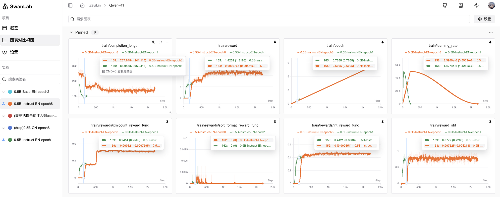
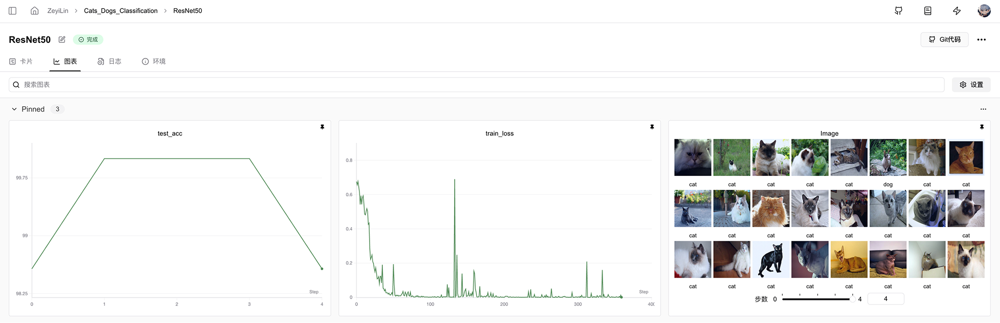

# 创建一个实验

使用 **SwanLab Python SDK** 跟踪人工智能实验，然后你可以在 在线交互式仪表板 中查看结果。  



本节将介绍如何创建一个SwanLab实验。

## 如何创建一个SwanLab实验?

创建一个SwanLab实验分为3步：
1. 初始化SwanLab
2. 传递一个超参数字典
3. 在你的训练循环中记录指标

### 1. 初始化SwanLab

`swanlab.init()`的作用是初始化一个SwanLab实验，它将启动后台进程以同步和记录数据。  
下面的代码片段展示了如何创建一个名为 **cat-dog-classification** 的新SwanLab项目。并为其添加了：

1. **project**：项目名。
1. **experiment_name**：实验名。实验名为当前实验的标识，以帮助您识别此实验。  
2. **description**：描述。描述是对实验的详细介绍。

```python
# 导入SwanLab Python库
import swanlab

# 1. 开启一个SwanLab实验
run = swanlab.init(
    project="cat-dog-classification",
    experiment_name="Resnet50",
    description="我的第一个人工智能实验",
)
```

当你初始化SwanLab时，`swanlab.init()`将返回一个对象。  
此外，SwanLab会创建一个本地目录（默认名称为“swanlog”），所有日志和文件都保存在其中，并异步传输到 SwanLab 服务器。（该目录也可以被`swanlab watch -l [logdir]`命令打开本地实验看板。）

::: info
**注意**：如果调用 `swanlab.init` 时该项目已存在，则实验会添加到预先存在的项目中。  
例如，如果您已经有一个名为`"cat-dog-classification"`的项目，那么新的实验会添加到该项目中。
:::

<br>

### 2. 传递超参数字典

传递超参数字典，例如学习率或模型类型。  
你在`config`中传入的字典将被保存并用于后续的实验对比与结果查询。

```python
# 2. 传递一个超参数字典
swanlab.config={"epochs": 20, "learning_rate": 1e-4, "batch_size": 32, "model_type": "CNN"}
```

有关如何配置实验的更多信息，请参阅[设置实验配置](/guide_cloud/experiment_track/set-experiment-config.md)。

<br>

### 3. 在训练循环中记录指标
在每轮for循环（epoch）中计算准确率与损失值指标，并用`swanlab.log()`将它们记录到SwanLab中。  
在默认情况下，当您调用`swanlab.log`时，它会创建一个新的step添加到对应指标的历史数据中，规则是新的step=旧的最大step数+1。  
下面的代码示例展示了如何用`swanlab.log()`记录指标：  

```python
# 省略了如何设置模型与如何设置数据集的细节

# 设置模型和数据集
model, dataloader = get_model(), get_data()

# 训练循环
for epoch in range(swanlab.config.epochs):
    for batch in dataloader:
        loss, acc = model.train_step()
        # 3. 在你的训练循环中记录指标，用于在仪表盘中进行可视化
        swanlab.log({"acc": acc, "loss": loss})
```

<br>

### 完整代码

包含上述代码片段的完整脚本如下：

```python
# 导入SwanLab Python库
import swanlab

# 1. 开启一个SwanLab实验
run = swanlab.init(
    project="cat-dog-classification",
    experiment_name="Resnet50",
    description="我的第一个人工智能实验",
)

# 2. 传递一个超参数字典
swanlab.config={"epochs": 20, "learning_rate": 1e-4, "batch_size": 32, "model_type": "CNN"}

# 省略了如何设置模型与如何设置数据集的细节
# 设置模型和数据集
model, dataloader = get_model(), get_data()

# 训练循环
for epoch in range(swanlab.config.epochs):
    for batch in dataloader:
        loss, acc = model.train_step()
        # 3. 在你的训练循环中记录指标，用于在仪表盘中进行可视化
        swanlab.log({"acc": acc, "loss": loss})
```

<br>

### 可视化你的实验

使用SwanLab仪表盘作为管理和可视化人工智能模型结果的一站式节点。  
可以可视化丰富的交互式图表，例如折线图、图像图表、音频图表、3D点云图表等。  
有关如何查看实验更多信息，请参阅[查看实验结果](/guide_cloud/experiment_track/view-result.md)。




## 最佳实践

下面介绍一下创建实验时可以参考的写法，一个完整的实验创建可以包含下面这四个参数：  
- `config`：配置。记录你想要用于复现模型的任何内容，比如超参数、模型名称、数据集等。这些内容将显示在仪表盘的“表格视图”与“实验卡片”页中，也可以作为实验比较、筛选、过滤的依据。
- `project`：项目。项目是一组可以一起比较的实验，它们将在一个统一的仪表盘中显示。
- `experiment_name`：实验名。定义实验的名称。您在脚本中设置，可以之后在SwanLab应用上编辑。
- `description`：描述。对实验的介绍文本，记录不同实验之间的差异和灵感。您在脚本中设置，可以之后在SwanLab应用上编辑。

以下代码片段展示了一个最佳实践案例：

```python
import swanlab

config = dict(
    learning_rate=1e-4, optimizer="Adam", architecture="Transformer", dataset_id="cats-dogs-2024"
)

swanlab.init(
    project="cats-dogs-classification",
    experiment_name="ViT-Adam-1e-4",
    description="基于ViT模型和1e-4学习率的Adam优化器的猫狗分类实验。",
    config=config,
)
```

关于创建SwanLab实验时更多可用参数的信息，请参阅API文档中的[swanlab.init](/api/py-init.md)文档。