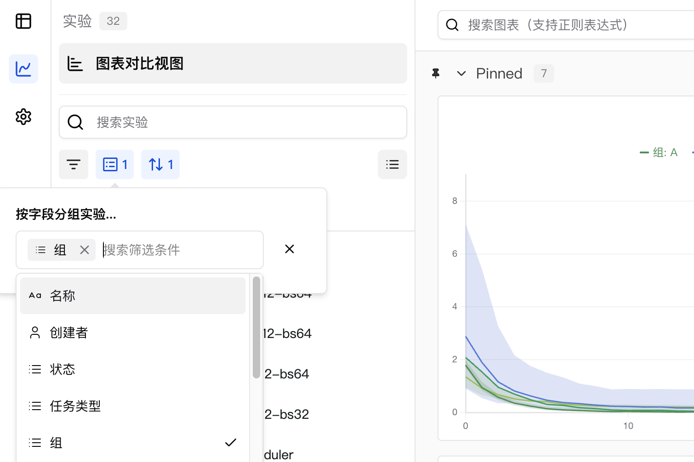

# 分组管理实验

> 将多个训练和评估实验组合成更大的实验。

通过将`group`参数传递给`swanlab.init`，可以设置新实验所在的分组。


## 使用场景

1. **分布式训练**：当实验被拆分成不同的部分，使用独立的训练和评估脚本，需要将它们作为一个整体查看时，可以使用分组功能。
2. **多进程实验**：将多个较小的进程组合成一个实验。
3. **K折交叉验证**：将具有不同随机种子的实验组合成一个完整的实验进行比较。

## 设置分组的方式

### 1. 在代码中设置分组

在初始化实验时传入 `group` 参数，即可将该次实验分配到对应的实验组，`job_type` 参数可用于标识该实验的任务类型（可选）：

```python
import swanlab

swanlab.init(
    experiment="my_experiment",
    group="experiment_1", # 相关的实验使用相同的 group 名称
    job_type="demo", # 训练任务
)
```

### 2. 通过环境变量设置分组

使用 `SWANLAB_GROUP` 环境变量来指定实验的分组：

```python
import os
import swanlab

# 使用 swanlab 内置的 ID 生成器创建唯一分组名称
os.environ["SWANLAB_GROUP"] = "experiment-1"

swanlab.init(experiment="my_experiment")
```

> 使用`SWANLAB_JOB_TYPE`环境变量来指定实验的任务类型。

### 3. 在界面中设置分组

SwanLab 支持按任意列对实验进行动态分组，包括隐藏的列。例如，如果使用 `swanlab.config` 记录了批次大小或学习率等超参数，可以直接在网页应用中按这些超参数进行动态分组。

> **注意**：实验列表中的 **分组** 列默认是隐藏的。

按一列或多列对实验进行分组：

1. 点击 **分组** 按钮。
2. 点击一列或多列的名称。



## 移动分组

### 1. 移动1个实验的分组

SwanLab 支持通过鼠标对实验的`组`这一列的点击，配置该实验的分组。

<video controls src="./grouping/move-grouping.mp4"></video>

### 2. 批量移动多个实验的分组

SwanLab 支持通过对实验的`组`这一列，执行快捷的批量移动操作。

<video controls src="./grouping/batch-move-grouping.mp4"></video>