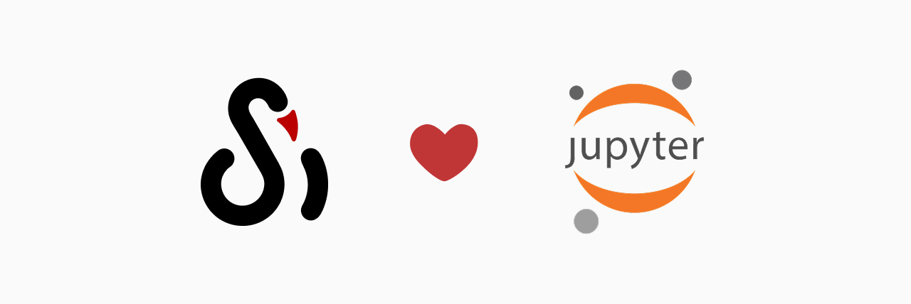

# 用 Notebook 跟踪实验

将 SwanLab 与 Jupyter 结合使用，无需离开Notebook即可获得交互式可视化效果。



## 在Notebook中安装SwanLab

```bash
!pip install swanlab -qqq
```

ps: `-qqq`是用来控制命令执行时的输出信息量的，可选。

## 在Notebook中登录Swanlab

`jupyter --execute`是 Jupyter 提供的命令行执行模式，常用于自动化、CI/CD 流水线、定时任务等场景。这些场景下，无人值守，不允许出现交互式输入（如 input()、手动粘贴密钥等），否则流程会卡住或报错。

环境变量让 API Key 自动注入 Notebook 执行环境，可确保 Notebook 在任何非交互式环境下都能顺利运行。因此需要通过[swanlab.login](/api/py-login.md)进行登录。

```python
import swanlab
import os

SWANLAB_API_KEY = os.getenv("SWANLAB_API_KEY")
swanlab.login(api_key=SWANLAB_API_KEY)
```

::: info

在 Kaggle 平台上应使用 [Kaggle Secrets](https://www.kaggle.com/discussions/product-feedback/114053) 存储 API key，可防止密钥泄露、简化管理、符合安全最佳实践，并确保 Notebook 可安全公开和协作。

```python
from kaggle_secrets import UserSecretsClient
user_secrets = UserSecretsClient()
SWANLAB_API_KEY = user_secrets.get_secret("SWANLAB_API_KEY")

import swanlab
swanlab.login(api_key=SWANLAB_API_KEY)
```

:::

## 在Notebok中与SwanLab交互

```python
import swanlab

swanlab.init()
...
# 在Notebook中，需要显式关闭实验
swanlab.finish()
```

在用`swanlab.init`初始化实验时，打印信息的最后会出现一个“Display SwanLab Dashboard”按钮：


点击该按钮，就会在Notebook中嵌入该实验的SwanLab网页：


现在，你可以在这个嵌入的网页中直接看到训练过程，以及和它交互。
