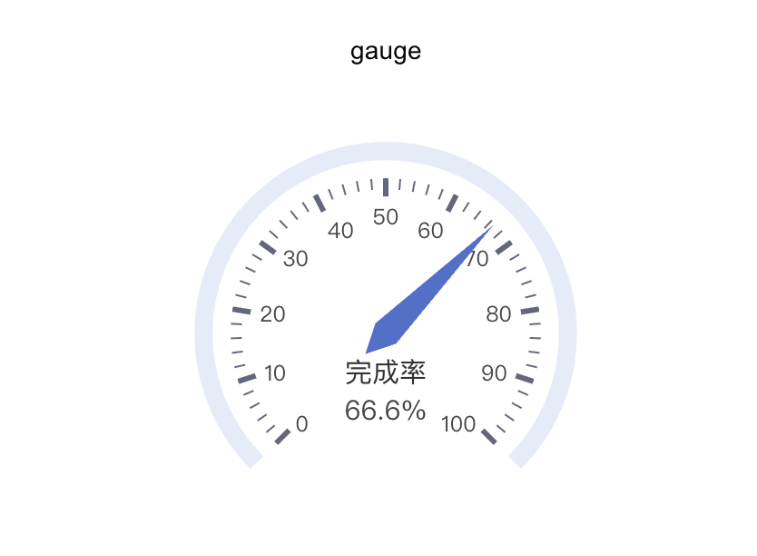

# 记录自定义图表

SwanLab 兼容 [pyecharts](https://pyecharts.org/#/zh-cn/intro) 的 API，可以方便地记录 pyecharts 的图表到 SwanLab，以呈现丰富的数据组织和图表展现形式。

**在线Demo点击下面的标签：**

[](https://swanlab.cn/@ZeyiLin/swanlab-echarts-demo/charts)

## 折线图 line


```python
import swanlab

swanlab.init(project="echarts-test")

# 定义数据
week_name_list = ["周一", "周二", "周三", "周四", "周五", "周六", "周日"]
high_temperature = [11, 11, 15, 13, 12, 13, 10]
low_temperature = [1, -2, 2, 5, 3, 2, 0]

# 创建echarts line对象
line = swanlab.echarts.Line()

# 设置line的轴
line.add_xaxis(week_name_list)
# 设置line的数据
line.add_yaxis("high_temperature", high_temperature)
line.add_yaxis("low_temperature", low_temperature)

# 记录到swanlab
swanlab.log({"line": line})
```

## 柱状图 bar


```python
import swanlab

swanlab.init(project="echarts-test")

# 定义数据
x = ["a", "b", "c"]
y = [1, 2, 3]

# 创建echarts bar对象
bar = swanlab.echarts.Bar()

# 设置x轴数据
bar.add_xaxis(x)
# 设置y轴数据
bar.add_yaxis("value", y)

# 记录到swanlab
swanlab.log({"bar": bar})
```

## 饼状图 pie


```python
import swanlab

swanlab.init(project="echarts-test")

# 定义数据
x_data = ["直接访问", "邮件营销", "联盟广告", "视频广告", "搜索引擎"]
y_data = [335, 310, 274, 235, 400]

# 组合数据
data_pair = [list(z) for z in zip(x_data, y_data)]
data_pair.sort(key=lambda x: x[1])

# 创建echarts pie对象
pie = swanlab.echarts.Pie()

# 设置x轴数据并配置标签显示
pie.add(
    "访问来源", 
    data_pair,
    # 配置标签显示
    label_opts={
        "formatter": "{b}: {d}%",  # 显示百分比
        "position": "outside"  # 标签位置
    }
)

# 记录到swanlab
swanlab.log({"pie": pie})
```

## 热力图 heatmap


```python
import swanlab

swanlab.init(project="echarts-test")

# 定义数据
hours = ["12a", "1a", "2a", "3a", "4a", "5a", "6a", "7a", "8a", "9a", "10a", "11a", "12p", "1p", "2p", "3p", "4p", "5p", "6p", "7p", "8p", "9p", "10p", "11p"]

days = ["Saturday", "Friday", "Thursday", "Wednesday", "Tuesday", "Monday", "Sunday"]

data = [
    [0, 0, 5], [0, 1, 1], [0, 2, 0], [0, 3, 0], [0, 4, 0], [0, 5, 0], [0, 6, 0], [0, 7, 0], [0, 8, 0], [0, 9, 0], [0, 10, 0], [0, 11, 2], [0, 12, 4], [0, 13, 1], [0, 14, 1], [0, 15, 3], [0, 16, 4], [0, 17, 6], [0, 18, 4], [0, 19, 4], [0, 20, 3], [0, 21, 3], [0, 22, 2], [0, 23, 5],
    [1, 0, 7],[1, 1, 0],[1, 2, 0],[1, 3, 0],[1, 4, 0],[1, 5, 0],[1, 6, 0],[1, 7, 0],[1, 8, 0],[1, 9, 0],[1, 10, 5],[1, 11, 2],[1, 12, 2],[1, 13, 6],[1, 14, 9],[1, 15, 11],[1, 16, 6],[1, 17, 7],[1, 18, 8],[1, 19, 12],[1, 20, 5],[1, 21, 5],[1, 22, 7],[1, 23, 2],
    [2, 0, 1],[2, 1, 1],[2, 2, 0],[2, 3, 0],[2, 4, 0],[2, 5, 0],[2, 6, 0],[2, 7, 0],[2, 8, 0],[2, 9, 0],[2, 10, 3],[2, 11, 2],[2, 12, 1],[2, 13, 9],[2, 14, 8],[2, 15, 10],[2, 16, 6],[2, 17, 5],[2, 18, 5],[2, 19, 5],[2, 20, 7],[2, 21, 4],[2, 22, 2],[2, 23, 4],
    [3, 0, 7],[3, 1, 3],[3, 2, 0],[3, 3, 0],[3, 4, 0],[3, 5, 0],[3, 6, 0],[3, 7, 0],[3, 8, 1],[3, 9, 0],[3, 10, 5],[3, 11, 4],[3, 12, 7],[3, 13, 14],[3, 14, 13],[3, 15, 12],[3, 16, 9],[3, 17, 5],[3, 18, 5],[3, 19, 10],[3, 20, 6],[3, 21, 4],[3, 22, 4],[3, 23, 1],
    [4, 0, 1],[4, 1, 3],[4, 2, 0],[4, 3, 0],[4, 4, 0],[4, 5, 1],[4, 6, 0],[4, 7, 0],[4, 8, 0],[4, 9, 2],[4, 10, 4],[4, 11, 4],[4, 12, 2],[4, 13, 4],[4, 14, 4],[4, 15, 14],[4, 16, 12],[4, 17, 1],[4, 18, 8],[4, 19, 5],[4, 20, 3],[4, 21, 7],[4, 22, 3],[4, 23, 0],
    [5, 0, 2],[5, 1, 1],[5, 2, 0],[5, 3, 3],[5, 4, 0],[5, 5, 0],[5, 6, 0],[5, 7, 0],[5, 8, 2],[5, 9, 0],[5, 10, 4],[5, 11, 1],[5, 12, 5],[5, 13, 10],[5, 14, 5],[5, 15, 7],[5, 16, 11],[5, 17, 6],[5, 18, 0],[5, 19, 5],[5, 20, 3],[5, 21, 4],[5, 22, 2],[5, 23, 0],
    [6, 0, 1],[6, 1, 0],[6, 2, 0],[6, 3, 0],[6, 4, 0],[6, 5, 0],[6, 6, 0],[6, 7, 0],[6, 8, 0],[6, 9, 0],[6, 10, 1],[6, 11, 0],[6, 12, 2],[6, 13, 1],[6, 14, 3],[6, 15, 4],[6, 16, 0],[6, 17, 0],[6, 18, 0],[6, 19, 0],[6, 20, 1],[6, 21, 2],[6, 22, 2],[6, 23, 6],
]
data = [[d[1], d[0], d[2] or "-"] for d in data]

# 创建echarts heatmap对象
heatmap = swanlab.echarts.HeatMap()

# 设置x轴数据并配置标签显示
heatmap.add_xaxis(hours)
heatmap.add_yaxis(
  "Punch Card", 
  days,
  data,
)

# 记录到swanlab
swanlab.log({"heatmap": heatmap})
```

## 散点图 scatter


```python
import swanlab

swanlab.init(project="echarts-test")

# 定义数据
data = [
    [10.0, 8.04],
    [8.0, 6.95],
    [13.0, 7.58],
    [9.0, 8.81],
    [11.0, 8.33],
    [14.0, 9.96],
    [6.0, 7.24],
    [4.0, 4.26],
    [12.0, 10.84],
    [7.0, 4.82],
    [5.0, 5.68],
]
data.sort(key=lambda x: x[0])
x_data = [d[0] for d in data]
y_data = [d[1] for d in data]

# 创建echarts scatter对象
scatter = swanlab.echarts.Scatter()

# 设置x轴数据并配置标签显示
scatter.add_xaxis(x_data)
scatter.add_yaxis(
  "", 
  y_data,
  symbol_size=20,
)

# 记录到swanlab
swanlab.log({"scatter": scatter})
```

## 雷达图 radar


```python
import swanlab

swanlab.init(project="echarts-test")

# 定义数据
v1 = [[4300, 10000, 28000, 35000, 50000, 19000]]
v2 = [[5000, 14000, 28000, 31000, 42000, 21000]]

# 创建echarts scatter对象
radar = swanlab.echarts.Radar()

# 设置雷达图维度与数据范围
radar.add_schema(
    schema=[
        {"name": "销售", "max": 6500},
        {"name": "管理", "max": 16000},
        {"name": "信息技术", "max": 30000},
        {"name": "客服", "max": 38000},
        {"name": "研发", "max": 52000},
        {"name": "市场", "max": 25000},
    ]
)

# 添加数据1
radar.add(
    "预算分配",
    v1,
    color="#1f77b4",
)

# 添加数据2
radar.add(
    "实际开销",
    v2,
    color="#ff7f0e",
)


# 记录到swanlab
swanlab.log({"radar": radar})
```

## 箱线图 boxplot


```python
import swanlab

swanlab.init(project="echarts-test")

# 定义数据
y_data = [
    [850, 740, 900, 1070, 930, 850, 950, 980, 980, 880, 1000, 980, 930, 650, 760, 810, 1000, 1000, 960, 960, ],
    [960, 940, 960, 940, 880, 800, 850, 880, 900, 840, 830, 790, 810, 880, 880, 830, 800, 790, 760, 800, ],
    [880, 880, 880, 860, 720, 720, 620, 860, 970, 950, 880, 910, 850, 870, 840, 840, 850, 840, 840, 840, ],
    [890, 810, 810, 820, 800, 770, 760, 740, 750, 760, 910, 920, 890, 860, 880, 720, 840, 850, 850, 780, ],
    [890, 840, 780, 810, 760, 810, 790, 810, 820, 850, 870, 870, 810, 740, 810, 940, 950, 800, 810, 870, ],
]

scatter_data = [650, 620, 720, 720, 950, 970]
# 创建echarts table对象
boxplot = swanlab.echarts.Boxplot()

# 设置表头
boxplot.add_xaxis(["expr 0", "expr 1", "expr 2", "expr 3", "expr 4"])
boxplot.add_yaxis("", boxplot.prepare_data(y_data))

# 记录到swanlab
swanlab.log({"boxplot": boxplot})
```

## 平行坐标系图 parallel


```python
import swanlab

swanlab.init(project="echarts-test")

# 定义数据
parallel_axis = [
    {"dim": 0, "name": "Price"},
    {"dim": 1, "name": "Net Weight"},
    {"dim": 2, "name": "Amount"},
    {
        "dim": 3,
        "name": "Score",
        "type": "category",
        "data": ["Excellent", "Good", "OK", "Bad"],
    },
]

data = [[12.99, 100, 82, "Good"], [9.99, 80, 77, "OK"], [20, 120, 60, "Excellent"]]

# 创建echarts parallel对象
parallel = swanlab.echarts.Parallel()

# 设置parallel的轴
parallel.add_schema(parallel_axis)
# 设置parallel的数据
parallel.add("data", data=data)

# 记录到swanlab
swanlab.log({"parallel": parallel})
```

## 仪表盘图 gauge



```python
import swanlab

swanlab.init(project="swanlab-echarts-demo")

# 创建echarts gauge对象
gauge = swanlab.echarts.Gauge()
gauge.add("", [("完成率", 66.6)])

# 记录到swanlab
swanlab.log({"gauge": gauge})
```