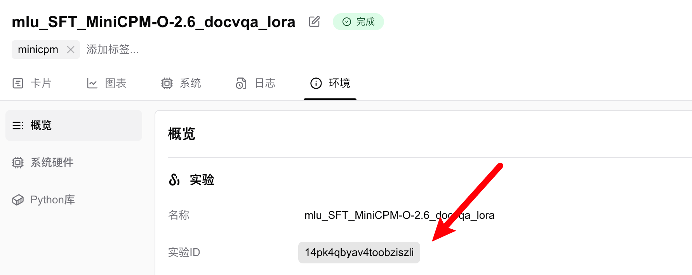

# 恢复实验/断点续训

> 恢复中断或已完成的SwanLab实验。

断点续训的意思是，如果你之前有一个状态为完成或中断的实验，需要补充一些实验数据，那么你可以通过`resume`和`id`参数来恢复这个实验，实验将重新变成进行中状态。

:::warning 使用场景
1. **断点续训：** 之前的训练进程断了，基于checkpoint继续训练时，希望实验图表能和之前的swanlab实验续上，而非创建1个新swanlab实验
2. **补充图表：** 训练和评估分为了两个进程，但希望评估和训练记录在同一个swanlab实验中
3. **更新超参：** config中有一些参数填写有误，希望更新config参数
:::

## 基本用法

恢复实验主要依赖两个参数，`resume`和`id`：

```python
swanlab.init(
    project="<project>",
    workspace="<workspace>",
    resume=True,
    id="<exp_id>",  # id必须为21位字符串
)
```

`resume`参数控制了实验恢复的行为，有以下几种选择：

- `must`：如果项目下存在id对应的实验，则会resume该实验，否则将报错
- `allow`：如果项目下存在id对应的实验，则会resume该实验，否则将创建一个新的实验。
- `never`：传递 id 参数将会报错；否则会创建一个新的实验。(即不开启resume的效果)
- `True`：即`allow`
- `False`：即`never`

`实验id`是实验的唯一标识，可以在实验的「环境」选项卡或URL中找到，必须为1个21位字符串：



或者打开一个实验，在其URL结构中的`<exp_id>`部分就是实验id：

```
https://swanlab.cn/@<username>/<project>/runs/<exp_id>/...
```

其中`<exp_id>`就是实验id。

## 示例

```python
import swanlab

run = swanlab.init(project="resume_test")
swanlab.log({"loss": 2, "acc":0.4})
# 完成实验
run.finish()

# 恢复实验
run = swanlab.init(project="resume_test", resume=True, id=run.id)
swanlab.log({"loss": 0.2, "acc": 0.9})
```