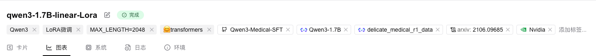
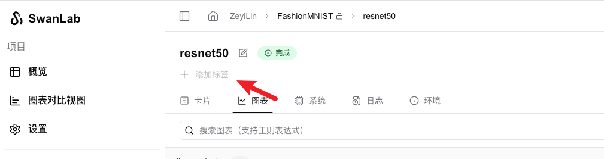
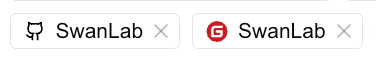
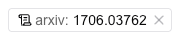
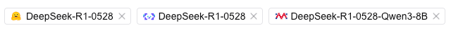

# 设置实验Tag

实验Tag可以快速标记本次实验所使用的**方法、数据集、模型、超参数、Git仓库等**，以及在未来可以用于分组和过滤实验。

设置好的Tag会在实验名的下方出现：



## 常规标签

**方法一：编程设置**

你可以使用`swanlab.init`中的`tags`参数，来设置实验的Tag（标签）。

```python
swanlab.init(
    tags=["tag1", "tag2"],
)
```

**方法二：GUI设置**

在网页中，找到实验的顶部区域，点击「添加标签」按钮，即可开始编辑标签：



## Git标签

支持识别标签中的Github、Gitee的仓库链接，呈现一个特殊样式，并可以点击跳转。

```python
swanlab.init(
    tags=[
        "https://github.com/SwanHubX/SwanLab",
        "https://gitee.com/SwanHubX/SwanLab",
    ],
)
```



## Arxiv标签

支持识别标签中的Arxiv链接，呈现一个特殊样式，并可以点击跳转。

```python
swanlab.init(
    tags=["https://arxiv.org/abs/1706.03762"],
)
```




## AI开源社区标签

支持识别标签中的AI开源社区链接（[HuggingFace](https://huggingface.co/)、[魔搭社区](https://www.modelscope.cn/)、[魔乐社区](https://www.modelers.cn/)），呈现一个特殊样式，并可以点击跳转。

```python
swanlab.init(
    tags=[
        "https://huggingface.co/deepseek-ai/DeepSeek-R1-0528",
        "https://modelscope.cn/models/deepseek-ai/DeepSeek-R1-0528",
        "https://modelers.cn/models/Modelers_Park/DeepSeek-R1-0528-Qwen3-8B",
    ],
)
```



## 算力标签

支持识别标签中的算力卡品牌（nvidia、ascend、apple）。

```python
swanlab.init(
    tags=["nvidia", "ascend", "apple"],
)
```


