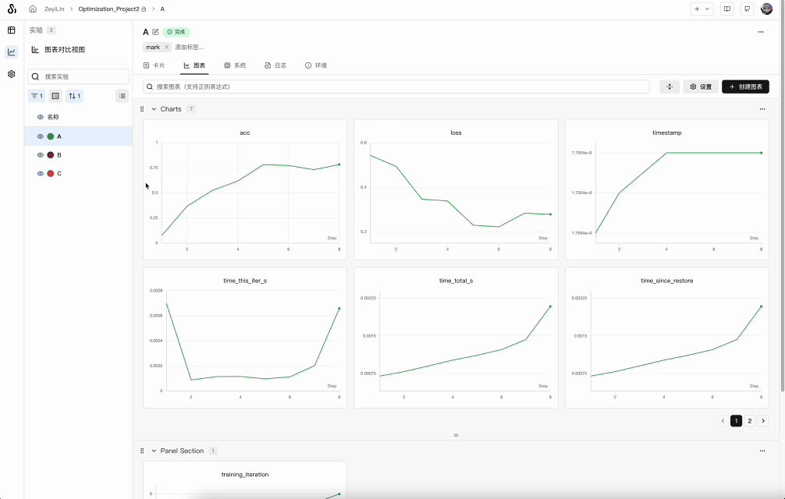
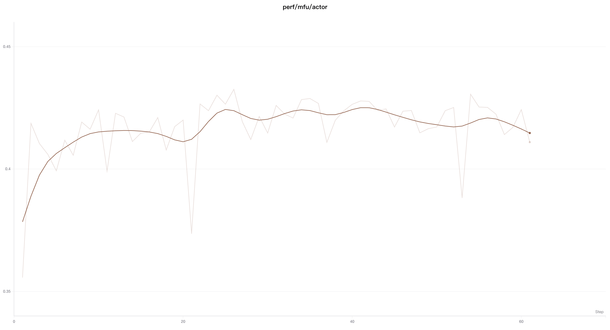

# 折线图平滑

> 在折线图中，使用平滑处理来查看带噪声的数据中的趋势

## 设置平滑

点击折线图右上角的「设置」按钮，打开设置面板，在「平滑」选项中选择你想要的平滑算法，并设置平滑参数即可：



SwanLab支持多种平滑算法：

- [时间加权指数移动平均 (EMA) 平滑](#time-weighted-ema)
- [高斯平滑](#gaussian-smoothing)
- [运行平均平滑](#running-average-smoothing)


## Time Weighted EMA

时间加权指数移动平均 (Time Weighted EMA) 平滑算法是一种通过指数衰减先前数据点的权重来平滑时间序列数据的技术。有关该技术的详细信息，请参阅[指数平滑](https://en.wikipedia.org/wiki/Exponential_smoothing)。权重值范围为 0 到 1。该算法还添加了一个去偏项，以避免时间序列中早期值偏向于零。

TWEMA 算法考虑了线上的点密度（`x` 轴上单位范围内 `y` 值的数量）。这使得在同时显示多条具有不同特征的线时，能够实现一致的平滑效果。

以下是其底层工作原理的示例代码：

```javascript
const smoothingWeight = Math.min(Math.sqrt(smoothingParam || 0), 0.999);
let lastY = yValues.length > 0 ? 0 : NaN;
let debiasWeight = 0;

return yValues.map((yPoint, index) => {
  const prevX = index > 0 ? index - 1 : 0;
  // VIEWPORT_SCALE scales the result to the chart's x-axis range
  const changeInX =
    ((xValues[index] - xValues[prevX]) / rangeOfX) * VIEWPORT_SCALE;
  const smoothingWeightAdj = Math.pow(smoothingWeight, changeInX);

  lastY = lastY * smoothingWeightAdj + yPoint;
  debiasWeight = debiasWeight * smoothingWeightAdj + 1;
  return lastY / debiasWeight;
});
```

在网站上，看起来是这样的：


## Running Average

移动平均是一种平滑算法，它将给定 `x` 值前后窗口内点的平均值替换为当前点。参见维基百科上的[“箱型滤波器”](https://en.wikipedia.org/wiki/Moving_average)。移动平均的选定参数告诉权重和偏差在计算移动平均时要考虑的点数。

如果你的点在 `x` 轴上分布不均匀，可以考虑使用高斯平滑法。

在网站上，看起来是这样的：


## Gaussian Smoothing

高斯平滑（或高斯核平滑）计算点的加权平均值，其中权重对应于标准差由平滑参数指定的高斯分布。对于每个输入 `x` 值，平滑值都是基于其前后出现的点计算得出的。

在网站上，看起来是这样的：

