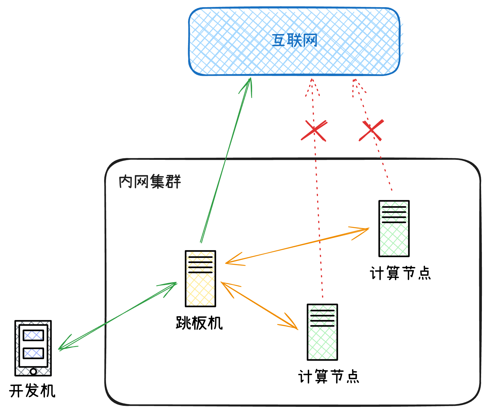

# 在内网计算节点访问SwanLab Cloud

通常，在算力集群中计算节点无法连接到互联网，外部开发机也必须通过跳板机才能连接到计算节点。如果无法连接到公网那就无法将数据上传到 SwanLab 云端。但是跳板机作为“中间人”角色，可以连接到互联网，那么就可以利用跳板机来实现代理计算节点连接到公网环境。



我们可以通过使用SSH代理转发来实现让计算节点也能连接上 [SwanLab Cloud](https://swanlab.cn/)。

## 开启代理转发网络

> 确保你的计算节点能通过SSH连接上跳板机

在计算节点上执行以下命令连接到跳板机：

```bash
ssh -D {port} {user}@{ip}
```

- `port` 参数为用于代理转发的端口，例如 `2015`
- `user` 和 `ip` 参数为跳板机服务器对应的用户名和内网IP地址

例如：`ssh -D 2015 hello@192.168.31.10`

连接到跳板机成功后，即在对应的端口开启了一个SOCKS代理通道，那么可以直接在终端设置环境变量来配置代理，例如：

```bash
export http_proxy=socks5://127.0.0.1:{port} https_proxy=socks5://127.0.0.1:{port}
```

> 注意将对应的 `port` 更换为自己设置的端口，协议为 [socks5](https://en.wikipedia.org/wiki/SOCKS)

配置成功后可以使用以下命令测试是否正确连接到公网:

```bash
curl ipinfo.io
```

配置成功后就可以愉快地使用SwanLab云端版了🥳。

注意SSH连接不能断开，关闭终端会话会导致连接断开，那么可以使用 [tmux](https://github.com/tmux/tmux/wiki) 将SSH连接命令放置在后台。

```bash
tmux
# 在tmux中执行SSH连接命令
ssh -D {port} {user}@{ip}
```

新开终端会话必须重新配置环境变量，当然可以将上述导入环境变量的命令写入 `.bashrc` 文件中实现每次开启新终端会话时自动写入环境变量。例如：
```bash
echo "export http_proxy=socks5://127.0.0.1:{port}" >> ~/.bashrc
echo "export https_proxy=socks5://127.0.0.1:{port}" >> ~/.bashrc
```
> 注意将 `{port}` 替换为自己设置的端口

## 实现原理

上述实现借助于 [SSH 动态转发](https://en.wikipedia.org/wiki/Port_forwarding#Dynamic_port_forwarding)功能，SSH 动态端口转发将 SSH 服务器变成 SOCKS 代理服务器，您计算机上的应用程序可以将其用作连接远程服务器的中介。

> **注意：**程序必须支持 SOCKS 类型的代理，您才能使用动态端口转发从该应用程序路由流量。
