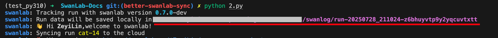
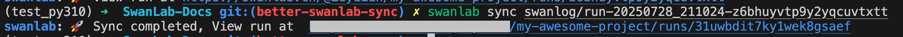

# 上传离线实验数据

> 将本地的实验数据，同步到SwanLab云端/私有化部署端

**使用场景：**
1. **训练过程中断网：** 模型训一半服务器断网了1小时，SwanLab的云端记录断了
2. **无网训练环境：** 你不幸地发现公司/学校的训练服务器完全不联网，也不让安装Docker
3. **多端同步：** 你使用了私有化部署，但也希望把实验记录同步到云端
4. **复制实验：** 这个实验对你创建的多个项目都有普适性（比如baseline、benchmark实验），希望能复制到多个项目下

当你遇到上述场景时，`swanlab sync`命令可以帮你解决，[API文档](/api/cli-swanlab-sync)。

## 本地实验数据目录

SwanLab会将**实验记录文件**默认存放到项目目录的`swanlog`目录下，你也可以通过`logdir`参数自定义保存路径，[文档](/api/py-init#设置日志文件保存位置)。

每当你创建1个实验时，SwanLab会自动在`swanlog`目录下创建1个`run-[实验ID]`目录，将数据持续记录到该目录下。



::: warning Tips
这个run开头的目录非常重要，是`swanlab sync`的基础。
:::

## 上传实验数据

找到你需要上传到云端的数据文件目录，然后执行命令：

```bash
swanlab sync ./swanlog/run-xxx
```

:::info
默认同步到的项目的是日志文件中记录的`project`，即跑该实验时设置的`project`。
如果想要同步到其他项目，可以使用`-p`选项指定项目。
:::

看到下面的打印信息，则表示上传成功：




## 在原实验上同步

如果你不希望创建1个新实验，而是在原本的实验上同步（会自行比对数据，增加差异的部分），可以使用`--id`参数：

```bash
swanlab sync ./swanlog/run-xxx --id <实验ID>
```

实验ID获取方式见：[恢复实验/断点续训](/guide_cloud/experiment_track/resume-experiment)


## 批量上传

可以使用通配符批量上传：

```bash
swanlab sync ./swanlog/run-*
```

## 上传到指定项目/团队空间

```bash
swanlab sync ./swanlog/run-xxx -p <project_name> -w <workspace_name>
```

:::warning 复制实验场景
如果你希望一个实验可以出现在多个项目下，那么可以使用上述命令，将实验上传到多个项目下。
:::


## 上传到私有化部署

```bash
swanlab sync ./swanlog/run-xxx --h <私有化部署地址>
```