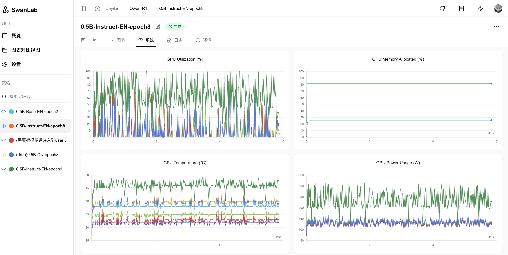
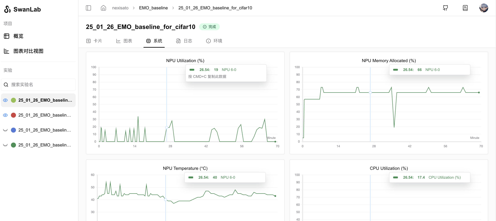

# 系统硬件监控（支持昇腾）

SwanLab在跟踪实验的过程中，会**自动监控**机器的硬件资源情况，并记录到 **「系统」图表** 当中。

目前SwanLab已支持监控2款**AI计算芯片**（**华为昇腾**、**英伟达**）的硬件资源情况，涵盖显卡利用率、显存占用率、显卡温度、显卡功率等指标。

除此之外，SwanLab还支持监控**CPU**、**内存**、**硬盘**等硬件资源情况。

---

> 很开心，我们与昇腾计算团队合作，为训练师提供更多的国产算力使用体验。

[昇腾NPU监控案例](https://swanlab.cn/@nexisato/EMO_baseline/runs/lg1ky9or15htzkek3vv2h/system)

NPU监控图表：

AI芯片环境记录：

---

## 系统监控指标详解

SwanLab 在当前实验运行的机器上自动监控硬件资源情况，并为每个指标生成图表，统一展示在 **「系统」图表** 选项卡中。

**采集策略与频率**：SwanLab根据当前实验的持续运行时间，自动调整硬件数据采集的频率，以平衡数据粒度与系统性能，采集频率分为以下几档：

| 已采集数据点数 | 采集频率 |
|   :---:   |   :---:   |
| 0~10    | 10 秒/次 |
| 10~50   | 30 秒/次 |
| 50+     | 60 秒/次 |

SwanLab 采集的硬件资源情况涵盖了GPU、NPU、CPU、系统内存、硬盘IO以及网络情况等多个与训练过程相关的指标。以下详细介绍每个部分的监控内容及其在图表展示中的意义。

### GPU（NVIDIA）

> 在多卡机器上，每个GPU的资源情况都会单独记录，最终在图表中展示多条图线。

**GPU 内存使用率** GPU Memory Allocated (%)

表示此GPU的显存占用百分比。

**GPU内存使用量** GPU Memory Allocated (MB)

表示此GPU的显存占用量，以MB为单位。

该指标对应图表的纵坐标上限为所有GPU中的最大总显存。

**GPU利用率** GPU Utilization (%)

表示此GPU的计算资源占用百分比。

**GPU温度** GPU Temperature (℃)

表示此GPU的温度，以摄氏度为单位。

**GPU功耗** GPU Power Usage (W)

表示此GPU的功耗，以瓦特为单位。

### NPU（Ascend）

> 在多卡机器上，每个NPU的资源情况都会单独记录，最终在图表中展示多条图线。

**NPU利用率** NPU Utilization (%)

表示此NPU的计算资源占用百分比。

**NPU内存使用率** NPU Memory Allocated (%)

表示此NPU的显存占用百分比。

**NPU温度** NPU Temperature (℃)

表示此NPU的温度，以摄氏度为单位。

### CPU

**CPU利用率** CPU Utilization (%)

表示此CPU的计算资源占用百分比。

**CPU线程数** Process CPU Threads

表示当前运行的实验所使用的CPU总线程数。

### 内存

**系统内存使用率** System Memory Utilization (%)

表示当前系统的内存占用百分比。

**进程占用内存** Process Memory In Use (non-swap) (MB)

当前进程实际占用的物理内存量（不包含交换区），直观反映实验运行时的内存消耗。

****进程分配内存**** Process Memory Utilization (MB)

表示当前进程分配的内存量（包含交换区），不一定是实际使用的内存量。

**进程可用内存** Process Memory Available （non-swap） (MB)

表示当前进程可用的物理内存量（不包含交换区），即当前进程可以使用的内存量。

### 硬盘

**硬盘I/O** Disk IO Utilization (MB)

表示硬盘的读写速度，以MB/s为单位。读速率和写速率会在图表中作为两条图线，分开展示。

**硬盘使用情况** Disk Utilization (%)

表示当前系统盘的使用率，以百分比为单位。

在Linux平台，取根目录`/`的使用率；若操作系统为Windows，则取系统盘（通常是`C:`）的使用率。

## 网络

**网络I/O** Network Traffic (KB)

表示网络的读写速度，以KB/s为单位。接收速率和发送速率会在图表中作为两条图线，分开展示。
