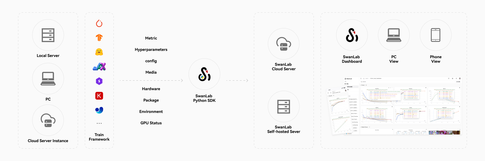

# 查看实验结果

使用SwanLab丰富的实验仪表盘，一站式管理和可视化AI模型训练结果。

[[toc]]

## 云端同步

无论您在哪里训练模型 —— **自己的电脑、实验室的服务器集群、还是云上的实例**，我们都能轻松收集与汇总您的训练数据，并且随时随地访问训练进展，哪怕是在手机上。

您也无需花时间将终端的输出截图或粘贴到Excel，也无需管理来自不同计算机的Tensorboard文件，用SwanLab就能轻松搞定。

## 📱 移动端看实验

你一定遇到过，实验正在training，但你不在电脑旁边 —— 也许在运动、在通勤、或者刚刚起床，十分想瞄一眼实验的进展和结果。这个时候，手机+SwanLab，会是绝佳组合。[查看详情](../general/app.md)

## 表格视图

通过表格视图比较每次训练实验，看看哪些超参数发生了变化。  
表格视图默认会将数据以`[实验名]-[元信息]-[配置]-[指标]`的顺序排序。

## 图表对比视图

通过**图表对比视图**可以将每个实验的图表进行整合，生成一个多实验对比图表视图。  
在多实验图表当中，可以清晰地对比不同实验在同一个指标下的变化情况与性能差异。

## 日志

在实验开始到结束，SwanLab会记录下从`swanlab.init`到实验结束的终端输出，并记录在实验的「日志」选项卡，可以随时查看、复制与下载。我们也支持通过搜索找到关键信息。

## 环境

在实验开始后，SwanLab会记录下训练相关的环境参数，包括：

- **基础数据**：运行时间、主机名、操作系统、Python版本、Python解释器、运行目录、命令行、Git仓库URL、Git分支、Git提交、日志文件目录、SwanLab版本
- **系统硬件**：CPU核心数、内存大小、GPU数量、GPU型号、GPU显存
- **Python库**：运行环境下的所有Python库

