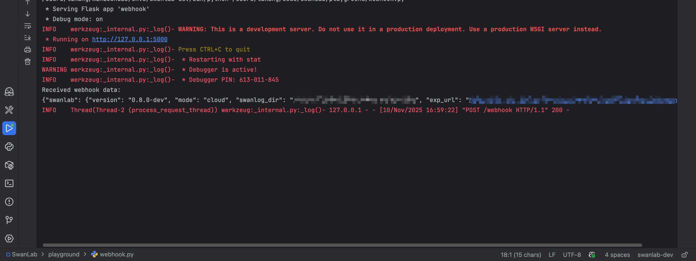

# Webhook使用说明

SwanLab webhook以实验为单位，将在实验创建的同时触发webhook逻辑。

## 使用方式

通过环境变量设置 SwanLab WebHook：

```bash
export SWANLAB_WEBHOOK='http://127.0.0.1/webhook'
# 可选，如果需要传递额外信息，可以设置此环境变量
export SWANLAB_WEBHOOK_VALUE='Hello World!'
```

设置完成后，SwanLab便会在实验拉起时（即`swanlab.init()`调用时）发送POST回调。

## 回调结构体

webhook使用POST方法发送回调，现以TS的类型语言描述回调结构体：

```ts
interface SwanLabInfo {
    // swanlab 版本号
    version: string
    // swanlab 运行模式
    mode: 'cloud' | 'local' | 'offline' | 'disabled'
    // 日志存储路径
    swanlog_dir: string
    // 云端实验链接
    exp_url: string
}

// webhook回调结构体
interface Body{
   value: string
   swanlab: SwanLabInfo
}
```

## 最小测试

下面是用flask框架的最小测试代码：

```python
from flask import Flask, request

app = Flask(__name__)

@app.route('/webhook', methods=['POST'])
def webhook():
    # 获取请求体数据
    data = request.get_data(as_text=True)  # 以文本形式获取数据
    print("Received webhook data:")
    print(data)
    return "Webhook received successfully!", 200

if __name__ == '__main__':
    app.run(host='127.0.0.1', port=5000, debug=True)
```

运行后服务后，在新的终端执行如下脚本：

```bash
export SWANLAB_WEBHOOK='http://127.0.0.1:5000/webhook'
export SWANLAB_WEBHOOK_VALUE='12345'
export SWANLAB_API_HOST='您的后端API HOST'
export SWANLAB_WEB_HOST='您的后端WEB HOST'

python -c "import swanlab;swanlab.init()"
```

可获得内容如下：

