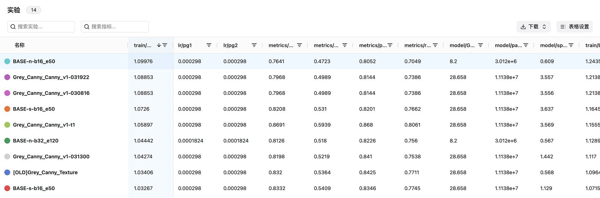

# 什么是实验跟踪

**实验跟踪** 是指在机器学习模型开发过程中，记录每个实验从开始到结束的**超参数、指标、硬件、环境、日志**等数据，并在UI界面进行**组织**和**呈现**的过程。实验跟踪的目的是帮助研究人员更有效地**管理**和**分析**实验结果，以便更好地理解模型性能的变化，进而优化模型开发过程。

::: warning 🤔简单来说
实验跟踪的作用可以理解为，在进行机器学习实验时，记录下实验的各个关键信息，**为后续模型的进化提供“弹药”**。
:::


与**实验跟踪**息息相关的，是**可视化**、**可复现性**、**实验比较**以及**团队协作**。

1. **📊 可视化**: 通过UI界面对实验跟踪数据进行可视化，可以让训练师**直观地看到实验每一步**的结果，**分析指标走势**，判断哪些**变化**导致了模型效果的提升，从而**整体性地提升模型迭代效率**。


<br>

2. **♻️ 可复现性**: 实验从跑通到可用，再到SOTA，往往需要经历**大量试验**，而一些非常好的结果可能出现在中前期。但如果没有实验跟踪和可视化，训练师难以记住这些结果，从而导致大量优秀的实验结果**记不清细节或被遗忘**。而通过SwanLab的实验跟踪和可视化功能，可以帮助训练师随时**回顾**这些结果，大大提高了可复现性与整体效率。


<br>

3. **🆚 实验比较**: 训练师可以通过SwanLab**轻松地比较**多组实验结果，分析哪些变化导致了性能提升，从而**快速找到最优的训练策略**。



<br>

4. **👥 团队协作**: 通过SwanLab的**实验分享、团队空间、多人协同**实验等功能，无缝地共享训练进展和心得经验，打通团队成员之间的信息孤岛，**提高团队协作效率**。


## SwanLab是如何进行实验跟踪的？

**SwanLab**帮助你只需使用几行代码，便可以跟踪机器学习实验，并在交互式仪表板中查看与比较结果。跟踪流程：

1. 创建SwanLab实验。
2. 将超参数字典（例如学习率或模型类型）存储到您的配置中 (swanlab.config)。
3. 在训练循环中随时间记录指标 (swanlab.log)，例如准确性acc和损失loss。

下面的伪代码演示了常见的**SwanLab实验跟踪工作流**：

```python
# 1. 创建1个SwanLab实验
swanlab.init(project="my-project-name")

# 2. 存储模型的输入或超参数
swanlab.config.learning_rate = 0.01

# 这里写模型的训练代码
...

# 3. 记录随时间变化的指标以可视化表现
swanlab.log({"loss": loss})
```

## 如何开始？

探索以下资源以了解SwanLab实验跟踪：

- 阅读[快速开始](/guide_cloud/general/quick-start)
- 探索本章以了解如何：
  - [创建一个实验](/guide_cloud/experiment_track/create-experiment)
  - [配置实验](/guide_cloud/experiment_track/set-experiment-config.md)
  - [记录指标](/guide_cloud/experiment_track/log-experiment-metric.md)
  - [查看实验结果](/guide_cloud/experiment_track/view-result.md)
- 在[API文档](/api/api-index)中探索SwanLab Python 库。