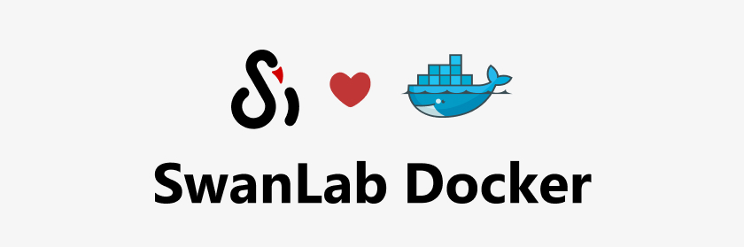

# ⚡️更新日志

::: warning 更新指南
升级到最新版：`pip install -U swanlab`  
Github: https://github.com/SwanHubX/SwanLab
::: 

## v0.6.5 - 2025.7.5

**🚀新增功能**
- 支持**resume断点续训**
- 支持小折线图局部放大
- 支持配置单个折线图平滑

**⚙️优化**
- 大幅改进了图像图表放大后的交互效果

**🔌集成**
- 🤗集成[accelerate](https://github.com/huggingface/accelerate)框架，[文档](/guide_cloud/integration/integration-huggingface-accelerate.md)增强分布式训练中的实验记录体验；
- 集成[ROLL](https://github.com/alibaba/ROLL)框架，[文档](/guide_cloud/integration/integration-roll.md)增强分布式训练中的实验记录体验；
- 集成[Ray](https://github.com/ray-project/ray)框架，[文档](/guide_cloud/integration/integration-ray.md)增强分布式训练中的实验记录体验；

**🔌插件**
- 新增`LogdirFileWriter`插件，支持将文件写入到日志文件夹

## v0.6.4 - 2025.6.18

**🚀新增功能**
- 新增与[AREAL](https://github.com/inclusionAI/AReaL)框架的集成，[PR](https://github.com/inclusionAI/AReaL/pull/98)
- 支持鼠标Hover到侧边栏实验时，高亮相应曲线
- 支持跨组对比折线图
- 启用渐进式图表渲染，提高页面加载速度
- 支持设置实验名裁剪规则

**⚙️修复**
- 修复了`local`模式下，日志文件无法正确`sync`和`watch`的问题

## v0.6.3 - 2025.6.12

**🚀新增功能**
- 新增`swnalab.echarts.table`，支持创建表格图表
- 昇腾/沐曦/海光/寒武纪/昆仑芯 硬件监控 增加显存（MB）记录
- `swanlab sync`支持一次多日志上传
- 工作区增加`公开/私有`筛选
- 表格视图增加`最新/最大/最小值`切换模块

## v0.6.2 - 2025.6.9

**🚀新增功能**
- 新增`swanlab sync`命令，支持将本地日志同步到SwanLab云端/私有化部署端
- 支持在本地存储完整的实验日志文件

## v0.6.1 - 2025.6.5

**🚀新增功能**
- 鼠标放到表头，可以显示缩略的名称了
- 表格视图增加「展开子表」功能
- 硬件监控支持海光DCU
- 硬件监控支持获取昇腾NPU的功耗信息

**🤔优化**
- 优化了HuggigngFace accelerate框架的集成
- 默认不再打印重复step log warning

## v0.6.0 - 2025.6.1

**🚀新增功能**
- 支持 **图表自由拖拽**
- 支持ECharts自定义图表，增加包括柱状图、饼状图、直方图在内的20+图表类型
- 硬件监控已支持 **沐曦** 显卡
- 集成 [PaddleNLP](https://github.com/PaddlePaddle/PaddleNLP) 框架

## v0.5.9 - 2025.5.25

**🚀新增功能**
-  📒 日志记录支持了标准错误流，EvalScope / PyTorch Lightning等这些框架的日志记录体验大幅提升
-  💻 硬件监控已支持 **摩尔线程** 显卡
-  🔐 新增运行命令记录的安全防护功能，API Key将被自动隐藏
-  ⚙️ 设置新增「默认空间」和「默认可见性」配置，可以指定你的项目默认创建在哪个组织下啦！

## v0.5.8 - 2025.5.13

**🚀新增功能**

- 新增**实验Tag**功能
- 新增折线图 **Log Scale** 功能
- 新增 **实验分组拖拽** 功能
- 新增实验卡片中**配置**与**指标**表格下载功能
- 新增[开放接口](/zh/api/py-openapi.md)，支持通过API获取SwanLab数据
- 大幅优化了指标传输性能，提升上千指标的传输速度
- 集成`paddlenlp`框架

**🤔优化**
- 优化了个人主页的一系列交互

**生态**
- 腾讯云云应用上架：[指引](/zh/guide_cloud/self_host/tencentcloud-app.md)

## v0.5.6 - 2025.4.23

**🚀新增功能**

- 折线图支持**图表配置**功能，本次更新支持配置图表的X、Y轴范围；主标题；X、Y轴标题
- 图表搜索支持**正则表达式**
- SwanLab私有化部署版，已支持离线激活验证
- 支持**昆仑芯XPU**的环境记录与硬件监控
- 适配对使用`uv`环境下的pip环境记录
- 环境记录支持记录**Linux发行版**（如Ubuntu、CentOS、Kylin等）

**🤔优化**
- 修复了侧边栏一键隐藏实验的一些问题

## v0.5.5 - 2025.4.7

**🚀新增功能**
- 新增`swanlab.Molecule`数据类型，支持生物化学分子可视化，为AlphaFold等AI4Science训练任务提供更好的训练体验
- 实验表格，现在支持记忆你的排序、筛选、列拖拽了！
- 支持了寒武纪MLU的温度和功率指标记录
- 新增SWANLAB_PROJ、SWANLAB_WORKSPACE、SWANLAB_EXP_NAME三个环境变量
- 环境中支持显示寒武纪MLU Logo

**🌍生态**
- 大模型评估框架[EvalScope](https://github.com/modelscope/evalscope) 已集成SwanLab！：https://github.com/modelscope/evalscope/pull/453

**🤔优化**
- 优化了网页加载性能

## v0.5.4 - 2025.3.31

**🚀新增功能**
- 新增`swanlab.Settings`方法，支持更精细化的实验行为控制，进一步增强开放性
- 支持了寒武纪MLU的硬件记录和资源监控
- 昇腾NPU的硬件记录支持记录CANN版本
- 英伟达GPU的硬件记录支持记录GPU架构和cuda核心数
- 英伟达GPU的硬件监控支持记录“GPU 访问内存所花费的时间百分比”
- 「个人主页」支持显示你所在的「组织」
- 「概览」页支持编辑"项目描述"文本

**🤔优化**
- 修复了sync_wandb的一些问题
- 修复了Obejct3D类的一些问题
- 优化「常规」设置样式
- 大幅优化了打开项目的性能

**🔌插件**
- 官方插件增加Slack通知、Discord通知，进一步打通海外生态

## v0.5.3 - 2025.3.20

**🚀新增功能**
- SwanLab已正式加入 **🤗HuggingFace生态**！Transformers 4.50.0版本开始 正式将SwanLab集成为实验跟踪工具，在TrainingArguments中加入`report_to="swanlab"`即可开始跟踪训练。
- 新增了`swanlab.Object3D`，支持记录三维点云，[文档](/api/py-object3d)
- 硬件监控支持了 GPU显存（MB）、磁盘利用率、网络上下行 的记录

**优化**
- 修复了一些问题

## v0.5.0 - 2025.3.12

**🎉🎉SwanLab私有化部署（社区版）现已重磅发布！！**[部署文档](/guide_cloud/self_host/docker-deploy.md)

**🚀新增功能**
- `swanlab.init`新增参数`callbacks`，支持在初始化时注册回调函数，以支持各式各样的自定义插件类
- 新增`swanlab.register_callback()`，支持在`init`外部注册回调函数，[文档](/api/py-register-callback.html)
- `swanlab.login()`升级，新增`host`、`web_host`、`save`参数，适配了私有化部署服务的特性，同时支持不将用户登录凭证写入本地，以适应共用服务器场景。[文档](/zh/api/py-login.md)
- `swanlab login`升级，新增`host`、`web_host`、`api-key`参数，[文档](/zh/api/cli-swanlab-login.md)
- 新增支持使用`swanlab.sync_mlflow()`将MLFlow项目同步到SwanLab，[文档](/guide_cloud/integration/integration-mlflow.md)

**🤔优化**
- 我们大幅优化了sdk架构，提升了sdk在大量metric场景下的性能
- 实验侧边栏可以拉伸了！
- 实验页面右上角增加了「Git代码」按钮，一键跳转到对应的仓库

**🔌插件**：
- 新增**通知类插件**，支持在训练结束时使用**邮件、飞书、钉钉、企业微信**进行通知
- 新增**记录类插件**，支持在训练过程中将元数据、配置、指标写入到**本地CSV文件**

## v0.4.12 - 2025.3.8

**优化**
- 修复了一些问题

## v0.4.11 - 2025.3.5

**优化**
- 修复了部分版本W&B格式转换报错的问题
- 修复了一些交互问题

## v0.4.10 - 2025.3.4

**🚀新增功能**
- 新增了和[DiffSynth-Studio](https://github.com/modelscope/DiffSynth-Studio)的集成, [文档](/guide_cloud/integration/integration-diffsynth-studio.md)
- 新增支持转换 **MLFlow** 实验到 SwanLab，[文档](/guide_cloud/integration/integration-mlflow.md)
- 新增**项目描述**，支持给你的项目记一些简短的笔记

**优化**
- 修复了在OpenEuler系统上无法正确记录CPU型号的问题

## v0.4.9 - 2025.2.28

**🚀新增功能**
- 新增了`移动实验`功能
- 对一些集成Callback类增加了`update_config`方法
- `run`新增`get_url()`和`get_project_url()`方法，支持获取实验和项目的URL

**优化**
- 修复了在部分Linux系统上CPU品牌获取不到的问题

## v0.4.8 - 2025.2.16

**🚀新增功能**
- 新增了和Modelscope Swift的集成，[文档](/guide_cloud/integration/integration-swift.md)
- 新增了`添加分组`和`移动图表到其他分组`功能

**优化**
- 修复了sdk的一些问题

## v0.4.7 - 2025.2.11

**🚀新增功能**
- `swanlab.log`支持了参数`print_to_console`，开启后可以将`swanlab.log`的`key`、`value`以字典的形式打印到终端
- `swanlab.init`支持了对`name`、`notes`参数的适配，等价于`experiment_name`和`description`

## v0.4.6 - 2025.2.3

**🚀新增功能**
- 新增与LLM强化学习框架[verl](https://github.com/volcengine/verl)的集成，[文档](/guide_cloud/integration/integration-verl.md)
- `swanlab.log`支持了嵌套字典传入

**优化**
- 优化了在PyTorch Lightning框架下的分布式训练优化

## v0.4.5 - 2025.1.22

**🚀新增功能**
- 新增`swanlab.sync_tensorboardX()`和`swanlab.sync_tensorboard_torch()`：支持使用TensorboardX或PyTorch.utils.tensorboard跟踪实验时，同步指标到SwanLab

**优化**
- 优化了`sync_wandb()`的代码兼容性

## v0.4.3 - 2025.1.17

**🚀新增功能**
- 新增`swanlab.sync_wandb()`：支持使用Weights&Biases跟踪实验时，同步指标到SwanLab，[文档](/guide_cloud/integration/integration-wandb.md)
- 新增在使用框架集成时，配置项将记录所使用的框架

**优化**
- 改进了表格视图的交互，增加了行列拖拽、筛选、排序交互
- 大幅优化了工作区加载的性能
- 大幅优化了日志渲染的性能
- 改进了在未登录的计算机上，执行`swanlab.init()`的交互
- 修复了一些已知问题

## 元旦节更新

**🚀新增功能**
- 升级了图表平滑，网页刷新后状态将仍然保留
- 更新了图表大小修改，现在可以通过拖拽图表的右下角来改变大小

**⚙️问题修复**
- 修复了没有实验时，项目设置不显示删除的bug

## v0.4.2 - 2024.12.24

**🚀新增功能**
- 新增密码登录
- 新增项目设置页

**优化**
- 修复在一些设备上运行硬件监控会warning的问题

## v0.4.0 - 2024.12.15

🎉万众期待的硬件监控功能（云端版）已经上线，支持**CPU、NPU、GPU**的系统级信息监控：

- **CPU**：利用率、线程数
- **内存**：利用率、进程利用率、可用内存
- **Nvidia GPU**：利用率、显存分配、温度、功耗
- **Ascend NPU**：利用率、HBM分配、温度

更多信息的监控已经在路上！

by Cunyue

## v0.3.28 - 2024.12.6

> 🍥公告：硬件监控功能即将推出！

**🚀新增功能**
- 新增与LightGBM的集成
- 新增与XGBoost的集成

**优化**
- 提高了对日志记录时单行长度的限制
- 改善了部分性能，为0.4.0版本做准备

## v0.3.27 - 2024.11.26

**🚀新增功能**
- 新增华为昇腾NPU显卡检测
- 新增与青云基石智算(Coreshub)的集成

## 新UI上线！

**🚀我们改进了什么**
- 从用户体验出发，上线全新的官网和UI界面
- 上线个人/组织主页
- 增加「黑夜模式」
- 全面优化的「新手快速开始」，增加了框架集成和案例
- 优化「图表对比视图」的实验选择逻辑

## v0.3.25 - 2024.11.11

**🚀新增功能**
- 🎉[VSCode插件](https://marketplace.visualstudio.com/items?itemName=SwanLab.swanlab&ssr=false#overview)已上线
- 新增与Keras框架的集成
- 新增`run.public`方法，支持获取实验的项目名、实验名、链接等信息，[#732](https://github.com/SwanHubX/SwanLab/pull/732)

## v0.3.22 - 2024.10.18

**🚀新增功能**
- 🎉基线社区Beta版本已上线：https://swanlab.cn/benchmarks
- 新增与PaddleYolo的集成，[文档](/guide_cloud/integration/integration-paddleyolo.md)

**修复问题**
- 修复了在多组并行实验提交时，出现sqlite并行读写报错的问题，[#715](https://github.com/SwanHubX/SwanLab/issues/715)
- 修复了在CPU品牌记录的兼容性问题

## v0.3.21 - 2024.9.26

**🚀新增功能**
- [组织创建](/guide_cloud/general/organization.md)已全面开放，每个组织上限为15人。
- 实验名现已支持「重名」，并使用新的一套新建实验名体系。

## v0.3.19 - 2024.9.2

**🚀新增功能**
- （内测）新增任务式训练`swanlab task`的网盘存储功能

**优化**
- 【环境】增加对CPU品牌的记录

**问题修复**
- 修复了在Win命令行下`swanlab login`容易出现误操作引发的问题

## v0.3.17 - 2024.8.18

1. 完成了对云端图表库以及前端的代码重构，改进了大量交互
2. 修复了实验表格中侧边栏未加载实验没有正常显示参数的问题
3. 修复了requests包引起的部分用户网络连接错误的问题
4. 【环境】增加对NVIDIA驱动版本的记录
5. 本地看版支持对已占用的端口自动续新端口了

## v0.3.16 - 2024.7.31

**🚀新增功能**
- （内测）新增任务式训练`swanlab task`功能
- 新增与`torchtune`的集成，[文档](/guide_cloud/integration/integration-pytorch-torchtune)

**优化**
- `swanlab.init`增加参数`public`，可用于设置创建的新项目的可见性，默认为`False`
- 用`swanlab.init`创建的项目默认可见性改为私有
- 新增了`swanlab.config`对`dataclass`类型的支持

**问题修复**
- 修复了在conda-forge环境下import swanlab会提示缺乏依赖库的问题

## v0.3.14 - 2024.7.20

**问题修复**
- 修复环境依赖安装问题
- 修复在Windows系统上存在的一些适配问题

## v0.3.13 - 2024.6.27

**🚀新增功能**
- 新增支持修改实验颜色

**⚡️改进**
- 优化了在Google CoLab、Jupyter Notebook下的一些问题
- 优化了错误日志收集与打印

**问题修复**
- 修复了Windows系统下运行的一些问题
- 修复了在Hydra等框架上的终端打印问题
- 修复了了在mmengine集成中SwanlabVisBackend的save_dir不能为None的问题

## v0.3.11 - 2024.6.14

**🚀新增功能**
- 环境记录增加PID和Python Verbose
- 支持修改项目可见性
- 离线看版命令修改为`swanlab watch [LOG PATH]`

**⚡️改进**
- 优化了Python环境搜索的性能
- 优化了SwanLab库的架构

**问题修复**
- 修复了离线看版启动失败的问题

## v0.3.10 - 2024.6.10

**问题修复**
- 修复了部分文本上传时会出现编码错误的问题
- 修复了环境信息没有正确上传的问题

## v0.3.9 - 2024.6.8

**🚀新增功能**
- `swanlab logout`：支持在终端退出SwanLab账号

**👥集成**
- 增加与HuggingFace Accelerate的集成，[文档](/guide_cloud/integration/integration-huggingface-accelerate.md)

**⚡️改进**
- 改进了媒体文件上传的稳定性

**问题修复**
- 修复了nvml库的兼容性问题
- 解决在实验结束时上传大量媒体文件可能引发的409错误
- 修复了在部分机器上会出现OSError的问题

## v0.3.8 - 2024.5.31

**⚡️改进**
- 改进了与ultralytics在ddp场景下的集成
- swanlab.init时增加最新版本的提示

**问题修复**

- 修复了当log的value为`inf`会导致线程崩溃的问题
- 修复了训练时间过长时，部分图片上传会失败的问题 

## v0.3.6 - 2024.5.28

**问题修复**

- 修复了部分logging日志无法上传的问题
- 修复了`swanlab login`无法登陆的问题

## v0.3.4 - 2024.5.27

**🚀新增功能**
- `swanlab.init`增加参数`mode`，支持新模式`disabled`
- 支持批量删除实验

**⚡️改进**
- 优化ultralytics集成代码

**👥集成**
- 与Stable Baseline3集成，[指引](/guide_cloud/integration/integration-sb3.md)

## v0.3.3 - 2024.5.22

**👥集成**
- 与Weights & Biases集成，支持将wandb项目转换为`SwanLab`项目，[指引](/guide_cloud/integration/integration-wandb.md)
- 与Ultralytics集成，[指引](/guide_cloud/integration/integration-ultralytics.md)
- 与fastai集成，[指引](/guide_cloud/integration/integration-fastai.md)

## v0.3.2 - 2024.5.17

**👥集成**
- 与Tensorboard集成，支持将`Tensorboard`日志文件转换为`SwanLab`实验，[指引](/guide_cloud/integration/integration-tensorboard.md)

**🚀新增功能**
- 支持下载折线图为PNG图像
- SwanLab实验可以被嵌入到在线文档中了（飞书/Notion等支持嵌入网页的在线文档）
- 表格视图支持导出CSV
- 表格视图支持仅看指标

**⚡️改进**
- 优化了折线图与表格视图的数值显示

**⚙️修复问题**
- 修复了在Windows系统下，`swanlab.config`载入`hydra`配置文件时，config表格的显示Bug
- 解决SwanLab在jupyter Notebook中的登录问题

## v0.3.1 - 2024.5.3

**⚡️改进**
- `swanlog`日志文件夹默认增加一个`.gitignore`

**⚙️修复问题**
- 修复`swanlab.init`的config不兼容Omegaconfig等类型的问题