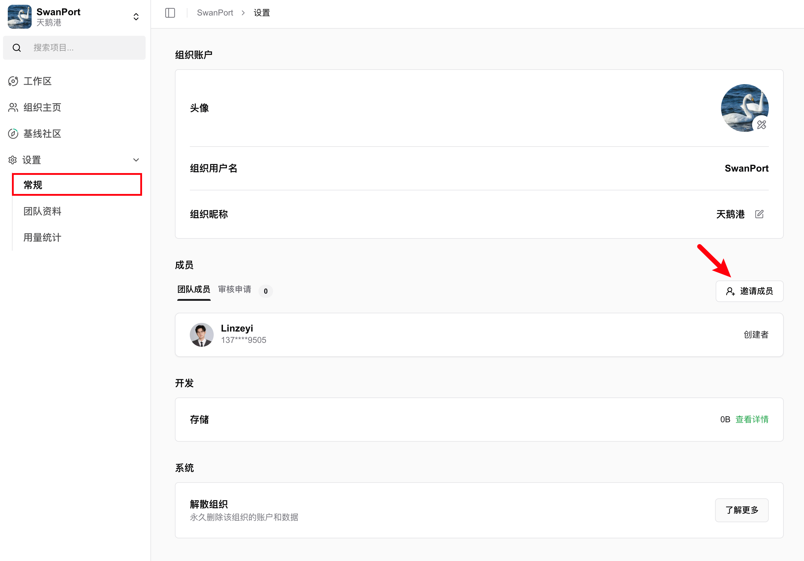
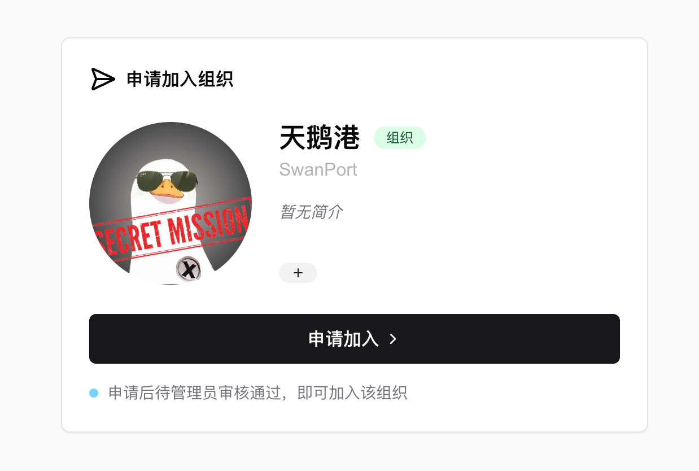

# 团队使用SwanLab

## 创建组织

在主页的左上方，点击“创建组织”按钮，填写组织名、组织ID等信息，即可完成组织创建。

<div align="center">

</div>

## 邀请成员

<div align="center">

</div>

在组织空间下，点击「设置」-「常规」，在「成员」栏下，点击「邀请成员」按钮，将邀请链接分享给要加入组织的成员。

<div align="center">

</div>

成员点击邀请链接，提交申请后，经管理员审核通过，即可完成加入。


## 将实验上传到组织空间

在默认情况下（即不设置`workspace`参数），你的项目会被上传到个人空间下。  
想要上传到组织空间下，则将`swanlab.init`的`workspace`参数设置为组织的组织名（不是组织昵称）即可。

```python
import swanlab

swanlab.init(
    workspace="[组织名username]"
)
```

如果组织里的多个人想要在一个项目下协作，则只需要将`swanlab.init`的`project`参数设置为同一个即可。