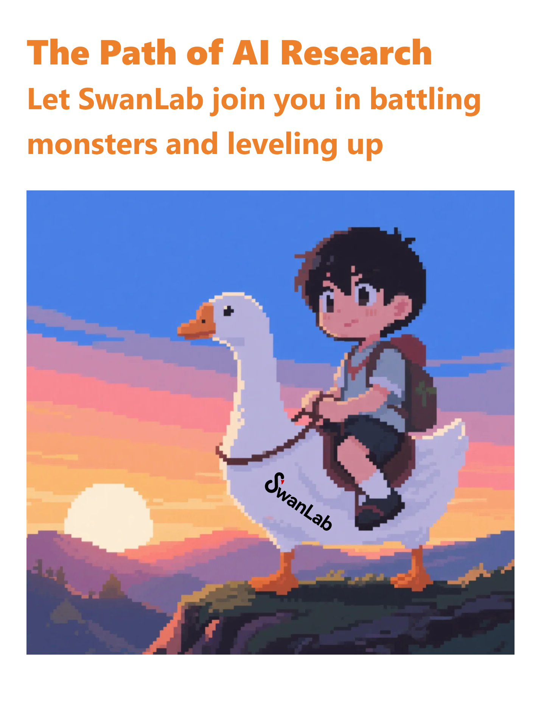

# 欢迎使用SwanLab 

[官网](https://swanlab.cn) · [框架集成](/guide_cloud/integration/integration-huggingface-transformers.html) · [Github](https://github.com/swanhubx/swanlab) · [快速开始](/guide_cloud/general/quick-start.md) · [同步Wandb](/guide_cloud/integration/integration-wandb.md#_1-同步跟踪) · [基线社区](https://swanlab.cn/benchmarks)

::: warning 🎉 私有化部署版正式上线！
私有化部署版支持在本地使用到与公有云版体验相当的功能，部署方式见[此文档](/guide_cloud/self_host/docker-deploy.md)
:::

SwanLab 是一款**开源、轻量**的 AI 模型训练跟踪与可视化工具，提供了一个**跟踪、记录、比较、和协作实验**的平台。

SwanLab 面向人工智能研究者，设计了友好的Python API 和漂亮的UI界面，并提供**训练可视化、自动日志记录、超参数记录、实验对比、多人协同等功能**。在SwanLab上，研究者能基于直观的可视化图表发现训练问题，对比多个实验找到研究灵感，并通过**在线网页**的分享与基于组织的**多人协同训练**，打破团队沟通的壁垒，提高组织训练效率。

借助SwanLab，科研人员可以沉淀自己的每一次训练经验，与合作者无缝地交流和协作，机器学习工程师可以更快地开发可用于生产的模型。

## 📹在线演示

| [ResNet50 猫狗分类][demo-cats-dogs] | [Yolov8-COCO128 目标检测][demo-yolo] |
| :--------: | :--------: |
| [![][demo-cats-dogs-image]][demo-cats-dogs] | [![][demo-yolo-image]][demo-yolo] |
| 跟踪一个简单的 ResNet50 模型在猫狗数据集上训练的图像分类任务。 | 使用 Yolov8 在 COCO128 数据集上进行目标检测任务，跟踪训练超参数和指标。 |

| [Qwen2 指令微调][demo-qwen2-sft] | [LSTM Google 股票预测][demo-google-stock] |
| :--------: | :--------: |
| [![][demo-qwen2-sft-image]][demo-qwen2-sft] | [![][demo-google-stock-image]][demo-google-stock] |
| 跟踪 Qwen2 大语言模型的指令微调训练，完成简单的指令遵循。 | 使用简单的 LSTM 模型在 Google 股价数据集上训练，实现对未来股价的预测。 |

| [ResNeXt101 音频分类][demo-audio-classification] | [Qwen2-VL COCO数据集微调][demo-qwen2-vl] |
| :--------: | :--------: |
| [![][demo-audio-classification-image]][demo-audio-classification] | [![][demo-qwen2-vl-image]][demo-qwen2-vl] |
| 从ResNet到ResNeXt在音频分类任务上的渐进式实验过程 | 基于Qwen2-VL多模态大模型，在COCO2014数据集上进行Lora微调。 |

| [EasyR1 多模态LLM RL训练][demo-easyr1-rl] | [Qwen2.5-0.5B GRPO训练][demo-qwen2-grpo] |
| :--------: | :--------: |
| [![][demo-easyr1-rl-image]][demo-easyr1-rl] | [![][demo-qwen2-grpo-image]][demo-qwen2-grpo] |
| 使用EasyR1框架进行多模态LLM RL训练 | 基于Qwen2.5-0.5B模型在GSM8k数据集上进行GRPO训练 |

视频Demo：

<video controls src="./what_is_swanlab/demo.mp4"></video>

## SwanLab能做什么？

**1. 📊 实验指标与超参数跟踪**: 极简的代码嵌入您的机器学习 pipeline，跟踪记录训练关键指标

- ☁️ 支持**云端**使用（类似Weights & Biases），随时随地查看训练进展。[手机看实验的方法](https://docs.swanlab.cn/guide_cloud/general/app.html)
- 🌸 **可视化训练过程**: 通过UI界面对实验跟踪数据进行可视化，可以让训练师直观地看到实验每一步的结果，分析指标走势，判断哪些变化导致了模型效果的提升，从而整体性地提升模型迭代效率。
- 📝 **超参数记录**、**指标总结**、**表格分析**
- **支持的元数据类型**：标量指标、图像、音频、文本、视频、3D点云、生物化学分子、Echarts自定义图表...

- **支持的图表类型**：折线图、媒体图（图像、音频、文本）、3D点云、生物化学分子、柱状图、散点图、箱线图、热力图、饼状图、雷达图...

- **LLM生成内容可视化组件**：为大语言模型训练场景打造的文本内容可视化图表，支持Markdown渲染

- **后台自动记录**：日志logging、硬件环境、Git 仓库、Python 环境、Python 库列表、项目运行目录
- **断点续训记录**：支持在训练完成/中断后，补充新的指标数据到同个实验中

**2. ⚡️ 全面的框架集成**: PyTorch、🤗HuggingFace Transformers、PyTorch Lightning、🦙LLaMA Factory、MMDetection、Ultralytics、PaddleDetetion、LightGBM、XGBoost、Keras、Tensorboard、Weights&Biases、OpenAI、Swift、XTuner、Stable Baseline3、Hydra 在内的 **40+** 框架

**3. 💻 硬件监控**: 支持实时记录与监控CPU、GPU（**英伟达Nvidia**、**沐曦MetaX**、**摩尔线程MooreThread**）、NPU（**昇腾Ascend**）、MLU（**寒武纪MLU**）、XPU（**昆仑芯KunlunX**）、内存的系统级硬件指标

**4. 📦 实验管理**: 通过专为训练场景设计的集中式仪表板，通过整体视图速览全局，快速管理多个项目与实验

**5. 🆚 比较结果**: 通过在线表格与对比图表比较不同实验的超参数和结果，挖掘迭代灵感

**6. 👥 在线协作**: 您可以与团队进行协作式训练，支持将实验实时同步在一个项目下，您可以在线查看团队的训练记录，基于结果发表看法与建议

**7. ✉️ 分享结果**: 复制和发送持久的 URL 来共享每个实验，方便地发送给伙伴，或嵌入到在线笔记中

**8. 💻 支持自托管**: 支持离线环境使用，自托管的社区版同样可以查看仪表盘与管理实验，[使用攻略](#-自托管)

**9. 🔌 插件拓展**: 支持通过插件拓展SwanLab的使用场景，比如 [飞书通知](https://docs.swanlab.cn/plugin/notification-lark.html)、[Slack通知](https://docs.swanlab.cn/plugin/notification-slack.html)、[CSV记录器](https://docs.swanlab.cn/plugin/writer-csv.html)等

## 为什么使用SwanLab？

与软件工程不同，人工智能是一个**实验性学科**，产生灵感、快速试验、验证想法 是AI研究的主旋律。而记录下实验过程和灵感，就像化学家记录实验手稿一样，是每一个AI研究者、研究组织**形成积累、提升加速度**的核心。

先前的实验记录方法，是在计算机前盯着终端打印的输出，复制粘贴日志文件（或TFEvent文件），**粗糙的日志对灵感的涌现造成了障碍，离线的日志文件让研究者之间难以形成合力**。

与之相比，SwanLab提供了一套云端AI实验跟踪方案，面向训练过程，提供了训练可视化、实验跟踪、超参数记录、日志记录、多人协同等功能，研究者能轻松**通过直观的可视化图表找到迭代灵感，并且通过在线链接的分享与基于组织的多人协同训练**，打破团队沟通的壁垒。

> 以往的AI研究的分享和开源更关注结果，而我们更关注过程。 
> 社区用户对SwanLab的产品评价可以归结为**简洁易用、提升效率与迭代迅速** 
> ——泽毅，SwanLab 联合创始人

更重要的是，SwanLab是开源的，由一帮热爱开源的机器学习工程师与社区共同构建，我们提供了完全自托管的版本，可以保证你的数据安全与隐私性。

希望以上信息和这份指南可以帮助你了解这款产品，我们相信 SwanLab 能够帮助到你。

## 从哪里开始

- [快速开始](/guide_cloud/general/quick-start.md): SwanLab入门教程，五分钟玩转实验跟踪！
- [API文档](/api/api-index.md): 完整的API文档
- [在线支持](/guide_cloud/community/online-support.md): 加入社区、反馈问题和联系我们
- [自托管](/guide_cloud/self_host/docker-deploy.md): 自托管（私有化部署）使用方式教程
- [案例](/examples/mnist.md): 查看SwanLab与各个深度学习任务的案例

## 与熟悉产品的对比

### Tensorboard vs SwanLab

- **☁️支持在线使用**：
  通过SwanLab可以方便地将训练实验在云端在线同步与保存，便于远程查看训练进展、管理历史项目、分享实验链接、发送实时消息通知、多端看实验等。而Tensorboard是一个离线的实验跟踪工具。

- **👥多人协作**：
  在进行多人、跨团队的机器学习协作时，通过SwanLab可以轻松管理多人的训练项目、分享实验链接、跨空间交流讨论。而Tensorboard主要为个人设计，难以进行多人协作和分享实验。

- **💻持久、集中的仪表板**：
  无论你在何处训练模型，无论是在本地计算机上、在实验室集群还是在公有云的GPU实例中，你的结果都会记录到同一个集中式仪表板中。而使用TensorBoard需要花费时间从不同的机器复制和管理 TFEvent文件。
  
- **💪更强大的表格**：
  通过SwanLab表格可以查看、搜索、过滤来自不同实验的结果，可以轻松查看数千个模型版本并找到适合不同任务的最佳性能模型。 TensorBoard 不适用于大型项目。  

### W&B vs SwanLab

- Weights and Biases 是一个必须联网使用的闭源MLOps平台

- SwanLab 不仅支持联网使用，也支持开源、免费、自托管的版本

## 训练框架集成

将你最喜欢的框架与 SwanLab 结合使用！  
下面是我们已集成的框架列表，欢迎提交 [Issue](https://github.com/swanhubx/swanlab/issues) 来反馈你想要集成的框架。

**基础框架**
- [PyTorch](/guide_cloud/integration/integration-pytorch.html)
- [MindSpore](/guide_cloud/integration/integration-ascend.html)
- [Keras](/guide_cloud/integration/integration-keras.html)

**专有/微调框架**
- [PyTorch Lightning](/guide_cloud/integration/integration-pytorch-lightning.html)
- [HuggingFace Transformers](/guide_cloud/integration/integration-huggingface-transformers.html)
- [LLaMA Factory](/guide_cloud/integration/integration-llama-factory.html)
- [Modelscope Swift](/guide_cloud/integration/integration-swift.html)
- [DiffSynth-Studio](/guide_cloud/integration/integration-diffsynth-studio.html)
- [Sentence Transformers](/guide_cloud/integration/integration-sentence-transformers.html)
- [OpenMind](https://modelers.cn/docs/zh/openmind-library/1.0.0/basic_tutorial/finetune/finetune_pt.html#%E8%AE%AD%E7%BB%83%E7%9B%91%E6%8E%A7)
- [Torchtune](/guide_cloud/integration/integration-pytorch-torchtune.html)
- [XTuner](/guide_cloud/integration/integration-xtuner.html)
- [MMEngine](/guide_cloud/integration/integration-mmengine.html)
- [FastAI](/guide_cloud/integration/integration-fastai.html)
- [LightGBM](/guide_cloud/integration/integration-lightgbm.html)
- [XGBoost](/guide_cloud/integration/integration-xgboost.html)
- [CatBoost](/guide_cloud/integration/integration-catboost.html)
- [MLX-LM](/guide_cloud/integration/integration-mlx-lm.html)

**计算机视觉**
- [Ultralytics](/guide_cloud/integration/integration-ultralytics.html)
- [MMDetection](/guide_cloud/integration/integration-mmdetection.html)
- [MMSegmentation](/guide_cloud/integration/integration-mmsegmentation.html)
- [PaddleDetection](/guide_cloud/integration/integration-paddledetection.html)
- [PaddleYOLO](/guide_cloud/integration/integration-paddleyolo.html)

**强化学习**
- [Stable Baseline3](/guide_cloud/integration/integration-sb3.html)
- [veRL](/guide_cloud/integration/integration-verl.html)
- [HuggingFace trl](/guide_cloud/integration/integration-huggingface-trl.html)
- [EasyR1](/guide_cloud/integration/integration-easyr1.html)
- [AReaL](/guide_cloud/integration/integration-areal.html)
- [ROLL](/guide_cloud/integration/integration-roll.html)
- [NVIDIA-NeMo RL](/guide_cloud/integration/integration-nvidia-nemo-rl.html)

**其他框架：**
- [Tensorboard](/guide_cloud/integration/integration-tensorboard.html)
- [Weights&Biases](/guide_cloud/integration/integration-wandb.html)
- [MLFlow](/guide_cloud/integration/integration-mlflow.html)
- [HuggingFace Accelerate](/guide_cloud/integration/integration-huggingface-accelerate.html)
- [Hydra](/guide_cloud/integration/integration-hydra.html)
- [Omegaconf](/guide_cloud/integration/integration-omegaconf.html)
- [OpenAI](/guide_cloud/integration/integration-openai.html)
- [ZhipuAI](/guide_cloud/integration/integration-zhipuai.html)

[更多集成](/guide_cloud/integration/integration-pytorch-lightning.html)

## 在线支持

- **[GitHub Issues](https://github.com/SwanHubX/SwanLab/issues)**：反馈使用SwanLab时遇到的错误和问题

- **电子邮件支持**：反馈关于使用SwanLab的问题
  - 产品: <contact@swanlab.cn>, <zeyi.lin@swanhub.co>(产品经理邮箱)

- **微信群与飞书群**: 见[在线支持](/guide_cloud/community/online-support.md)

- **微信公众号**:

<!-- link -->

[release-shield]: https://img.shields.io/github/v/release/swanhubx/swanlab?color=369eff&labelColor=black&logo=github&style=flat-square
[release-link]: https://github.com/swanhubx/swanlab/releases

[license-shield]: https://img.shields.io/badge/license-apache%202.0-white?labelColor=black&style=flat-square
[license-shield-link]: https://github.com/SwanHubX/SwanLab/blob/main/LICENSE

[last-commit-shield]: https://img.shields.io/github/last-commit/swanhubx/swanlab?color=c4f042&labelColor=black&style=flat-square
[last-commit-shield-link]: https://github.com/swanhubx/swanlab/commits/main

[pypi-version-shield]: https://img.shields.io/pypi/v/swanlab?color=orange&labelColor=black&style=flat-square
[pypi-version-shield-link]: https://pypi.org/project/swanlab/

[pypi-downloads-shield]: https://static.pepy.tech/badge/swanlab?labelColor=black&style=flat-square
[pypi-downloads-shield-link]: https://pepy.tech/project/swanlab

[swanlab-cloud-shield]: https://img.shields.io/badge/Product-SwanLab云端版-636a3f?labelColor=black&style=flat-square
[swanlab-cloud-shield-link]: https://swanlab.cn/

[wechat-shield]: https://img.shields.io/badge/WeChat-微信-4cb55e?labelColor=black&style=flat-square
[wechat-shield-link]: https://docs.swanlab.cn/guide_cloud/community/online-support.html

[colab-shield]: https://colab.research.google.com/assets/colab-badge.svg
[colab-shield-link]: https://colab.research.google.com/drive/1RWsrY_1bS8ECzaHvYtLb_1eBkkdzekR3?usp=sharing

[github-stars-shield]: https://img.shields.io/github/stars/swanhubx/swanlab?labelColor&style=flat-square&color=ffcb47
[github-stars-link]: https://github.com/swanhubx/swanlab

[github-issues-shield]: https://img.shields.io/github/issues/swanhubx/swanlab?labelColor=black&style=flat-square&color=ff80eb
[github-issues-shield-link]: https://github.com/swanhubx/swanlab/issues

[github-contributors-shield]: https://img.shields.io/github/contributors/swanhubx/swanlab?color=c4f042&labelColor=black&style=flat-square
[github-contributors-link]: https://github.com/swanhubx/swanlab/graphs/contributors

[demo-cats-dogs]: https://swanlab.cn/@ZeyiLin/Cats_Dogs_Classification/runs/jzo93k112f15pmx14vtxf/chart
[demo-cats-dogs-image]: /assets/example-catsdogs.png

[demo-yolo]: https://swanlab.cn/@ZeyiLin/ultratest/runs/yux7vclmsmmsar9ear7u5/chart
[demo-yolo-image]: /assets/example-yolo.png

[demo-qwen2-sft]: https://swanlab.cn/@ZeyiLin/Qwen2-fintune/runs/cfg5f8dzkp6vouxzaxlx6/chart
[demo-qwen2-sft-image]: /assets/example-qwen2.png

[demo-google-stock]:https://swanlab.cn/@ZeyiLin/Google-Stock-Prediction/charts
[demo-google-stock-image]: /assets/example-lstm.png

[demo-audio-classification]:https://swanlab.cn/@ZeyiLin/PyTorch_Audio_Classification/charts
[demo-audio-classification-image]: /assets/example-audio-classification.png

[demo-qwen2-vl]:https://swanlab.cn/@ZeyiLin/Qwen2-VL-finetune/runs/pkgest5xhdn3ukpdy6kv5/chart
[demo-qwen2-vl-image]: /assets/example-qwen2-vl.jpg

[demo-easyr1-rl]:https://swanlab.cn/@Kedreamix/easy_r1/runs/wzezd8q36bb6dlza6wtpc/chart
[demo-easyr1-rl-image]: /assets/example-easyr1-rl.png

[demo-qwen2-grpo]:https://swanlab.cn/@kmno4/Qwen-R1/runs/t0zr3ak5r7188mjbjgdsc/chart
[demo-qwen2-grpo-image]: /assets/example-qwen2-grpo.png

[tracking-swanlab-shield-link]:https://swanlab.cn
[tracking-swanlab-shield]: https://raw.githubusercontent.com/SwanHubX/assets/main/badge2.svg

[visualize-swanlab-shield-link]:https://swanlab.cn
[visualize-swanlab-shield]: https://raw.githubusercontent.com/SwanHubX/assets/main/badge1.svg

[dockerhub-shield]: https://img.shields.io/docker/v/swanlab/swanlab-next?color=369eff&label=docker&labelColor=black&logoColor=white&style=flat-square
[dockerhub-link]: https://hub.docker.com/r/swanlab/swanlab-next/tags