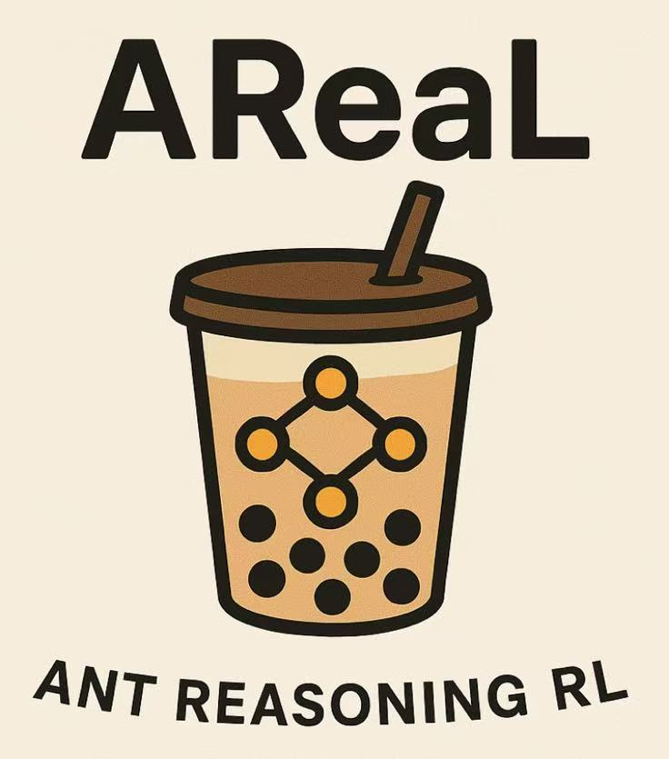

# AREAL

[AReaL](https://github.com/inclusionAI/AReaL)（Ant Reasoning RL）是由蚂蚁研究院强化学习实验室（RL Lab） 开发的一套开源 、完全异步的强化学习训练系统， 适用于大型推理模型。该系统基于开源项目 [RealHF](https://github.com/openpsi-project/ReaLHF) 致力于开源，提供训练细节、数据以及复现结果所需的基础设施，并提供模型本身。

AReaL项目已集成SwanLab，指引可见此文档：[Areal中的SwanLab配置](https://inclusionai.github.io/AReaL/cli_reference.html#swanlab-configuration)