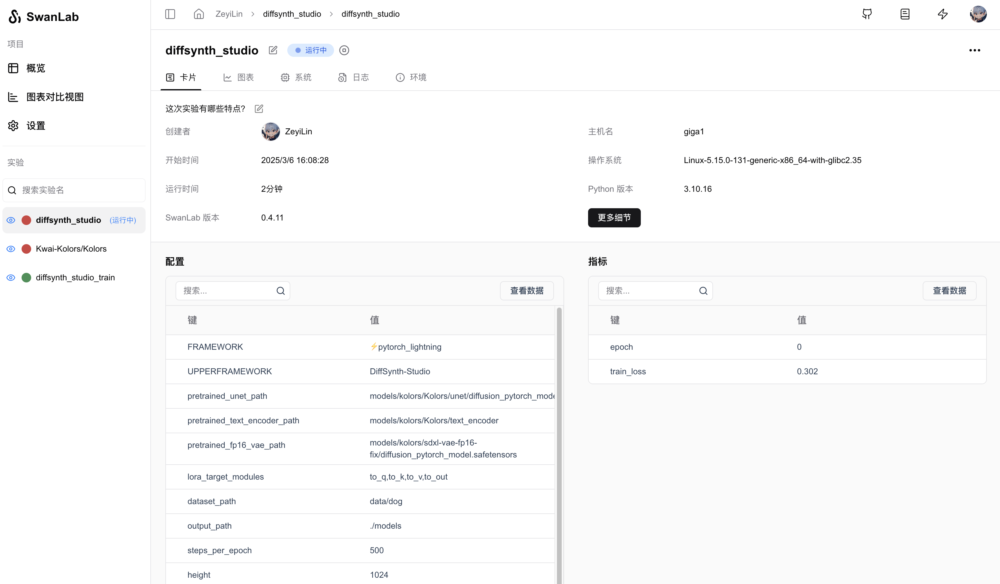
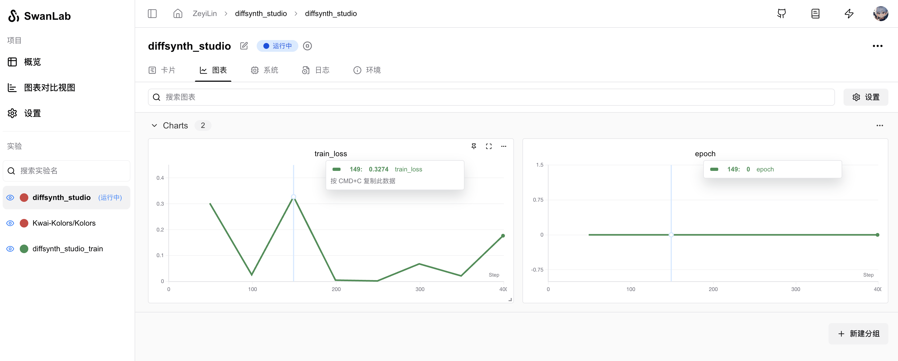

# DiffSynth Studio

[DiffSynth-Studio](https://github.com/modelscope/DiffSynth-Studio) 是 [ModelScope](https://modelscope.cn/) 推出的一个开源的扩散模型引擎，专注于图像与视频的风格迁移与生成任务。它通过优化架构设计（如文本编码器、UNet、VAE 等组件），在保持与开源社区模型兼容性的同时，显著提升计算性能，为用户提供高效、灵活的创作工具。

DiffSynth Studio 支持多种扩散模型，包括 Wan-Video、StepVideo、HunyuanVideo、CogVideoX、FLUX、ExVideo、Kolors、Stable Diffusion 3 等。


你可以使用DiffSynth Studio快速进行Diffusion模型训练，同时使用SwanLab进行实验跟踪与可视化。

[[toc]]


## 准备工作

**1. 克隆仓库并安装环境**

```bash
git clone https://github.com/modelscope/DiffSynth-Studio.git
cd DiffSynth-Studio
pip install -e .
pip install swanlab
```

**2. 准备数据集**

DiffSynth Studio 的数据集需要按下面的格式进行构建，比如将图像数据存放在`data/dog`目录下：

```bash
data/dog/
└── train
    ├── 00.jpg
    ├── 01.jpg
    ├── 02.jpg
    ├── 03.jpg
    ├── 04.jpg
    └── metadata.csv
```

`metadata.csv` 文件需要按下面的格式进行构建：

```csv
file_name,text
00.jpg,一只小狗
01.jpg,一只小狗
02.jpg,一只小狗
03.jpg,一只小狗
04.jpg,一只小狗
```

**3. 准备模型**

这里以Kolors模型为例，下载模型权重和VAE权重：

```bash
modelscope download --model=Kwai-Kolors/Kolors --local_dir models/kolors/Kolors
modelscope download --model=AI-ModelScope/sdxl-vae-fp16-fix --local_dir models/kolors/sdxl-vae-fp16-fix
```


## 设置SwanLab参数

在运行训练脚本时，添加`--use_swanlab`，即可将训练过程记录到SwanLab平台。

如果你需要离线记录，可以添加`--swanlab_mode "local"`。

```bash {3,4}
CUDA_VISIBLE_DEVICES="0" python examples/train/kolors/train_kolors_lora.py \
...
--use_swanlab \
--swanlab_mode "cloud"
```

## 开启训练

使用下面的命令即可开启训练，并使用SwanLab记录超参数、训练日志、loss曲线等信息：

```bash {11,12}
CUDA_VISIBLE_DEVICES="0" python examples/train/kolors/train_kolors_lora.py \
--pretrained_unet_path models/kolors/Kolors/unet/diffusion_pytorch_model.safetensors \
--pretrained_text_encoder_path models/kolors/Kolors/text_encoder \
--pretrained_fp16_vae_path models/kolors/sdxl-vae-fp16-fix/diffusion_pytorch_model.safetensors \
--dataset_path data/dog \
--output_path ./models \
--max_epochs 10 \
--center_crop \
--use_gradient_checkpointing \
--precision "16-mixed" \
--use_swanlab \
--swanlab_mode "cloud"
```





## 补充

如果你想要自定义SwanLab的项目名、实验名等参数，可以：

**1. 文生图任务**

在`DiffSynth-Studio/diffsynth/trainers/text_to_image.py`文件中，找到`swanlab_logger`变量的位置，修改`project`和`name`参数：

```python {6-7}
if args.use_swanlab:
    from swanlab.integration.pytorch_lightning import SwanLabLogger
    swanlab_config = {"UPPERFRAMEWORK": "DiffSynth-Studio"}
    swanlab_config.update(vars(args))
    swanlab_logger = SwanLabLogger(
        project="diffsynth_studio", 
        name="diffsynth_studio",
        config=swanlab_config,
        mode=args.swanlab_mode,
        logdir=args.output_path,
    )
    logger = [swanlab_logger]
```

**2. Wan-Video文生视频任务**

在`DiffSynth-Studio/examples/wanvideo/train_wan_t2v.py`文件中，找到`swanlab_logger`变量的位置，修改`project`和`name`参数：

```python {6-7}
if args.use_swanlab:
    from swanlab.integration.pytorch_lightning import SwanLabLogger
    swanlab_config = {"UPPERFRAMEWORK": "DiffSynth-Studio"}
    swanlab_config.update(vars(args))
    swanlab_logger = SwanLabLogger(
        project="wan", 
        name="wan",
        config=swanlab_config,
        mode=args.swanlab_mode,
        logdir=args.output_path,
    )
    logger = [swanlab_logger]
```