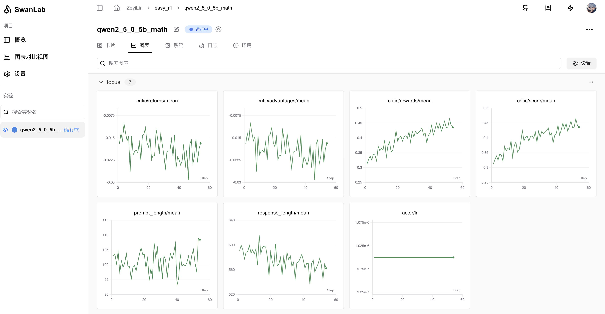

# EasyR1

[EasyR1](https://github.com/hiyouga/EasyR1) 是基于[veRL](https://github.com/volcengine/verl)的一个高效、可扩展、多模态强化学习LLM训练框架

EasyR1 受益于 veRL 的 HybridEngine 和 vLLM 0.7 的 SPMD mode，并适配了 Qwen2.5-VL 模型，在多模态几何题任务 Geometry3k 上通过 30 个 batch 的 GRPO 训练，即可提升 5% 验证集准确率。

> **作者hiyouga**：EasyR1旨在钻研多模态 RL 训练的难点，由团队的算法同学和工程同学共同迭代框架效率、算法表现和扩展性，未来将会支持更多的 RL 算法和多模态模型。

你可以使用EasyR1训练你的多模态RL模型，并使用SwanLab跟踪与可视化训练曲线。

## 1. 准备工作

在执行下面的命令之前，请先确保你的环境中已经安装了Python>=3.9，CUDA和PyTorch。

```bash
git clone https://github.com/hiyouga/EasyR1.git
cd EasyR1
pip install -e .
pip install git+https://github.com/hiyouga/MathRuler.git
pip install swanlab
```

:::warning 注意

EasyR1的依赖中有flash-attn，直接安装非常慢，请在[flash-attention预编译包](https://github.com/Dao-AILab/flash-attention/releases)中找到对应Python与CUDA版本的包，下载并安装。

:::

## 2. 训练Qwen2.5-7b数学模型

在`EasyR1`目录下，执行下面的命令，即可使用GRPO训练Qwen2.5-7b数学模型，并使用SwanLab进行跟踪与可视化：

```bash
bash examples/run_qwen2_5_7b_math_swanlab.sh
```



当然，这里我们可以剖析一下，由于EasyR1是原始 veRL 项目的一个干净分叉，所以继承了[veRL与SwanLab的集成](/zh/guide_cloud/integration/integration-verl.md)。所以这里我们来看`run_qwen2_5_7b_math_swanlab.sh`文件：

```sh {10}
set -x

export VLLM_ATTENTION_BACKEND=XFORMERS

MODEL_PATH=Qwen/Qwen2.5-7B-Instruct  # replace it with your local file path

python3 -m verl.trainer.main \
    config=examples/grpo_example.yaml \
    worker.actor.model.model_path=${MODEL_PATH} \
    trainer.logger=['console','swanlab'] \
    trainer.n_gpus_per_node=4
```

只需要在`python3 -m verl.trainer.main`参数中加入一行`trainer.logger=['console','swanlab']`，即可使用SwanLab进行跟踪与可视化。

## 3. 训练Qwen2.5-VL-7b多模态模型

在`EasyR1`目录下，执行下面的命令，即可使用GRPO训练Qwen2.5-VL-7b多模态模型，并使用SwanLab进行跟踪与可视化：

```bash
bash examples/run_qwen2_5_vl_7b_geo_swanlab.sh
```

## 写在最后

EasyR1 是 [LLaMA Factory](https://github.com/hiyouga/LLaMA-Factory) 作者 [hiyouga](https://github.com/hiyouga) 的全新开源项目，一个适用于多模态大模型的强化学习框架。感谢 [hiyouga](https://github.com/hiyouga) 为全球开源生态的贡献，SwanLab也将继续与AI开发者同行。


