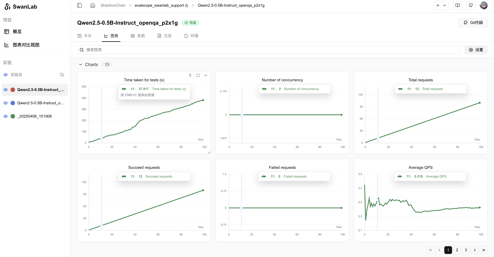

# EvalScope

[EvalScope](https://github.com/modelscope/evalscope) 是 [ModelScope](https://modelscope.cn/) 的官方模型评估和基准测试框架，专为满足各种评估需求而设计。它支持各种模型类型，包括大型语言模型、多模态模型、Embedding模型、Reranker模型和 CLIP 模型。


该框架支持多种评估场景，如端到端的RAG评估、竞技场模式和推理性能测试。它内置了MMLU、CMMLU、C-Eval和GSM8K等基准和指标。与 [ms-swift](https://github.com/modelscope/ms-swift) 训练框架无缝集成，EvalScope实现了单击评估，为模型训练和评估提供全面支持 🚀。

现在，你可以使用 EvalScope 评估LLM性能，同时使用SwanLab方便地跟踪、对比、可视化。

[Demo](https://swanlab.cn/@ShaohonChen/perf_benchmark/overview)

## 1. 准备工作

安装下面的环境：

```bash
pip install evalscope
pip install swanlab
```

如果你需要扩展evalscope的更多功能，可以按需安装：

```bash
pip install -e '.[opencompass]'   # Install OpenCompass backend
pip install -e '.[vlmeval]'       # Install VLMEvalKit backend
pip install -e '.[rag]'           # Install RAGEval backend
pip install -e '.[perf]'          # Install Perf dependencies
pip install -e '.[app]'           # Install visualization dependencies
pip install -e '.[all]'           # Install all backends (Native, OpenCompass, VLMEvalKit, RAGEval)
```


## 2. Qwen模型推理性能压测

如果你希望评估`Qwen2.5-0.5B-Instruct`在[openqa格式默认数据集](https://www.modelscope.cn/datasets/AI-ModelScope/HC3-Chinese)上的表现，同时使用`SwanLab`观测性能，可以运行下面的命令：

```bash {5,6}
export CUDA_VISIBLE_DEVICES=0
evalscope perf \
 --model Qwen/Qwen2.5-0.5B-Instruct \
 --dataset openqa \
 --number 20 \
 --parallel 2 \
 --limit 5 \
 --swanlab-api-key '你的API Key' \
 --name 'qwen2.5-openqa' \
 --temperature 0.9 \
 --api local
```

其中`swanlab-api-key`是你的SwanLab API Key，`name`是实验名。  
如果你希望设置自定义项目名，可以去往`EvalScope`源码的 `evalscope/perf/benchmark.py` 的 `statistic_benchmark_metric_worker`函数，找到swanlab部分，修改`project`参数。

**可视化效果案例：**



## 上传到私有化部署版

如果你希望将评估结果上传到私有化部署版，可以先在命令行登录到私有化部署版。比如你的部署地址是`http://localhost:8000`，可以运行：

```bash
swanlab login --host http://localhost:8000
```

完成登录后，再运行`evalscope`的命令，就可以将评估结果上传到私有化部署版了。