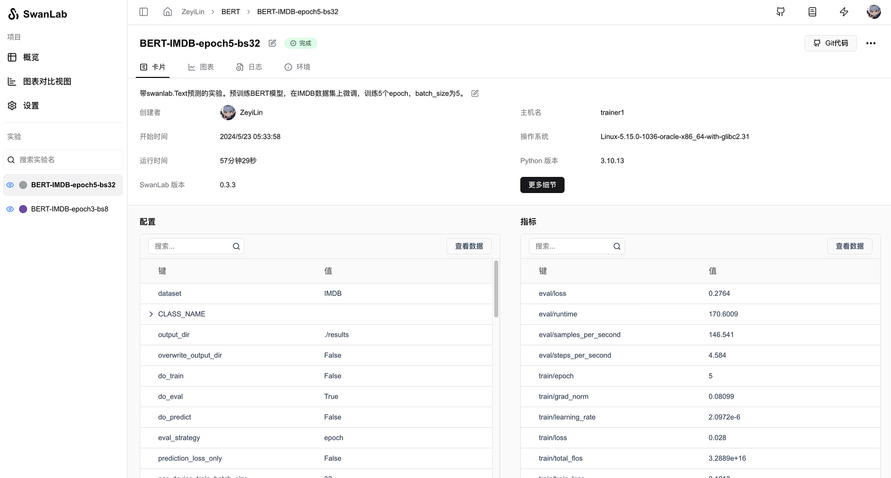
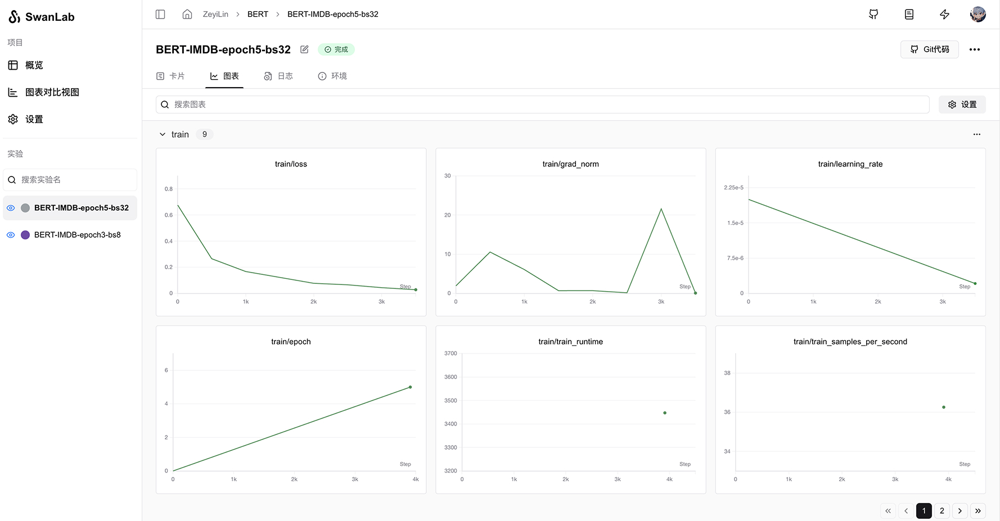

# 🤗HuggingFace Transformers

[](https://colab.research.google.com/drive/1iYwrAM4ToCWt5p5hlrrkHlQqBIav_r2E?usp=sharing)

Hugging Face 的 [Transformers](https://github.com/huggingface/transformers) 是一个非常流行的开源库，它提供了大量预训练的模型，主要用于自然语言处理（NLP）任务。这个库的目标是使最新的模型能够易于使用，并支持多种框架，如 TensorFlow 和 PyTorch。


你可以使用Transformers快速进行模型训练，同时使用SwanLab进行实验跟踪与可视化。

> `transformers>=4.50.0` 的版本，已官方集成了SwanLab  
> 如果你的版本低于4.50.0，请使用[SwanLabCallback集成](#_4-swanlabcallback集成)。

## 1. 一行代码完成集成

只需要在你的训练代码中，找到`TrainingArguments`部分，添加`report_to="swanlab"`参数，即可完成集成。

```python
from transformers import TrainingArguments, Trainer

args = TrainingArguments(
    ...,
    report_to="swanlab" # [!code ++]

)

trainer = Trainer(..., args=args)
```

如果你想要设定一下实验名，以区分每次训练，可以设置`run_name`参数：

```python
args = TrainingArguments(
    ...,
    report_to="swanlab",
    run_name="great_try_1", # [!code ++]
)
```

## 2. 自定义项目/工作空间

默认下，项目名会使用你运行代码的`目录名`，实验名等于`output_dir`。

如果你想自定义项目名、实验名或工作空间，可以设置`SWANLAB_PROJECT`和`SWANLAB_WORKSPACE`环境变量：

::: code-group

```python
import os  # [!code ++]

os.environ["SWANLAB_PROJECT"]="qwen2-sft"  # [!code ++]
os.environ["SWANLAB_WORKSPACE"]="EmotionMachine"  # [!code ++]

...

from transformers import TrainingArguments, Trainer

args = TrainingArguments(
    ...,
    report_to="swanlab"

)

trainer = Trainer(..., args=args)
```

```bash [Command Line（Linux/MacOS）]
export SWANLAB_PROJECT="qwen2-sft"
export SWANLAB_WORKSPACE="EmotionMachine"
```

```bash [Command Line（Windows）]
set SWANLAB_PROJECT="qwen2-sft"
set SWANLAB_WORKSPACE="EmotionMachine"
```

:::

## 3. 案例代码：Bert文本分类

```python
import evaluate
import numpy as np
from datasets import load_dataset
from transformers import AutoModelForSequenceClassification, AutoTokenizer, Trainer, TrainingArguments


def tokenize_function(examples):
    return tokenizer(examples["text"], padding="max_length", truncation=True)


def compute_metrics(eval_pred):
    logits, labels = eval_pred
    predictions = np.argmax(logits, axis=-1)
    return metric.compute(predictions=predictions, references=labels)


dataset = load_dataset("yelp_review_full")

tokenizer = AutoTokenizer.from_pretrained("bert-base-cased")

tokenized_datasets = dataset.map(tokenize_function, batched=True)

small_train_dataset = tokenized_datasets["train"].shuffle(seed=42).select(range(1000))
small_eval_dataset = tokenized_datasets["test"].shuffle(seed=42).select(range(1000))

metric = evaluate.load("accuracy")

model = AutoModelForSequenceClassification.from_pretrained("bert-base-cased", num_labels=5)

training_args = TrainingArguments(
    output_dir="test_trainer",
    num_train_epochs=3,
    logging_steps=50,
    report_to="swanlab", # [!code ++]
    run_name="bert_train",
)

trainer = Trainer(
    model=model,
    args=training_args,
    train_dataset=small_train_dataset,
    eval_dataset=small_eval_dataset,
    compute_metrics=compute_metrics,
)

trainer.train()
```

## 4. SwanLabCallback集成

如果你使用的是`Transformers<4.50.0`的版本，或者你希望更灵活地控制SwanLab的行为，则可以使用SwanLabCallback集成。

### 4.1 引入SwanLabCallback

```python
from swanlab.integration.transformers import SwanLabCallback
```

**SwanLabCallback**是适配于Transformers的日志记录类。

**SwanLabCallback**可以定义的参数有：

- project、experiment_name、description 等与 swanlab.init 效果一致的参数, 用于SwanLab项目的初始化。
- 你也可以在外部通过`swanlab.init`创建项目，集成会将实验记录到你在外部创建的项目中。

### 4.2 传入Trainer

```python (1,7,12)
from swanlab.integration.transformers import SwanLabCallback
from transformers import Trainer, TrainingArguments

...

# 实例化SwanLabCallback
swanlab_callback = SwanLabCallback(project="hf-visualization")

trainer = Trainer(
    ...
    # 传入callbacks参数
    callbacks=[swanlab_callback],
)

trainer.train()
```

### 4.3 完整案例代码

```python (4,41,50)
import evaluate
import numpy as np
import swanlab
from swanlab.integration.transformers import SwanLabCallback
from datasets import load_dataset
from transformers import AutoModelForSequenceClassification, AutoTokenizer, Trainer, TrainingArguments


def tokenize_function(examples):
    return tokenizer(examples["text"], padding="max_length", truncation=True)


def compute_metrics(eval_pred):
    logits, labels = eval_pred
    predictions = np.argmax(logits, axis=-1)
    return metric.compute(predictions=predictions, references=labels)


dataset = load_dataset("yelp_review_full")

tokenizer = AutoTokenizer.from_pretrained("bert-base-cased")

tokenized_datasets = dataset.map(tokenize_function, batched=True)

small_train_dataset = tokenized_datasets["train"].shuffle(seed=42).select(range(1000))
small_eval_dataset = tokenized_datasets["test"].shuffle(seed=42).select(range(1000))

metric = evaluate.load("accuracy")

model = AutoModelForSequenceClassification.from_pretrained("bert-base-cased", num_labels=5)

training_args = TrainingArguments(
    output_dir="test_trainer",
    # 如果只需要用SwanLab跟踪实验，则将report_to参数设置为”none“
    report_to="none",
    num_train_epochs=3,
    logging_steps=50,
)

# 实例化SwanLabCallback
swanlab_callback = SwanLabCallback(experiment_name="TransformersTest")

trainer = Trainer(
    model=model,
    args=training_args,
    train_dataset=small_train_dataset,
    eval_dataset=small_eval_dataset,
    compute_metrics=compute_metrics,
    # 传入callbacks参数
    callbacks=[swanlab_callback],
)

trainer.train()
```

### 4.4 GUI效果展示

超参数自动记录：



指标记录：




### 4.5 拓展：增加更多回调

试想一个场景，你希望在每个epoch结束时，让模型推理测试样例，并用swanlab记录推理的结果，那么你可以创建一个继承自`SwanLabCallback`的新类，增加或重构生命周期函数。比如：

```python
class NLPSwanLabCallback(SwanLabCallback):    
    def on_epoch_end(self, args, state, control, **kwargs):
        test_text_list = ["example1", "example2"]
        log_text_list = []
        for text in test_text_list:
            result = model(text)
            log_text_list.append(swanlab.Text(result))
            
        swanlab.log({"Prediction": test_text_list}, step=state.global_step)
```

上面是一个在NLP任务下的新回调类，增加了`on_epoch_end`函数，它会在`transformers`训练的每个epoch结束时执行。

查看全部的Transformers生命周期回调函数：[链接](https://github.com/huggingface/transformers/blob/main/src/transformers/trainer_callback.py#L311)

## 5. 环境变量

参考：[HuggingFace Docs: transformers.integrations.SwanLabCallback](https://huggingface.co/docs/transformers/main/en/main_classes/callback#transformers.integrations.SwanLabCallback)