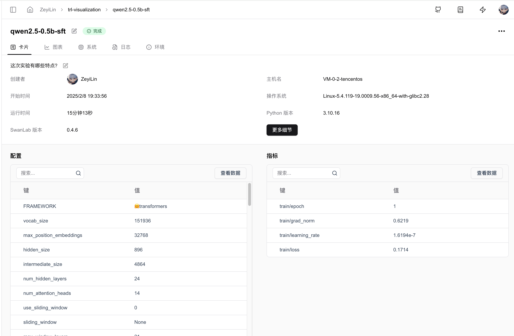
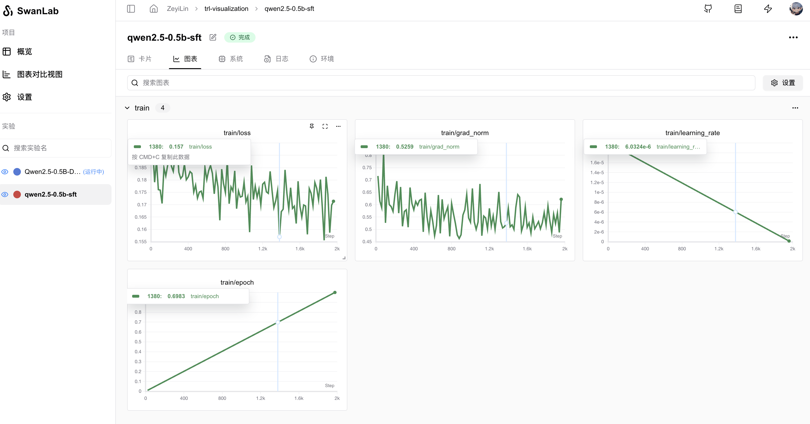

# 🤗HuggingFace Trl

[TRL](https://github.com/huggingface/trl) (Transformers Reinforcement Learning，用强化学习训练Transformers模型) 是一个领先的Python库，旨在通过监督微调（SFT）、近端策略优化（PPO）和直接偏好优化（DPO）等先进技术，对基础模型进行训练后优化。TRL 建立在 🤗 Transformers 生态系统之上，支持多种模型架构和模态，并且能够在各种硬件配置上进行扩展。


你可以使用Trl快速进行模型训练，同时使用SwanLab进行实验跟踪与可视化。

[Demo](https://swanlab.cn/@ZeyiLin/trl-visualization/runs/q1uf2r4wmao7iomc5z1ff/overview)

> `transformers>=4.50.0` 的版本，已官方集成了SwanLab  
> 如果你的版本低于4.50.0，请使用[SwanLabCallback集成](#_5-使用swanlabcallback)。

## 1. 一行代码集成

只需要在你的训练代码中，找到HF的`Config`部分（比如`SFTConfig`、`GRPOConfig`等），添加`report_to="swanlab"`参数，即可完成集成。

```python
from trl import SFTConfig, SFTTrainer

args = SFTConfig(
    ...,
    report_to="swanlab" # [!code ++]
)

trainer = Trainer(..., args=args)
```

## 2. 自定义项目名

默认下，项目名会使用你运行代码的`目录名`。

如果你想自定义项目名，可以设置`SWANLAB_PROJECT`环境变量：

::: code-group

```python
import os
os.environ["SWANLAB_PROJECT"]="qwen2-sft"
```

```bash [Command Line（Linux/MacOS）]
export SWANLAB_PROJECT="qwen2-sft"
```

```bash [Command Line（Windows）]
set SWANLAB_PROJECT="qwen2-sft"
```

:::

## 3. 案例代码

使用Qwen2.5-0.5B-Instruct模型，使用Capybara数据集进行SFT训练：

```python
from trl import SFTConfig, SFTTrainer
from datasets import load_dataset

dataset = load_dataset("trl-lib/Capybara", split="train")

training_args = SFTConfig(
    output_dir="Qwen/Qwen2.5-0.5B-SFT",
    per_device_train_batch_size=1,
    per_device_eval_batch_size=1,
    num_train_epochs=1,
    logging_steps=20,
    learning_rate=2e-5,
    report_to="swanlab", # [!code ++]
    )

trainer = SFTTrainer(
    args=training_args,
    model="Qwen/Qwen2.5-0.5B-Instruct",
    train_dataset=dataset,
)

trainer.train()
```

DPO、GRPO、PPO等同理，只需要将`report_to="swanlab"`传入对应的`Config`即可。

## 4. GUI效果展示

**超参数自动记录：**



**指标记录：**



## 5.使用SwanLabCallback

如果你使用的是`Transformers<4.50.0`的版本，或者你希望更灵活地控制SwanLab的行为，则可以使用SwanLabCallback集成。

### 5.1 引入SwanLabCallback

```python
from swanlab.integration.transformers import SwanLabCallback
```

**SwanLabCallback**是适配于Transformers的日志记录类。

**SwanLabCallback**可以定义的参数有：

- project、experiment_name、description 等与 swanlab.init 效果一致的参数, 用于SwanLab项目的初始化。
- 你也可以在外部通过`swanlab.init`创建项目，集成会将实验记录到你在外部创建的项目中。

### 5.2 传入Trainer

```python (1,7,12)
from swanlab.integration.transformers import SwanLabCallback
from trl import SFTConfig, SFTTrainer

...

# 实例化SwanLabCallback
swanlab_callback = SwanLabCallback(project="trl-visualization")

trainer = SFTTrainer(
    ...
    # 传入callbacks参数
    callbacks=[swanlab_callback],
)

trainer.train()
```

### 5.3 完整案例代码

使用Qwen2.5-0.5B-Instruct模型，使用Capybara数据集进行SFT训练：

```python (3,7,26)
from trl import SFTConfig, SFTTrainer
from datasets import load_dataset
from swanlab.integration.transformers import SwanLabCallback

dataset = load_dataset("trl-lib/Capybara", split="train")

swanlab_callback = SwanLabCallback(
    project="trl-visualization",
    experiment_name="Qwen2.5-0.5B-SFT",
    description="测试使用trl框架sft训练"
)

training_args = SFTConfig(
    output_dir="Qwen/Qwen2.5-0.5B-SFT",
    per_device_train_batch_size=1,
    per_device_eval_batch_size=1,
    num_train_epochs=1,
    logging_steps=20,
    learning_rate=2e-5,
    report_to="none",
    )

trainer = SFTTrainer(
    args=training_args,
    model="Qwen/Qwen2.5-0.5B-Instruct",
    train_dataset=dataset,
)

trainer.train()
```

DPO、GRPO、PPO等同理，只需要将`SwanLabCallback`传入对应的`Trainer`即可。