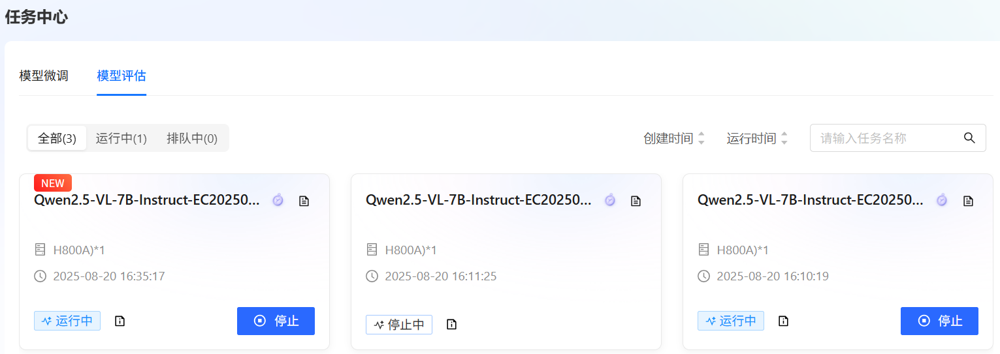
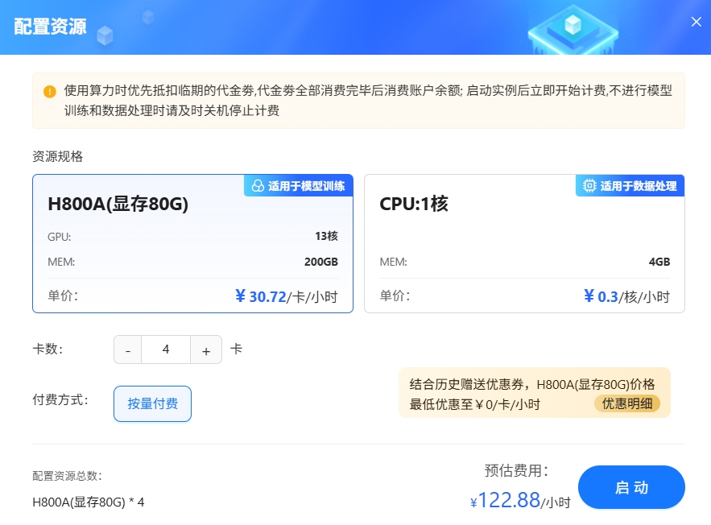

# 微调基于Qwen2.5-VL-7B-Instruct的自动驾驶辅助模型

* 作者：LLaMA-Factory Online官方
* 联系邮箱：<LLaMA-FactoryOnline@zetyun.com>

<div align="center">
  <figure>
  
  </figure>
</div>

[**LLaMA-Factory Online**](https://www.llamafactory.com.cn/?utm_source=swablab)是与明星开源项目 LLaMA-Factory 官方合作打造的在线大模型训练与微调服务平台，底层提供高性能、高弹性GPU算力资源，为具有微调需求、编码与工程能力较为基础的用户群体，提供开箱即用、低代码、全链路功能覆盖的大模型训练与微调服务。目前L la m-Factory Online已支持SwanLab在线跟踪工具，本教程

在**LLaMA-Factory Online**，您不需要进行复杂的环境与资源配置，通过可视化界面操作即可快速地进行模型微调与评估，同时方便地使用Swanlab进行实验跟踪与可视化。在本文中，我们以基于**Qwen2.5-VL-7B-Instruct微调自动驾驶辅助模型**为例，讲解如何在LLaMA-Factory Online进行模型微调与评估，同时使用Swanlab监控训练过程。

相关参考链接：

* 🎉LlaMA-Factory Online访问地址：https://www.llamafactory.online/

* 自动驾驶辅助模型数据集：https://huggingface.co/datasets/AlayaNeW/QA_from_CoVLA_zh

* Qwen2.5-VL模型地址：https://www.modelscope.cn/models/Qwen/Qwen2.5-VL-7B-Instruct

<div align="center">
  <figure>
  
  <figcaption>LLaMA-Factory Online界面</figcaption>
  </figure>
</div>

## 目录

[[toc]]

## 使用模型和数据集介绍

智能驾驶领域正经历从“感知智能”向“认知智能”的深刻演进。在复杂多变的真实交通环境中，自动驾驶系统不仅需要精准识别车道线、车辆、行人等视觉信息，更需理解场景语义、响应自然语言指令，并做出符合安全逻辑与交通规则的决策。传统模块化系统（感知-规划-控制）在应对模糊或突发场景时往往缺乏灵活推理能力，而融合视觉与语言理解的多模态大模型为此提供了突破性解决方案。

### 模型介绍

<div align="center">
  <figure>
  
  <figcaption>Qwen2.5-VL模型结构图</figcaption>
  </figure>
</div>

**Qwen2.5-VL-7B-Instruct**作为支持VLA（Vision-Language-Action）架构的先进模型，在智能驾驶领域展现出强大潜力。它能够接收来自车载摄像头的实时图像或视频流作为视觉输入，同时理解驾驶员或车载系统发出的自然语言指令（如“前面堵车了，能换条路吗？”或“右转车道有自行车，帮我等一下”），实现对环境与意图的联合建模。基于对交通状况的全面理解，模型可生成结构化、可执行的操作建议。

关于**Qwen2.5-VL-7B-Instruct**模型的详细信息可以参考：<https://www.modelscope.cn/models/Qwen/Qwen2.5-VL-7B-Instruct>

### 数据集介绍

<div align="center">
  <figure>
  
  <figcaption>QA_from_CoVLA_zh数据集展示，左边为图像数据、右边为聊天数据</figcaption>
  </figure>
</div>

[`QA_from_CoVLA_zh`](https://huggingface.co/datasets/AlayaNeW/QA_from_CoVLA_zh/blob/main/README.md)是一个专为多模态大模型微调任务构建，聚焦自动驾驶场景下的视觉识别需求的数据集。它是基于`QA_from_CoVLA`数据集进行翻译整理的中文版本，并适配了LLaMA-Factory框架微调数据集格式。

* 支持的任务：多模态图片识别理解任务
* 数据组成：
    * 图片：`images`
    * 数据集配置文件`dataset_info.json,QA_from_CoVLA_zh.json`
* 数据来源
    * 图片：基于`CoVLA`数据集中的`images`，过滤筛选出400张图片。 
    * QA问答对：基于`QA_from_CoVLA`数据集进行整理翻译。
* 数据结构：该数据集不区分训练集和测试集，存放在`data/` 目录下，使用者可直接下载使用。

### 任务总览

| 配置参数 | 配置项                 | 是否预置 | 说明                                               |
| -------- | :--------------------- | :------- | -------------------------------------------------- |
| 模型     | Qwen2.5-VL-7B-Instruct | 是       | 经过指令微调，7B参数多模态模型，擅图文理解与生成。 |
| 数据集   | QA_from_CoVLA_zh       | 是       | 智能驾驶适合多模态场景的数据集。                   |
| GPU      | H800*4（推荐）         | -        | H800**1（最少）。                                  |
| 微调方法 | lora                   | -        | 显著降低计算与存储成本，兼具高性能与部署灵活性。   |

### 本教程所需算力资源

| 评估阶段                      | 资源配置 | 过程描述                     | 时长（分钟） |
| ----------------------------- | -------- | ---------------------------- | ------------ |
| 模型微调                      | H800 × 4 | 使用推荐资源配置进行模型微调 | 16.5         |
| 微调后模型 Evaluate & Predict | H800 × 4 | 使用微调后模型进行评估与预测 | 3.88         |
| 原生模型 Evaluate & Predict   | H800 × 4 | 使用原始模型进行评估与预测   | 12.2         |

## Llama-Factory Online运行方法

运行前需要准备的工作

* 用户已经获取LLaMA Factory Online平台账户和密码，如果需要帮助或尚未注册，可参考[注册账户](/docs/documents/quickstart/loginAccount)完成注册。
* 当前账号的余额充裕，可满足模型微调服务的需要。点击可了解[最新的活动](/docs/documents/quickstart/freetrialguide)及[费用信息](/docs/documents/recharge/charging)，或前往<Anchor label="充值" href="/cost/recharge" />，如需了解更多请[联系我们](/docs/documents/recharge/refill#发票)。
* 在本次微调任务中，我们将使用SwanLab记录整个微调过程。请您访问[SwanLab](https://www.swanlab.cn/)并完成注册。

LLaMA Factory Online支持通过**任务模式**和**实例模式**运行微调任务，不同模式下的微调/评估操作详情如下所示。

支持运行模式，可以直接点击如下链接跳转到希望的模式，总体来说任务模式使用体验更便捷、更省算力，实例模式更容易调试debug：

* [LLaMA-Factory Online任务模式微调](#LLaMA-FactoryOnline任务模式微调)
* [LLaMA-Factory Online实例模式微调](#LLaMA-FactoryOnline实例模式微调)

### LLaMA-Factory Online任务模式微调

登录[SwanLab](https://www.swanlab.cn/)后，选择[设置/常规]菜单项，下滑主页面到找到[开发]模块，获取SwanLab的API Key，例如下图所示。

<div align="center">
  <figure>
  
  <figcaption>获取SwanLab API</figcaption>
  </figure>
</div>

登录已注册的[LLaMA-Factory Online](https://www.llamafactory.online/)平台，切换至[微调/模型微调]菜单项，进入模型微调配置页面。点击页面上方的“配置SwanLab API Key”链接，例如下图所示，进入用户中心页面。

<div align="center">
  <figure>
  
  </figure>
</div>

在用户中心页面的“访问管理”模块中，将第一步获取的`SwanLab API Key`填入对应字段，点击“校验”按钮。若状态显示“校验成功”，连接SwanLab成功，例如下图所示。

<div align="center">
  <figure>
  
  </figure>
</div>

返回“微调/模型微调”菜单项，进入模型微调参数配置页面，本实践参数配置详情如下所示。

<div align="center">
  <figure>
  
  </figure>
</div>

* `基础模型`选择`Qwen2.5-VL-7B-Instruct`，如下图高亮①所示。
* `训练数据-公共数据`选择`QA_from_CoVLA_zh`，如下图高亮②所示。
* `截断长度`修改为`2048`，如下图高亮③所示。
* `资源规格`配置GPU卡数为4，如下图高亮④所示。
* 价格优惠本实践中选择“极速尊享”，如下图高亮⑤所示，您可按需进行选择。
* 其余参数可根据实际需求调整，具体说明可参考[参数说明](https://llamafactory.readthedocs.io/zh-cn/latest/advanced/arguments.html)，本实践中的其他参数均保持默认值。

:::tip
配置模型与数据集后，系统将根据所需资源及其相关参数，动态预估任务运行时长及微调费用，您可在页面底部查看预估结果。
:::

参数配置完成后，单击“开始训练”按钮，进入[任务中心/模型微调]列表页面，以查看任务的运行状态，例如下图高亮①所示。

<div align="center">
  <figure>
  
  </figure>
</div>

点击图标，进入微调任务信息查看页面，切换至“训练追踪”Tab页，单击“立即进入”按钮，例如下图所示，进入SwanLab训练追踪页面。

<div align="center">
  <figure>
  
  </figure>
</div>

您在SwanLab训练追踪页面可以查看：损失曲线图（train/loss）、学习率变化图（train/learning_rate）、评估指标图（eval/accuracy等）、GPU使用率图、显存占用图、系统资源监控图、超参数面板及自定义图表（如混淆矩阵、ROC曲线）等，全面可视化训练过程，例如下图所示。

<div align="center">
  <figure>
  
  </figure>
</div>

:::note  
任务状态流转至“运行中”之后，您可开始查看训练追踪图表。
:::

切换至LLaMA Factory Online的“微调/任务中心/模型微调”列表页面，点击图标，在[基本信息]页面单击“评估”按钮，进入模型评估页面，选择微调时的数据集，例如下图高亮①所示，其余评估参数保持默认即可。

<div align="center">
  <figure>
  
  </figure>
</div>

参数配置完成后，单击“开始评估”按钮，进入[任务中心/模型评估]列表页面，以查看任务运行状态，例如下图所示。

<div align="center">
  <figure>
  
  </figure>
</div>

:::tip
配置模型与数据集后，系统将根据所需资源及其相关参数，动态预估任务运行时长及微调费用，您可在页面底部查看预估结果。
:::

点击图标，进入任务基本信息查看页面。用户可查看评估任务的基本信息、日志以及评估结果。

### LLaMA-Factory Online实例模式微调

登录已注册的[LLaMA-Factory Online](https://www.llamafactory.online/)平台，选择[实例空间]菜单项，进入实例空间页面，例如下图所示。

<div align="center">
  <figure>
  
  </figure>
</div>

单击上图“开始微调”按钮，进入[配置资源]页面，选择GPU资源，卡数填写`4`，其他参数保持为默认值，例如下图所示。

<div align="center">
  <figure>
  
  </figure>
</div>

单击“启动”按钮，进入LLaMA Factory Online在线WebUI微调配置页面，本实践参数配置详情如下所示。

* `语言`选择`zh`，如下图高亮①所示。
* `模型名称`选择`Qwen2.5-VL-7B-Instruct`，如下图高亮②所示。系统默认填充模型路径`/shared-only/models/Qwen/Qwen2.5-VL-7B-Instruct`。
* `微调方法`选择`lora`，如下图高亮④所示。
* 选择“train”功能，`训练方式`保持`Supervised Fine-Tuning`，如下图高亮⑤所示。
* `数据路径`保持`/workspace/llamafactory/data`，如下图高亮⑥所示。
* `数据集`选择平台已预置的`QA_from_CoVLA_zh`，如下图高亮⑦所示。
* `SwanLab参数设置`勾选`使用Swanlab`，例如下图高亮⑧所示。
* `SwanLab API秘钥`填写已获取API Key，例如下图高亮⑨所示。
* 其余参数可根据实际需求调整，具体说明可参考[参数说明](https://llamafactory.readthedocs.io/zh-cn/latest/advanced/arguments.html)，本实践中的其他参数均保持默认值。

<div align="center">
  <figure>
  
  </figure>
</div>

参数配置完成后，点击“开始”按钮启动微调任务。页面底部将实时显示微调过程中的日志信息，当页面弹出`SwanLab链接`访问链接时，例如下图所示。

<div align="center">
  <figure>
  
  </figure>
</div>

点击链接即可查看模型的训练追踪图表，例如下图所示。

<div align="center">
  <figure>
  
  </figure>
</div>

微调页面底部同时展示当前微调进度及Loss变化曲线。经过多轮微调后，例如下图高亮②所示，从图中可以看出Loss逐渐趋于收敛。微调完成后，系统提示“训练完毕”，例如下图高亮③所示。

<div align="center">
  <figure>
  
  </figure>
</div>

## 测试微调自动驾驶模型效果

### 微调后模型对话

切换至“chat”界面，如下图高亮①所示；选择检查点路径，如下图高亮②所示；单击“加载模型”按钮，微调的模型加载后，在系统提示词处填入提示词，如下图高亮④所示；上传[素材图片](https://llamafactory-online-assets.oss-cn-beijing.aliyuncs.com/llamafactory-online/docs/v2.0/documents/Practice/item.png)后输入用户模拟词“自动驾驶车辆应该关注哪些风险？”，观察模型回答，如下图高亮⑥所示。

<div align="center">
  <figure>
  
  </figure>
</div>

### 原生模型对话

清空“检查点路径”中的LoRA配置，单击下图高亮②所示的“卸载模型”按钮，卸载微调后的模型，模型卸载完成后，单击“加载模型”按钮，加载原生的`Qwen2.5-VL-7B-Instruct`模型进行对话，其余配置保持不变。用户模拟词依旧输入“自动驾驶车辆应该关注哪些风险？”，观察模型回答，如下图高亮⑤所示。

<div align="center">
  <figure>
  
  </figure>
</div>

综合看来通过使用微调后的模型进行对话，可以获得更具参考价值的回答。相较于原生模型，后者往往提供的是宽泛且笼统的可能性描述，而经过特定任务或数据集微调的模型能够基于实际的图片场景生成更为精准、有针对性的回答。

* 提高回答的准确性：根据具体的图像内容提供详细且准确的信息。
* 增强实用性：减少无关信息，聚焦于与用户查询最相关的细节。
* 提升用户体验：通过更贴近实际场景的回答，使交互过程更加流畅和高效。

### 微调后模型评估

切换至“Evaluate & Predict”页面，选择微调后模型的检查点路径，例如下图高亮①所示；然后选择平台预置的`QA_from_CoVLA_zh`数据集，并根据实际需求配置评估参数（本实践的参数设置如下图所示）。

<div align="center">
  <figure>
  
  </figure>
</div>

参数配置完成后，点击“开始”按钮即可启动评估，页面底部将实时显示评估过程中的日志信息，评估完成后，记录评估结果，结果如下所示。

```shell
{
  "predict_bleu-4": 52.764348416666664,
  "predict_model_preparation_time": 0.0053,
  "predict_rouge-1": 71.00543958333333,
  "predict_rouge-2": 57.82092183333333,
  "predict_rouge-l": 70.30141458333334,
  "predict_runtime": 232.7091,
  "predict_samples_per_second": 5.157,
  "predict_steps_per_second": 0.645
}
```

结果解读：该模型在生成任务中表现出色，`BLEU-4`得分为`52.76`，`ROUGE-L`达到`70.30`，表明生成文本在词汇匹配、短语重合和句子级逻辑连贯性方面均具有较高质量。同时，模型推理效率良好，准备时间仅`0.0053`秒，平均每秒可处理`5.16`个样本，整体性能稳定且具备实际应用价值。

### 原生模型评估原生模型评估

切换至“Evaluate & Predict”页面，清空检查点路径配置，数据集依旧选择平台预置的`QA_from_CoVLA_zh`数据集，并根据实际需求配置评估参数（本实践的参数设置如下图所示）。

<div align="center">
  <figure>
  
  </figure>
</div>

完成配置后，点击“开始”按钮即可启动评估，页面底部将实时显示评估过程中的日志信息，评估完成后，记录评估结果，结果如下所示。

```shell
{
  "predict_bleu-4": 5.996730166666667,
  "predict_model_preparation_time": 0.0047,
  "predict_rouge-1": 29.889636416666665,
  "predict_rouge-2": 7.416755416666667,
  "predict_rouge-l": 22.993275999999998,
  "predict_runtime": 734.3082,
  "predict_samples_per_second": 1.634,
  "predict_steps_per_second": 0.204
}
```

结果解读：该模型在生成任务中的表现较差，`BLEU-4`得分为`6.00`，`ROUGE-L`为`22.9`9，且`ROUGE-2`低至`7.42`，表明生成文本在`n-gram`匹配、短语重合度和句子级语义连贯性方面与参考文本存在较大差距，生成质量较低。尽管模型准备时间极短（仅`0.0047`秒），但推理速度较慢，总运行时间达`734`秒（约`12.2`分钟），每秒仅处理约1.63个样本，效率偏低。

对比两组结果可见，第一组模型在生成质量与推理效率上均显著优于第二组：其`BLEU-4`（`52.76`vs`6.00`）、`ROUGE-L`（`70.30`vs`22.99`）等指标远高于第二组，且推理速度达`5.16`样本/秒，是第二组（`1.63`样本/秒）的三倍以上，运行时间更短。综合表明，微调后模型不仅输出更准确、连贯，且响应更快，具备更强的实用性与部署价值。

## 结论

用户可通过LLaMA-Factory Online平台预置的模型及数据集完成快速微调与效果验证，并方便地使用Swanlab进行实验监控。

从上述实践案例可以看出，基于`Qwen2.5-VL-7B-Instruct`模型，采用LoRA方法在`QA_from_CoVLA_zh`角色扮演数据集上进行指令微调后，模型在问题理解、行为指导等方面均有显著提升。

本实践为构建高效能、轻量化的多模态自动驾驶感知系统提供了可复用的技术路径，未来可进一步探索多模态输入输出融合、模型在线增量学习与动态场景自适应能力，持续提升系统在复杂真实环境下的感知性与决策智能化水平。
