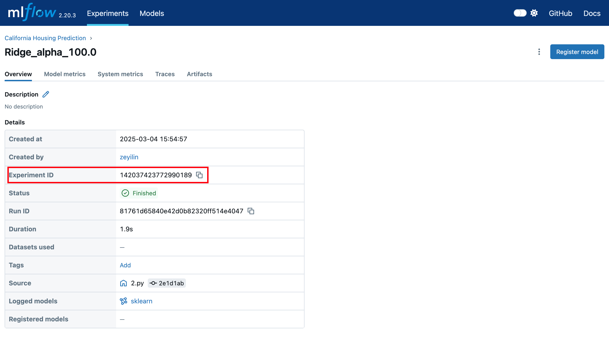

# MLFlow

[MLFlow](https://github.com/mlflow/mlflow) 是一个开源的机器学习生命周期管理平台，由 Databricks 创建并维护。它旨在帮助数据科学家和机器学习工程师更高效地管理机器学习项目的整个生命周期，包括实验跟踪、模型管理、模型部署和协作。MLflow 的设计是模块化的，可以与任何机器学习库、框架或工具集成。


:::warning 其他工具的同步教程

- [TensorBoard](/guide_cloud/integration/integration-tensorboard.md)
- [Weights & Biases](/guide_cloud/integration/integration-wandb.md)
:::

**你可以用两种方式将MLflow上的项目同步到SwanLab：**

1. **同步跟踪**：如果你现在的项目使用了mlflow进行实验跟踪，你可以使用`swanlab.sync_mlflow()`命令，在运行训练脚本时同步记录指标到SwanLab。
2. **转换已存在的项目**：如果你想要将mlflow上的项目复制到SwanLab，你可以使用`swanlab convert`，将mlflow上已存在的项目转换成SwanLab项目。

::: info
在当前版本暂仅支持转换标量图表。
:::

[[toc]]


## 1. 同步跟踪

### 1.1 添加sync_mlflow命令

在你的代码执行`mlflow.start_run()`之前的任何位置，添加一行`swanlab.sync()`命令，即可在运行训练脚本时同步记录指标到SwanLab。

```python
import swanlab

swanlab.sync_mlflow()

...

mlflow.start_run()
```

在上述这种代码写法中，`mlflow.start_run()`的同时会初始化swanlab，项目名、实验名和配置和`mlflow.start_run()`中的`experiment_name`、`run_name`、`log_param`一致，因此你不需要再手动初始化swanlab。


### 1.2 另一种写法

另一种用法是先手动初始化swanlab，再运行mlflow的代码。

```python
import swanlab

swanlab.init(...)
swanlab.sync_mlflow()
```

在这种写法中，项目名、实验名、配置和`swanlab.init()`中的`project`、`experiment_name`、`config`一致，而后续`mlflow.start_run()`中的`experiment_name`、`run_name`会被忽略，`config`会更新进`swanlab.config`中。

### 1.3 测试代码

```python
import mlflow
import random
import swanlab

swanlab.sync_mlflow()

mlflow.set_experiment("mlflow_sync_test")

with mlflow.start_run(run_name="test_run"):
    mlflow.log_param("learning_rate", 0.01)
    mlflow.log_params({"batch_size": 32, "epochs": 10})
    
    for epoch in range(10):
        acc = 1 - 2 ** -epoch - random.random() / epoch
        loss = 2 ** -epoch + random.random() / epoch
        mlflow.log_metric("accuracy", acc, step=epoch)
        mlflow.log_metric("loss", loss, step=epoch)
        
        mlflow.log_metrics({
            "precision": acc * 0.9,
            "recall": acc * 0.8
        }, step=epoch)
```


## 2. 转换已经存在的项目

### 2.1 准备工作

**（必须）mlflow服务的url链接**

首先，需要记下mlflow服务的**url链接**，如`http://127.0.0.1:5000`。

> 如果还没有启动mlflow服务，那么需要使用`mlflow ui`命令启动服务，并记下url链接。

**（可选）实验ID**

如果你只想转换其中的一组实验，那么在下图所示的地方，记下该实验ID。



### 2.2 方式一：命令行转换

转换命令行：

```bash
swanlab convert -t mlflow --mlflow-url <MLFLOW_URL> --mlflow-exp <MLFLOW_EXPERIMENT_ID>
```

支持的参数如下：

- `-t`: 转换类型，可选wandb、tensorboard和mlflow。
- `-p`: SwanLab项目名。
- `-w`: SwanLab工作空间名。
- `--mode`: (str) 选择模式，默认为"cloud"，可选 ["cloud", "local", "offline", "disabled"]
- `-l`: logdir路径。
- `--mlflow-url`: mlflow服务的url链接。
- `--mlflow-exp`: mlflow实验ID。

如果不填写`--mlflow-exp`，则会将指定项目下的全部实验进行转换；如果填写，则只转换指定的实验组。

### 2.3 方式二：代码内转换

```python
from swanlab.converter import MLFLowConverter

mlflow_converter = MLFLowConverter(project="mlflow_converter")
# mlflow_exp可选
mlflow_converter.run(tracking_uri="http://127.0.0.1:5000", experiment="1")
```

效果与命令行转换一致。

`MLFLowConverter`支持的参数：

- `project`: SwanLab项目名。
- `workspace`: SwanLab工作空间名。
- `mode`: (str) 选择模式，默认为"cloud"，可选 ["cloud", "local", "offline", "disabled"]。
- `logdir`: logdir路径。