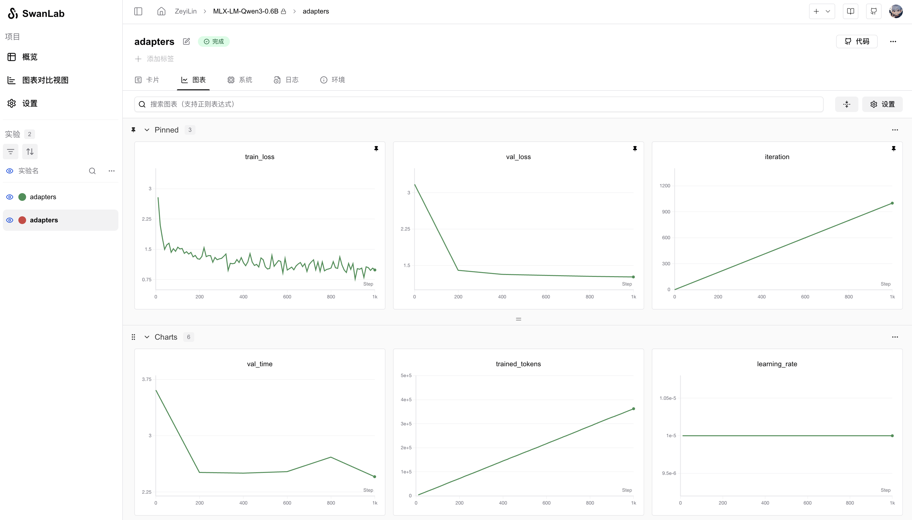

# MLX LM

[MLX LM](https://github.com/ml-explore/mlx-lm) 是由 Apple 机器学习研究团队开发的开源 Python 软件包，专门用于在 Apple Silicon（M1、M2、M3 等芯片）上高效运行和微调大型语言模型（LLM）。它基于 MLX 框架，充分利用 Apple 的统一内存架构和 Metal 性能着色器（Metal Performance Shaders）来优化性能，特别适合在 Mac 设备上本地运行和开发 AI 模型。


你可以使用 MLX LM 快速进行模型训练，同时使用SwanLab进行实验跟踪与可视化。

## 1. 环境安装

```bash
pip install mlx-lm swanlab
```

## 2. Lora微调

使用`mlx-lm`训练LLM的流程非常简单，案例可以在 [mlx-lm/examples](https://github.com/ml-explore/mlx-lm/tree/main/mlx_lm/examples) 中找到。

下面主要以Lora微调为例，这是一个用Qwen3-0.6B模型进行Lora微调的MLX-LM配置文件：

```yaml
model: "Qwen/Qwen3-0.6B"
train: true
fine_tune_type: lora
optimizer: adamw
data: "mlx-community/WikiSQL"
seed: 0
num_layers: 16
batch_size: 4
iters: 1000
val_batches: 25
learning_rate: 1e-5
steps_per_report: 10
steps_per_eval: 200
resume_adapter_file: null
adapter_path: "adapters"
save_every: 100
test: false
test_batches: 100
max_seq_length: 2048
grad_checkpoint: false
lora_parameters:
  keys: ["self_attn.q_proj", "self_attn.v_proj"]
  rank: 8
  scale: 20.0
  dropout: 0.0
```

将这个配置文件保存到本地，文件名用`qwen3_sft.yaml`。

然后使用下面的命令，就可以启动训练，并将训练过程记录到SwanLab上：

```bash
mlx_lm.lora --config qwen3_sft.yaml --report-to swanlab --project-name MLX-LM
```

## 3. 可视化效果

