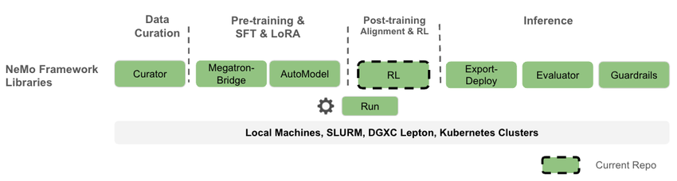
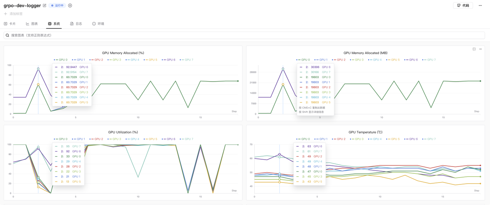
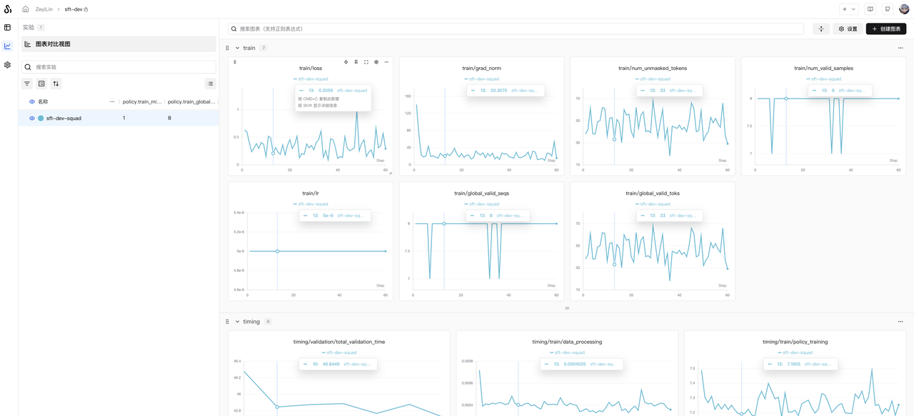
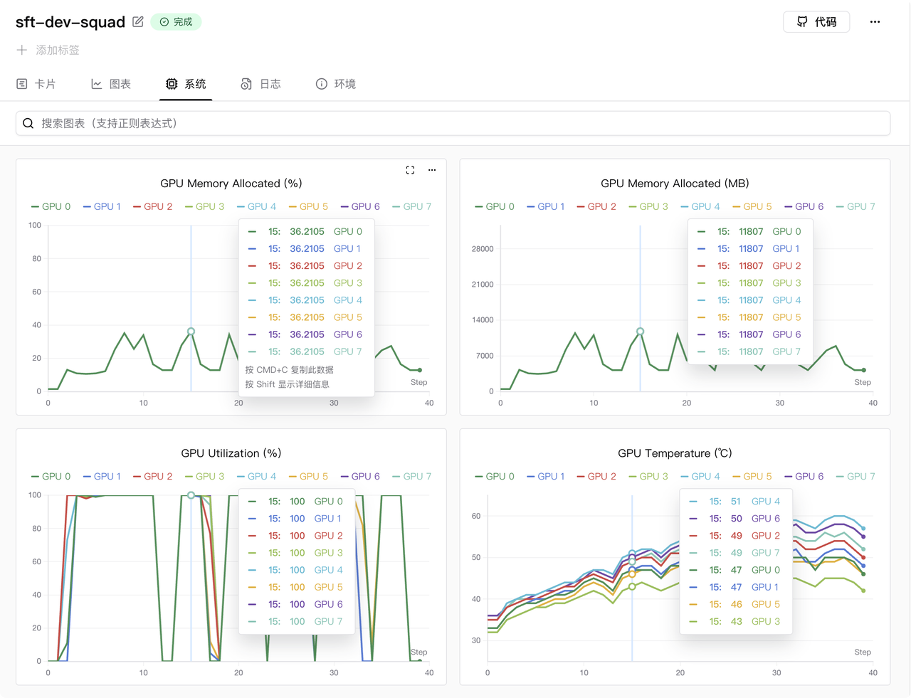

# NVIDIA-NeMo RL

我们很开心地宣布，SwanLab 已与英伟达 LLM RL 后训练框架 **NVIDIA-NeMo/RL** 完成官方集成。


在最新的 NVIDIA NeMo RL 版本中，可以使用 SwanLab 实现对训练全流程的跟踪、观测、分析与实验管理，帮助人工智能研发人员掌控 RL 训练的每个细节，加速模型的高效迭代。

* **官方文档：** [https://docs.nvidia.com/nemo/rl/latest/design-docs/logger.html](https://docs.nvidia.com/nemo/rl/latest/design-docs/logger.html)
* **Github：** [https://github.com/NVIDIA-NeMo/RL](https://github.com/NVIDIA-NeMo/RL)
* **SwanLab：** [https://swanlab.cn](https://swanlab.cn)

## 1. NVIDIA-NeMo/RL



**NVIDIA NeMo RL** 是 NVIDIA NeMo 框架下的一个开源 LLM 后训练库，旨在简化和扩展多模态模型（如大型语言模型、视觉语言模型等）的强化学习方法。NeMo RL 专为灵活性、可重复性和扩展性而设计，既支持小规模实验，也支持大规模多 GPU、多节点部署，适用于研究和生产环境中的快速实验。

值得一提的是，NeMo RL 是 **NeMo Aligner** 重构后的仓库，而 NeMo Aligner 是最早的大型语言模型强化学习库之一，现在非常流行的 VeRL 和 ROLL 均受到了 NeMo Aligner 的启发。


NeMo RL 支持的训练种类也非常多，除了 GRPO 以外，还支持 On-policy Distillation、DPO、RM 和 SFT，你也可以通过 NeMo RL 快速评估训练好的模型。

也因为 NeMo RL 是英伟达的官方框架，所以对基于 NV 卡的多卡多节点训练支持的十分出色，支持包括 DTensor、Megatron 在内的多种后端。

现在，你可以使用 NeMo RL 快速使用 LLM 后训练，同时使用 SwanLab 进行全面的跟踪、观测与分析。


## 2. 使用方式

### 2.1 基础环境

* **计算卡：** 至少 1 张 24GB 以上的 NVIDIA 计算卡
* **CUDA 版本：** >= 12.8
* **Python 包管理器：** uv
* **Python 版本：** >= 3.10

---

### 2.2 安装环境

克隆最新的 NVIDIA-NeMo/RL 仓库：

```bash
git clone git@github.com:NVIDIA-NeMo/RL.git nemo-rl --recursive
cd nemo-rl
```

如果你在裸机（容器外）上使用 Megatron 后端，则可能还需要安装 cuDNN 头文件。以下是检查和安装方法：

```bash
# Check if you have libcudnn installed
dpkg -l | grep cudnn.*cuda

# Find the version you need here: [https://developer.nvidia.com/cudnn-downloads](https://developer.nvidia.com/cudnn-downloads)
# As an example, these are the "Linux Ubuntu 20.04 x86_64" instructions

wget https://developer.download.nvidia.com/compute/cuda/repos/ubuntu2004/x86_64/cuda-keyring_1.1-1_all.deb
sudo dpkg -i cuda-keyring_1.1-1_all.deb
sudo apt update
sudo apt install cudnn  # Will install cuDNN meta packages which points to the latest versions

# sudo apt install cudnn9-cuda-12  # Will install cuDNN version 9.x.x compiled for cuda 12.x
# sudo apt install cudnn9-cuda-12-8  # Will install cuDNN version 9.x.x compiled for cuda 12.8
```

如果在裸机（容器外）上安装 vllm 的依赖项 `deep_ep` 时遇到问题，你可能还需要安装 `libibverbs-dev`。以下是安装方法：

```bash
sudo apt-get update
sudo apt-get install libibverbs-dev
```

然后，通过以下方式初始化 NeMo RL 项目的 uv 虚拟环境：

```bash
uv venv
```

至此，我们完成了基础环境的准备。

---

### 2.3 GRPO训练

我们使用 Qwen/Qwen2.5-1.5B 模型，在 OpenMathInstruct-2 数据集上做GRPO训练：
```bash
uv run python examples/run_grpo_math.py \
    policy.model_name="Qwen/Qwen2.5-1.5B" \
    swanlab_enabled=True
```

默认情况下，此程序使用 `examples/configs/grpo_math_1B.yaml` 中的配置。

你也可以使用命令行参数自定义参数。例如，要在 8 个 GPU 上运行，则设置 `cluster.gpus_per_node` 参数：

```bash
uv run python examples/run_grpo_math.py \
    policy.model_name="Qwen/Qwen2.5-1.5B" \
    swanlab_enabled=True \
    cluster.gpus_per_node=8
```

运行起来后，在 SwanLab 上观测训练效果：


显存使用情况如下图所示（显卡为 8 卡 RTX 5090）：



如果你希望配置更多参数，可以在 `examples/configs/grpo_math_1B.yaml` 里进行编辑。

如果你希望设置 SwanLab 的项目名与实验名，在 yaml 文件中找到：


```yaml
logger:
  log_dir: "logs" # Base directory for all logs
  # ... 其他配置
  swanlab_enabled: false # (注意：命令行中设置为True会覆盖此处)
  # ...
  swanlab:
    project: "grpo-dev"
    name: "grpo-dev-logger"
```

对 `project` 和 `name` 参数进行修改即可。

---

### 2.4 SFT监督微调

让我们再试试 sft。这里使用 Nemo RL 微调 `Qwen2.5-1.5B`，数据集选择默认的 `squad`（斯坦福问答）：

```bash
uv run python examples/run_sft.py \
    policy.model_name="Qwen/Qwen2.5-1.5B" \
    swanlab_enabled=True
```

要在单个节点上使用多个 GPU，您可以修改集群配置。此调整还可以让您增加模型和批次大小：

```bash
uv run python examples/run_sft.py \
  policy.model_name="Qwen/Qwen2.5-1.5B" \
  policy.train_global_batch_size=128 \
  sft.val_global_batch_size=128 \
  swanlab_enabled=True  \
  cluster.gpus_per_node=8
```

运行起来后，在 SwanLab 上观测训练效果：



显存使用情况如下图所示（显卡为 8 卡 RTX 5090）：

