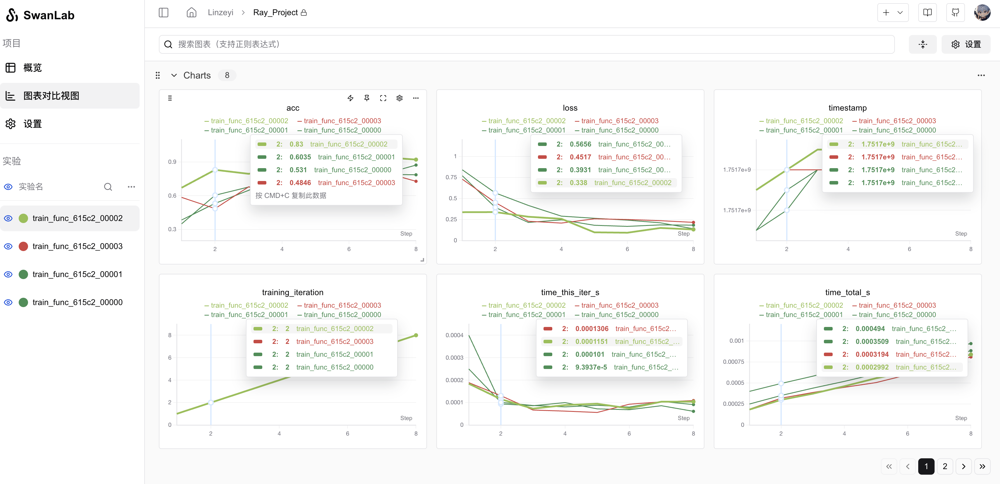

# Ray

[Ray](https://github.com/ray-project/ray) 是一个分布式计算框架，专为大规模并行任务和强化学习应用设计。它由加州大学伯克利分校的研究团队开发，旨在简化构建高性能、可扩展的分布式应用程序的过程。Ray 支持 Python 和 Java，并且可以轻松集成到现有的机器学习、数据处理和强化学习工作流中。


SwanLab 支持 Ray 的实验记录，通过 `SwanLabLoggerCallback` 可以方便地记录实验指标和超参数。

## 1. 引入SwanLabCallback

```python
from swanlab.integration.ray import SwanLabLoggerCallback
```

`SwanLabLoggerCallback` 是适配于 `Ray` 的日志记录类。

`SwanLabLoggerCallback`可以定义的参数有：
- `project`: 项目名称
- `workspace`: 工作空间名称
- 其他和`swanlab.init`一致的参数

## 2. 与`tune.Tuner`集成

```python
tuner = tune.Tuner(
    ...
    run_config=tune.RunConfig(
        callbacks=[SwanLabLoggerCallback(project="Ray_Project")],
    ),
)
```

## 3. 完整案例

```python
import random
from ray import tune
from swanlab.integration.ray import SwanLabLoggerCallback

def train_func(config):
    offset = random.random() / 5
    for epoch in range(2, config["epochs"]):
        acc = 1 - (2 + config["lr"]) ** -epoch - random.random() / epoch - offset
        loss = (2 + config["lr"]) ** -epoch + random.random() / epoch + offset
        tune.report({"acc": acc, "loss": loss})


tuner = tune.Tuner(
    train_func,
    param_space={
        "lr": tune.grid_search([0.001, 0.01, 0.1, 1.0]),
        "epochs": 10,
    },
    run_config=tune.RunConfig(
        callbacks=[SwanLabLoggerCallback(project="Ray_Project")],
    ),
)
results = tuner.fit()
```

