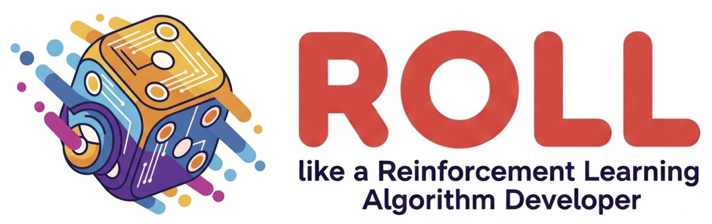

# ROLL

[ROLL](https://github.com/alibaba/ROLL) 是一个高效且用户友好的强化学习库，专为利用大规模 GPU 资源的大型语言模型 (LLM) 而设计。它显著提升了 LLM 在人类偏好对齐、复杂推理和多轮代理交互等关键领域的性能。

ROLL 利用 Ray 的多角色分布式架构实现灵活的资源分配和异构任务调度，并集成 Megatron-Core、SGLang 和 vLLM 等尖端技术来加速模型训练和推理。

在ROLL中使用SwanLab非常简单，只需要设置一些参数即可，详情参考 [agentic_pipeline_config.yaml](https://github.com/alibaba/ROLL/blob/main/tests/pipeline/agentic_pipeline_config.yaml) 中的`track_with: swanlab`部分。

更多详情请参考：[ROLL官方API文档-配置SwanLab](https://alibaba.github.io/ROLL/docs/User%20Guides/Tracker%20&%20Metrics/trackers_and_metrics#configuring-swanlab)。