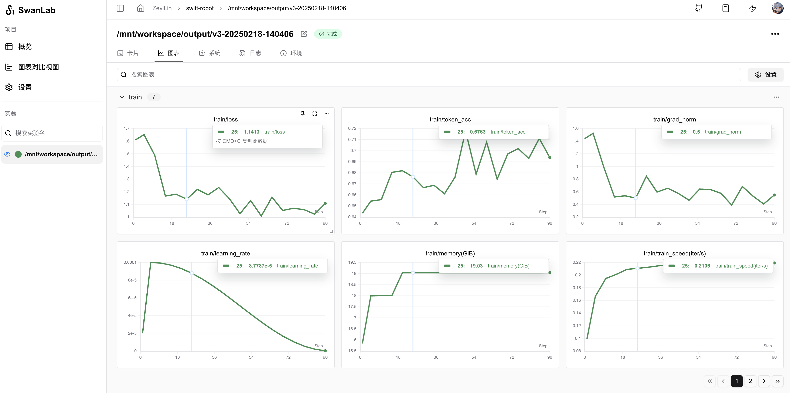
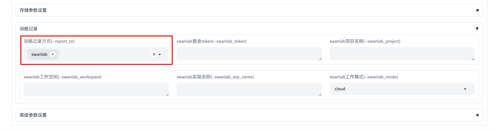
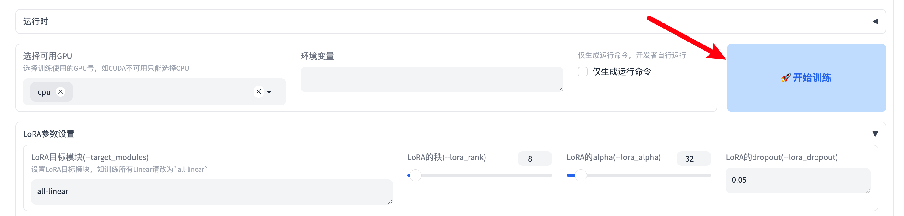
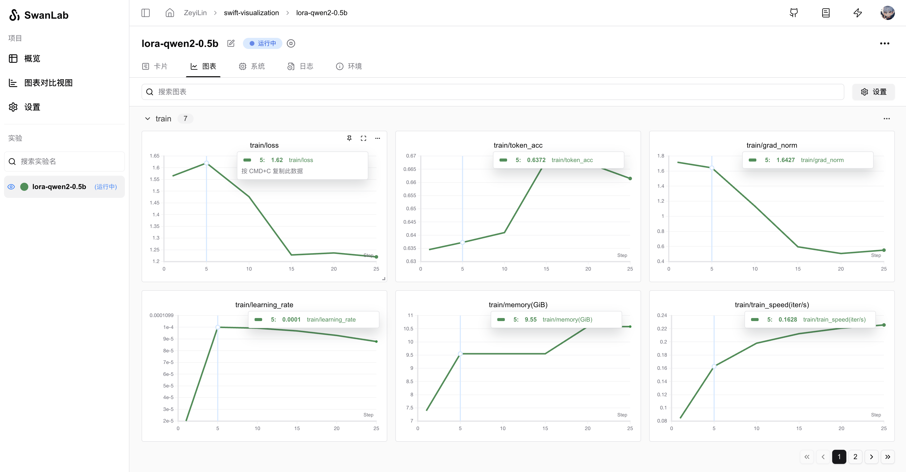

# Modelscope Swift

> SwanLab已经与Swift官方集成，见：[#3142](https://github.com/modelscope/ms-swift/pull/3142)  
> 可视化在线Demo：[swift-robot](https://swanlab.cn/@ZeyiLin/swift-robot/runs/9lc9rmmwm4hh7ay1vkzd7/chart)

[Modelscope魔搭社区](https://modelscope.cn/) 的 [Swift](https://github.com/modelscope/swift) 是一个集模型训练、微调、推理、部署于一体的框架。


🍲 **ms-swift** 是 ModelScope 社区提供的官方框架，用于微调和部署大型语言模型和多模态大型模型。它目前支持 **450+** 大型模型和 **150+** 多模态大型模型的训练（预训练、微调、人工对齐）、推理、评估、量化和部署。

🍔 此外，ms-swift 还采用了**最新的训练技术**，包括 **LoRA、QLoRA、Llama-Pro、LongLoRA、GaLore、Q-GaLore、LoRA+、LISA、DoRA、FourierFt、ReFT、UnSloth 和 Liger 等轻量级技术**，以及 **DPO、GRPO、RM、PPO、KTO、CPO、SimPO 和 ORPO** 等人工对齐训练方法。

ms-swift 支持使用 vLLM 和 LMDeploy 加速推理、评估和部署模块，并支持使用 GPTQ、AWQ 和 BNB 等技术进行模型量化。此外，ms-swift 还提供了基于 Gradio 的 Web UI 和丰富的最佳实践。

你可以使用Swift快速进行模型训练，同时使用SwanLab进行实验跟踪与可视化。

[[toc]]

## 0. 安装ms-swift和swanlab

> 目前ms-swift还未release最新的包（本文写作时版本为3.1.0），所以需要使用源码安装。

源码安装ms-swift：

```bash
git clone https://github.com/modelscope/swift.git
cd swift
pip install -e .
```

安装swanlab：

```bash
pip install swanlab
```

## 1. CLI微调

你只需要在ms-swift的CLI中添加`--report_to`和`--swanlab_project`两个参数，即可使用SwanLab进行实验跟踪与可视化：

```bash
swift sft \
    ...
    --report_to swanlab \
    --swanlab_project swift-robot \
    ...
```

下面是在swift官方的CLI微调案例，中结合SwanLab的示例（见代码最后）：

```bash {29-30}
# 22GB
CUDA_VISIBLE_DEVICES=0 \
swift sft \
    --model Qwen/Qwen2.5-7B-Instruct \
    --train_type lora \
    --dataset 'AI-ModelScope/alpaca-gpt4-data-zh#500' \
              'AI-ModelScope/alpaca-gpt4-data-en#500' \
              'swift/self-cognition#500' \
    --torch_dtype bfloat16 \
    --num_train_epochs 1 \
    --per_device_train_batch_size 1 \
    --per_device_eval_batch_size 1 \
    --learning_rate 1e-4 \
    --lora_rank 8 \
    --lora_alpha 32 \
    --target_modules all-linear \
    --gradient_accumulation_steps 16 \
    --eval_steps 50 \
    --save_steps 50 \
    --save_total_limit 5 \
    --logging_steps 5 \
    --max_length 2048 \
    --output_dir output \
    --system 'You are a helpful assistant.' \
    --warmup_ratio 0.05 \
    --dataloader_num_workers 4 \
    --model_author swift \
    --model_name swift-robot \
    --report_to swanlab \
    --swanlab_project swift-robot
```

运行指令后，就可以在SwanLab看到训练过程：



支持的完整参数：

- `swanlab_token`: SwanLab的api-key
- `swanlab_project`: swanlab的project
- `swanlab_workspace`: 默认为None，会使用api-key对应的username
- `swanlab_exp_name`: 实验名，可以为空，为空时默认传入--output_dir的值
- `swanlab_mode`: 可选cloud和local，云模式或者本地模式

## 2. WebUI微调

Swift不仅支持CLI微调，还为开发者提供非常方便的**WebUI（网页端）**的微调界面。你同样可以在WebUI当中启动SwanLab跟踪实验。

启动WebUI方式：

```bash
swift web-ui
```

启动后，会自动打开浏览器，显示微调界面（或者访问 http://localhost:7860/ ）：


在下方的「训练记录」模块中，在`训练记录方式`部分选择`swanlab`：



你还可以在「训练记录」模块的其他填写更细致的swanlab参数，包括：

- `swanlab_token`: SwanLab的api-key
- `swanlab_project`: swanlab的project
- `swanlab_workspace`: 默认为None，会使用api-key对应的username
- `swanlab_exp_name`: 实验名，可以为空，为空时默认传入--output_dir的值
- `swanlab_mode`: 可选cloud和local，云模式或者本地模式

然后，点击「🚀开始训练」按钮，即可启动训练，并使用SwanLab跟踪实验：



## 3. Python代码微调

**3.1 引入SwanLabCallback**

因为`Swift`的`trainer`集成自`transformers`，所以可以直接使用`swanlab`与`huggingface`集成的`SwanLabCallback`：

```python
from swanlab.integration.transformers import SwanLabCallback
```

SwanLabCallback可以定义的参数有：

- project、experiment_name、description 等与 swanlab.init 效果一致的参数, 用于SwanLab项目的初始化。 你也可以在外部通过swanlab.init创建项目，集成会将实验记录到你在外部创建的项目中。

**3.2 引入Trainer**

```python {1,7,11}
from swanlab.integration.transformers import SwanLabCallback
from swift import Seq2SeqTrainer, Seq2SeqTrainingArguments

···

#实例化SwanLabCallback
swanlab_callback = SwanLabCallback(project="swift-visualization")

trainer = Seq2SeqTrainer(
    ...
    callbacks=[swanlab_callback],
    )

trainer.train()
```

**3.3 使用SwanLabCallback**

> Lora微调一个Qwen2-0.5B模型

```python
from swanlab.integration.transformers import SwanLabCallback
from swift import Seq2SeqTrainer, Seq2SeqTrainingArguments
from swift.llm import get_model_tokenizer, load_dataset, get_template, EncodePreprocessor
from swift.utils import get_logger, find_all_linears, get_model_parameter_info, plot_images, seed_everything
from swift.tuners import Swift, LoraConfig
from swift.trainers import Seq2SeqTrainer, Seq2SeqTrainingArguments
from functools import partial
import os

logger = get_logger()
seed_everything(42)

# Hyperparameters for training
# model
model_id_or_path = 'Qwen/Qwen2.5-3B-Instruct'  # model_id or model_path
system = 'You are a helpful assistant.'
output_dir = 'output'

# dataset
dataset = ['AI-ModelScope/alpaca-gpt4-data-zh#500', 'AI-ModelScope/alpaca-gpt4-data-en#500',
           'swift/self-cognition#500']  # dataset_id or dataset_path
data_seed = 42
max_length = 2048
split_dataset_ratio = 0.01  # Split validation set
num_proc = 4  # The number of processes for data loading.
# The following two parameters are used to override the placeholders in the self-cognition dataset.
model_name = ['小黄', 'Xiao Huang']  # The Chinese name and English name of the model
model_author = ['魔搭', 'ModelScope']  # The Chinese name and English name of the model author

# lora
lora_rank = 8
lora_alpha = 32

# training_args
training_args = Seq2SeqTrainingArguments(
    output_dir=output_dir,
    learning_rate=1e-4,
    per_device_train_batch_size=1,
    per_device_eval_batch_size=1,
    gradient_checkpointing=True,
    weight_decay=0.1,
    lr_scheduler_type='cosine',
    warmup_ratio=0.05,
    logging_first_step=True,
    save_strategy='steps',
    save_steps=50,
    eval_strategy='steps',
    eval_steps=50,
    gradient_accumulation_steps=16,
    num_train_epochs=1,
    metric_for_best_model='loss',
    save_total_limit=5,
    logging_steps=5,
    dataloader_num_workers=1,
    data_seed=data_seed,
)

output_dir = os.path.abspath(os.path.expanduser(output_dir))
logger.info(f'output_dir: {output_dir}')

# Obtain the model and template, and add a trainable Lora layer on the model.
model, tokenizer = get_model_tokenizer(model_id_or_path)
logger.info(f'model_info: {model.model_info}')
template = get_template(model.model_meta.template, tokenizer, default_system=system, max_length=max_length)
template.set_mode('train')

target_modules = find_all_linears(model)
lora_config = LoraConfig(task_type='CAUSAL_LM', r=lora_rank, lora_alpha=lora_alpha,
                         target_modules=target_modules)
model = Swift.prepare_model(model, lora_config)
logger.info(f'lora_config: {lora_config}')

# Print model structure and trainable parameters.
logger.info(f'model: {model}')
model_parameter_info = get_model_parameter_info(model)
logger.info(f'model_parameter_info: {model_parameter_info}')

# Download and load the dataset, split it into a training set and a validation set,
# and encode the text data into tokens.
train_dataset, val_dataset = load_dataset(dataset, split_dataset_ratio=split_dataset_ratio, num_proc=num_proc,
        model_name=model_name, model_author=model_author, seed=data_seed)

logger.info(f'train_dataset: {train_dataset}')
logger.info(f'val_dataset: {val_dataset}')
logger.info(f'train_dataset[0]: {train_dataset[0]}')

train_dataset = EncodePreprocessor(template=template)(train_dataset, num_proc=num_proc)
val_dataset = EncodePreprocessor(template=template)(val_dataset, num_proc=num_proc)
logger.info(f'encoded_train_dataset[0]: {train_dataset[0]}')

# Print a sample
template.print_inputs(train_dataset[0])

# Get the trainer and start the training.
model.enable_input_require_grads()  # Compatible with gradient checkpointing

swanlab_callback = SwanLabCallback(
    project="swift-visualization",
    experiment_name="lora-qwen2-0.5b",
    description="Lora微调一个Qwen2-0.5B模型"
)

trainer = Seq2SeqTrainer(
    model=model,
    args=training_args,
    data_collator=template.data_collator,
    train_dataset=train_dataset,
    eval_dataset=val_dataset,
    template=template,
    callbacks=[swanlab_callback],
)
trainer.train()

last_model_checkpoint = trainer.state.last_model_checkpoint
logger.info(f'last_model_checkpoint: {last_model_checkpoint}')
```

运行可视化结果：

