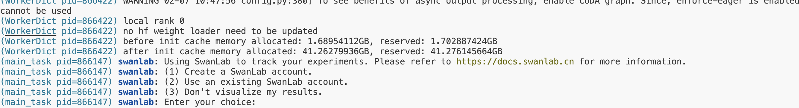
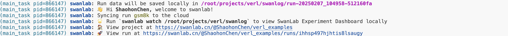
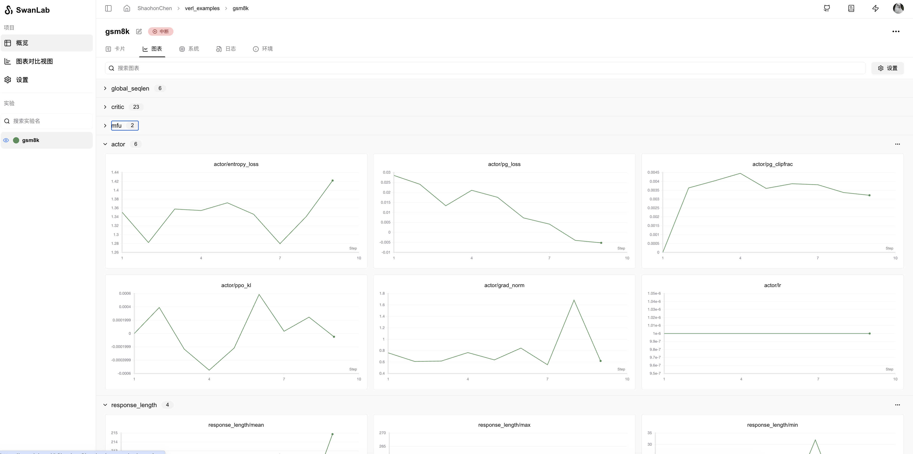

# verl

[verl](https://github.com/volcengine/verl) 是一个灵活、高效且可用于生产环境的强化学习（RL）训练框架，专为大型语言模型（LLMs）的后训练设计。它由字节跳动火山引擎团队开源，是 [HybridFlow](https://arxiv.org/abs/2409.19256) 论文的开源实现。

<div style="text-align: center;">
    
</div>

**verl 具有以下特点，使其灵活且易于使用：**

1. **易于扩展的多样化 RL 算法**：Hybrid 编程模型结合了单控制器和多控制器范式的优点，能够灵活表示并高效执行复杂的后训练数据流。用户只需几行代码即可构建 RL 数据流。

2. **与现有 LLM 基础设施无缝集成的模块化 API**：通过解耦计算和数据依赖，verl 能够与现有的 LLM 框架（如 PyTorch FSDP、Megatron-LM 和 vLLM）无缝集成。此外，用户可以轻松扩展到其他 LLM 训练和推理框架。

3. **灵活的设备映射和并行化**：支持将模型灵活地映射到不同的 GPU 组上，以实现高效的资源利用，并在不同规模的集群上具有良好的扩展性。

4. **与流行的 HuggingFace 模型轻松集成**：verl 能够方便地与 HuggingFace 模型进行集成。

**verl 也具有以下优势，使其运行速度快：**

1. **最先进的吞吐量**：通过无缝集成现有的 SOTA LLM 训练和推理框架，verl 实现了高生成和训练吞吐量。

2. **基于 3D-HybridEngine 的高效 Actor 模型重分片**：消除了内存冗余，并显著减少了在训练和生成阶段之间切换时的通信开销。

更多信息可参考如下链接

> * verl GitHub仓库链接: [https://github.com/volcengine/verl](https://github.com/volcengine/verl)
> * 官方文档: [https://verl.readthedocs.io/en/latest/index.html](https://verl.readthedocs.io/en/latest/index.html)
> * HybridFlow论文地址: [https://arxiv.org/pdf/2409.19256v2](https://arxiv.org/pdf/2409.19256v2)


你可以使用verl快速进行大模型强化学习训练，同时使用SwanLab进行实验跟踪与可视化。

## 环境安装

需要环境：

* Python: Version >= 3.9

* CUDA: Version >= 12.1

参考verl官方文档安装：[https://verl.readthedocs.io/en/latest/start/install.html](https://verl.readthedocs.io/en/latest/start/install.html)

以及需要额外安装SwanLab

```bash
pip install -U swanlab
```

## 使用方法

以verl官方文档的[Post-train a LLM using PPO with GSM8K dataset](https://verl.readthedocs.io/en/latest/start/quickstart.html)为例。

你仅需要通过在实验的启动命令中，增加`trainer.logger=['swanlab']`，即可选择swanlab进行实验跟踪。

**完整的测试命令如下：**

```bash {4}
PYTHONUNBUFFERED=1 python3 -m verl.trainer.main_ppo \
 data.train_files=$HOME/data/gsm8k/train.parquet \
 data.val_files=$HOME/data/gsm8k/test.parquet \
 trainer.logger=['console','swanlab'] \
 data.train_batch_size=256 \
 data.val_batch_size=1312 \
 data.max_prompt_length=512 \
 data.max_response_length=256 \
 actor_rollout_ref.model.path=Qwen/Qwen2.5-0.5B-Instruct \
 actor_rollout_ref.actor.optim.lr=1e-6 \
 actor_rollout_ref.actor.ppo_mini_batch_size=64 \
 actor_rollout_ref.actor.ppo_micro_batch_size_per_gpu=4 \
 actor_rollout_ref.rollout.log_prob_micro_batch_size_per_gpu=8 \
 actor_rollout_ref.rollout.tensor_model_parallel_size=1 \
 actor_rollout_ref.rollout.gpu_memory_utilization=0.4 \
 actor_rollout_ref.ref.log_prob_micro_batch_size_per_gpu=4 \
 critic.optim.lr=1e-5 \
 critic.model.path=Qwen/Qwen2.5-0.5B-Instruct \
 critic.ppo_micro_batch_size_per_gpu=4 \
 algorithm.kl_ctrl.kl_coef=0.001 \
 +trainer.val_before_train=False \
 trainer.default_hdfs_dir=null \
 trainer.n_gpus_per_node=1 \
 trainer.nnodes=1 \
 trainer.save_freq=10 \
 trainer.test_freq=10 \
 trainer.total_epochs=15 2>&1 | tee verl_demo.log
```

如果启动训练时你还未登陆SwanLab，会出现如下提示。



选择**1、2**则为使用云端跟踪模式，选择后根据引导输入官网的API即可实现在线跟踪。可以在线查看训练跟踪结果。选择**3**则不上传训练数据，采用离线跟踪。


当然，你也可以通过[环境变量](/api/environment-variable)的方式登陆或者设置跟踪模式：

```bash
export SWANLAB_API_KEY=<你的登陆API>           # 设置在线跟踪模式API
export SWANLAB_LOG_DIR=<设置本地日志存储路径>    # 设置本地日志存储路径
export SWANLAB_MODE=<设置SwanLab的运行模式>     # 包含四种模式：cloud云端跟踪模式（默认）、cloud-only仅云端跟踪本地不保存文件、local本地跟踪模式、disabled完全不记录用于debug
```

## 查看训练日志

完成登陆后会显示如下登陆信息：



运行进程，即可在[SwanLab官网](https://swanlab.cn)上查看训练日志：



更多使用方法可以参考[SwanLab查看使用结果](https://docs.swanlab.cn/guide_cloud/experiment_track/view-result.html)

---

如果你使用本地看板模式，则可以通过如下命令打开本地看板

```bash
swanlab watch
```

更多详细可以参考[SwanLab离线看板模式](https://docs.swanlab.cn/guide_cloud/self_host/offline-board.html)

服务器设置端口号可以查看[离线看板端口号](https://docs.swanlab.cn/api/cli-swanlab-watch.html#%E8%AE%BE%E7%BD%AEip%E5%92%8C%E7%AB%AF%E5%8F%A3%E5%8F%B7)

## 每轮评估时记录生成文本

如果你希望在每轮评估（val）时将生成的文本记录到SwanLab中，只需在命令行钟增加一行`val_generations_to_log_to_wandb=1`即可：

```bash {5}
PYTHONUNBUFFERED=1 python3 -m verl.trainer.main_ppo \
 data.train_files=$HOME/data/gsm8k/train.parquet \
 data.val_files=$HOME/data/gsm8k/test.parquet \
 trainer.logger=['console','swanlab'] \
 val_generations_to_log_to_wandb=1 \
 ...
```