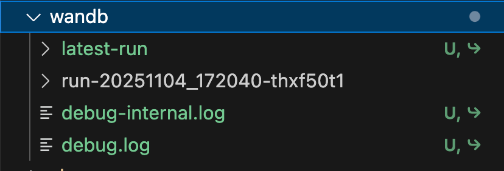
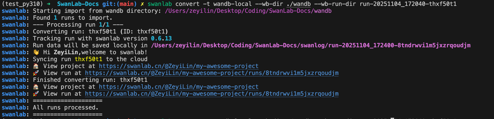

# Weights & Biases

Weights & Biases (Wandb) 是一个用于机器学习和深度学习项目的实验跟踪、模型优化和协作平台。W&B 提供了强大的工具来记录和可视化实验结果，帮助数据科学家和研究人员更好地管理和分享他们的工作。


:::warning 其他工具的同步教程

- [TensorBoard](/guide_cloud/integration/integration-tensorboard.md)
- [MLFlow](/guide_cloud/integration/integration-mlflow.md)
:::

**你可以用三种方式将Wandb上的项目同步到SwanLab：**

1. **同步跟踪**：如果你现在的项目使用了wandb进行实验跟踪，你可以使用`swanlab.sync_wandb()`命令，在运行训练脚本时同步记录指标到SwanLab。
2. **从wandb网站转换已存在的项目**：如果你想要将wandb服务器（wandb.ai或wandb私有化部署版）上的项目复制到SwanLab，你可以使用`swanlab convert`，将Wandb上已存在的项目转换成SwanLab项目。
3. **从wandb本地日志文件转换已存在的项目**：如果你想要将wandb本地的日志文件上传到swanlab，你可以使用`swanlab convert`，将wandb本地日志文件转换成SwanLab项目。

::: info
在当前版本暂仅支持转换标量图表。
:::

[[toc]]


## 1. 同步跟踪

### 1.1 添加sync_wandb命令

在你的代码执行`wandb.init()`之前的任何位置，添加一行`swanlab.sync()`命令，即可在训练时同步wandb的指标到SwanLab。

```python
import swanlab

swanlab.sync_wandb()

...

wandb.init()
```

在上述这种代码写法中，`wandb.init()`的同时会初始化swanlab，项目名、实验名和配置和`wandb.init()`中的`project`、`name`、`config`一致，因此你不需要再手动初始化swanlab。

:::info

**`sync_wandb`支持设置两个参数：**

- `mode`: swanlab的记录模式，支持cloud、local和disabled三种模式。
- `wandb_run`: 如果此参数设置为**False**，则不会将数据上传到wandb，等同于设置wandb.init(mode="offline")

:::

### 1.2 另一种写法

另一种用法是先手动初始化swanlab，再运行wandb的代码。

```python
import swanlab

swanlab.init(...)
swanlab.sync_wandb()

...

wandb.init()
```

在这种写法中，项目名、实验名、配置和`swanlab.init()`中的`project`、`experiment_name`、`config`一致，而后续`wandb.init()`中的`project`、`name`会被忽略，`config`会更新进`swanlab.config`中。

### 1.3 测试代码

```python
import wandb
import random
import swanlab

swanlab.sync_wandb()
# swanlab.init(project="sync_wandb")

wandb.init(
  project="test",
  config={"a": 1, "b": 2},
  name="test",
  )

epochs = 10
offset = random.random() / 5
for epoch in range(2, epochs):
  acc = 1 - 2 ** -epoch - random.random() / epoch - offset
  loss = 2 ** -epoch + random.random() / epoch + offset

  wandb.log({"acc": acc, "loss": loss})
```


## 2. 转换wandb网站上的项目

### 2.1 找到你在wandb.ai上的projecy、entity和runid

projecy、entity和runid是转换所需要的（runid是可选的）。  
project和entity的位置：


runid的位置：


### 2.2 方式一：命令行转换

首先，需要确保当前环境下，你已登录了wandb，并有权限访问目标项目。

转换命令行：

```bash
swanlab convert -t wandb --wb-project [WANDB_PROJECT_NAME] --wb-entity [WANDB_ENTITY]
```

支持的参数如下：

- `-t`: 转换类型，可选wandb与tensorboard。
- `-p`: SwanLab项目名。
- `-w`: SwanLab工作空间名。
- `--mode`: (str) 选择模式，默认为"cloud"，可选 ["cloud", "local", "offline", "disabled"]
- `-l`: logdir路径。
- `--wb-project`：待转换的wandb项目名。
- `--wb-entity`：wandb项目所在的空间名。
- `--wb-runid`: wandb Run（项目下的某一个实验）的id。

如果不填写`--wb-runid`，则会将指定项目下的全部Run进行转换；如果填写，则只转换指定的Run。

---

**异步转换方法（先将数据下载到本地，再上传到swanlab）**

1. 数据下载到本地：

```bash
swanlab convert --mode 'offline' -t wandb --wb-project [WANDB_PROJECT_NAME] --wb-entity [WANDB_ENTITY]
```

2. 上传到swanlab：

```bash
swanlab sync [日志文件夹路径]
```

[swanlab sync文档](/zh/api/cli-swanlab-sync.md)


### 2.3 方式二：代码内转换

```python
from swanlab.converter import WandbConverter

wb_converter = WandbConverter()
# wb_runid可选
wb_converter.run(wb_project="WANDB_PROJECT_NAME", wb_entity="WANDB_USERNAME")
```

效果与命令行转换一致。

`WandbConverter`支持的参数：

- `project`: SwanLab项目名。
- `workspace`: SwanLab工作空间名。
- `mode`: (str) 选择模式，默认为"cloud"，可选 ["cloud", "local", "offline", "disabled"]
- `logdir`: logdir路径。

`WandbConverter.run`支持的参数：

- `wb_project`: wandb项目名。
- `wb_entity`: wandb项目所在的空间名。
- `wb_runid`: wandb Run（项目下的某一个实验）的id。

**异步转换方法（先将数据下载到本地，再上传到swanlab）**

1. 数据下载到本地：

```python
from swanlab.converter import WandbConverter

wb_converter = WandbConverter(mode="offline")
# wb_runid可选
wb_converter.run(wb_project="WANDB_PROJECT_NAME", wb_entity="WANDB_USERNAME")
```

2. 上传到swanlab：

```bash
swanlab sync [日志文件夹路径]
```

[swanlab sync文档](/zh/api/cli-swanlab-sync.md)


## 3 转换wandb日志文件

### 3.1 找到你的日志文件

wandb日志文件是指，在进行实验跟踪时，wandb会默认在训练目录下创建的文件夹（默认为`wandb`目录），如下所示：



### 3.2 方式一：命令行转换

转换命令为：

```bash
swanlab convert -t wandb-local --wb-dir [WANDB_LOG_DIR] --wb-run-dir [WANDB_RUN_DIR]
```

支持的参数如下：

- `-t`: 转换类型，可选wandb、tensorboard、mlflow、wandb-local。
- `-p`: SwanLab项目名。
- `-w`: SwanLab工作空间名。
- `--mode`: (str) 选择模式，默认为"cloud"，可选 ["cloud", "local", "offline", "disabled"]
- `-l`: logdir路径。
- `--wb-dir`：待转换的wandb日志目录
- `--wb-run-dir`：指定的wandb run的目录名。如果不写该参数，则将上传整个wb-dir中的run。

案例：




### 3.3 方式二：代码转换

```bash
from swanlab.converter import WandbLocalConverter

wb_converter = WandbLocalConverter()
# wb_runid可选
wb_converter.run(root_wandb_dir="WANDB_DIR", wandb_run_dir="WANDB_RUN_DIR")
```

`WandbLocalConverter`支持的参数：

- `project`: SwanLab项目名。
- `workspace`: SwanLab工作空间名。
- `mode`: (str) 选择模式，默认为"cloud"，可选 ["cloud", "local", "offline", "disabled"]
- `logdir`: logdir路径。

`WandbLocalConverter.run`支持的参数：

- `root_wandb_dir`: wandb日志文件目录的路径。
- `wandb_run_dir`: wandb run目录的路径。