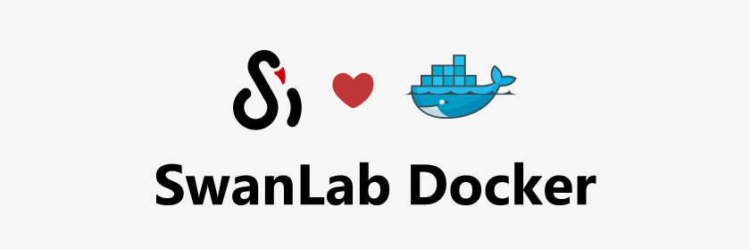
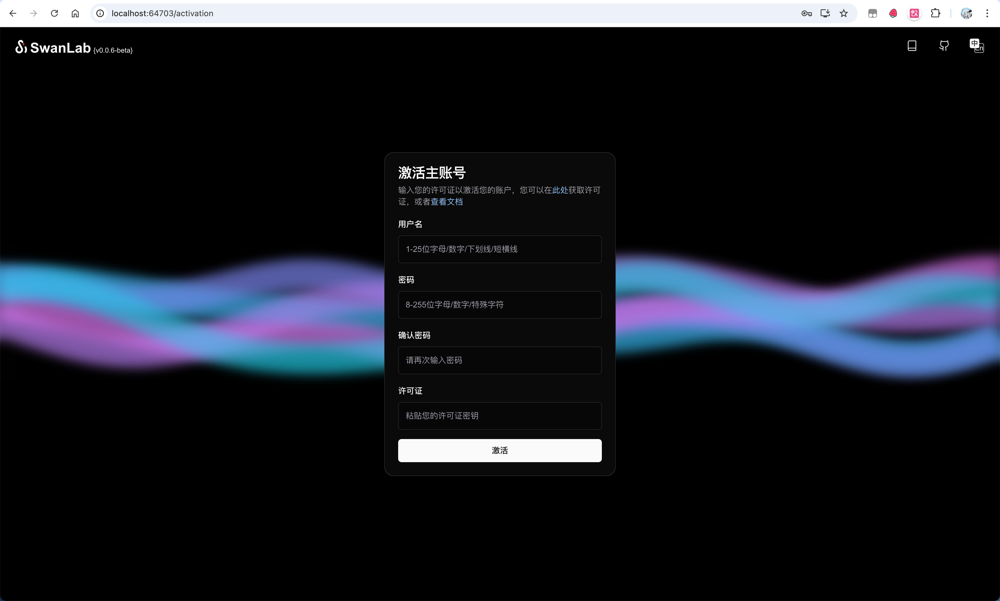

# 使用Docker进行部署

如果你想要使用SwanLab私有化部署（社区版），请按照下面的流程进行安装。



## 先决条件

> 在安装 SwanLab 之前，请确保您的机器满足以下最低系统要求：
>
> - CPU >= 2核
> - 内存 >= 4GB
> - 存储空间 >= 20GB

SwanLab 私有化部署版，需要使用 **Docker Compose** 进行安装与部署（暂不支持K8S部署），请根据你的操作系统，对表下面的表格选择正确的Docker及compose版本。

**如果你已经安装了Docker，请跳过这一步。**

| 操作系统               | 软件                                                   | 解释                                                                                                                                                                                                                                                                                                                                                 |
| ---------------------- | ------------------------------------------------------ | ---------------------------------------------------------------------------------------------------------------------------------------------------------------------------------------------------------------------------------------------------------------------------------------------------------------------------------------------------- |
| macOS 10.14 或更高版本 | Docker Desktop                                         | 将 Docker 虚拟机 (VM) 设置为至少使用 2 个虚拟 CPU (vCPU) 和 8 GB 初始内存。否则，安装可能会失败。有关更多信息，请参阅[Mac 版 Docker Desktop 安装指南](https://docs.docker.com/desktop/install/mac-install/)。                                                                                                                                        |
| Windows（启用了WSL 2） | Docker Desktop                                         | 我们建议将源代码和其他与 Linux 容器绑定的数据存储在 Linux 文件系统中，而不是 Windows 文件系统中。有关更多信息，请参阅 [Windows上使用WSL安装Linux](https://learn.microsoft.com/zh-cn/windows/wsl/install) 与 [在 Windows 上使用 WSL 2 后端的 Docker Desktop 安装指南](https://docs.docker.com/desktop/setup/install/windows-install/#wsl-2-backend)。 |
| Linux                  | Docker 19.03 或更高版本 Docker Compose 1.28 或更高版本 | 有关如何安装Docker和Docker Compose 的更多信息，请参阅[Docker 安装指南](https://docs.docker.com/engine/install/)和[Docker Compose 安装指南](https://docs.docker.com/compose/install/)。                                                                                                                                                               |

> 如果你还未安装Docker，可以运行我们提供的[安装脚本](https://docs.docker.com/desktop/install/mac-install/)。

---

**端口说明**

如果你将SwanLab部署在服务器上，并希望能够远程访问与实验记录，那么请确保服务器开放以下两个端口：

| 端口号 | 是否可配置 | 用途说明                                                      |
| ------ | ---------- | ------------------------------------------------------------- |
| 8000   | 是         | 网关服务端口，可用于接收外部请求，建议在公网环境中设置为 `80` |
| 9000   | 否         | MinIO 签名端口，用于对象存储访问，端口固定不可修改            |

> 由于网关服务端口（默认为`8000`）支持在部署前后修改，所以请确保你开放的是最终修改的端口。

## 1. 克隆仓库

使用Git克隆`self-hosted`仓库：

```bash
git clone https://github.com/SwanHubX/self-hosted.git
cd self-hosted
```

## 2. 一键脚本安装

> 如果你使用的是Windows系统，请确保已安装并开启 WSL2 和 Docker Desktop
> 

> 在WSL2的文件系统中执行 `.sh` 安装脚本
> 

默认的安装脚本在`docker/install.sh`，直接执行即可一键安装所有需要的容器以及执行初始化配置。

```bash
cd ./docker
./install.sh
```

默认脚本链接的镜像源在中国，所以中国地区的下载速度非常快！

如果你需要使用 [DockerHub](https://hub.docker.com/) 作为镜像源，则可以使用下面的脚本进行安装：

```bash
./install-dockerhub.sh
```

## 3. 激活主账号

SwanLab社区版默认会使用`8000`端口，如果你使用的是默认配置，那么可以直接访问：`http://localhost:8000`，就可以访问到SwanLab社区版。

> 也有可能社区版部署在了其他端口，请打开 Docker Desktop，找到`traefik`容器旁边的port映射，比如`64703:80`，那么你应该访问`http://localhost:64703`。



现在，你需要激活你的主账号。激活需要1个License，个人使用可以免费在[SwanLab官网](https://swanlab.cn)申请一个，位置在 「设置」-「账户与许可证」。

:::warning 离线验证

在私有化部署 > `v1.1`的版本中，支持在离线环境下验证License。

:::


拿到License后，回到激活页面，填写用户名、密码、确认密码和License，点击激活即可完成创建。


## 4. 开始你的第一个实验

在Python SDK完成登录：

```bash
swanlab login --host <IP地址>
```

> 如果你之前登录过swanlab，想要重新登录，请使用：
> `swanlab login --host <IP地址> --relogin`。

按回车，填写API Key，完成登录。之后你的SwanLab实验将会默认传到私有化部署的SwanLab上。

---

测试脚本：

```bash
import swanlab
import random

# 创建一个SwanLab项目
swanlab.init(
    # 设置项目名
    project="my-awesome-project",

    # 设置超参数
    config={
        "learning_rate": 0.02,
        "architecture": "CNN",
        "dataset": "CIFAR-100",
        "epochs": 10
    }
)

# 模拟一次训练
epochs = 10
offset = random.random() / 5
for epoch in range(2, epochs):
  acc = 1 - 2 ** -epoch - random.random() / epoch - offset
  loss = 2 ** -epoch + random.random() / epoch + offset

  # 记录训练指标
  swanlab.log({"acc": acc, "loss": loss})

# [可选] 完成训练，这在notebook环境中是必要的
swanlab.finish()
```

运行后在网页查看实验：


## 升级版本

如果你想要将你本地的私有化部署版本升级到最新版，请使用下面的命令：

```bash
# 在你之前本地部署的 self-hosted 项目目录下
cd ./docker
./upgrade.sh
```

升级完成的命令行样式：


