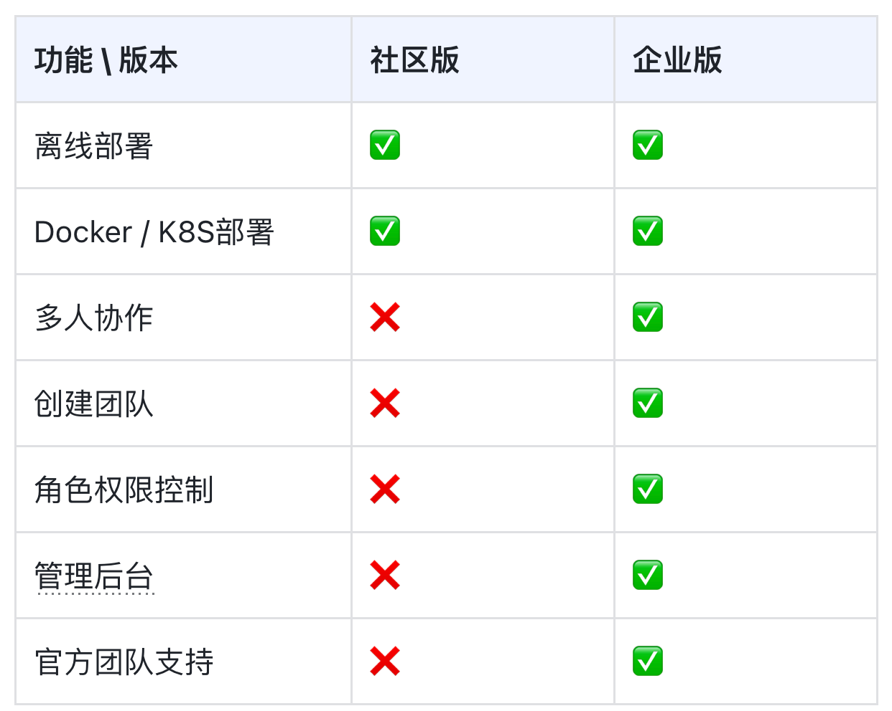

# 团队/企业版

::: warning 🎉联系我们
对企业版有需求的伙伴，欢迎通过以下方式与我们联系，请备注您的公司/机构与职位：

1. 网页申请：[申请链接](https://rcnpx636fedp.feishu.cn/share/base/form/shrcnVS6JQjfXW3vEOvLdCITxfe)
2. 邮件联系：[contact@swanlab.cn](mailto:contact@swanlab.cn)

:::

社区版支持公有云版（swanlab.cn）的主流功能，但仅限个人使用；

社区版并不支持**多人协作、创建团队、权限控制、管理看板**等高级功能，难以满足AI实验室、算法团队、人工智能行业企业的训练观测与协同需求。

针对专业AI研发团队，我们提供了**SwanLab企业版**，与社区版的对比可见下表：

