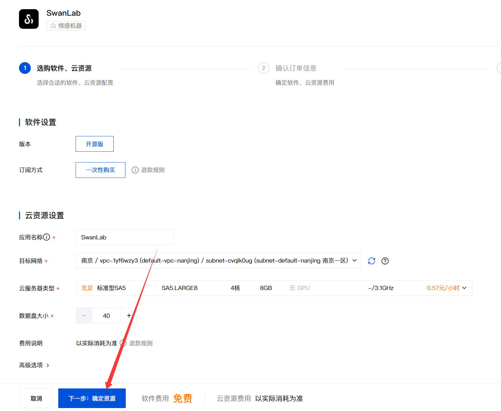

# 腾讯云应用

目前 SwanLab 自托管版本已上线腾讯云应用市场，欢迎各位训练师通过腾讯云开箱使用~

- [SwanLab 腾讯云应用](https://app.cloud.tencent.com/detail/SPU_BHEEJEJCDD1984)

## 先决条件

1. 首先需要一个腾讯云账号，并确保账号拥有 **安装云应用的权限**，参考链接：[腾讯云应用购买安装指引](https://cloud.tencent.com/document/product/1689/113848)

2. 在 [腾讯云控制台-私有网络](https://console.cloud.tencent.com/vpc/vpc) 中，创建一个默认的 `VPC`（Vitual Private Cloud， 虚拟私有云），为云应用提供目标网络，
目前支持的地域如下：
    - 境内：南京; 北京; 广州; 成都; 上海; 重庆; 成都
    - 境外：中国香港; 新加坡; 硅谷; 圣保罗; 法兰克福


以`南京`区域为例，CIDR与子网可以按需修改，必填项只有`名称`、`子网名称`与`可用区`


## 安装教程


1. 进入 [SwanLab 腾讯云应用](https://app.cloud.tencent.com/detail/SPU_BHEEJEJCDD1984) 页面，
勾选 `我已阅读并同意《腾讯云云应用通用商品用户协议》`，并点击 `安装应用`，跳转到控制台界面


2. 在控制台界面，只需要配置 `目标网络`、`云服务器类型` 以及 `数据盘大小` 三项云资源设置：


各云资源代表的含义如下：

| 配置项 | 说明 | 配置要求 |
| ---- | ---- | ---- |
| 目标网络 | 云服务托管地域 | 可以根据之前创建 `VPC` 的地域进行选择 |
| 云服务器类型 | 云服务器实例配置 | 最低配置：<br>- CPU: ≥ 4 核<br>- 内存：≥ 8GB<br>- 系统存储空间：默认 40GB |
| 数据盘大小 | 记录实验数据的硬盘大小 | 默认为 `100GB`，最低 `40GB` |

云资源配置完成之后，点击 `下一步：确定资源`



3. 接着进入`确认订单信息`信息界面，腾讯云会根据上一步选用的云资源整理账单费用，此时需要确保腾讯云账号中有一定的余额。确认订单无误后，点击`允许服务角色调用其他云服务接口`，并点击 `下一步：安装应用`


4. 接下来进入应用安装界面，需要等待所有资源创建并启动，需要等待 5 分钟左右


5. 完成之后，即可在腾讯云控制台界面看到已创建完成的云应用，点击 `打开应用`，即可使用自托管版的SwanLab


:::info 提示

在应用创建完成后，如果立即打开应用，可能会看到 404 页面，这是因为云服务器实例创建后需要执行一些容器初始化操作，稍等 1~2 分钟再打开即可。

:::

## 激活主账号

现在，你可以在腾讯云上使用自托管版本的 SwanLab


个人使用可以免费在 [SwanLab官网](https://swanlab.cn) 申请一个License，位置在 「设置」-「账户与许可证」。


输入账号、密码、License 后即可激活自托管版的 SwanLab


## 启动实验

在Python SDK完成登录：

```bash
swanlab login --host <IP地址>
```

> 如果你之前登录过swanlab，想要重新登录，请使用：  
> `swanlab login --host <IP地址> --relogin`。

按回车，填写API Key，完成登录。之后你的SwanLab实验将会默认传到私有化部署的SwanLab上。

---

测试脚本：

```bash
import swanlab
import random

# 创建一个SwanLab项目
swanlab.init(
    # 设置项目名
    project="my-awesome-project",
    
    # 设置超参数
    config={
        "learning_rate": 0.02,
        "architecture": "CNN",
        "dataset": "CIFAR-100",
        "epochs": 10
    }
)

# 模拟一次训练
epochs = 10
offset = random.random() / 5
for epoch in range(2, epochs):
  acc = 1 - 2 ** -epoch - random.random() / epoch - offset
  loss = 2 ** -epoch + random.random() / epoch + offset

  # 记录训练指标
  swanlab.log({"acc": acc, "loss": loss})

# [可选] 完成训练，这在notebook环境中是必要的
swanlab.finish()
```

运行后，可在网页查看实验


:::info 提示

如您不再需要使用，请及时在 [腾讯云应用控制台](https://console.cloud.tencent.com/app) 中销毁应用，避免继续计费。

:::


